# Agent-Runtime 服务化高层设计(HLD)


> 本文含 Mermaid 图,可用 GitHub / VS Code / Typora / 导出 HTML 等渲染查看。

---

## 背景

### 现状与问题

`agent-runtime/management/openjiuwen_runtime/management/session/` 现为**进程内 Python SDK**(`Access`):gateway 直接 `import` 后调 `Access.send_message()`,消息走直路——用户 → gateway →(WebSocket)→ AgentServer Pod,响应沿原路流式回传。该 SDK 同时持有**数据面**(WSS 通道、`response_queue`)与**控制面**(路由 / 准入 / TTL / Pod 池),重度依赖进程内可变状态(`asyncio.Semaphore`、进程内 Timer、idle/in_use 池),跑在 gateway 主进程(主备单活)。带来的问题:数据面与控制面耦合、编排态在内存(主备切换 / 重启即丢、无法水平扩展)、gateway 与 AgentServer 运行时强绑定。

### 演进目标(bypass)

把「会话运行时编排」与「Pod 资源管理」从 gateway 进程内 SDK 提炼为**可独立部署的分布式服务**,并实现**消息旁路**:拉起 AgentServer Pod 后把 SSE 端点交给 gateway,gateway 与 Pod **直连**收发;控制面服务仅在**旁路**感知消息首发 / 收发(`route` / `touch`),据此做资源管理(准入 / 老化 / 回收 / 扩缩容),**全程不在数据通路上**。运行时编排态外置到 Redis → 多副本无状态、水平扩展、独立故障。


---

## 1. 架构与拓扑

**一个可水平扩展的分布式服务**(`agent-runtime`:**Session Manager**[含配置职责] + **Resource Manager** 两模块、同一 App `/api/session`)——**多副本无状态,前置负载均衡**,编排态在共享 Redis(两前缀)、配置在 DB、Pod 物理态以 K8s 为唯一真相源。数据面 Gateway ↔ AgentServer Pod 直连(服务全程旁路)。

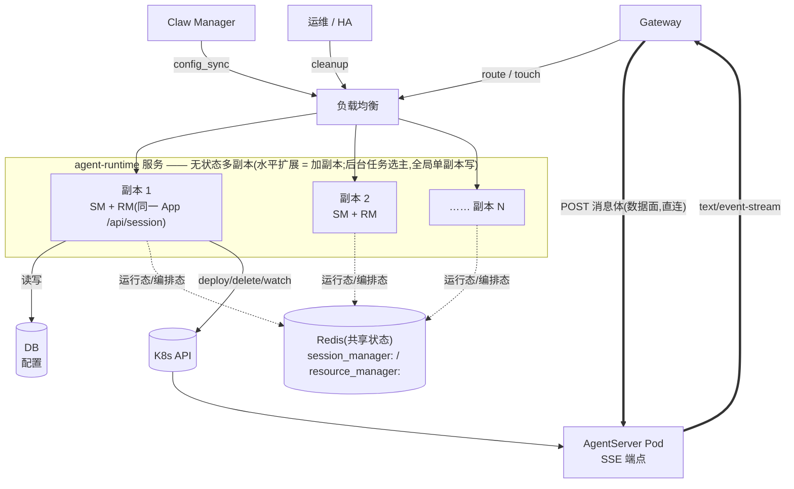
```mermaid
flowchart TB
    GW[Gateway]
    CM[Claw Manager]
    OPS["运维 / HA"]
    LB["负载均衡"]
    subgraph AR["agent-runtime 服务 —— 无状态多副本(水平扩展 = 加副本;后台任务选主,全局单副本写)"]
      R1["副本 1<br/>SM + RM(同一 App /api/session)"]
      R2["副本 2<br/>SM + RM"]
      RN["…… 副本 N"]
    end
    DB[("DB<br/>配置")]
    REDIS[("Redis(共享状态)<br/>session_manager: / resource_manager:")]
    K8s[("K8s API<br/>")]
    POD["AgentServer Pod<br/>SSE 端点"]

    GW -- "route / touch" --> LB
    CM -- "config_sync" --> LB
    OPS -- "cleanup" --> LB
    LB --> R1
    LB --> R2
    LB --> RN
    R1 -- "读写" --> DB
    R1 -. "运行态/编排态" .-> REDIS
    R2 -. "运行态/编排态" .-> REDIS
    RN -. "运行态/编排态" .-> REDIS
    R1 -- "deploy/delete/watch" --> K8s
    K8s --> POD

    GW == "POST 消息体(数据面,直连)" ==> POD
    POD == "text/event-stream" ==> GW
```

- **分布式形态**:**多副本无状态**(编排态全在共享 Redis、配置在 DB、Pod 物理态以 K8s 为准),前置**负载均衡**,水平扩展 = 加副本;后台任务(sweeper / autoscale / reclaim / K8s Watch / 孤儿对账)经 Redis 选主锁,**全局单副本执行写操作**,多副本安全。
- **配置面**:Claw Manager →(LB)→ Session Manager(`config_sync`)→ DB。
- **控制面**:Gateway 每请求经 LB 调本服务(`route` / `touch`);Claw Manager 下发配置(`config_sync`);运维 / HA 批量清 Pod(`cleanup`)。Pod 的 deploy / 扩缩由服务内的 Resource Manager 模块自治承担。
- **物理面**:Resource Manager ↔ K8s(deploy/delete/watch),Pod 存在/健康/pod_ip/sse_url 以 K8s 为唯一真相源。
- **数据面**:Gateway ↔ Pod 直连(两 Manager 全程旁路,不转发消息)。
- **旁路信号**:Gateway → Session Manager(`touch` 保活/结束)。

---

## 2. 概述

### 2.1 定位

控制面由**一个服务**承担,内含 **Session Manager** 与 **Resource Manager** 两个模块(**都不在数据通路上**)(Gateway 拿到 Pod SSE 地址后直连 Pod 收发消息):

- **Session Manager** —— **会话编排**:准入、路由亲和、老化回收,并按需让 Resource Manager 增减 Pod。
- **Resource Manager** —— **Pod 生命周期所有者**:deploy / idle→reclaim / min_idle 热备 / per-`scope_id` 独立 Pod 池 / 死 Pod 探测清理 / 运维 cleanup。

### 2.3 名词速查

| 术语 | 含义 |
|---|---|
| **user_id** | 用户标识。与 group_id / bot_id 一起作为路由表达式左值。 |
| **group_id** | 群组标识(经 `metadata.extra` 传递)。路由表达式左值之一。 |
| **bot_id** | 机器人标识(该群组中的机器人账号)。路由表达式左值之一。 |
| **scope_id** | 资源域标识,记作 `scope_A`。由 config_sync 下发(`routing_scope` 行),不再从 (group_id, bot_id) 派生;请求经路由规则匹配命中 scope(§3.1)。 |
| **index** | scope 的匹配序号:请求按 (index 升序, scope_id 升序) first-fit 首个命中即止。 |
| **pod_id** | 一个 AgentServer Pod 实例标识,记作 `pod_1`。 |
| **session_id** | 一次用户会话(chat_session),路由/亲和/老化的最小单位,记作 `sess_1`。 |
| **亲和** | 同一 session_id 始终路由到同一 Pod(粘性),直到老化。 |
| **scope_concurrency** | 一个 scope_id 同时允许的活跃会话数上限。 |
| **pod_concurrency** | SM 的 per-Pod 容量闸门输入(`SCARD < pod_concurrency`);RM 不强制。 |
| **pod_ttl** | idle Pod 至 reclaim 的等待秒数。 |
| **min_idle_pods** | per-`scope_id` 的最小热备 Pod 数(config_sync 主动推 RM,**无请求即预热**)。 |
| **max_pods** | 单个 scope 的最大 Pod 数,派生 = `⌈scope_concurrency / pod_concurrency⌉`,SM 经 `pool_config` 传入 RM。 |

> **示例配置**(本文场景统一):`scope_concurrency=3`、`pod_concurrency=2` → `max_pods(最多 Pod 数)=⌈scope_concurrency/pod_concurrency⌉=⌈3/2⌉=2`、`session_ttl=60s`、`scope_full_timeout=30s`。

---

## 3. 对外接口

### 3.1 Session Manager(prefix `/api/session`,端口 8091)

| 端点 | 入参 | 出参 | 说明 |
|---|---|---|---|
| `POST /api/session/route` | `metadata`:session_id / user_id / group_id / bot_id(**四项均必填非空**) | `{ pod_sse_url, pod_id }` | 同步路由 + 占额度(关键路径);按路由规则匹配 scope(§3.1 匹配语义) |
| `POST /api/session/touch` | `metadata`:session_id | `{ touched:bool }` | 保活 / EOS,刷新老化 |
| `POST /api/session/config_sync` | `{ templates:[...], scopes:[...] }`(全量快照) | `{ ok, templates_synced/deleted, scopes_synced/deleted, affected_scopes, wildcard_present }` | Claw Manager 全量下发配置(模板列表 + scope 列表);旧 `kind/op` 增量协议已废弃(400) |
| `POST /api/session/cleanup` | `{ namespace?, label_selector? }` | `{ cleaned:int }` | 运维批量清 Pod(灾难恢复 / 重新部署),handler 在 Session Manager、委托 `rm_facade.cleanup()` |

- `group_id` 经 `metadata.extra` 传递;`metadata.request_id` 兼作幂等键。
- `route` 典型错误:容量满超时(504)、无可用 Pod(503)、无匹配 scope(503)、参数错(400);过载响应带 `Retry-After` + `error_code`。

> **`route` 内部调 `rm_facade.acquire` 时传的两个关键参数**:
>
> | 参数 | 回答的问题 | 包含字段 | 何时用 |
> |---|---|---|---|
> | **`pod_spec`** | 这个 Pod 怎么 deploy | deploy 字段:镜像 / namespace / kubeconfig / readiness 探针 / NFS 挂载 / 资源限额 / SSE 端口 | deploy 时一次性读取(创建 K8s Pod) |
> | **`pool_config`** | 这个 scope 的 Pod 池怎么管 | `min_idle_pods` / `max_pods`(派生 = ⌈scope_concurrency / pod_concurrency⌉)/ `pod_ttl` | 持续读取(autoscale 补位 / reclaim 回收 / acquire 封顶),RM 缓存于 `resource:scope:{scope_id}:config` |

#### 数据结构定义

**`pod_sse_url`**:`http://{pod_ip}:{sse_port}/{sse_path}`
- `pod_ip` = K8s deploy 返回的 Pod IP;`sse_port` / `sse_path` = template 配置(pod_spec 组成部分)。

**`template`**(config_sync 下发,持久化到 DB 表 `service_config_template`):

| 字段 | 类型 | 说明 |
|---|---|---|
| `scope_concurrency` | int | 该 scope 最大活跃会话数(scope 闸门) |
| `pod_concurrency` | int | 单 Pod 最大并发(SCARD 闸门) |
| `session_ttl` | int(秒) | 会话保活超时,未 touch 则老化 |
| `pod_ttl` | int(秒) | idle Pod 至 reclaim 的等待 |
| `min_idle_pods` | int | 该 scope 最少热备 Pod 数 |
| `agent_image` | str | AgentServer 容器镜像 |
| `namespace` | str | K8s 命名空间 |
| `container_name` | str | 容器名 |
| `container_port` | int | 容器端口 |
| `sse_port` | int | SSE 端口(gateway 直连 Pod) |
| `sse_path` | str | SSE 路径(真 AgentServer HTTP 入口为 `/api/v1/events/stream`) |
| `health_path` | str | 健康端点路径(readiness 探针与 RM 场景 N 探测共用;默认 `/health`,真 AgentServer 为 `/api/v1/health`) |
| `agent_env` | dict | Agent 容器 env 注入(如 `AGENT_HTTP_ENABLED/AGENT_HTTP_HOST/AGENT_HTTP_PORT`——真 AgentServer 需以此开启 HTTP 入口并绑 0.0.0.0) |
| `kubeconfig` | str? | K8s 认证(可选,默认用集群内 ServiceAccount) |
| `readiness_*` / `nfs_*` / 资源限额 | — | deploy 子集(就绪探针 / 存储 / CPU / 内存) |

> `max_pods` 不在 template 里——它是派生值 `⌈scope_concurrency / pod_concurrency⌉`,SM 派生后经 `pool_config` 传 RM。`autoscale_interval` 也不在 template——它是全局默认(0.5s)。

**`routing_scope`**(config_sync 下发,持久化到 DB 表 `routing_scope`):scope 定义 = `scope_id + index + template_id + routing_rules`,scope↔模板多对一。

| 字段 | 类型 | 说明 |
|---|---|---|
| `scope_id` | str | 资源域标识。字符集 `[0-9A-Za-z._-]`(≤128)——内嵌 Redis 键名与 `pods:registered` 的 `"{scope}:{pod}"` 条目,禁 `:`、`*`、空白 |
| `index` | int | 匹配序号;请求按 (index 升序, scope_id 升序) first-fit |
| `template_id` | str | 引用的 template(必须在本批模板列表内;多个 scope 可引用同一模板) |
| `routing_rules` | list | 路由规则集,规则间 **OR**;**空列表 = 通配兜底 scope**(命中一切) |

路由规则(rule)与表达式(expression)结构:

```
routing_rules: [                       # 多条规则之间 OR
  { "expressions": [                   # 一条规则内多表达式 AND(空 expressions 下发校验拒绝)
      { "field": "user_id|group_id|bot_id",
        "op":    "in|not_in",
        "values": ["v1", "v2"] }       # 字符串集合;空 values:in 恒假、not_in 恒真
  ]}
]
```

**匹配语义**(resolve 权威定义):请求属性 (user_id, group_id, bot_id) 对 scopes 按 `(index ASC, scope_id ASC)` 排序遍历,**首个命中的 scope 即止**(first-fit);scope 命中 = 空 routing_rules(通配)或任一规则为真(OR);规则为真 = 全部表达式为真(AND);表达式 = 属性值 `in`/`not in` 集合。引用模板缺失或 `enabled=False` 的 scope 视为不命中,继续落下一个。**下发方保证含一个空规则的通配 scope 兜底**;服务端缺失时仅 WARNING 放行,运行时无匹配 → 503 `CONFIG_NOT_FOUND`。

**`config_sync` 入参完整 schema**(全量快照式,一次请求同时携带两个列表;旧 `kind/op` 协议 400 拒绝):

```json
{
  "templates": [ {"template_id": "...", "...template 字段": ...} ],
  "scopes":    [ {"scope_id": "...", "index": 0, "template_id": "...",
                  "routing_rules": [ ... ]} ]
}
```

- 语义:**以数组为准的全量替换**(upsert 全部 + 删除消失项);幂等重放收敛(affected_scopes 为空)。
- 校验(400 VALIDATION):`templates`/`scopes` 非 list;template 缺 `template_id`;scope_id 字符集非法;`index` 非整数;scope 引用不在本批模板集内的 template;规则空 `expressions`;表达式 field/op 非法或 values 非字符串数组;同批 scope_id 重复。
- 每次成功下发都会:重建路由快照(§5.1 `routing:snapshot`)、对每个存活 scope 推 RM 池参数 + pod_spec(**eager 预热**:autoscale 下一拍即预热 min_idle)、对被删 scope 推 `min_idle=0`(自然排空)。

**错误响应体**(所有非 2xx):

| 字段 | 类型 | 说明 |
|---|---|---|
| `ok` | bool | 固定 `false` |
| `error_code` | str | `SCOPE_FULL_TIMEOUT` / `SCOPE_QUEUE_FULL` / `NO_POD_AVAILABLE` / `CONFIG_NOT_FOUND` / `MAX_PODS_REACHED` / `DEPLOY_FAILED` / `VALIDATION` |
| `error_message` | str | 人类可读描述 |
| `retry_after` | int?(秒) | 仅过载类(`SCOPE_QUEUE_FULL` / `SCOPE_FULL_TIMEOUT` / `NO_POD_AVAILABLE`)返回;其它省略 |

**过载参数**:

| 参数 | 默认 | 含义 |
|---|---|---|
| `scope_full_timeout` | 30s | scope 满(队列内)阻塞上限,超则 504 `SCOPE_FULL_TIMEOUT` |
| `max_waiters` | 2 × `scope_concurrency` | 每 scope 等待队列上限,超限快失败 503 `SCOPE_QUEUE_FULL` |
| `session_ttl` | 60s(template) | 会话保活窗口;超时未 touch 则老化回收 |

---

## 4. 运行场景

> 本节给出**纯逻辑决策图**(不涉及存储)。场景清单与逐场景详细时序见 §6,Redis 键结构总览见 §5。

### 4.1 纯逻辑决策图(不涉及存储)

> 覆盖两模块:**§4.1.1–4.1.2 Session Manager**(路由 / 老化回收);**§4.1.3–4.1.4 Resource Manager**(acquire / Pod 生命周期)。本节只画决策与状态流转,不涉及 Redis 键(存储视图见 §5,含状态变化的详细时序见 §6.2)。

#### 4.1.1 Session Manager —— 路由决策主流程(route)

覆盖 **亲和续期 / 有空位选 Pod / 扩 Pod / 容量满** 四种走向:

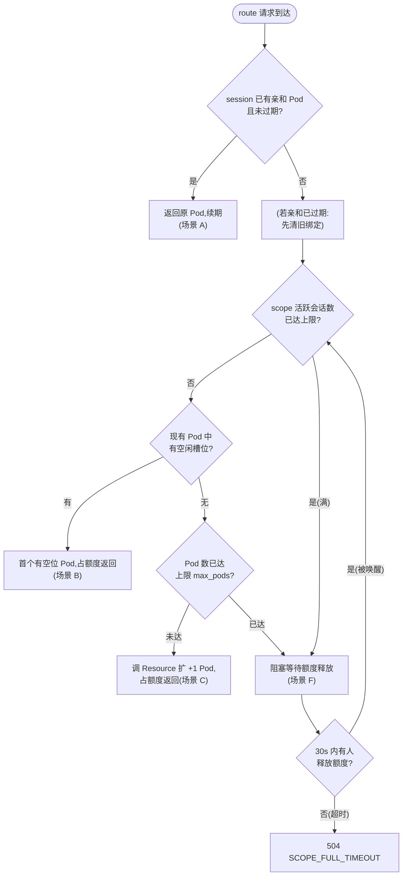
```mermaid
flowchart TD
    S([route 请求到达])
    A1{"session 已有亲和 Pod<br/>且未过期?"}
    CLR["(若亲和已过期:<br/>先清旧绑定)"]
    A2{"scope 活跃会话数<br/>已达上限?"}
    A3{"现有 Pod 中<br/>有空闲槽位?"}
    A4{"Pod 数已达<br/>上限 max_pods?"}
    W{"30s 内有人<br/>释放额度?"}
    RA["返回原 Pod,续期<br/>(场景 A)"]
    RB["首个有空位 Pod,占额度返回<br/>(场景 B)"]
    RC["调 Resource 扩 +1 Pod,<br/>占额度返回(场景 C)"]
    RF["阻塞等待额度释放<br/>(场景 F)"]
    R504["504 SCOPE_FULL_TIMEOUT"]

    S --> A1
    A1 -- 是 --> RA
    A1 -- 否 --> CLR --> A2
    A2 -- 否 --> A3
    A2 -- 是(满) --> RF
    A3 -- 有 --> RB
    A3 -- 无 --> A4
    A4 -- 未达 --> RC
    A4 -- 已达 --> RF
    RF --> W
    W -- 是(被唤醒) --> A2
    W -- 否(超时) --> R504
```

**读图**:亲和优先(零成本续期)→ 准入(满则排队等,超时 504)→ 有空位直接占 → 无空位且未达 Pod 上限则扩 → 占额度走原子提交,不超发。

#### 4.1.2 Session Manager —— 老化与回收 / 保活 / 故障清洗

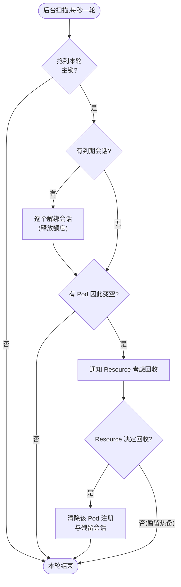
```mermaid
flowchart TD
    T([后台扫描,每秒一轮])
    L{"抢到本轮<br/>主锁?"}
    E1{"有到期会话?"}
    E2["逐个解绑会话<br/>(释放额度)"]
    P1{"有 Pod 因此变空?"}
    P2["通知 Resource 考虑回收"]
    P3{"Resource 决定回收?"}
    P4["清除该 Pod 注册<br/>与残留会话"]
    DONE([本轮结束])
    T --> L
    L -- 否 --> DONE
    L -- 是 --> E1
    E1 -- 有 --> E2 --> P1
    E1 -- 无 --> P1
    P1 -- 是 --> P2 --> P3
    P1 -- 否 --> DONE
    P3 -- 是 --> P4 --> DONE
    P3 -- 否(暂留热备) --> DONE
```

- **保活(touch)**:会话存在且未过期 → 刷新老化计时(`touched=true`);否则 `touched=false`,网关回退重新 route。
- **故障清洗(notify_pod_dead)**:Pod 不可用 → 找出其上所有会话逐个解绑(释放额度,唤醒等待者)→ 清除该 Pod 全部注册 → 返回受影响会话列表。

#### 4.1.3 Resource Manager —— acquire 决策主流程(请求路径)

覆盖 **取该 scope 暖 Pod / 扩 Pod / 封顶** 三种走向(对应 Session Manager 的 `route` 在 RM 侧的入口;SM 已在自身 scope:pods 里做过 first-fit,只有 SM 现有 Pod 都满时才会调到 RM acquire):

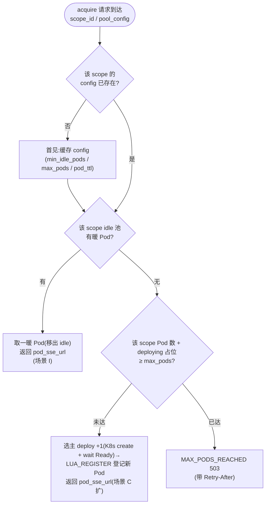
```mermaid
flowchart TD
    S(["acquire 请求到达<br/>scope_id / pool_config"])
    C{"该 scope 的<br/>config 已存在?"}
    CC["首见:缓存 config<br/>(min_idle_pods / max_pods / pod_ttl)"]
    A1{"该 scope idle 池<br/>有暖 Pod?"}
    RU["取一暖 Pod(移出 idle)<br/>返回 pod_sse_url<br/>(场景 I)"]
    A2{"该 scope Pod 数 + deploying 占位<br/>≥ max_pods?"}
    DP["选主 deploy +1(K8s create + wait Ready)→<br/>LUA_REGISTER 登记新 Pod<br/>返回 pod_sse_url(场景 C 扩)"]
    MX["MAX_PODS_REACHED 503<br/>(带 Retry-After)"]

    S --> C
    C -- 否 --> CC --> A1
    C -- 是 --> A1
    A1 -- 有 --> RU
    A1 -- 无 --> A2
    A2 -- 未达 --> DP
    A2 -- 已达 --> MX
```

**读图**:优先取该 scope idle 池里的暖 Pod(`SREM idle` 后返回)→ 无暖 Pod 且该 scope 未达 `max_pods` 则 per-`scope_id` 选主 deploy +1 → `LUA_REGISTER` 登记新 Pod 即返回 → 达 `max_pods`(含 `deploying` 占位)则 `MAX_PODS_REACHED`。deploy 走 **per-`scope_id` 选主串行**(防并发超配;锁输家进 **follower 等待室**——原子准入上限 `pod_concurrency-1`、overflow 快失败、等待有界、leader 的 Pod 注册即直接复用、leader 失败则不接管直接失败)。**config-agnostic**:RM 不解析 `pod_spec` 语义;一个 Pod 只服务一个 scope,容量由 SM 的 `SCARD < pod_concurrency` 闸门保证,RM 不做容量叠加判定。

#### 4.1.4 Resource Manager —— Pod 生命周期与自治回收(后台)

Pod 在 RM 视角只有两个逻辑态(**in_use** / **idle**)+ 终态(不存在),由 acquire / idle_consider 切换,由四类选主后台任务驱动回收与热备:

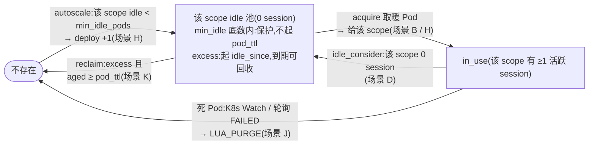
```mermaid
flowchart LR
    NONE(["不存在"])
    IDLE["该 scope idle 池(0 session)<br/>min_idle 底数内:保护,不起 pod_ttl<br/>excess:起 idle_since,到期可回收"]
    USE["in_use(该 scope 有 ≥1 活跃 session)"]

    NONE -- "autoscale:该 scope idle < min_idle_pods<br/>→ deploy +1(场景 H)" --> IDLE
    IDLE -- "acquire 取暖 Pod<br/>→ 给该 scope(场景 B / H)" --> USE
    USE -- "idle_consider:该 scope 0 session<br/>(场景 D)" --> IDLE
    IDLE -- "reclaim:excess 且<br/>aged ≥ pod_ttl(场景 K)" --> NONE
    USE -- "死 Pod:K8s Watch / 轮询 FAILED<br/>→ LUA_PURGE(场景 J)" --> NONE
```

- **两态切换**:`acquire` 取暖 Pod(或 deploy 新 Pod)给该 scope 即进 in_use,`idle_consider` 在该 scope 0 session 时(`SADD scope:idle` + `SET idle_since`)回 idle 池;物理存在 / 健康以 K8s 为准。
- **idle 池内部**(per-scope):该 scope `min_idle` 底数内的 idle Pod 受保护(reclaim 排除最早 `min_idle` 个);**热备 Pod 不起 `pod_ttl` 计时**(对齐 SDK `_bootstrap_min_idle`)。
- **两类回收触发**:① **reclaim sweeper**(周期,per-scope 扫,excess 且 aged ≥ `pod_ttl`);② **死 Pod 探测**(K8s Watch + 10s 轮询)。两者均 K8s delete + `LUA_PURGE` + `notify_pod_dead`(触发 SM 场景 G 清洗受影响会话)。
- **孤儿对账**:「RM 仍持有该 scope 的 Pod(未 idle / reclaim)、SM 已 `ZREM`」的孤儿由 30s `reconcile_pods` 把该 Pod 移入 idle / reclaim 候选(场景 L),不误杀有活跃会话的 Pod。
- **多副本安全**:autoscale / reclaim / deploy / 死 Pod 探测 / 对账 各自 tick 级选主锁,全局单副本执行写操作。

---

## 5. Redis 状态设计(运行态)

两个模块 **均无进程内状态**,运行态在 **Redis**(前缀 `session_manager:` / `resource_manager:` 隔离,见 §8)。

### 5.1 Session Manager(prefix `session:`)

一次活跃会话同时记录在**四处**,保持一致;一个已注册 Pod 同时记录在**三处**。

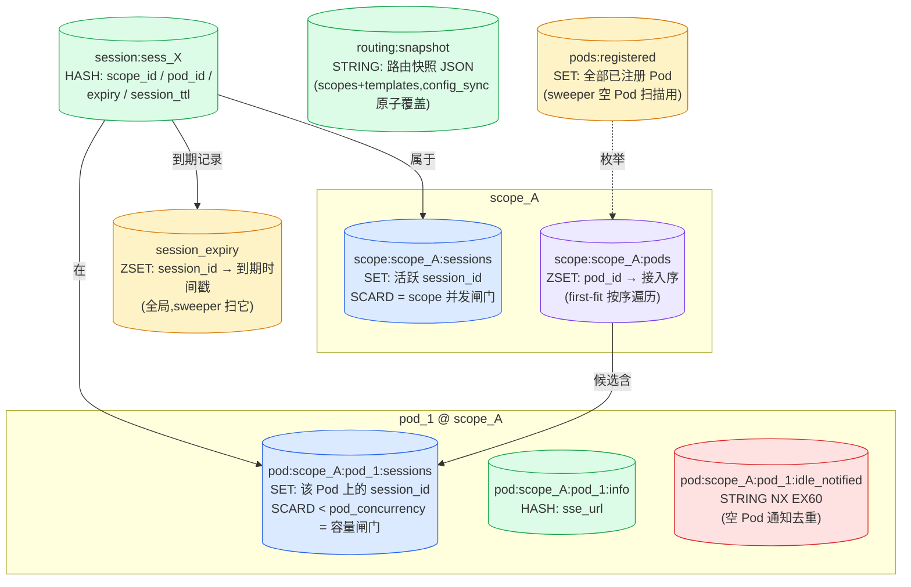
```mermaid
flowchart TB
    SE[("session_expiry<br/>ZSET: session_id → 到期时间戳<br/>(全局,sweeper 扫它)")]:::global
    PR[("pods:registered<br/>SET: 全部已注册 Pod<br/>(sweeper 空 Pod 扫描用)")]:::global

    subgraph SCOPE["scope_A"]
        direction TB
        SS[("scope:scope_A:sessions<br/>SET: 活跃 session_id<br/>SCARD = scope 并发闸门")]:::set
        SP[("scope:scope_A:pods<br/>ZSET: pod_id → 接入序<br/>(first-fit 按序遍历)")]:::zset
    end

    SNAP[("routing:snapshot<br/>STRING: 路由快照 JSON<br/>(scopes+templates,config_sync 原子覆盖)")]:::hash

    subgraph POD1["pod_1 @ scope_A"]
        PS[("pod:scope_A:pod_1:sessions<br/>SET: 该 Pod 上的 session_id<br/>SCARD &lt; pod_concurrency = 容量闸门")]:::set
        PI[("pod:scope_A:pod_1:info<br/>HASH: sse_url")]:::hash
        PIN[("pod:scope_A:pod_1:idle_notified<br/>STRING NX EX60<br/>(空 Pod 通知去重)")]:::str
    end

    SES[("session:sess_X<br/>HASH: scope_id / pod_id /<br/>expiry / session_ttl")]:::hash

    SES -->|"属于"| SS
    SES -->|"在"| PS
    SES -->|"到期记录"| SE
    SP -->|"候选含"| PS
    PR -.->|"枚举"| SP

    classDef global fill:#fef3c7,stroke:#d97706;
    classDef set fill:#dbeafe,stroke:#2563eb;
    classDef zset fill:#ede9fe,stroke:#7c3aed;
    classDef hash fill:#dcfce7,stroke:#16a34a;
    classDef str fill:#fee2e2,stroke:#dc2626;
```

> **关键不变量**:一个活跃会话**同时存在于此四处**(`scope:sessions`、`pod:sessions`、`session:{id}`、`session_expiry`);一个已注册 Pod 注册于三处(`pods:registered`、`pods:{pod_id}:scopes`、`scope:pods`)。建/删用 Lua 原子同步;但 **`scope:pods` ⊆ `pods:registered`**(弱化)——`idle_consider` 时 sweeper `LUA_SWEEP_IDLE_NOTIFY` 只 `ZREM scope:pods`(不删另两处),"在 `pods:registered` 但不在 `scope:pods`" = **已 `idle_consider`、待 RM 回收的合法中间态**,非漂移。
>
> **无进程内状态**:Session Manager 不持有任何进程内可变状态;所有键懒创建,**进程重启不丢状态**(全在 Redis/DB)。

**SM Redis 键一览**(前缀 `session_manager:`):

| 键 | 类型 | 内容 | 用途 |
|---|---|---|---|
| `session_expiry` | ZSET | session_id → 到期时间戳 | 全局会话到期集合,sweeper 每秒扫它找过期 session |
| `session:{session_id}` | HASH | scope_id / pod_id / expiry / session_ttl | 单会话亲和绑定;route 写、touch 读续期、evict 删 |
| `scope:{scope_id}:sessions` | SET | 该 scope 活跃 session_id | **SCARD = scope 活跃数 = scope_concurrency 闸门** |
| `scope:{scope_id}:pods` | ZSET | pod_id(score=接入序) | 该 scope 的 Pod 候选集,first-fit 按序遍历;sweeper ZREM 使 Pod 退出候选 |
| `routing:snapshot` | STRING | 全部 scopes(含规则/索引)+ templates 的 JSON | **路由快照**:resolve 的唯一读源(route 每请求 1 GET,进程内按原文 memo 免重复解析);config_sync 写 DB 后原子 SET 覆盖,缺失/损坏由首次 resolve 从 DB 重建 |
| `scope:{scope_id}:waiters` | SET | 等待中的 request_id | **等待队列上限 max_waiters**(满了快失败 503;入队经 `LUA_WAITER_GATE` 原子闸门:SADD 先行 + 超限自退,并发不超收,稳态 SCARD ≤ max_waiters) |
| `scope:{scope_id}:free` | PubSub | —(无持久值) | 额度释放信号(evict PUBLISH、阻塞 route SUBSCRIBE) |
| `pod:{scope_id}:{pod_id}:sessions` | SET | 该(scope, Pod)上的 session_id | **SCARD < pod_concurrency = Pod 容量闸门** |
| `pod:{scope_id}:{pod_id}:info` | HASH | sse_url / deploy_ver | Pod 的 SSE 地址(route 返回它给 gateway);`deploy_ver` = deploy 子集指纹(config_sync 日落判定用) |
| `pod:{scope_id}:{pod_id}:idle_notified` | STRING(NX EX 60) | 去重标记 | 空 Pod 通知 RM 回收的 60s 去重;placement 时 DEL |
| `pods:registered` | SET | 全部 `"{scope_id}:{pod_id}"` | sweeper 空 Pod pass 全局枚举 |
| `pods:{pod_id}:scopes` | SET | 该 Pod 被哪些 scope 引用 | notify_pod_dead 反查受影响 scope |
| `lock:sweep` | STRING(NX EX 2) | 选主标记 | sweeper tick 级选主(全局单副本扫描) |

### 5.2 Resource Manager(prefix `resource:`)

Resource Manager 编排语义态(idle/info)在 **Redis**(前缀 `resource_manager:`);所有计数派生自 SET/ZSET(SCARD / ZCARD),无独立计数器。

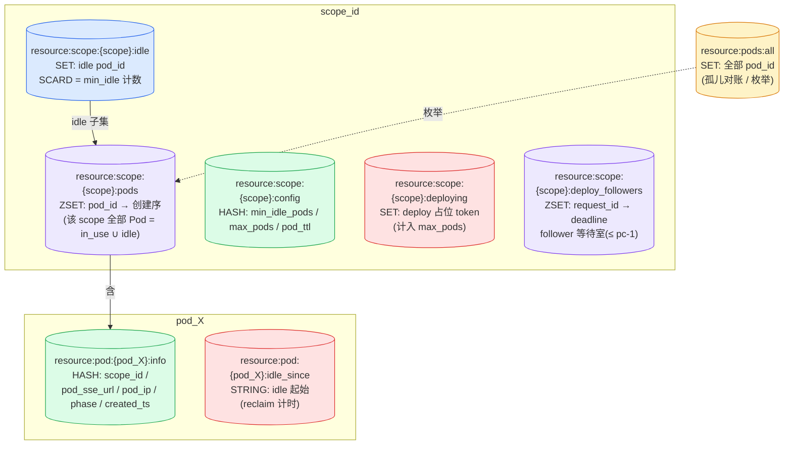
```mermaid
flowchart TB
    subgraph SCOPE["scope_id"]
        SP[("resource:scope:{scope}:pods<br/>ZSET: pod_id → 创建序<br/>(该 scope 全部 Pod = in_use ∪ idle)")]:::zset
        SI[("resource:scope:{scope}:idle<br/>SET: idle pod_id<br/>SCARD = min_idle 计数")]:::set
        SCFG[("resource:scope:{scope}:config<br/>HASH: min_idle_pods / max_pods / pod_ttl")]:::hash
        SD[("resource:scope:{scope}:deploying<br/>SET: deploy 占位 token<br/>(计入 max_pods)")]:::str
        SDF[("resource:scope:{scope}:deploy_followers<br/>ZSET: request_id → deadline<br/>follower 等待室(≤ pc-1)")]:::zset
    end

    subgraph POD["pod_X"]
        PI[("resource:pod:{pod_X}:info<br/>HASH: scope_id /<br/>pod_sse_url / pod_ip / phase / created_ts")]:::hash
        PIS[("resource:pod:{pod_X}:idle_since<br/>STRING: idle 起始<br/>(reclaim 计时)")]:::str
    end

    PA[("resource:pods:all<br/>SET: 全部 pod_id<br/>(孤儿对账 / 枚举)")]:::global

    SP -->|"含"| PI
    SI -->|"idle 子集"| SP
    PA -.->|"枚举"| SP

    classDef global fill:#fef3c7,stroke:#d97706;
    classDef set fill:#dbeafe,stroke:#2563eb;
    classDef zset fill:#ede9fe,stroke:#7c3aed;
    classDef hash fill:#dcfce7,stroke:#16a34a;
    classDef str fill:#fee2e2,stroke:#dc2626;
```

> **关键不变量(Lua 原子维护)**:① **一 Pod 恰属一 scope**(`pod:info.scope_id` 唯一);容量由 SM `SCARD(pod:{scope}:{pod}:sessions) < pod_concurrency` 闸门保证,无跨 scope 容量叠加;② `idle ⊆ pods`(idle 是 Pod 子集);③ **注册一致** `pods:all` 每个 pod_id 同时在对应 `scope:pods` 且 `info.scope_id` 匹配;④ **物理为准** Redis 描述的 Pod 必在 K8s,漂移由 K8s Watch + 10s 轮询校正;⑤ `idle_since` 存在 ⟺ 在 `scope:idle` ⟺ 该 scope 在该 Pod 上 0 session。
>
> **模块边界(经 Facade,不读对方 key)**:Resource Manager reclaim / 对账**均不读** Session Manager 模块的 key(协调全经进程内 Facade;虽用一个 Redis 实例,但跨模块数据只走 Facade 方法)。reclaim 安全靠 SM→RM 单向契约:SM 发 `idle_consider` 前**原子 `ZREM scope:pods`**,该 Pod 即刻退出 route 候选,reclaim 窗口内 SM 不再 route 新 session 上去。`idle_consider` 丢失 / SM 重启漂移由 RM 每 30s 经 Facade `sm_facade.reconcile_pods` 对账兜底(场景 L)。

**RM Redis 键一览**(前缀 `resource_manager:`):

| 键 | 类型 | 内容 | 用途 |
|---|---|---|---|
| `resource:scope:{scope_id}:pods` | ZSET | pod_id(score=创建序) | 该 scope 全部 Pod(in_use ∪ idle);`ZCARD` 参与 `max_pods` 判定 |
| `resource:scope:{scope_id}:idle` | SET | idle 的 pod_id | **SCARD = idle Pod 数**(autoscale / reclaim 闸门;acquire 从此取暖 Pod) |
| `resource:scope:{scope_id}:config` | HASH | min_idle_pods / max_pods / pod_ttl / pod_concurrency / deploy_ver / pod_spec_json | config_sync 对**每个存活 scope 主动写入/刷新**(带 pod_spec——无请求 scope 的 autoscale 预热依赖 pod_spec_json);首 acquire 也会兜底写入;被删 scope 推 `min_idle=0` 停预热自然排空 |
| `resource:scope:{scope_id}:deploying` | SET | deploy 占位 token(uuid) | 计入 `max_pods` 判定(防并发 deploy 超配);register / 失败时清 |
| `resource:scope:{scope_id}:deploy_followers` | ZSET | deploy 锁输家的 request_id → deadline | follower 等待室(M8):`ZCARD ≤ pod_concurrency-1`;检测 leader Pod 注册即复用;score=deadline 供闸门清崩溃遗留 |
| `resource:pod:{pod_id}:info` | HASH | scope_id / pod_sse_url / pod_ip / namespace / phase / created_ts / deploy_ver | Pod 元信息;`scope_id` 标识所属池;`deploy_ver` 供 acquire 版本过滤(只发当前版本暖 Pod) |
| `resource:pod:{pod_id}:idle_since` | STRING | idle 起始时间戳 | reclaim 计时(aged ≥ `pod_ttl` 回收) |
| `resource:pods:all` | SET | 全部 pod_id | 孤儿对账 / 枚举 |
| `lock:rm:deploy:{scope_id}` | STRING(NX EX) | 选主标记 | per-scope deploy 串行(防并发 deploy 超配) |
| `lock:rm:autoscale` | STRING(NX EX) | 选主标记 | autoscale tick 级选主 |
| `lock:rm:reclaim` | STRING(NX EX) | 选主标记 | reclaim tick 级选主 |
| `lock:rm:reconcile` | STRING(NX EX) | 选主标记 | 孤儿对账 sweeper 选主 |
| `lock:rm:watch` | STRING(NX EX) | 选主标记 | K8s Watch + 死 Pod 轮询 + 健康 SSE 探测(场景 N)选主 |

---

## 6. 场景清单与详细时序

> 场景清单见 §6.1,逐场景的决策与 Redis 状态变化时序见 §6.2。

### 6.1 场景清单

| # | 场景 | 触发 | 结果 | 价值 |
|---|---|---|---|---|
| A | 有亲和 | 已有会话再次 route | 续期,返回原 Pod,不重抢额度 | 零冷启动 |
| B | 无亲和 + 有空位 | 新会话,现有 Pod 有余量 | 首个有空位 Pod,占额度 | 负载打包,利于缩容 |
| C | 无亲和 + 无空位 | 新会话,现有 Pod 全满 | 调 Resource 扩 +1 Pod | 按需弹性 |
| D | 老化与回收 | 会话 TTL 到期 | 解绑 → Pod 空 → 回收 | 低峰自动缩容 |
| E | 保活 | gateway 周期保活 | 刷新 TTL | 阻止活跃会话老化 |
| F | 容量满 | 活跃会话达上限 | 队列未满→排队等(超时 504);队列满(≥max_waiters)→快失败 503 | 背压不雪崩 |
| G | Pod 异常死亡 | Resource 通知 | 清洗受影响会话 | 故障自愈 |
| H | min_idle 热备 | 空闲时 autoscale | 预建热备 Pod | 新请求零部署等待 |
| I | RM acquire | SM 现有 Pod 都满时调 acquire | 取该 scope idle 暖 Pod 复用,或 deploy +1,或达 max_pods 返回 503 | 按需给 scope 配 Pod,暖 Pod 零部署 |
| J | 死 Pod 探测清理 | K8s Watch 探测 | 清 Redis+K8s + 通知 SM | 故障自愈(RM 侧) |
| K | reclaim 自治回收 | 空闲超 pod_ttl | 周期扫 idle 池回收(ZREM 堵 route 直选) | 低峰自动缩容 |
| L | 孤儿 Pod 对账 | idle_consider 丢失/漂移 | RM 每 30s `reconcile_pods` 把 SM 已不用的 Pod 移入 idle / reclaim | 消除孤儿,不误杀 |
| M | 配置热更新 | config_sync 全量下发 {templates, scopes} | A 类(deploy 字段/换引用)日落老 Pod / B 类(策略参数)快照覆盖立即生效 / 删除 scope 自然排空 / eager 预热 min_idle | 配置变更不中断服务 |
| N | 半死 Pod 检测 | Pod Running 但 SSE 服务不通 | RM 周期探测 AgentServer 健康 SSE 端点,判死清理 | 旁路架构下的数据面健康兜底 |

### 6.2 详细场景(含 Redis 状态变化)

#### 场景 A:有亲和 —— 续期返回原 Pod
**前置**:`sess_1` 已路由到 `scope_A` 的 `pod_1`,未过期。

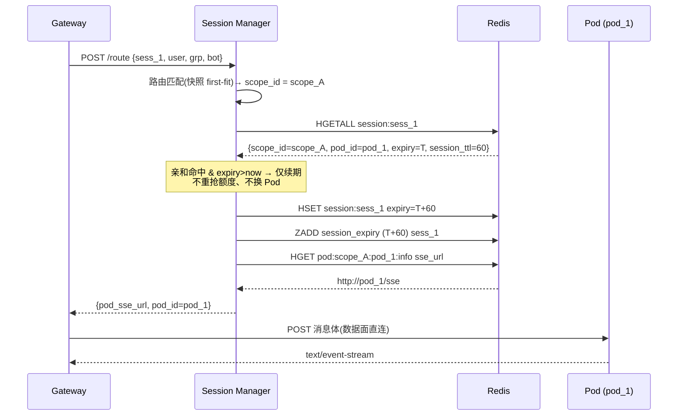
```mermaid
sequenceDiagram
    participant GW as Gateway
    participant SM as Session Manager
    participant R as Redis
    participant Pod as Pod (pod_1)
    GW->>SM: POST /route {sess_1, user, grp, bot}
    SM->>SM: 路由匹配(快照 first-fit)→ scope_id = scope_A
    SM->>R: HGETALL session:sess_1
    R-->>SM: {scope_id=scope_A, pod_id=pod_1, expiry=T, session_ttl=60}
    Note over SM: 亲和命中 & expiry>now → 仅续期<br/>不重抢额度、不换 Pod
    SM->>R: HSET session:sess_1 expiry=T+60
    SM->>R: ZADD session_expiry (T+60) sess_1
    SM->>R: HGET pod:scope_A:pod_1:info sse_url
    R-->>SM: http://pod_1/sse
    SM-->>GW: {pod_sse_url, pod_id=pod_1}
    GW->>Pod: POST 消息体(数据面直连)
    Pod-->>GW: text/event-stream
```

| 键 | 操作 | 变化 |
|---|---|---|
| `session:sess_1` | HSET | `expiry` → T+60(续期) |
| `session_expiry` | ZADD | `sess_1` 的 score → T+60 |
| `scope:scope_A:sessions` | — | 不变 |
| `pod:scope_A:pod_1:sessions` | — | 不变 |

> 价值:同一用户后续请求**零冷启动**,稳定粘到原 Pod。

#### 场景 B:无亲和 + 有空闲槽位 —— first-fit 选 Pod
**前置**:`scope_A` 现有 Pod `pod_1`(上有 `sess_1`,1/2 占用);新会话 `sess_2` 到来。活跃数=1 < 3。

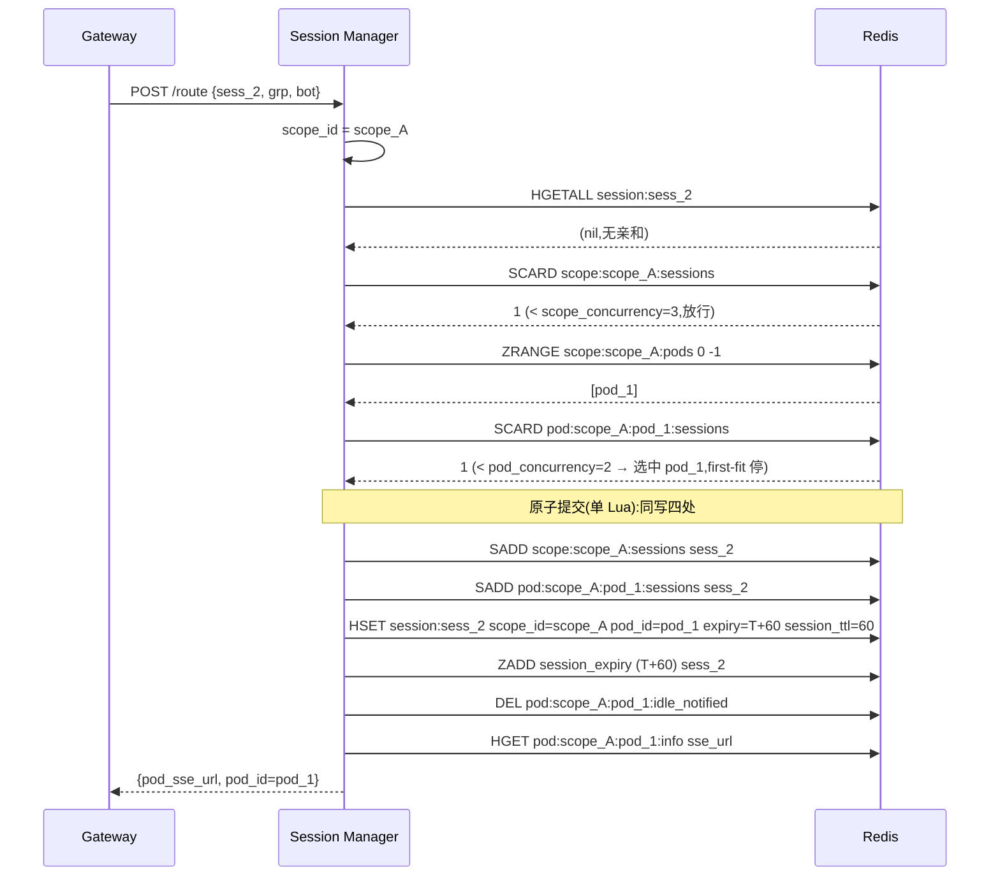
```mermaid
sequenceDiagram
    participant GW as Gateway
    participant SM as Session Manager
    participant R as Redis
    GW->>SM: POST /route {sess_2, grp, bot}
    SM->>SM: scope_id = scope_A
    SM->>R: HGETALL session:sess_2
    R-->>SM: (nil,无亲和)
    SM->>R: SCARD scope:scope_A:sessions
    R-->>SM: 1   (< scope_concurrency=3,放行)
    SM->>R: ZRANGE scope:scope_A:pods 0 -1
    R-->>SM: [pod_1]
    SM->>R: SCARD pod:scope_A:pod_1:sessions
    R-->>SM: 1   (< pod_concurrency=2 → 选中 pod_1,first-fit 停)
    Note over SM,R: 原子提交(单 Lua):同写四处
    SM->>R: SADD scope:scope_A:sessions sess_2
    SM->>R: SADD pod:scope_A:pod_1:sessions sess_2
    SM->>R: HSET session:sess_2 scope_id=scope_A pod_id=pod_1 expiry=T+60 session_ttl=60
    SM->>R: ZADD session_expiry (T+60) sess_2
    SM->>R: DEL pod:scope_A:pod_1:idle_notified
    SM->>R: HGET pod:scope_A:pod_1:info sse_url
    SM-->>GW: {pod_sse_url, pod_id=pod_1}
```

| 键 | 操作 | 变化 |
|---|---|---|
| `scope:scope_A:sessions` | SADD | +`sess_2`(活跃数 1→**2**) |
| `pod:scope_A:pod_1:sessions` | SADD | +`sess_2`(占用 1→**2**,满) |
| `session:sess_2` | HSET | **新建**:{scope_id, pod_id=pod_1, expiry, session_ttl} |
| `session_expiry` | ZADD | +`sess_2` |
| `pod:scope_A:pod_1:idle_notified` | DEL | 清(若曾标记空,复用时清掉) |

> 选 first-fit(首个有余量)而非最少负载:把流量往早期 Pod 塞满,**后加的 Pod 在低峰时先空出 → 先回收**,利于缩容省钱。

#### 场景 C:无亲和 + 无空闲槽位 —— 扩 Pod
**前置**:`scope_A` 有 `pod_1` 且已满(sess_1、sess_2,2/2);活跃数=2 < 3;新会话 `sess_3` 到来。`max_pods=2`,当前 Pod 数=1 < 2 → 可扩。

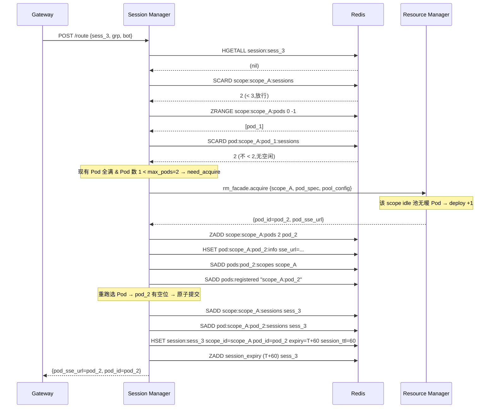
```mermaid
sequenceDiagram
    participant GW as Gateway
    participant SM as Session Manager
    participant R as Redis
    participant RM as Resource Manager
    GW->>SM: POST /route {sess_3, grp, bot}
    SM->>R: HGETALL session:sess_3
    R-->>SM: (nil)
    SM->>R: SCARD scope:scope_A:sessions
    R-->>SM: 2   (< 3,放行)
    SM->>R: ZRANGE scope:scope_A:pods 0 -1
    R-->>SM: [pod_1]
    SM->>R: SCARD pod:scope_A:pod_1:sessions
    R-->>SM: 2   (不 < 2,无空闲)
    Note over SM: 现有 Pod 全满 & Pod 数 1 < max_pods=2 → need_acquire
    SM->>RM: rm_facade.acquire {scope_A, pod_spec, pool_config}
    Note over RM: 该 scope idle 池无暖 Pod → deploy +1
    RM-->>SM: {pod_id=pod_2, pod_sse_url}
    SM->>R: ZADD scope:scope_A:pods 2 pod_2
    SM->>R: HSET pod:scope_A:pod_2:info sse_url=...
    SM->>R: SADD pods:pod_2:scopes scope_A
    SM->>R: SADD pods:registered "scope_A:pod_2"
    Note over SM: 重跑选 Pod → pod_2 有空位 → 原子提交
    SM->>R: SADD scope:scope_A:sessions sess_3
    SM->>R: SADD pod:scope_A:pod_2:sessions sess_3
    SM->>R: HSET session:sess_3 scope_id=scope_A pod_id=pod_2 expiry=T+60 session_ttl=60
    SM->>R: ZADD session_expiry (T+60) sess_3
    SM-->>GW: {pod_sse_url=pod_2, pod_id=pod_2}
```

| 键 | 操作 | 变化 |
|---|---|---|
| `scope:scope_A:pods` | ZADD | +`pod_2`(score=2,接入序) |
| `pod:scope_A:pod_2:info` | HSET | **新建**:{sse_url} |
| `pods:pod_2:scopes` | SADD | **新建**:{scope_A} |
| `pods:registered` | SADD | +"scope_A:pod_2" |
| `scope:scope_A:sessions` | SADD | +`sess_3`(2→**3**,满) |
| `pod:scope_A:pod_2:sessions` | SADD | **新建**:+`sess_3` |
| `session:sess_3` / `session_expiry` | HSET / ZADD | 新建 / +sess_3 |

> 价值:**按需弹性扩容**——满载才建 Pod,不空跑;容量随并发自动横向扩展。

#### 场景 D:老化与回收 —— TTL 到期 → 删空 Pod
**前置**:`pod_1` 上仅剩 `sess_1`,`sess_1` 到期。sweeper 每 1s 扫(多副本抢锁,全局只有一个扫)。

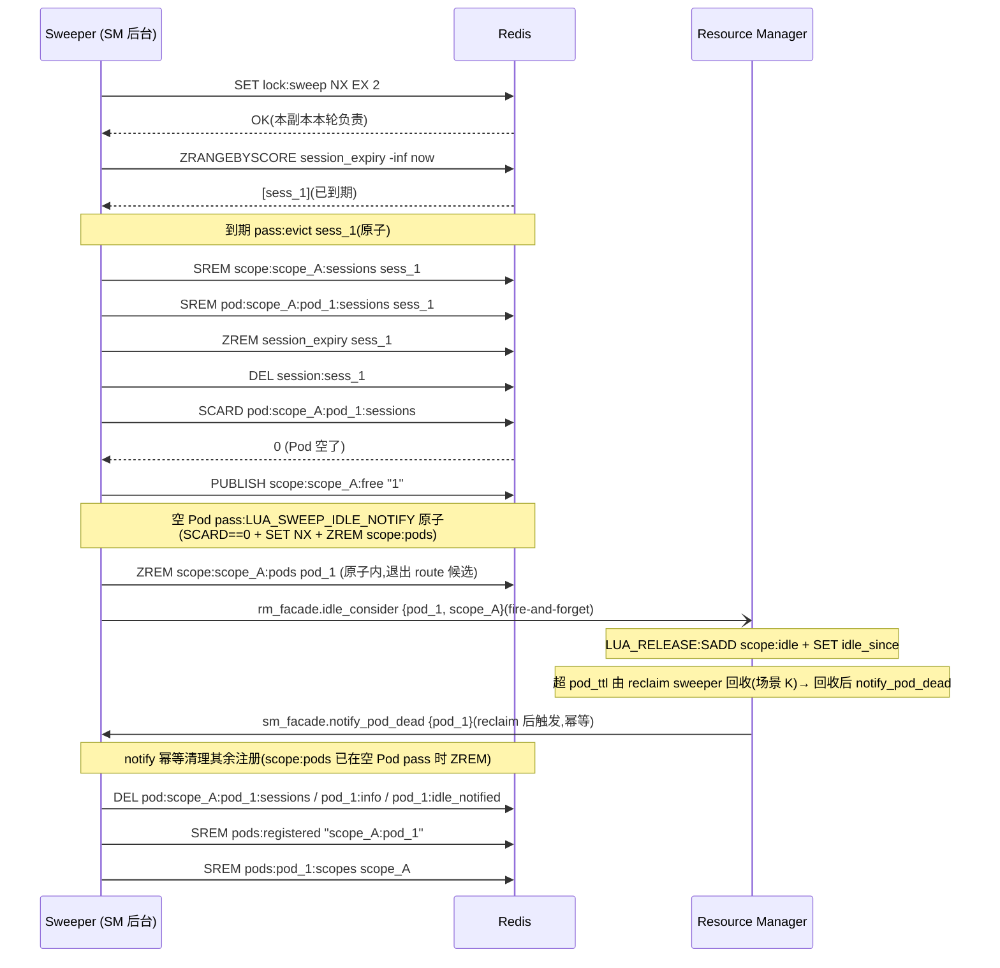
```mermaid
sequenceDiagram
    participant SW as Sweeper (SM 后台)
    participant R as Redis
    participant RM as Resource Manager
    SW->>R: SET lock:sweep NX EX 2
    R-->>SW: OK(本副本本轮负责)
    SW->>R: ZRANGEBYSCORE session_expiry -inf now
    R-->>SW: [sess_1](已到期)
    Note over SW,R: 到期 pass:evict sess_1(原子)
    SW->>R: SREM scope:scope_A:sessions sess_1
    SW->>R: SREM pod:scope_A:pod_1:sessions sess_1
    SW->>R: ZREM session_expiry sess_1
    SW->>R: DEL session:sess_1
    SW->>R: SCARD pod:scope_A:pod_1:sessions
    R-->>SW: 0  (Pod 空了)
    SW->>R: PUBLISH scope:scope_A:free "1"
    Note over SW,R: 空 Pod pass:LUA_SWEEP_IDLE_NOTIFY 原子<br/>(SCARD==0 + SET NX + ZREM scope:pods)
    SW->>R: ZREM scope:scope_A:pods pod_1  (原子内,退出 route 候选)
    SW-)RM: rm_facade.idle_consider {pod_1, scope_A}(fire-and-forget)
    Note over RM: LUA_RELEASE:SADD scope:idle + SET idle_since
    Note over RM: 超 pod_ttl 由 reclaim sweeper 回收(场景 K)→ 回收后 notify_pod_dead
    RM->>SW: sm_facade.notify_pod_dead {pod_1}(reclaim 后触发,幂等)
    Note over SW,R: notify 幂等清理其余注册(scope:pods 已在空 Pod pass 时 ZREM)
    SW->>R: DEL pod:scope_A:pod_1:sessions / pod_1:info / pod_1:idle_notified
    SW->>R: SREM pods:registered "scope_A:pod_1"
    SW->>R: SREM pods:pod_1:scopes scope_A
```

| 键 | 操作 | 变化 |
|---|---|---|
| `scope:scope_A:sessions` | SREM | -`sess_1` |
| `pod:scope_A:pod_1:sessions` | SREM→DEL | 清空→键删除 |
| `session:sess_1` | DEL | 删除 |
| `session_expiry` | ZREM | -`sess_1` |
| `scope:scope_A:pods` | ZREM(空 Pod pass 原子内) | -`pod_1`,**退出 route 候选(堵 reclaim 窗口内 route 直选)** |
| `pod:scope_A:pod_1:idle_notified` | SET NX(原子内) | 60s 去重标记 |
| `pods:registered` | SREM(notify 时) | -"scope_A:pod_1" |
| `pods:pod_1:scopes` / `pod:scope_A:pod_1:info` | SREM / DEL(notify 时) | 清理 |

> 价值:**低峰自动缩容**——空 Pod 经 `idle_consider`(`SADD scope:idle` + `SET idle_since`)转 idle 后由 reclaim sweeper 按 `pod_ttl` 回收(场景 K)。`LUA_SWEEP_IDLE_NOTIFY` 原子完成去重 + ZREM(堵 reclaim 窗口内 route 直选);`idle_consider` 丢失由 60s `idle_notified` 过期重发 + RM `reconcile_pods` 对账(场景 L)兜底。

#### 场景 E:保活(touch)
gateway 对**仍打开**的页面周期性调 touch,阻止老化。

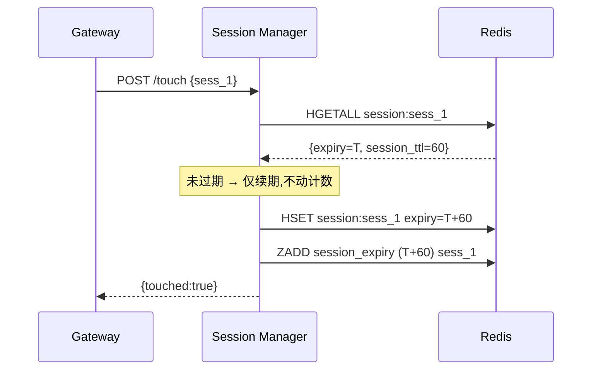
```mermaid
sequenceDiagram
    participant GW as Gateway
    participant SM as Session Manager
    participant R as Redis
    GW->>SM: POST /touch {sess_1}
    SM->>R: HGETALL session:sess_1
    R-->>SM: {expiry=T, session_ttl=60}
    Note over SM: 未过期 → 仅续期,不动计数
    SM->>R: HSET session:sess_1 expiry=T+60
    SM->>R: ZADD session_expiry (T+60) sess_1
    SM-->>GW: {touched:true}
```

**Redis 状态变化**:`session:sess_1.expiry` 与 `session_expiry` 的 score 续期;**scope/Pod 集合不变**(额度不增减)。若会话已过期/不存在 → `{touched:false}`,gateway 应回退重新 `route`。

#### 场景 F:容量满 —— 队列等待或快失败
**前置**:`scope_A` 活跃会话已达 3(上限),新 `sess_4` 到来。每 scope 等待队列上限 `max_waiters`(默认 `2×scope_concurrency=6`)。

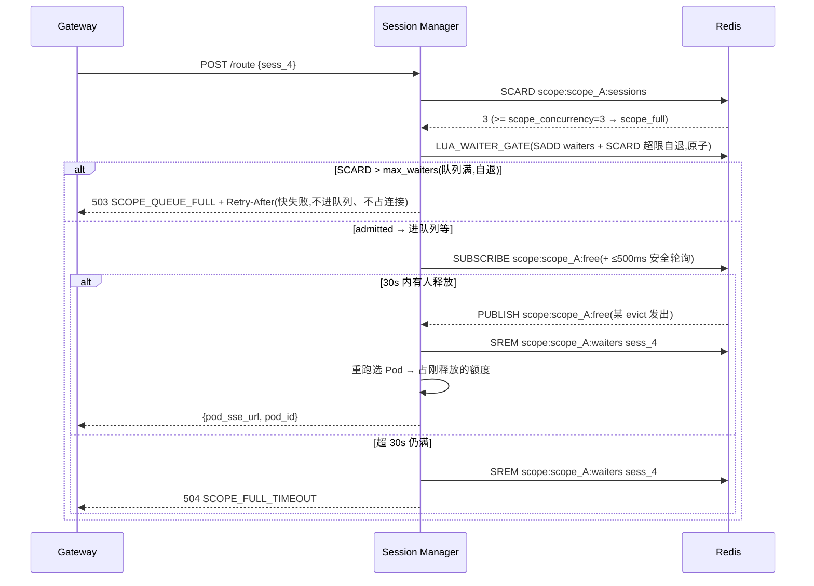
```mermaid
sequenceDiagram
    participant GW as Gateway
    participant SM as Session Manager
    participant R as Redis
    GW->>SM: POST /route {sess_4}
    SM->>R: SCARD scope:scope_A:sessions
    R-->>SM: 3   (>= scope_concurrency=3 → scope_full)
    SM->>R: LUA_WAITER_GATE(SADD waiters + SCARD 超限自退,原子)
    alt SCARD > max_waiters(队列满,自退)
        SM-->>GW: 503 SCOPE_QUEUE_FULL + Retry-After(快失败,不进队列、不占连接)
    else admitted → 进队列等
        SM->>R: SUBSCRIBE scope:scope_A:free(+ ≤500ms 安全轮询)
        alt 30s 内有人释放
            R-->>SM: PUBLISH scope:scope_A:free(某 evict 发出)
            SM->>R: SREM scope:scope_A:waiters sess_4
            SM->>SM: 重跑选 Pod → 占刚释放的额度
            SM-->>GW: {pod_sse_url, pod_id}
        else 超 30s 仍满
            SM->>R: SREM scope:scope_A:waiters sess_4
            SM-->>GW: 504 SCOPE_FULL_TIMEOUT
        end
    end
```

**Redis 状态变化**:`scope:scope_A:waiters` 是等待队列(SET,入队/出队均原子:入队经 `LUA_WAITER_GATE` SADD 先行 + 超限自退,出队 SREM);`scope:scope_A:free` 是 pubsub 通道(额度释放信号,由 evict 发布、route 订阅)。等待期间无额度写入;被唤醒后才走场景 B/C 的写入。

> 价值:**背压**而非雪崩——容量满时进有界队列(不随突发无限增长);队列满则快失败 503(不占连接),队列内超时则 504;gateway 据错误码退避重试。

#### 场景 G:Pod 异常死亡 —— notify_pod_dead 清洗
**前置**:`pod_2` 崩溃(上有 `sess_3`),Resource Manager 探测到 → 通知 Session Manager。

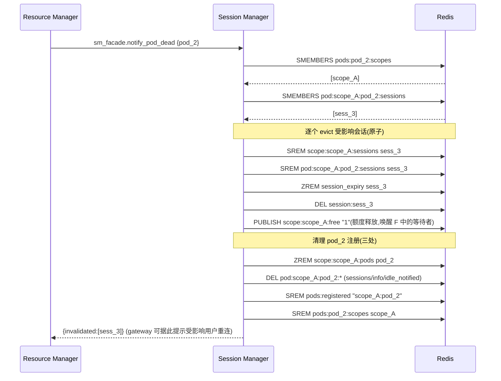
```mermaid
sequenceDiagram
    participant RM as Resource Manager
    participant SM as Session Manager
    participant R as Redis
    RM->>SM: sm_facade.notify_pod_dead {pod_2}
    SM->>R: SMEMBERS pods:pod_2:scopes
    R-->>SM: [scope_A]
    SM->>R: SMEMBERS pod:scope_A:pod_2:sessions
    R-->>SM: [sess_3]
    Note over SM,R: 逐个 evict 受影响会话(原子)
    SM->>R: SREM scope:scope_A:sessions sess_3
    SM->>R: SREM pod:scope_A:pod_2:sessions sess_3
    SM->>R: ZREM session_expiry sess_3
    SM->>R: DEL session:sess_3
    SM->>R: PUBLISH scope:scope_A:free "1"(额度释放,唤醒 F 中的等待者)
    Note over SM,R: 清理 pod_2 注册(三处)
    SM->>R: ZREM scope:scope_A:pods pod_2
    SM->>R: DEL pod:scope_A:pod_2:* (sessions/info/idle_notified)
    SM->>R: SREM pods:registered "scope_A:pod_2"
    SM->>R: SREM pods:pod_2:scopes scope_A
    SM-->>RM: {invalidated:[sess_3]}   (gateway 可据此提示受影响用户重连)
```

**Redis 状态变化**:受影响会话(`sess_3`)从四处清除;`pod_2` 从三处注册表清除;`scope:scope_A:free` 发布释放信号。

> 价值:**故障自愈**——Pod 挂了立即回收所有粘在它上的会话,受影响用户重新 route 即被分配到健康 Pod,不留孤儿状态。

#### 场景 H:min_idle 热备 —— 空闲预建 Pod(配置驱动,无需请求)
**前置**:某 `scope_A` 的 `min_idle_pods=1`,当前该 scope idle 池为空(所有 Pod 在用或尚未有请求)。autoscale 每全局 `autoscale_interval`(默认 1s)检查,抢 `lock:rm:autoscale`(per-scope)。**config_sync 已对该 scope 主动写入 RM scope config(含 pod_spec)**——因此**从未被请求过的 scope 也会被预热**(eager:下发即预备热备,见场景 M)。

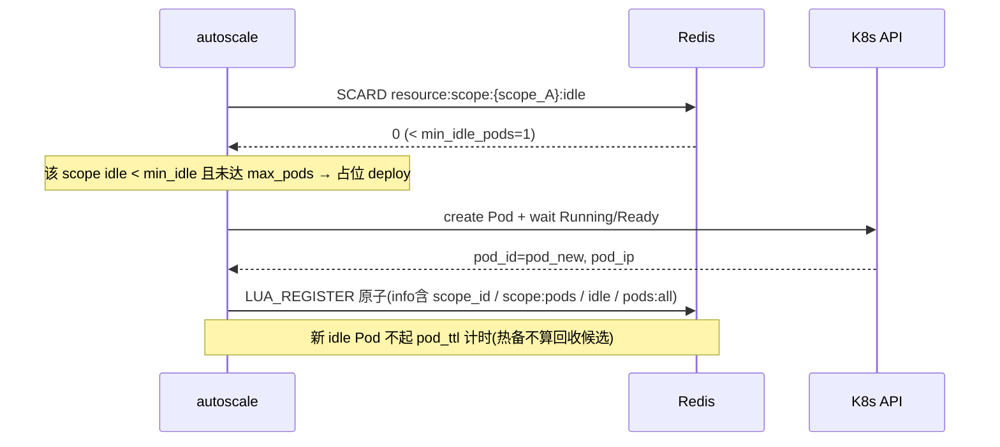
```mermaid
sequenceDiagram
    participant AS as autoscale
    participant R as Redis
    participant K8s as K8s API
    AS->>R: SCARD resource:scope:{scope_A}:idle
    R-->>AS: 0  (< min_idle_pods=1)
    Note over AS: 该 scope idle < min_idle 且未达 max_pods → 占位 deploy
    AS->>K8s: create Pod + wait Running/Ready
    K8s-->>AS: pod_id=pod_new, pod_ip
    AS->>R: LUA_REGISTER 原子(info含 scope_id / scope:pods / idle / pods:all)
    Note over AS,R: 新 idle Pod 不起 pod_ttl 计时(热备不算回收候选)
```

| 键 | 操作 | 变化 |
|---|---|---|
| `resource:scope:{scope_A}:pods` | ZADD | +`pod_new`(创建序) |
| `resource:scope:{scope_A}:idle` | SADD | +`pod_new`(SCARD 0→1 = min_idle 达标) |
| `resource:pods:all` | SADD | +`pod_new` |
| `resource:pod:{pod_new}:info` | HSET | **新建**:{scope_id=scope_A, pod_sse_url, pod_ip, phase=created} |

> 价值:**新请求零部署等待**——后续该 scope 的 acquire 直接取 idle 池里的 `pod_new`,无需等 K8s create + Ready。

#### 场景 I:RM acquire —— 取该 scope 暖 Pod / deploy / 封顶
**前置**:`scope_A` 现有 Pod 都满(SM 的 `route` first-fit 后未找到空位 → 调 `rm_facade.acquire`)。RM 侧三种走向。

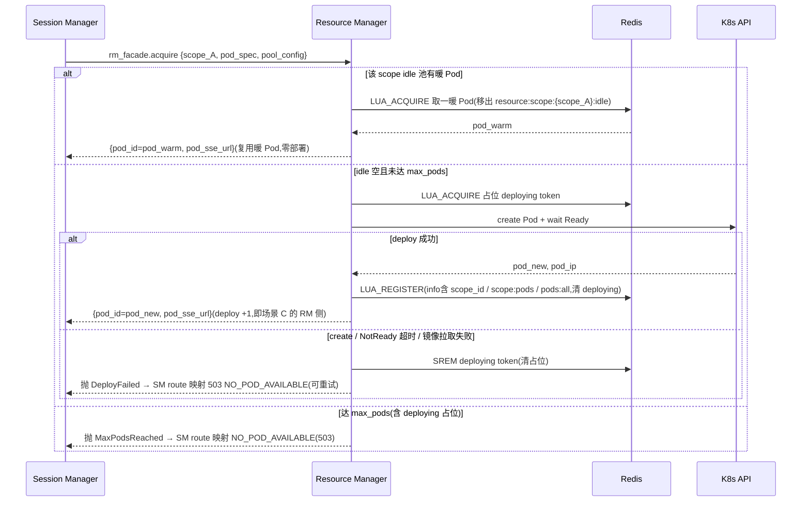
```mermaid
sequenceDiagram
    participant SM as Session Manager
    participant RM as Resource Manager
    participant R as Redis
    participant K8s as K8s API
    SM->>RM: rm_facade.acquire {scope_A, pod_spec, pool_config}
    alt 该 scope idle 池有暖 Pod
        RM->>R: LUA_ACQUIRE 取一暖 Pod(移出 resource:scope:{scope_A}:idle)
        R-->>RM: pod_warm
        RM-->>SM: {pod_id=pod_warm, pod_sse_url}(复用暖 Pod,零部署)
    else idle 空且未达 max_pods
        RM->>R: LUA_ACQUIRE 占位 deploying token
        RM->>K8s: create Pod + wait Ready
        alt deploy 成功
            K8s-->>RM: pod_new, pod_ip
            RM->>R: LUA_REGISTER(info含 scope_id / scope:pods / pods:all,清 deploying)
            RM-->>SM: {pod_id=pod_new, pod_sse_url}(deploy +1,即场景 C 的 RM 侧)
        else create / NotReady 超时 / 镜像拉取失败
            RM->>R: SREM deploying token(清占位)
            RM-->>SM: 抛 DeployFailed → SM route 映射 503 NO_POD_AVAILABLE(可重试)
        end
    else 达 max_pods(含 deploying 占位)
        RM-->>SM: 抛 MaxPodsReached → SM route 映射 NO_POD_AVAILABLE(503)
    end
```

| 走向 | 判定 | 结果 |
|---|---|---|
| 复用暖 Pod | `scope:idle` 非空 | 取一暖 Pod 返回(零部署;暖 Pod 来自场景 H 或刚腾空的 Pod) |
| deploy +1 | idle 空 + `ZCARD(scope:pods)+SCARD(scope:deploying) < max_pods` | 选主 deploy + `LUA_REGISTER`(场景 C 的 RM 侧) |
| **deploy 失败** | K8s create 报错 / NotReady 超 `ready_timeout`(300s)/ 镜像拉取失败 | `SREM` 清占位 → 抛 `DeployFailed`(503 可重试;占位已清,下次 acquire 可重试 deploy) |
| 封顶 | 达 `max_pods`(含 deploying 占位) | `MaxPodsReached` → SM 映射 503 `NO_POD_AVAILABLE` |

> 价值:**按需给 scope 配 Pod**——优先复用 idle 暖池里现成的 Pod(零部署等待),不够再 deploy,达上限则背压返回。一个 Pod 只服务一个 scope,RM 不做容量叠加判定(容量由 SM 的 `SCARD < pod_concurrency` 闸门保证)。

#### 场景 J:Pod 死亡 —— RM 探测清理(K8s Watch)
**前置**:`pod_2` 崩溃(K8s Watch 探测 FAILED),其上有 `scope_A` 的 `sess_3`(SM 侧仍记录)。与场景 G 互补:J 是 RM 侧探测 + 物理清理,G 是 SM 收到 `notify_pod_dead` 后的会话清洗。

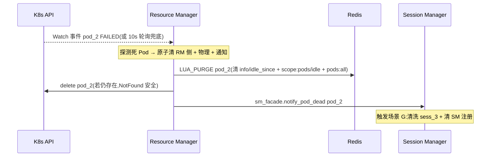
```mermaid
sequenceDiagram
    participant K8s as K8s API
    participant RM as Resource Manager
    participant R as Redis
    participant SM as Session Manager
    K8s-->>RM: Watch 事件 pod_2 FAILED(或 10s 轮询兜底)
    Note over RM: 探测死 Pod → 原子清 RM 侧 + 物理 + 通知
    RM->>R: LUA_PURGE pod_2(清 info/idle_since + scope:pods/idle + pods:all)
    RM->>K8s: delete pod_2(若仍存在,NotFound 安全)
    RM->>SM: sm_facade.notify_pod_dead pod_2
    Note over SM: 触发场景 G:清洗 sess_3 + 清 SM 注册
```

| 键 | 操作 | 变化 |
|---|---|---|
| `resource:pod:pod_2:*` | DEL | info / idle_since 全清 |
| `resource:scope:{scope_A}:pods` | ZREM | -`pod_2` |
| `resource:scope:{scope_A}:idle` | SREM | -`pod_2`(若在) |
| `resource:pods:all` | SREM | -`pod_2` |

**判死状态枚举**(沿用老 SDK `FAILED_POD_STATUSES`,真实踩过的清单):`Terminating`(删除中 / node 驱逐)、`Failed`、`CrashLoopBackOff`(含 OOM 反复重启)、`ImagePullBackOff` / `ErrImagePull` / `InvalidImageName`。**`Pending` 不判死**——deploy 路径靠 `ready_timeout` 兜,池内 Pod 卡 Pending 属异常由 Watch 状态变化跟进。

> 价值:**RM 侧故障自愈**——K8s Watch(实时)+ 10s 轮询(兜底)两道防线保证死 Pod 被发现并清掉;`notify_pod_dead` 触发 SM 清洗(场景 G),受影响用户重连即分配健康 Pod。

#### 场景 K:reclaim 自治回收 —— 周期 sweeper + ZREM
**前置**:`pod_1` 已 idle(该 scope 0 session)、`idle_since=T0` 已超 `pod_ttl`。Resource Manager reclaim sweeper 每 1s 扫,抢 `lock:rm:reclaim`,**不读 SM 模块 key(经 Facade 边界)**。reclaim 的删除是**周期触发**(每 1s 扫 idle 池);idle 只是「入 idle 池 + 起 `pod_ttl` 计时」(由 `idle_consider` 的 `LUA_RELEASE` 触发,见场景 D)。

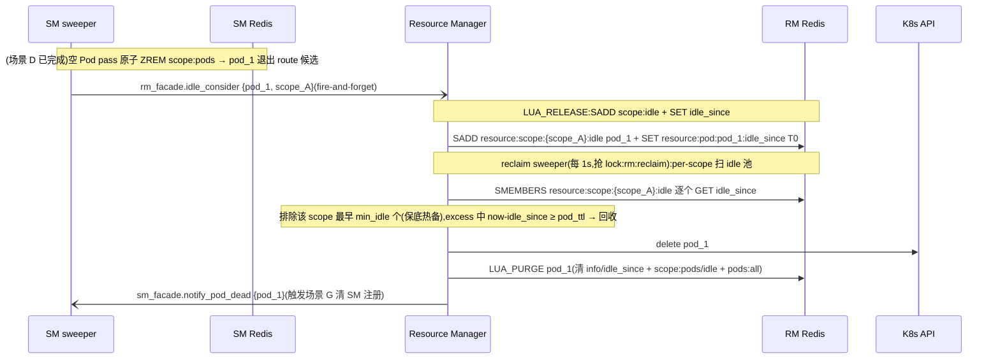
```mermaid
sequenceDiagram
    participant SW as SM sweeper
    participant SMR as SM Redis
    participant RM as Resource Manager
    participant RMR as RM Redis
    participant K8s as K8s API
    Note over SW,SMR: (场景 D 已完成)空 Pod pass 原子 ZREM scope:pods → pod_1 退出 route 候选
    SW-)RM: rm_facade.idle_consider {pod_1, scope_A}(fire-and-forget)
    Note over RM,RMR: LUA_RELEASE:SADD scope:idle + SET idle_since
    RM->>RMR: SADD resource:scope:{scope_A}:idle pod_1 + SET resource:pod:pod_1:idle_since T0
    Note over RM,RMR: reclaim sweeper(每 1s,抢 lock:rm:reclaim):per-scope 扫 idle 池
    RM->>RMR: SMEMBERS resource:scope:{scope_A}:idle 逐个 GET idle_since
    Note over RM: 排除该 scope 最早 min_idle 个(保底热备),excess 中 now-idle_since ≥ pod_ttl → 回收
    RM->>K8s: delete pod_1
    RM->>RMR: LUA_PURGE pod_1(清 info/idle_since + scope:pods/idle + pods:all)
    RM-)SW: sm_facade.notify_pod_dead {pod_1}(触发场景 G 清 SM 注册)
```

> 注:图中 `SMR` / `RMR` 是**同一个 Redis 实例的两个前缀**(`session_manager:` / `resource_manager:`)。

| 阶段 | 触发 | 动作 |
|---|---|---|
| 入 idle 池 | `idle_consider` 的 `LUA_RELEASE`(事件) | `SADD scope:idle` + `SET idle_since`(起 `pod_ttl` 计时) |
| reclaim 删除 | reclaim sweeper 每 1s(周期,per-scope) | excess(超 `min_idle` 底数)中 `now-idle_since ≥ pod_ttl` → K8s delete + `LUA_PURGE` + `notify_pod_dead` |

> 价值:**低峰自动缩容**——空闲超 `pod_ttl` 的 Pod 周期回收,不空跑。**安全靠 SM `ZREM`**:SM 发 `idle_consider` 前**原子 `ZREM scope:pods`**,该 Pod 即刻退出 route 候选,reclaim 窗口内 SM 不再 route 新 session 上去。`min_idle` 底数内的 idle Pod 即使过期也不回收(保底热备)。

#### 场景 L:孤儿 Pod 对账 —— reconcile_pods 移入 idle / reclaim
**前置**:`pod_1` 的 `idle_consider` 丢失(SM 已 `ZREM scope:pods`,但 RM 仍持有该 scope 的 Pod,未 idle / reclaim)→ Pod 卡在「RM 仍持有、SM 已不用」的孤儿态,不进 reclaim 候选。RM 孤儿对账 sweeper 每 30s(抢 `lock:rm:reconcile`)调 SM `reconcile_pods`。

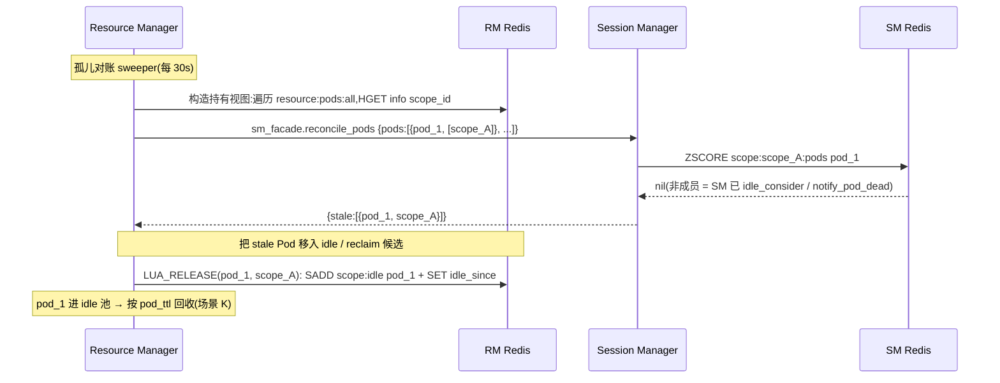
```mermaid
sequenceDiagram
    participant RM as Resource Manager
    participant RMR as RM Redis
    participant SM as Session Manager
    participant SMR as SM Redis
    Note over RM: 孤儿对账 sweeper(每 30s)
    RM->>RMR: 构造持有视图:遍历 resource:pods:all,HGET info scope_id
    RM->>SM: sm_facade.reconcile_pods {pods:[{pod_1, [scope_A]}, ...]}
    SM->>SMR: ZSCORE scope:scope_A:pods pod_1
    SMR-->>SM: nil(非成员 = SM 已 idle_consider / notify_pod_dead)
    SM-->>RM: {stale:[{pod_1, scope_A}]}
    Note over RM,RMR: 把 stale Pod 移入 idle / reclaim 候选
    RM->>RMR: LUA_RELEASE(pod_1, scope_A): SADD scope:idle pod_1 + SET idle_since
    Note over RM: pod_1 进 idle 池 → 按 pod_ttl 回收(场景 K)
```

> 注:图中 `SMR` / `RMR` 是**同一个 Redis 实例的两个前缀**(`session_manager:` / `resource_manager:`)。

| 步骤 | 判定 | 结果 |
|---|---|---|
| SM 查成员 | `ZSCORE scope:scope_A:pods pod_1` | 非成员 → `stale`(SM 已 `idle_consider`/`notify_pod_dead`,不再用) |
| RM 释放 | `LUA_RELEASE` 把 stale Pod 移入 idle 池 | 进 idle 池 + 起 idle_since → 进 reclaim 候选(场景 K) |

> 价值:**消除孤儿 Pod**——`idle_consider` 丢失 / SM 重启漂移导致的「RM 仍持有 Pod、SM 已不用」由周期对账兜底移入 idle / reclaim。**只删 SM 已 `ZREM` 的对**(SM 不再 route 到它),不误杀有活跃会话的 Pod。经 Facade、不读 SM 模块 key(SM 读自身前缀返回 `stale`)。

#### 场景 M:配置热更新 —— 全量下发 / A 类日落老 Pod / B 类只调策略 / 无请求预热
**前置**:Claw Manager 经 `config_sync` **全量下发** `{templates, scopes}`(快照式替换;旧 `kind/op` 增量协议已废弃,400 拒绝)。

**总原则:新值对增量生效;存量不驱逐、自然过渡(grandfathered)。** 改"Pod 长什么样"→ 老 Pod 日落换血;改"怎么管流量 / 池"→ 只调策略,老 Pod 原地继续服务。

```mermaid
sequenceDiagram
    participant CM as Claw Manager
    participant SM as Session Manager
    participant R as Redis
    participant RM as Resource Manager
    CM->>SM: POST /config_sync {templates, scopes}(全量)
    SM->>SM: 锁外校验(400)→ 抢 lock:config_sync(忙→409)
    SM->>SM: 读 DB 旧态 → 模板/scope diff → 日落中间态检查(先于写库)
    SM->>SM: 写 DB(upsert 全部 + 删消失项;失败即中止,不动快照/不推送)
    SM->>R: 重建路由快照(原子 SET routing:snapshot;B 类立即生效由此完成)
    SM->>RM: 对每个存活 scope update_pool_config(池参数 + pod_spec)<br/>★eager 预热:autoscale 下一拍即预热 min_idle(无需任何请求)
    opt A 类(有效模板 deploy_ver 变:模板变更或 scope 换引用)
        SM->>R: ZREM 老版本 Pod 出 scope:pods 候选集(软摘除)
        Note over RM: autoscale 新暖 Pod 用新镜像<br/>acquire 取暖 Pod 跳过老版本
        Note over R: 存量会话粘老 Pod 直至老化<br/>老 Pod 排空 → idle → 按 pod_ttl 回收
    end
    opt scope 从下发列表消失(删除)
        SM->>RM: update_pool_config(min_idle=0)
        Note over RM: 停止预热;存量会话到期止<br/>空闲 Pod 按 pod_ttl 自然排空(不强制驱逐)
    end
```

**配置项按"值是否在 deploy 时被烘焙进运行中的 Pod"分两类:**

**A 类——变更需"日落"老 Pod**(deploy 子集,除 `kubeconfig`;变更后老 Pod 运行态与新配置不一致,不再接新流量):

| 配置项 | 日落原因 |
|---|---|
| `agent_image` | 老 Pod 跑老代码 |
| `namespace` / `container_name` / `container_port` | Pod 部署规格,新老不一致 |
| `sse_port` / `sse_path` | 影响 `pod_sse_url` 构造 |
| `readiness_*` | 探针烘焙在 Pod spec 里,K8s 对老 Pod 持续用老探针 |
| `nfs_*` / 资源限额(CPU / 内存) | 挂载 / 限额要重建才生效 |

**B 类——变更无需日落老 Pod**(运行时策略,控制面读时使用,老 Pod 继续服务):

| 配置项 | 生效方式 |
|---|---|
| `scope_concurrency` | 下次 route(SM 闸门);调小→存量不驱逐,新请求 scope_full,老化回落 |
| `pod_concurrency` | 下次 route first-fit(SM per-Pod 闸门);调小→该 Pod 不接新 session |
| `session_ttl` | 新 session 即时;存量下次 route 续期刷新为新值(纯 touch 用老值) |
| `pod_ttl` / `min_idle_pods` | config_sync 经 Facade 推 RM,立即生效 |
| `max_pods`(派生) | 下次 route / acquire;调小→不再扩,存量按 `pod_ttl` 自然回收 |
| `kubeconfig` | RM 的 deploy 凭证,只影响新 deploy 操作,不影响运行中 Pod(**虽在 deploy 子集但例外**) |

**变更检测**:config_sync 处理时,SM 手里同时有老值(DB 现行 template/routing_scope 行)和新值(下发 payload),**进程内逐字段 diff**(不在热路径上)。`deploy_ver` = A 类字段的 hash 指纹——新旧 `deploy_ver` 不等即 A 类变更(字段级 diff 供审计 / 决策明细)。`max_pods` 是派生值,随 `scope_concurrency`/`pod_concurrency` 自动涵盖。**受影响 scope 从 DB scope 表确定性求出**(引用变更模板的 scope ∪ 引用切换的 scope),不再依赖缓存反查。**scope 的"有效模板" A 类判定**:模板自身 deploy_ver 变、或 scope 换引用模板且新旧模板 deploy_ver 不同,都按 A 类日落该 scope 的老 Pod。

**A 类日落机制(保证新流量不落老 Pod):**
1. **SM 侧软摘除**:`pod:info` 记录 `deploy_ver`(注册 Pod 时的指纹);config_sync 对比新旧 `deploy_ver` 不等 → 定位受影响 scope → 把 `deploy_ver` 不匹配的 Pod **ZREM 出 `scope:pods` 候选集**(与 `idle_consider` 同款机制)——即刻退出 first-fit,**不再接任何新 session**。存量会话不受影响(亲和续期直读 session HASH,不查候选集),继续粘在老 Pod 直至老化。
2. **RM 侧版本过滤**:`acquire` 从 `scope:idle` 取暖 Pod 时**跳过 `deploy_ver` 不匹配的**(老镜像暖 Pod 留在 idle 池按 `pod_ttl` 回收,不外发给新流量);`update_pool_config` 推送同时刷新 RM 缓存的 deploy 字段 → autoscale 补位的暖 Pod 用**新镜像**。
3. **判定粒度是 deploy 子集指纹**:只改 B 类参数时 `deploy_ver` 不变,不触发日落,老 Pod 继续接新流量(避免任何配置变更都引发全量重部署)。

**B 类推送 / eager 预热**:SM 经 **`rm_facade.update_pool_config(scope_id, pool_config, pod_spec)`** 把池参数 + deploy 子集主动推给 RM,RM 覆盖 `resource:scope:{scope_id}:config`(HSET 幂等)——autoscale / reclaim **立即**按新值执行。**config_sync 对每个存活 scope 都推(始终带 pod_spec)**:RM 侧只有带 pod_spec 才会落 `pod_spec_json`/`deploy_ver`,autoscale 才能无请求预热 min_idle——这是"配置驱动预热"(下发即预备热备,无需首个请求触发)的实现核心。

**scope 删除(从下发列表消失)**:推 `min_idle=0` 停止预热;存量会话**不强制驱逐**(亲和续期到 TTL 自然到期);空闲 Pod 由 reclaim(aged ≥ pod_ttl)自然排空。RM 侧 scope config 键残留无害(复活时推送覆盖)。

**镜像升级路径**(A 类变更的落地):默认**自然滚动**——老 Pod 无新会话 → 存量老化排空 → idle → 按 `pod_ttl` 回收;新流量 first-fit 只剩 / acquire 只发新镜像 Pod。需快速切换时用运维 **`cleanup` 批删 + autoscale 重建**(强制,中断存量会话)。

**串行化与并发控制**:服务是多副本 + LB,两次 `config_sync` 可能落到**不同副本并发执行**(diff / 日落 / 推送互相交错)。处理:
1. **分布式锁串行**:`config_sync` 全程持 `lock:config_sync`(SET NX EX,EX = 处理超时上限);抢不到 → 返回 **409 `CONFIG_SYNC_BUSY`**(可重试,带 `Retry-After`),不排队。
2. **完成判定含老 Pod 日落**:上一次热更新**未完全完成前拒绝下一次**——完成 = 处理流程结束 + 受影响 scope **无"已日落待回收"的 Pod**(SM 侧判定:`pods:registered` 中属于该 scope、但已不在 `scope:pods` 候选集里的 Pod 即中间态残留;全部回收后 `notify_pod_dead` 清注册,中间态清零)。**检查先于写 DB**:拒绝时 DB/Redis 均未被改动。
3. **写 DB 失败防护**:写 DB 失败 → 立即中止,**不得 SET 路由快照、不得推送**(运行时继续用 last-known-good 快照;对应真实 bug教训:DB 写异常后缓存被脏数据刷新)。DB 无事务,部分写入时快照未动、服务面无感,下次成功下发收敛。

> 价值:**配置变更不中断服务**——A 类(镜像等)通过软摘除 + 版本过滤实现自然滚动,新流量只走新 Pod、存量会话无感;B 类(策略参数)经路由快照原子覆盖 + 主动推送立即生效、老 Pod 原地复用;**eager 预热让每个 scope 在下发后即拥有 min_idle 热备**(无需首个请求);串行化 + 日落完成判定保证并发下发不交错。

#### 场景 N:半死 Pod 检测 —— AgentServer 健康 SSE 端点 + RM 周期探测
**前置**:`pod_2` 在 K8s 侧 Running/Ready,但其 SSE 服务 hang 死 / 不响应(进程死锁、事件循环阻塞、连接堆积)。**K8s Watch 看不到这种半死**——bypass 架构下 SM/gateway 直连数据面,控制面里只有 RM 管物理面,因此**半死检测归 RM**。

**机制**:AgentServer 在 SSE 端口上提供**健康检查端点**(`GET /health`,固定约定,复用 `sse_port`);RM 的后台探测任务(复用死 Pod 探测的选主,见场景 J)对 `pods:all` 里每个 Pod **周期探测**(默认 10s,与轮询同频)该端点——**连续失败达阈值(默认 2 次)判半死,按死 Pod 处理**:`LUA_PURGE` + K8s `delete` + `sm_facade.notify_pod_dead`(触发场景 G 清洗)。连续失败阈值防瞬时抖动误杀;探测恢复则无动作(半死期间该 Pod 本就不该接新流量,由 gateway 侧超时兜底)。

```mermaid
sequenceDiagram
    participant RM as Resource Manager(RM 后台探测)
    participant Pod2 as Pod(pod_2, Running 但 SSE hang)
    participant R as Redis
    participant SM as Session Manager
    Note over RM: 每 10s 对 pods:all 逐个探测 GET http://pod_ip:sse_port/health
    RM->>Pod2: 健康探测(第 1 次)
    Pod2--xRM: 超时 / 无响应
    RM->>Pod2: 健康探测(第 2 次,隔 10s)
    Pod2--xRM: 仍失败 → 连续 2 次,判半死
    RM->>R: LUA_PURGE pod_2(清 info/idle_since + scope:pods/idle + pods:all)
    RM->>Pod2: K8s delete(若仍在)
    RM->>SM: sm_facade.notify_pod_dead pod_2
    Note over SM: 触发场景 G:清洗粘在 pod_2 上的会话<br/>用户下次请求重新 route → 健康 Pod
```

**数据面超时契约(gateway ↔ Pod SSE,配套自愈)**:gateway 对 SSE 流设读写超时(`message_timeout` 语义,默认 600s 量级);**超时或断流必须给用户明确错误,禁止流静默结束**(老 SDK 真实踩过:静默结束导致前端只看到对话无声中断);断流/超时后 gateway 的自愈 = **重新 `route`**——此时半死 Pod 已被 RM 摘除(本场景)或将被摘除,重新 route 会拿到健康 Pod,粘上去的旧会话由场景 G 清洗。SM 不在数据通路上,不感知单次断流;数据面健康由本场景的 RM 探测兜底。

> 价值:**旁路架构下的数据面健康兜底**——控制面不在数据通路上,看不见"SSE 不通";用 AgentServer 健康 SSE 端点 + RM 周期探测补上这块盲区,半死 Pod 在 ≤20s 内被发现并清理,配合 gateway 超时 + 重新 route 实现用户无感自愈。

---

## 7. 安全与可靠性设计

### 7.1 原子性 —— 一个操作要么全做完,要么等于没做
路由时要一气呵成地"查会话亲和 → 检查容量 → 选 Pod → 记账占额度",这几步被塞进 Redis 的**一个 Lua 脚本**(`LUA_ROUTE_PLACE`)里一次跑完。Redis 执行 Lua 期间不会被其它请求打断,因此不会出现"两个请求同时看到同一个空位、都抢上去"的竞态,也就不会超卖。RM 侧"挑一个暖备 Pod / 标记正在 deploy"同理,也是单脚本原子(`LUA_ACQUIRE`)。

### 7.2 幂等性 —— 同一个请求重发多少次,效果只等于一次
网络抖动时 gateway 会重试同一个请求(携带相同的 `request_id`)。服务用 `request_id` 作幂等键把结果记下,重试一来直接回上次的答,**不会因为重试就多占一份额度、多建一个 Pod**。另外 `idle_consider`(标记 Pod 空闲)和 `notify_pod_dead`(清死 Pod 注册)这两种操作本身就"做一遍和做多遍结果一样",丢了重发也安全(SM、RM 各用各自的前缀存幂等键,同一个 `request_id` 不会串)。

### 7.3 过载保护 —— 流量超容量时排队,而不是把后端打爆
当某个 scope 的活跃会话已达上限,新请求不直接失败,而是进一个**有界的等待队列**(容量约 `2 × scope_concurrency`),等别人释放额度;队列也满了就**立即返回 503**(带 `Retry-After`),不拖着占用连接。等到 `scope_full_timeout`(默认 30s)还没轮到,返回 504。gateway 拿到"可重试"的错误码后,用**指数退避 + 随机抖动**重试——每次等更久、再叠加一个随机量,把一大批同时被拒的请求在时间上摊开,避免它们同一瞬间又一起涌回来把服务打爆(即"重试风暴")。

### 7.4 认证授权 —— 谁能调哪个接口,由服务框架统一把关
对外的四个接口(`route` / `touch` / `config_sync` / `cleanup`)用什么凭证(mTLS 或 token)、是否允许本次调用,由底层**服务框架 `openjiuwen_runtime.service` 统一把关**(`link_auth` + adapter 中间件),本服务只声明各接口的调用方约束:`config_sync` 只许 Claw Manager 调、`cleanup` 只许运维调。SM 与 RM 之间的调用是同进程函数调用,不经过网络框架,因此不需要鉴权。

### 7.5 输入校验 —— 通用校验框架做,本服务只补自己特有的
接口入参的常规校验(字符集合法、长度不超、非空、数值在合理范围)由**服务框架在进入 handler 之前统一拦掉**,handler 不必重复实现。本服务只补框架管不到的两条:
1. `scope_id` 由 config_sync 下发,服务端在入口强校验字符集 `[0-9A-Za-z._-]{1,128}`——它会直接拼进 Redis 键名(`scope:{scope_id}:*`)与 `pods:registered` 的 `"{scope}:{pod}"` 条目(按首个 `:` 切分),含 `:`/`*`/空白会破坏键解析与切分唯一性;
2. `route` 四参(session_id/user_id/group_id/bot_id)非空在 orchestrator 补校验(user_id/group_id 经信封可选传递,框架拦不到空串语义)。

### 7.6 状态持久化 —— 重启不丢编排态,清库属灾难
所有运行时状态(会话亲和、额度占用、Pod 池)都放在 Redis,不在进程内存。因此 Redis **必须开持久化(AOF / RDB)**,服务重启后状态原样还在,无需重建。但 Redis 被整体清空(flush)属于灾难——会话和 TTL 同时丢失,不在自动恢复范围内;这时 K8s 里还活着的旧 Pod 会变成没人管的"孤儿",靠 RM 的周期对账慢慢发现并按 `pod_ttl` 回收。所以部署上禁止清库,也不提供"列出所有 Pod"的接口。

### 7.7 死 Pod 自愈 —— Pod 崩了能自动发现并清理
AgentServer Pod 会崩溃、被驱逐或卡死。RM 靠两道防线保证它最终被发现并清掉(K8s 里没了、或状态 Failed):
1. **K8s Watch**——实时订阅 K8s 事件,Pod 一变 Failed 立刻感知;
2. **10 秒轮询**——Watch 万一漏报时的兜底,周期主动查一遍 Pod 状态。
任一道命中,都做同样的三步清理:从 Redis 删掉它的记录(`LUA_PURGE`)、从 K8s 删掉它(若还在)、通知 SM 把粘在它上的会话清掉(`notify_pod_dead`)——受影响用户下次请求会被重新分配到健康 Pod。

### 7.8 孤儿 Pod 对账 —— Pod 还活着、但被 SM 遗忘的,定期清账
"孤儿 Pod"特指:**Pod 在 K8s 里还活着,但 SM 早已不再往它 route 会话**(成因:`idle_consider` 通知丢了、或 SM 重启漂移),而 RM 这边却还持有它的记账——它不在死 Pod 清理范围内(Pod 没死),又不会被正常回收(SM 没再通知它空闲)。RM 每 30 秒做一次 **RM↔SM 对账**兜底:把自己持有的 Pod 视图经 Facade `reconcile_pods` 发给 SM,SM 对照自己还在用的,把"我已不用的"标为 stale 返回;RM 据此释放这些 Pod 的记账 → 它们转为 idle → 空闲超 `pod_ttl` 后被回收(这条不立即删 Pod,只是把它还给 idle 池等回收)。

---

## 8. 部署与运维

- **服务**(Session Manager + Resource Manager 两个模块):多副本无状态,前置负载均衡;Gateway 调任意副本。运行态 / 编排态在 Redis(同一实例,`session_manager` / `resource_manager` 两前缀),配置在 DB。autoscale / reclaim / deploy / 对账各自 tick 级选主,多副本安全。
  - **Redis 不可用** = 编排态不可读写 → `rm_facade.acquire`/`rm_facade.idle_consider` fail-fast(不降级到内存,防超卖失效);**K8s 不可用** = deploy/delete 失败 → 现有 Pod 继续服务(只影响扩缩容)。
  - **运维清理**:调 `POST /api/session/cleanup` 按 label 批删 AgentServer Pod(灾难恢复 / 重新部署 / 清孤儿);不操作 Redis 编排态;清完后 autoscale 重建 `min_idle_pods`。
- **Redis**:本服务用**一个 Redis 实例**(两模块以 `session_manager` / `resource_manager` 前缀隔离);同进程同信任域,模块边界由 Facade 强制(跨模块数据只走 Facade、不读对方 key)。须高可用 + AOF/RDB 持久化。
- **配置下发**:Claw Manager 经 `config_sync` 推 template + 路由规则到 Session Manager,写 DB,立即生效。
- **依赖**:Redis / DB 为关键状态,须高可用;不可用即服务不可用(fail-fast,不降级)。

---

## 9. 实现与验收状态(2026-08-15 更新)

M6(server 模式)已完成开发与真环境端到端验收,实现与本文的差异记录如下(语义以本文为准,差异处本文已同步修订):

- **`LUA_WAITER_GATE`(§5.1 键表 / §6.2 场景 F)**:实现期补充的第 7 个 SM Lua 脚本。初稿「先 SCARD 再 SADD」的入队判定在并发同时到达时全部读到旧计数而超收(真环境验收场景 F 发现的竞态),改为原子闸门后稳态 `SCARD ≤ max_waiters` 恒成立。全文见 SM 设计 §5.1。
- **场景 N(半死 Pod 健康探测)**:机制已实现且有单测覆盖;端到端验收**暂缓**——当前 AgentServer 镜像在 SSE 端口对 `GET /health` 返回 426(要求协议升级),不满足 §6.2 场景 N 的固定约定,待 AgentServer 原生支持后补验。
- 场景 A–L 已在真 Redis + MySQL + K8s 环境端到端验收通过(用例固化为 `applications/agent_runtime/scripts/e2e_hld_acceptance.py`,经 `scripts/integration_smoke.sh` 调用,可作部署后回归)。

### 9.1 多副本验收(2026-08-18 更新,M7)

§8「多副本无状态 + 前置 LB」承诺已全链路落地并验收:

- **进程内双实例确定性测试**(12 用例,`tests/integration/test_multi_replica.py`):同进程两 App 共享一组资源,覆盖跨副本闸门不超收、deploy 锁窗口零重叠、PubSub 跨副本唤醒、幂等跨副本重放、配置失效传播、每 (job,epoch) 恒一选主、sweeper 互斥。套件 104 用例日常全跑。
- **真 LB 多副本 e2e**(35 项,`scripts/e2e_multi_replica.py`):K8s 2 副本 + ClusterIP/NodePort Service 单入口,实例身份从选主键反查;含 **failover**(流量中删副本 Pod → Deployment 恢复 + 选主接管 + 错误率归零)。<2 实例自动 DEGRADED(专项 SKIP,退出码 0)。
- **部署形态**:`deploy/`(Deployment 多副本/反亲和 + `/healthz` 探针 + SA/RBAC×2 + Service LB,`render_and_apply.sh` 渲染部署)+ Dockerfile;宿主机 `deploy_replicas.sh` 多进程。<br>**红线**:`OPENJIUWEN_SERVICE_DEPLOY_REPLICAS` 保持 1(副本数=Deployment replicas);RBAC 须覆盖 AgentServer 目标 namespace。
- **压测/浸泡**:`scripts/load_test.py`(route/route_touch/queued 三场景,分位数+错误直方图;真 LB 实测 ~540rps p50≈5ms 零错误)。
- **实现补充**:新增 `GET /healthz`(探针/就绪轮询/实例观测);`create_app` 支持注入共享资源(`resources`/`instance_id`/`own_resources`);修复 in-cluster 模式 `load_incluster_config` 误 await(同步函数,M6 只验过 kubeconfig 路径未暴露)。
- **已知语义差异**:多副本冷突发时并发请求可拿到 `NO_POD_AVAILABLE` 快失败(占位封顶,`retry_after=1` 重试),非超收;M6 冒烟回归建议对单实例执行。
