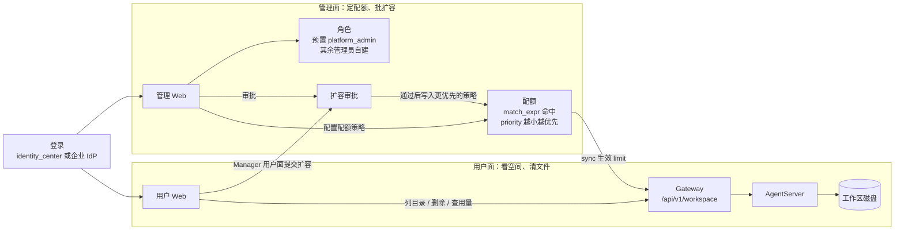
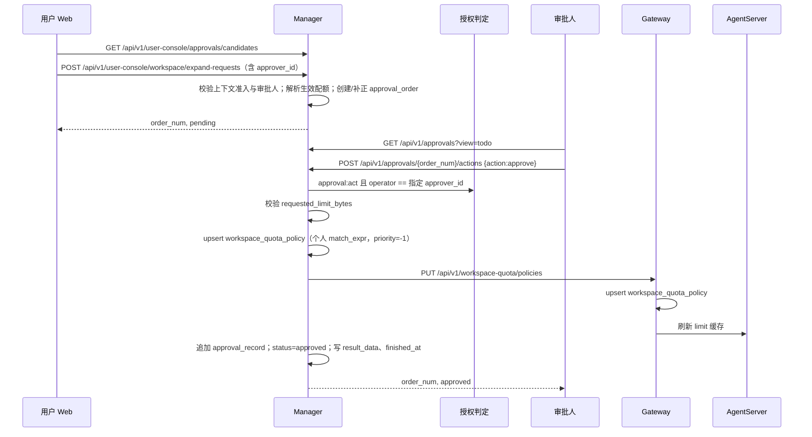

# 用户空间与配额管理设计方案

## 0. 需求与优先级（实现输入）

| # | 需求 | 优先级 | 落点章节 |
|---|------|--------|----------|
| R1 | 展示目录与文件列表（名称、大小、日期；**不展示内容**） | P0 | §2 |
| R2 | 会话目录可删；其他 md、skills 不可删 | P0 | §2 |
| R3 | 配额 ≥80% 提醒；≥100% 告警并拒绝新增磁盘占用，须清理或扩容后才能再写入 | P0 | §1 / §2 / §3 / §4 |
| R4 | 用户发起扩容；管理面审批生效；多粒度配额管理 | P0 | §3 / §5 / §6 |
| R5 | 文件内容预览 | P2 | §2 |
| R6 | 文件/文件夹下载 | P2 | §2 |

**非目标：** 不替代 Agent 工具链读写；不做跨实例对象存储浏览器；不自动迁移存量 `workspace_dir`；不混淆 Runtime「会话路由」与磁盘 session 目录。

**实现顺序建议：**

```text
Phase A  §1 架构契约 + 企业 Agent 转发通道
Phase B  §2 用户面 list / delete / usage（可先无审批，配额读 Manager 下发值）
Phase C  §3 配额 CRUD + sync，§4 用量查询
Phase D  §5 角色权限落地 + §6 配额扩容审批
Phase E  §2 P2 预览 / 下载
```

> Phase D 可与 C 并行设计、稍后落地；但**权限码与审批表结构须在 C 之前定稿**，配额/审批 API 以角色权限码鉴权。

---

## 1. 总体架构

### 1.1 问题与结论

| 现状 | 结论 |
|------|------|
| Swarm 已有 `/file-api` 浏览雏形，缺 size/mtime、精细删除、配额 | 用户面在 Gateway/AgentServer 增强，契约统一为 `/api/v1/workspace` |
| 企业版 Gateway 读本地盘，远程 Pod 工作区不可靠 | **企业版文件与用量必须在 AgentServer 执行**，Gateway 只做鉴权转发 |
| Manager 无磁盘配额与审批；仅有身份侧超管开关 | 配额权威在 Manager；角色权限见 §5，审批见 §6 |

### 1.2 组件职责

| 组件 | 职责 |
|------|------|
| **Web（用户面）** | 工作区浏览器、用量条、清理、发起扩容；写盘阻断引导 |
| **Gateway** | `/api/v1/workspace` 鉴权、限流、协议适配；企业版转发 Agent；个人版可同机直读；写盘前按用量拒绝 |
| **AgentServer** | 真实盘：list / delete / usage / preview / download；写盘前配额检查；维护用量计数，供 Gateway 查询 |
| **Manager** | 配额策略权威、多粒度绑定、角色权限与扩容审批、审计；quota sync 下发 |
| **identity_center** | 认证与目录（可替换）；**不承载**产品权限与审批单 |

### 1.3 架构总图



### 1.4 数据面与控制面

| 面 | 主路径 | 权威 |
|----|--------|------|
| **数据面（文件）** | Web → Gateway → AgentServer → 磁盘 | 磁盘事实 + zone 策略 |
| **控制面（配额）** | Manager 策略 → push → Gateway `workspace_quota_policy` → Agent 只读 | Manager `workspace_quota_policy` |
| **控制面（审批）** | 用户 Web → Manager 用户面建单 → `approval_order` / 审批记录 → **批准后生效**（改配额并 sync） | Manager 审批引擎（见 §6） |
| **控制面（授权）** | JWT 身份 → Manager 本地角色/权限 → 接口放行 | Manager 产品授权（见 §5） |

写路径原则：管理面手写配额策略与《配置生效策略》一致——**先推下游成功，再提交 Manager 库**。审批通过生效见 §6.5（先写 Manager，再推 Gateway，失败可重试）。

### 1.5 企业版转发约定（架构硬约束）

```text
GET/DELETE /api/v1/workspace/*
  → Gateway 验用户会话 + instance_grant
  → 解析 workspace_key / 绑定 Agent
  → E2A/WS 调用 AgentServer WorkspaceService
  → 返回元数据 / 删除结果 / 用量
```

验收：远程 Pod 场景下列表与删除必须反映 **Agent 工作区真实磁盘**，不得出现 Gateway 空目录假成功。

### 1.6 工作区目录与计量边界（跨 §2/§3/§4 的共享模型）

企业版实测落盘（NFS/PVC 下 `workspace_{key}`）示意：

```text
workspace_{workspace_key}/                         ← 默认配额计量根
└── agent/
    ├── jiuwenclaw_workspace/                      ← Agent DeepAgent 工作区
    │   ├── AGENT.md                               ← role_md：角色设定（不可删）
    │   ├── agents/                                ← runtime：运行时/子代理占位
    │   ├── coding_memory/                         ← memory：编码相关记忆（不可删）
    │   │   └── MEMORY.md
    │   ├── context/                               ← memory：会话上下文摘要（不可删）
    │   │   └── session_memory.md
    │   ├── extensions/                            ← runtime：扩展占位
    │   ├── HEARTBEAT.md                           ← role_md（不可删）
    │   ├── IDENTITY.md                            ← role_md（不可删）
    │   ├── memory/                                ← memory：长期记忆与本地库（不可删）
    │   │   ├── daily_memory/
    │   │   ├── memory.db
    │   │   ├── memory.db-shm
    │   │   ├── memory.db-wal
    │   │   └── MEMORY.md
    │   ├── messages/                              ← runtime：消息相关占位
    │   ├── projects/                              ← session_workspace：会话任务产物（可删）
    │   │   ├── web_1a0ae04ff01_bfbe238f04bb/       ← 单会话 cwd / 产出目录
    │   │   │   ├── outline_test.json              ← 例：结构化中间产物
    │   │   │   └── PPT技能安装验证_示例.pptx       ← 例：生成的 pptx 等大文件
    │   │   └── web_1a0aebf8a32_473687b35ac1/       ← 另一会话（可为空或仅有子文件）
    │   ├── prompt_attachment/                     ← artifact：提示附件（建议可删）
    │   │   └── README.md
    │   ├── skills/                                ← skills：技能包与状态（不可删）
    │   │   ├── openclaw-tour-planner/           ← 已安装技能示例
    │   │   │   ├── ANALYSIS.md
    │   │   │   ├── index.html
    │   │   │   ├── package.json
    │   │   │   ├── package-lock.json
    │   │   │   ├── SECURITY.md
    │   │   │   ├── SKILL.md
    │   │   │   ├── src/
    │   │   │   │   ├── apis/
    │   │   │   │   │   ├── nominatim.ts
    │   │   │   │   │   ├── weather.ts
    │   │   │   │   │   └── wikivoyage.ts
    │   │   │   │   ├── index.ts
    │   │   │   │   ├── planners/
    │   │   │   │   │   ├── budget.ts
    │   │   │   │   │   └── itinerary.ts
    │   │   │   │   ├── types.ts
    │   │   │   │   └── utils/
    │   │   │   │       ├── cache.ts
    │   │   │   │       └── formatter.ts
    │   │   │   └── tsconfig.json
    │   │   ├── skills_state.json                   ← 技能安装状态索引
    │   │   └── skills_state.json.lock              ← 状态文件锁
    │   ├── SOUL.md                                ← role_md（不可删）
    │   ├── todo/                                  ← session_todo：会话待办（可删）
    │   │   └── web_1a0ae04ff01_bfbe238f04bb/
    │   │       └── todo.json
    │   └── USER.md                                ← role_md（不可删）
    └── sessions/                                  ← session_meta：会话元数据（不可单文件删；走 session.delete）
        ├── web_1a0ae04ff01_bfbe238f04bb/
        │   ├── history.json                       ← 对话历史
        │   ├── metadata.json                      ← 会话元信息
        │   └── request_summaries.jsonl            ← 请求摘要流水
        └── web_1a0aebf8a32_473687b35ac1/
            ├── history.json
            ├── metadata.json
            └── request_summaries.jsonl
```

> 上表为某企业版 PVC 工作区实测快照（24 directories / 39 files）；不同会话会增删 `projects/`、`todo/`、`sessions/` 子目录，技能包内容随安装变化。相对路径均相对于 `workspace_{key}`。

Manager **不存绝对路径**。配额策略用 `match_expr` 匹配 `user_id`、`group_id`、`bot_id`，`priority` 越小越优先。

### 1.7 与现有 `/file-api` 关系

- 新能力统一挂 **`/api/v1/workspace`**，与聊天附件下载语义分离。
- 旧 `list-files` 可内部复用同一实现，增量字段向后兼容。
- P2 预览/下载优先复用 `file-content` / `download` token 能力，并补齐权限与配额门禁。

### 1.8 特性开关（用户空间配额）

配额能力默认**关闭**。关闭时：写盘/会话门禁短路；管理面配额相关 API 闸门，配额子 Tab 仍可见但内容占位留白；**用户面隐藏工作空间页与申请页**（导航 `agents` / `approvals`，以及用量条 / 扩容 / 横幅）。

| 环境变量 | 默认 | 作用范围 |
|----------|------|----------|
| `WORKSPACE_QUOTA_ENABLED` | `false` | **统一开关**：部署注入到 Manager Server / Manager Web / User Web / Gateway / AgentServer。后端 API 闸门与写盘门禁读进程 env；管理面与用户面前端读 `window.__WORKSPACE_QUOTA_ENABLED__`（index.html 运行时注入） |

布尔解析与既有配置一致：`1/true/yes/on` 为真，`0/false/no/off/""`（含未设置）为假。

**前端读取：** `index.html` 占位符 `__WORKSPACE_QUOTA_ENABLED_VALUE__`，由 User Web（`app_web.py` / `web.nginx.conf.template`）与 Manager Web（`manager_web.py` / `manager-web.nginx.conf.template`）在返回 HTML 时替换为 `true`/`false`，前端读 `window.__WORKSPACE_QUOTA_ENABLED__`。改 `.env.custom` 后重新部署/重启对应 Web 即可，无需 `npm run build`。无 Manager 时用户面仍可由 Web/Gateway 侧 env 独立注入。

**部署约定：** 企业一体包在 `deploy/jiuwenswarm-ee/.env.example`（实际改 `.env.custom`）配置一次即可，由部署工具注入各组件。

| 状态 | 行为 |
|------|------|
| **OFF**（默认） | 无写盘/会话配额门禁；管理面「配额管理」仍展示「用户空间配额 / Token 配额」子 Tab，内容区占位留白，相关 API 403（`WORKSPACE_QUOTA_FEATURE_DISABLED`）；管理面隐藏顶栏「待办」与角色权限中的 `quota:*` / `approval:*` 权限点，审批页入口不可用；用户面隐藏工作空间导航与整页（含文件树/用量/扩容），并隐藏「申请」导航与页面 |
| **ON** | 维持现有 §2.3 / §3 / §4 / §6 契约 |

---

## 2. 用户面：工作空间文件设计

> 实现主体：`jiuwenswarm` Web + Gateway + AgentServer。  
> 目标：用户能看清空间、能按策略清理、能感知配额并在满额时自助或申请扩容。

### 2.1 产品形态

在现有「智能体」页（`AgentPanel` 工作区文件树）上升级为 **工作区空间管理**。个人版已有该入口；企业版此前在 `ENTERPRISE_HIDDEN_NAV_ITEMS` 中隐藏 `agents`，现已放开导航，可与个人版同样进入该页（后续补元数据 / 删除 / 配额等能力）：

| 区域 | 行为 |
|------|------|
| 顶栏 | 用量条（绿/黄/红）+ 百分比 +「申请扩容」 |
| 左侧 | 目录树；可选懒加载目录占用 |
| 右侧 | **默认仅元信息**（名称、路径、大小、修改时间、zone、是否可删）；P2 再嵌预览 |
| 工具条 | 刷新、删除（不可删 disabled + 原因）、P2 下载 |
| 快捷过滤 | 「仅可删除」「按占用排序」——服务 100% 清理场景 |
| 会话页 | `warn` 横幅；`block` 告警卡（跳转空间管理 / 发起扩容）。`block` 时本页发消息若会增大已用字节，同样被拒绝 |

### 2.2 路径分区（zone）与删除策略

路径前缀相对于租户根 `workspace_{key}/`（下表省略该前缀）。判定按**最长前缀 / 白名单文件名**匹配，不按「是否 .md」一刀切。

| zone | 匹配规则（相对租户根） | 列表 | 删除 | 说明 |
|------|------------------------|------|------|------|
| `session_workspace` | `agent/jiuwenclaw_workspace/projects/<session_id>/**` | ✓ | ✓ | 会话任务产物主清理区（如 pptx、outline json） |
| `session_todo` | `agent/jiuwenclaw_workspace/todo/<session_id>/**` | ✓ | ✓ | 会话待办；与 projects 同属会话维度，允许清理腾空 |
| `session_meta` | `agent/sessions/<session_id>/**` | ✓ | ✗ | `history.json` / `metadata.json` / `request_summaries.jsonl`；清理走既有 `session.delete` |
| `skills` | `agent/jiuwenclaw_workspace/skills/**` | ✓ | ✗ | 含技能包子目录，以及同目录下 `skills_state.json`、`*.lock` |
| `role_md` | 工作区根下白名单文件：`AGENT.md`、`SOUL.md`、`IDENTITY.md`、`HEARTBEAT.md`、`USER.md` | ✓ | ✗ | 仅上述文件名；`projects/` 内用户自建 md **可删** |
| `memory` | `…/memory/**`、`…/coding_memory/**`、`…/context/**` | ✓ | ✗ | 含 `MEMORY.md`、`memory.db*`、`daily_memory`、`session_memory.md` 等 |
| `runtime` | `…/agents/**`、`…/extensions/**`、`…/messages/**` | ✓ | ✗ | 运行时/扩展占位目录，防误删 |
| `artifact` | `…/prompt_attachment/**`；若存在 `received_files/**` 等同理 | ✓ | ✓ | 附件类；满额时优先引导清理 |

**硬约束：**

1. 仅 `zone ∈ {session_workspace, session_todo, artifact}` 可删；服务端强制，前端只做 UX。  
2. 客户端只传相对租户根的 `relative_path`；规范化 → 落在沙箱根内 → zone 判定 → 执行。  
3. 目录删除限深限量；批量删除返回逐项结果，成功后刷新用量缓存。  
4. `skills/` 下即使是 `.md`（如 `SKILL.md`、`SECURITY.md`）也属 `skills`，**不可删**。  
5. 推荐清理入口：按 `session_id` 聚合展示 `projects/<sid>` + `todo/<sid>`，便于一次清会话产物（仍不删 `agent/sessions/<sid>`）。

### 2.3 配额门禁（用户侧感知，R3）

| 状态 | 条件 | UX | 系统 |
|------|------|----|------|
| `ok` | used &lt; soft(80%) | 正常 | 放行 |
| `warn` | soft ≤ used &lt; hard | 横幅提醒 | 放行；打点 |
| `block` | used ≥ hard(100%) | 告警 + 引导清理/扩容 | **拒绝**会使已用空间增加的写盘/上传，含会话历史。list、delete、只读预览、下载、发起扩容照常 |

**判断：** 登录身份取出 `user_id`、`group_id`、`bot_id`，在本集群 `workspace_quota_policy` 上按 §3.2 选路。已用字节取 §2.4 的全量 `du`，不读 Gateway 的 `workspace_quota_usage`。`status=block` 时，只有会使已用字节增加的写被拒绝。覆盖写若新内容不大于原文件，放行。删、只读放行。

**不检查：**

- 列目录、删除、预览、下载、申请扩容。这些不增加已用字节。只读接口为 `GET /file-api/list-files`、`list-markdown`、`file-content`、`raw-file`、`download`。告警、清理、扩容在工作区管理页，不依赖会话能否建起来。
- `POST /file-api/upload-obs` 进对象存储，不进工作区计量根。

**检查入口只有两处，判断函数共用一个。** 业务侧不再各自判断。

1. **AgentServer 写盘函数。** 下列写都进这一个函数，不在调用方再查：
   - 企业版聊天附件：`_materialize_enterprise_attachments` 下载到 `uploads/`
   - 写文件工具：`write_file`、`edit_file`、`write`、`write_text_file`
   - 技能安装：`_handle_skills_request` 里写入 `skills/` 的安装
   - 用户保存 markdown、推送落盘：企业远程盘由 Gateway 转发到该函数（对应现在的 `write_markdown_content`、`save_pushed_file`）
   - 工作区初始化：`host_init_workspace_sync` 在 `mkdir` 和拷贝模板之前进入该函数。已有 `.workspace` 标记则跳过，不占新空间
   - 会话元数据：创建、恢复、继续会话时，`JiuWenSwarm` 在 `interface.py` 里 `get_session_id`、`_append_history_record` 以及同路径上写入 `agent/sessions/<sid>/` 的 `history.json`、`metadata.json`、`request_summaries.jsonl`。写之前进入该函数，不在落盘之后再查

   函数内用上面的判断。新文件，或新内容大于原文件，且 `status=block`，拒绝。覆盖变小放行。初始化一次写入整份模板：当前 `du` 加上模板大小达到 `hard` 时拒绝，不建目录、不拷模板。拒绝时 Agent 创建失败，返回同一错误码。会话历史被拒时，本轮不落盘、不继续对话；用户到工作区管理页清理或申请扩容。

2. **`before_tool_call`。** 只拦命令工具 `bash`、`exec_command`、`mcp_exec_command`。它们直接写文件系统，不经过写盘函数，也无法预知会增大多少。已是 `block` 则拒绝本次调用。写文件工具已走写盘函数，这里不再查。

拒绝时 HTTP 403，`detail` 为 `WORKSPACE_QUOTA_EXCEEDED`。工具调用把同一错误放进工具结果，不中断已建立的会话。

### 2.4 用量

只做全量 `du`，不按文件差额累加。对计量根执行 `du -s -B1`，只取这一行的字节数。写盘门禁前和 Gateway 来查用量时各跑一次。`limit_bytes` **只读 Manager 下发值**，Agent 本地不可改。

Gateway 向 Agent 查询用量，与列目录同一条转发路径：按会话路由到持有该工作区的 Pod，按 §4.2.3.1 发请求。Agent 在这次响应里对计量根做 `du -s -B1`，Gateway 把总计写入 `workspace_quota_usage`（§4.1.2.1）。不走 `events/stream`。发生在这三处：

1. 用户打开用量或文件列表：`GET /api/v1/workspace/usage`、`GET /api/v1/workspace/tree`。
2. 删除成功后刷新。
3. 工作区第一次初始化成功后。Gateway 发现本三元组在 `workspace_quota_usage` 中还没有行，用刚才这次请求的同一 Pod 再发一条用量查询。已有行则不再查。已有 `.workspace` 标记、初始化被跳过，且表里已有行时，也不查。

管理面查用量不走这里，只读 Gateway 已有缓存，见 §4.2.1.1、§4.2.2.1。不按固定周期扫全部工作区。

### 2.5 用户面 API

用户面挂在 **Gateway Web HTTP**（默认端口 `19002`），路径前缀 `/api/v1/workspace`。契约对齐《Gateway Web HTTP接口文档》**§1 通用约定**，**不是**管理面 Config Receiver 的 `{ code, message, data }`。

身份来自登录会话，经企业信任头写入路由（`X-User-Id` / `X-Group-Id` / `X-Bot-Id`），对应 `user_id` / `group_id` / `bot_id`。调用方不能在参数里指定他人，只能操作本人工作区。

**通用请求头**（与 Web HTTP 其它接口相同；写操作另加 `Content-Type: application/json`）：

| 头部 | 必填 | 说明 |
|------|------|------|
| `X-Request-Id` | 否 | 客户端追踪 id；缺省服务端生成；回显于响应信封 `request_id` 与响应头 |
| `X-User-Id` | 企业推荐 | 当前用户 |
| `X-Group-Id` | 企业推荐 | 当前组织 |
| `X-Bot-Id` | 企业推荐 | 当前 Bot |

**一元 JSON 成功信封**（HTTP 2xx）：

```json
{
  "request_id": "req_abc_01",
  "ok": true,
  "data": { },
  "metadata": {
    "rpc_method": "workspace.tree",
    "transport": "web-http"
  }
}
```

**一元 JSON 失败信封**（HTTP 4xx / 5xx）：

```json
{
  "request_id": "req_abc_01",
  "ok": false,
  "error": {
    "code": "NOT_FOUND",
    "message": "path not found",
    "details": {}
  },
  "metadata": {
    "rpc_method": "workspace.tree",
    "transport": "web-http"
  }
}
```

| HTTP | 典型 `error.code` | 含义 |
|------|-------------------|------|
| 200 | — | 一元成功 |
| 400 | `BAD_REQUEST` | 参数不合法（含目录当文件预览、下载超限等） |
| 403 | `FORBIDDEN` | 无准入、路径不可删或越权 |
| 404 | `NOT_FOUND` | 路径不存在 |
| 500 | `INTERNAL_ERROR` | 未分类服务端异常 |

下文各接口的「返回参数」均指成功时信封内的 `data`；失败统一走上方失败信封。`metadata.rpc_method` 取各接口标注的 RPC 名。扩容申请的提交、本人审批列表与撤回见 §6.7.2（挂在 Manager 用户面，**不**经 Gateway `/api/v1/workspace`），不在本节。

#### 2.5.1 列目录

- **接口名称**：列工作区目录
- **RPC**：`workspace.tree`
- **请求方法**：`GET`
- **请求路径**：`/api/v1/workspace/tree`
- **请求参数**（Query）：

| 字段名 | 类型 | 必填 | 说明 |
|--------|------|------|------|
| `relative_path` | string | 否 | 相对租户根的目录。空表示根 `workspace_{key}`。禁止 `..` 与绝对路径 |

- **返回参数**（`data`）：

| 字段名 | 类型 | 说明 |
|--------|------|------|
| `relative_path` | string | 本次列出的目录 |
| `entries` | object[] | 直接子项，不含文件正文 |
| `entries[].name` | string | 名称 |
| `entries[].relative_path` | string | 相对租户根 |
| `entries[].is_dir` | bool | 是否目录 |
| `entries[].size_bytes` | int | 文件字节数；目录为该目录已统计占用，未统计时为 `null` |
| `entries[].mtime_ms` | int | 修改时间，毫秒 |
| `entries[].ctime_ms` | int | 创建时间，毫秒 |
| `entries[].zone` | string | `session_workspace` / `session_todo` / `session_meta` / `skills` / `role_md` / `memory` / `runtime` / `artifact` |
| `entries[].deletable` | bool | 当前用户是否可删 |
| `entries[].mime_hint` | string \| null | MIME 提示。目录或无法判断时为 `null`。不含文件正文 |

- **请求示例**：`GET /api/v1/workspace/tree?relative_path=agent/jiuwenclaw_workspace/projects`
- **返回示例**（成功 `200`）：

```json
{
  "request_id": "req_abc_01",
  "ok": true,
  "data": {
    "relative_path": "agent/jiuwenclaw_workspace/projects",
    "entries": [
      {
        "name": "outline_test.json",
        "relative_path": "agent/jiuwenclaw_workspace/projects/web_1a0ae04ff01_bfbe238f04bb/outline_test.json",
        "is_dir": false,
        "size_bytes": 1024,
        "mtime_ms": 1710000000000,
        "ctime_ms": 1710000000000,
        "zone": "session_workspace",
        "deletable": true,
        "mime_hint": "application/json"
      }
    ]
  },
  "metadata": {
    "rpc_method": "workspace.tree",
    "transport": "web-http"
  }
}
```

#### 2.5.2 查询用量

- **接口名称**：查询本人工作区用量
- **RPC**：`workspace.usage`
- **请求方法**：`GET`
- **请求路径**：`/api/v1/workspace/usage`
- **请求参数**：无
- **返回参数**（`data`）：

| 字段名 | 类型 | 说明 |
|--------|------|------|
| `user_id` | string | 当前用户 |
| `group_id` | string | 当前组织 |
| `bot_id` | string | 当前 Bot |
| `used_bytes` | int | 已用字节 |
| `limit_bytes` | int | 生效配额 |
| `percent` | number | `used / limit * 100` |
| `status` | string | `ok` / `warn` / `block` |
| `source_policy_id` | string | 命中的策略，即 `workspace_quota_policy.policy_id` |

Gateway 按 §2.4、§4.2.3.1 向 Agent 取当前 `used_bytes`，只把 `used_bytes` 与 `reported_at` 写入本集群 `workspace_quota_usage`（§4.1.2.1）。再用本集群 `workspace_quota_policy` 按 §3.2 现算 `limit_bytes`、`source_policy_id`、`status` 与 `percent`，放入本接口响应的 `data`；这些合成字段**不**落 Gateway 用量表。

- **请求示例**：无 Body
- **返回示例**（成功 `200`）：

```json
{
  "request_id": "req_abc_01",
  "ok": true,
  "data": {
    "user_id": "u_123",
    "group_id": "g_sales",
    "bot_id": "bot_writer",
    "used_bytes": 5368709120,
    "limit_bytes": 5368709120,
    "percent": 100,
    "status": "block",
    "source_policy_id": "qp_default"
  },
  "metadata": {
    "rpc_method": "workspace.usage",
    "transport": "web-http"
  }
}
```

#### 2.5.3 删除条目

- **接口名称**：删除可清理文件或目录
- **RPC**：`workspace.entries.delete`
- **请求方法**：`DELETE`
- **请求路径**：`/api/v1/workspace/entries`
- **请求参数**（Body）：

| 字段名 | 类型 | 必填 | 说明 |
|--------|------|------|------|
| `relative_paths` | string[] | 是 | 相对租户根。仅 `session_workspace`、`session_todo`、`artifact` 可删 |

- **返回参数**（`data`）：

| 字段名 | 类型 | 说明 |
|--------|------|------|
| `results` | object[] | 逐项结果，不因单条失败整批回滚 |
| `results[].relative_path` | string | 请求路径 |
| `results[].ok` | bool | 本条是否删除成功（业务字段，不是外层信封的 `ok`） |
| `results[].error` | string \| null | 失败原因，如 `forbidden_zone`、`not_found` |

- **请求示例**：

```json
{
  "relative_paths": [
    "agent/jiuwenclaw_workspace/projects/web_1a0ae04ff01_bfbe238f04bb/outline_test.json"
  ]
}
```

- **返回示例**（成功 `200`，逐项结果在 `data.results`）：

```json
{
  "request_id": "req_abc_01",
  "ok": true,
  "data": {
    "results": [
      {
        "relative_path": "agent/jiuwenclaw_workspace/projects/web_1a0ae04ff01_bfbe238f04bb/outline_test.json",
        "ok": true,
        "error": null
      }
    ]
  },
  "metadata": {
    "rpc_method": "workspace.entries.delete",
    "transport": "web-http"
  }
}
```

#### 2.5.4 预览文件（P2）

- **接口名称**：预览文件内容
- **RPC**：`workspace.preview`
- **请求方法**：`GET`
- **请求路径**：`/api/v1/workspace/preview`
- **请求参数**（Query）：

| 字段名 | 类型 | 必填 | 说明 |
|--------|------|------|------|
| `relative_path` | string | 是 | 文件相对路径。目录返回 400 `BAD_REQUEST` |
| `max_bytes` | int | 否 | 截断上限，默认 `65536` |

- **返回参数**（`data`）：

| 字段名 | 类型 | 说明 |
|--------|------|------|
| `relative_path` | string | 文件路径 |
| `truncated` | bool | 是否截断 |
| `content` | string \| null | 文本内容。二进制不返回正文，`content` 为 `null` |

- **请求示例**：`GET /api/v1/workspace/preview?relative_path=agent/jiuwenclaw_workspace/USER.md`
- **返回示例**（成功 `200`）：

```json
{
  "request_id": "req_abc_01",
  "ok": true,
  "data": {
    "relative_path": "agent/jiuwenclaw_workspace/USER.md",
    "truncated": false,
    "content": "# USER"
  },
  "metadata": {
    "rpc_method": "workspace.preview",
    "transport": "web-http"
  }
}
```

#### 2.5.5 下载（P2）

- **接口名称**：下载文件或目录
- **RPC**：`workspace.download`
- **请求方法**：`GET`
- **请求路径**：`/api/v1/workspace/download`
- **请求参数**（Query）：

| 字段名 | 类型 | 必填 | 说明 |
|--------|------|------|------|
| `relative_path` | string | 是 | 文件或目录。目录打成 zip，超限返回 400 `BAD_REQUEST` |

- **返回参数**：成功时为文件流（**不走**一元 JSON 信封），`Content-Disposition: attachment`，响应头仍回显 `X-Request-Id`。失败仍走一元 JSON 失败信封。
- **请求示例**：`GET /api/v1/workspace/download?relative_path=agent/jiuwenclaw_workspace/projects/web_1a0ae04ff01_bfbe238f04bb/outline_test.json`
- **返回示例**（成功）：文件流。

```http
HTTP/1.1 200 OK
X-Request-Id: req_abc_01
Content-Type: application/octet-stream
Content-Disposition: attachment; filename="outline_test.json"
Content-Length: 1024

<文件字节流>
```

- **返回示例**（失败 `400`）：

```json
{
  "request_id": "req_abc_01",
  "ok": false,
  "error": {
    "code": "BAD_REQUEST",
    "message": "download_too_large",
    "details": {}
  },
  "metadata": {
    "rpc_method": "workspace.download",
    "transport": "web-http"
  }
}
```

**鉴权：** 登录用户且对目标实例具备 `instance_grant`。管理员查看他人用量走 §4，不走本节接口。

### 2.6 安全要点

- 路径沙箱延续 `FileHttpRoots` / `resolve_under_*`。
- 租户隔离：禁止越 `workspace_key` 列举。
- 下载 token 短时、限流、大小上限；预览不落明文到日志。

### 2.7 用户面验收（P0）

1. 列表含名称、大小、修改时间，无正文。  
2. `projects/<session_id>/` 与 `todo/<session_id>/` 可删；`skills/**`、记忆目录与受保护角色 md 删返回 403。  
3. 80% 提醒、100% 拒绝会使已用字节增加的写盘，含创建、恢复、继续会话时写入的 `history.json` 等会话元数据。清理、预览、下载、发起扩容仍可用。清理或扩容生效后写盘恢复。  
4. 企业远程 Pod 下列表/删除为 Agent 真实盘。

---

## 3. 配额管理

> 实现主体：`manager_server` + `manager_web`。  
> 目标：按粒度配置配额，审批通过后写入策略并下发。用量查询见 §4，审批见 §6。

### 3.1 设计原则

1. **一条策略表，用匹配表达式选路**：每行是一条配额规则。`match_expr` 决定命中谁，`priority` 越小越优先。语法与《配置生效策略》的 `match_expr` 相同。
2. **查生效配额必须带齐身份**：`user_id`、`group_id`、`bot_id`。返回值写明命中了哪条策略、配额是多少。
3. **管理员与审批写同一张表**：持 `quota:write` 的用户可增删改策略；用户扩容审批通过后，按申请人三元组 upsert 一条更小 `priority` 的策略。
4. **改配额是高敏写操作**：走 §5 权限码，以角色指派为准（不再用裸 `is_admin`）。

### 3.2 选路模型

计量主体是三元组 **`(user_id, group_id, bot_id)`**。策略用 `match_expr` 描述范围，用 `priority` 决定谁生效。

`match_expr` 约定（与配置生效策略一致）：

| 写法 | 含义 | 示例 |
|------|------|------|
| `[]` 或空 | 全匹配，平台默认 | `[]` |
| 字符串 | 单条条件。`and` 写在同一字符串里 | `user_id == 'u_123' and group_id == 'g_sales' and bot_id == 'bot_writer'` |
| 字符串数组 | 多条条件，OR | `["group_id == 'g_sales'", "group_id == 'g_support']` |

允许变量：`user_id`、`group_id`、`bot_id`。运算符：`==`、`!=`、`in`、`not in`。语法错误在写入时拒绝。

**选路：**

```text
命中 = 同一 cluster_id 内 enabled 且 match_expr 对 (user_id, group_id, bot_id) 求值为真
生效 = 命中行里 priority 最小的一条
```

`priority` 为整数，默认 0，**越小越优先**。同一 `cluster_id` 内、`enabled=true` 的行，**非负** `priority` 不能重复；重复写入返回 400。负数域（审批策略）允许多条同为 `-1`。`cluster_id` 划定在哪一套策略里选、sync 到哪套 Gateway，不参与 `match_expr` 求值。

建议取值（不是枚举，只是让更具体的规则排在前面）：

| 用途 | `match_expr` | `priority` |
|------|----------------|------------|
| 审批个人（扩容通过） | `user_id == 'u_123' and group_id == 'g_sales' and bot_id == 'bot_writer'` | **-1**（负数域，可多条并存） |
| 管理员个人/组织 | 具体表达式 | ≥ 0，同集群启用中唯一 |
| 平台默认 | `[]` | 100 |

**优先级域约定：**

- **负数域**（`< 0`）留给特殊操作。扩容审批通过写入的策略固定 `priority = -1`，且可多条同为 `-1`（靠不同 `match_expr` 区分主体）；不参与「启用行 priority 唯一」约束。
- **非负域**（`≥ 0`）给管理员手写策略；同集群启用中 `priority` 不可重复。管理面创建/修改时禁止写入负数。
- 选路仍是「命中行里 `priority` 最小者生效」，因此 `-1` 恒优先于管理员的 `0+` 通用策略。

**审批来源锁定：** `source = approval` 的策略视为锁定（`source_order_num` 指向审批单号）。管理面不可改 `match_expr` / `priority` / `limit_bytes` 等核心字段，仅允许停用/启用或删除；改额度应走扩容审批同单补正。响应中带 `locked: true` 供前端展示。

上例中审批个人 `-1` 先于组织 `50`，组织先于全匹配 `100`。

生效行的 `limit_bytes`、`soft_percent`、`hard_percent` 都取自这一条，不从其他策略补齐。每条策略这两项必填，缺省 80 / 100，且 `hard_percent` 须大于 `soft_percent`。

同一 `cluster_id`、`enabled=true` 范围内，规范化后的 `match_expr` 至多一行；**非负** `priority` 至多一行。负数 `priority`（审批专用 `-1`）可多条并存。每个集群启用中的全匹配行至多一条。停用后再启用时，若非负 `priority` 与另一条启用行相同，返回 400。

### 3.3 管理面信息架构（易用性）

实例详情主 Tab「**配额管理**」（路由 `/instances/{id}/quota`，默认进用户空间配额）：

```text
配额管理
├── 用户空间配额（/workspace-quota）
│     策略：policy_name、policy_desc、match_expr、priority、limit、source/locked
│     列表缺省按 priority 升序；支持 search / 分页 / 列排序
│     全匹配一条作为平台默认，priority 应大于更具体的规则
│     审批通过写入 priority=-1 的个人表达式（source=approval，locked）
├── Token配额（/token-quota）——占位，功能未交付
└── 扩容审批：见 §6（独立「审批」入口，非本 Tab 子页）
```

用量排行见 §4（管理面用量 API 若尚未挂载到本 Tab，以交付状态为准）。

- 档位优先于裸字节。
- 下调配额导致大批主体进入 `block`：二次确认 + 影响人数。
- 停用某条策略后，该主体改走下一条命中规则，需确认。
- `source=approval` 的策略锁定核心字段，管理面仅允许改 `enabled`（或删除）。

### 3.4 数据模型（配额）

策略在 Manager 库：管理员直接写入，或扩容审批通过后按规范化 `match_expr` upsert，都落在 `workspace_quota_policy` 并 sync 到 Gateway 的同名表。用量缓存见 §4。Manager 的 `workspace_quota_policy` 带 `cluster_id`。Gateway 的同名表不写 `cluster_id`，一套 Gateway 对应一个集群。

#### 3.4.1 Manager 表结构

Manager 库。`workspace_quota_policy` 带 `cluster_id`。

##### 3.4.1.1 `workspace_quota_policy`

| 字段名 | 类型 | 必填 | 说明 |
|--------|------|------|------|
| `id` | BIGINT 自增 PK | 是 | 数据库主键；插入时可省略。 |
| `cluster_id` | VARCHAR(64) | 是 | 集群 ID。划定本行属于哪个集群，不参与 `match_expr` 求值。 |
| `policy_id` | VARCHAR(64) UNIQUE | 是 | 对外稳定标识。API 与审批结果引用本字段。 |
| `policy_name` | VARCHAR(128) | 是 | 策略名称。管理面列表与表单展示。 |
| `policy_desc` | VARCHAR(512) | 否 | 策略描述。管理面列表与表单展示。 |
| `match_expr` | JSON | 否 | 选路匹配。`[]` 或空为全匹配。语法见 §3.2。 |
| `priority` | INT DEFAULT 0 | 是 | 选路序：**越小越优先**。非负值在同一 `cluster_id` 启用行内不可重复；审批策略固定为 `-1`（可多条）。 |
| `limit_bytes` | BIGINT | 是 | 配额字节数。`>0` 正常限额；`0` 零配额；`-1` 无限制。 |
| `soft_percent` | INT DEFAULT 80 | 是 | 提醒阈值。每条策略自带，缺省 80。 |
| `hard_percent` | INT DEFAULT 100 | 是 | 阻断阈值。每条策略自带，缺省 100，且须大于 `soft_percent`。 |
| `source` | VARCHAR(32) DEFAULT `manual` | 是 | 策略来源：`manual` 管理员手写；`approval` 扩容审批写入。 |
| `source_order_num` | VARCHAR(64) | 否 | `source=approval` 时填 `approval_order.order_num`；`manual` 为空。 |
| `enabled` | BOOLEAN DEFAULT true | 是 | `false` 表示本行不参与选路。 |
| `data` | JSON | 否 | 扩展字段。 |
| `created_at` | DATETIME | 是 | 创建时间。 |
| `created_by` | VARCHAR(64) | 否 | 创建人 `user_id`。 |
| `updated_at` | DATETIME | 是 | 更新时间。 |
| `updated_by` | VARCHAR(64) | 否 | 最后修改人 `user_id`。 |

**物理索引：** `policy_id` UNIQUE；`cluster_id` 普通索引。  
**业务唯一（服务层校验，仅 `enabled=true`）：** 同一 `cluster_id` 内规范化 `match_expr` 至多一行；**非负** `priority` 至多一行；负数域（审批 `-1`）允许多条；全匹配（`[]`）至多一条。

#### 3.4.2 Gateway 表结构

Gateway 库。表不含 `cluster_id`，一套 Gateway 对应一个集群。

##### 3.4.2.1 `workspace_quota_policy`

本集群的配额策略副本。列与 §3.4.1.1 相同，但不含 `cluster_id`：一套 Gateway 对应一个集群，由下发目标决定。Manager 下发时按 `policy_id` upsert。Gateway 与 Agent 只读，不能在本地改。用量查询和写盘前检查用本表按 §3.2 选路。

| 字段名 | 类型 | 必填 | 说明 |
|--------|------|------|------|
| `id` | BIGINT 自增 PK | 是 | 数据库主键；插入时可省略。 |
| `policy_id` | VARCHAR(64) UNIQUE | 是 | 对外稳定标识。API 与审批结果引用本字段。 |
| `policy_name` | VARCHAR(128) | 是 | 策略名称。与 Manager 下发一致。 |
| `policy_desc` | VARCHAR(512) | 否 | 策略描述。与 Manager 下发一致。 |
| `match_expr` | JSON | 否 | 选路匹配。`[]` 或空为全匹配。语法见 §3.2。 |
| `priority` | INT DEFAULT 0 | 是 | 选路序：**越小越优先**。与 Manager 相同：非负启用行不可重复；审批 `-1` 可多条。 |
| `limit_bytes` | BIGINT | 是 | 配额字节数。`>0` / `0` / `-1`（无限制），语义同 Manager。 |
| `soft_percent` | INT DEFAULT 80 | 是 | 提醒阈值。每条策略自带，缺省 80。 |
| `hard_percent` | INT DEFAULT 100 | 是 | 阻断阈值。每条策略自带，缺省 100，且须大于 `soft_percent`。 |
| `source` | VARCHAR(32) DEFAULT `manual` | 是 | 策略来源：`manual` 管理员手写；`approval` 扩容审批写入。 |
| `source_order_num` | VARCHAR(64) | 否 | `source=approval` 时填 `approval_order.order_num`；`manual` 为空。 |
| `enabled` | BOOLEAN DEFAULT true | 是 | `false` 表示本行不参与选路。 |
| `data` | JSON | 否 | 扩展字段。 |
| `created_at` | DATETIME | 是 | 创建时间。 |
| `created_by` | VARCHAR(64) | 否 | 创建人 `user_id`。 |
| `updated_at` | DATETIME | 是 | 更新时间。 |
| `updated_by` | VARCHAR(64) | 否 | 最后修改人 `user_id`。 |

**物理索引：** `policy_id` UNIQUE。  
**业务唯一（接收端校验，仅 `enabled=true`）：** 规范化 `match_expr` 至多一行；**非负** `priority` 至多一行；负数域（审批 `-1`）允许多条；全匹配（`[]`）至多一条。

### 3.5 配额 API

按调用方分成两组。管理面 Web 只调 §3.5.1。Manager 用 `gateway_request` 调 §3.5.2 下发或删除策略。用量查询见 §4。

#### 3.5.1 管理面 API

管理面挂在 Manager **配额模块**（`quota_routers`，与应用配置分离），路径前缀仍为 `/api/v1/instances/{jiuwenclaw_id}`。`jiuwenclaw_id` 即集群 ID，写入 `workspace_quota_policy.cluster_id`。响应信封：`{ "code": 200, "message": "success", "data": ... }`。策略的增删改查都落在 `workspace_quota_policy`。写接口需 `quota:write`，读接口需 `quota:read`。管理面手写策略：`source` 固定 `manual`，禁止 `priority < 0`，禁止客户端设置 `source_order_num`。

策略对象字段：

| 字段名 | 类型 | 说明 |
|--------|------|------|
| `policy_id` | string | 对外标识 |
| `cluster_id` | string | 集群 ID |
| `policy_name` | string | 策略名称 |
| `policy_desc` | string \| null | 策略描述 |
| `match_expr` | string \| string[] \| array | 选路匹配。`[]` 为全匹配 |
| `priority` | int | 越小越优先 |
| `limit_bytes` | int | 配额字节数 |
| `soft_percent` | int | 提醒阈值。每条策略自带，缺省 80 |
| `hard_percent` | int | 阻断阈值。每条策略自带，缺省 100 |
| `source` | string | `manual` / `approval` |
| `source_order_num` | string \| null | `source=approval` 时为 `approval_order.order_num`；否则 `null` |
| `locked` | bool | `source=approval` 时为 `true` |
| `enabled` | bool | `false` 表示不参与选路 |

##### 3.5.1.1 查询配额策略

- **接口名称**：查询配额策略
- **请求方法**：`GET`
- **请求路径**：`/api/v1/instances/{jiuwenclaw_id}/workspace-quota/policies`
- **权限**：`quota:read`
- **请求参数**（Path）：

| 字段名 | 类型 | 必填 | 说明 |
|--------|------|------|------|
| `jiuwenclaw_id` | string | 是 | 集群 ID。只返回该集群的策略 |

- **请求参数**（Query）：

| 字段名 | 类型 | 必填 | 说明 |
|--------|------|------|------|
| `policy_id` | string | 否 | 指定一条 |
| `enabled` | bool | 否 | 省略时返回全部（含停用行） |
| `search` | string | 否 | 搜索策略 ID、名称、描述、匹配范围、来源、来源单号、优先级、配额与阈值 |
| `sort_by` | string | 否 | 排序字段：`policy_name` / `policy_desc` / `priority` / `match_expr` / `limit_bytes` / `soft_percent` / `hard_percent` / `source` / `source_order_num` / `updated_at`。缺省按 `priority` 升序 |
| `sort_order` | string | 否 | `asc` / `desc` |
| `page` | int | 否 | 默认 1 |
| `page_size` | int | 否 | 默认 20，最大 200 |

管理面策略列表使用本接口，不按主体过滤。查某个三元组命中哪条策略用 §3.5.1.5。

- **返回参数**（`data`）：`items[]`（策略对象，字段见本节开头，含 `locked` / `created_at` / `updated_at` 等）、`total`、`page`、`page_size`
- **请求示例**：`GET /api/v1/instances/cluster_01/workspace-quota/policies`
- **返回示例**：

```json
{
  "code": 200,
  "message": "success",
  "data": {
    "items": [
      {
        "policy_id": "qp_01",
        "cluster_id": "cluster_01",
        "policy_name": "销售组个人额度",
        "policy_desc": "销售组织下个人写作者的配额",
        "match_expr": "user_id == 'u_123' and group_id == 'g_sales' and bot_id == 'bot_writer'",
        "priority": 10,
        "limit_bytes": 21474836480,
        "soft_percent": 80,
        "hard_percent": 100,
        "source": "manual",
        "source_order_num": null,
        "locked": false,
        "enabled": true,
        "created_at": "2026-03-17T10:00:00Z",
        "updated_at": "2026-03-17T10:00:00Z"
      }
    ],
    "total": 1,
    "page": 1,
    "page_size": 20
  }
}
```

##### 3.5.1.2 新增配额策略

- **接口名称**：新增配额策略
- **请求方法**：`POST`
- **请求路径**：`/api/v1/instances/{jiuwenclaw_id}/workspace-quota/policies`
- **权限**：`quota:write`
- **请求参数**（Path）：

| 字段名 | 类型 | 必填 | 说明 |
|--------|------|------|------|
| `jiuwenclaw_id` | string | 是 | 集群 ID。写入 `cluster_id` |

- **请求参数**（Body）：

| 字段名 | 类型 | 必填 | 说明 |
|--------|------|------|------|
| `policy_name` | string | 是 | 策略名称。长度 1–128 |
| `policy_desc` | string | 否 | 策略描述。最长 512 |
| `match_expr` | string \| string[] \| array | 否 | 默认 `[]` 全匹配。语法见 §3.2 |
| `priority` | int | 否 | 默认 0。须 `>= 0`（负数保留给审批）。同集群启用行中**非负** `priority` 不可重复 |
| `limit_bytes` | int | 是 | `>= 0` 或 `-1`（无限制）；`0` 为零配额 |
| `soft_percent` | int | 否 | 默认 80。须小于 `hard_percent` |
| `hard_percent` | int | 否 | 默认 100。须大于 `soft_percent` |

管理面创建固定 `source=manual`、`source_order_num=null`；若 Body 带 `source_order_num` 则 400。同一 `cluster_id`、`enabled=true` 范围内：规范化 `match_expr` 至多一行，**非负** `priority` 至多一行。冲突返回 400。`soft_percent` / `hard_percent` 省略时取 80 / 100。先按 §3.5.2.1 下发成功，再写 Manager 行。

- **返回参数**：`data` 为新建的策略对象
- **请求示例**：`POST /api/v1/instances/cluster_01/workspace-quota/policies`

```json
{
  "policy_name": "销售组个人额度",
  "policy_desc": "销售组织下个人写作者的配额",
  "match_expr": "user_id == 'u_123' and group_id == 'g_sales' and bot_id == 'bot_writer'",
  "priority": 10,
  "limit_bytes": 21474836480
}
```

- **返回示例**：

```json
{
  "code": 200,
  "message": "success",
  "data": {
    "policy_id": "qp_01",
    "cluster_id": "cluster_01",
    "policy_name": "销售组个人额度",
    "policy_desc": "销售组织下个人写作者的配额",
    "match_expr": "user_id == 'u_123' and group_id == 'g_sales' and bot_id == 'bot_writer'",
    "priority": 10,
    "limit_bytes": 21474836480,
    "soft_percent": 80,
    "hard_percent": 100,
    "source": "manual",
    "source_order_num": null,
    "locked": false,
    "enabled": true
  }
}
```

##### 3.5.1.3 修改配额策略

- **接口名称**：修改配额策略
- **请求方法**：`PATCH`
- **请求路径**：`/api/v1/instances/{jiuwenclaw_id}/workspace-quota/policies/{policy_id}`
- **权限**：`quota:write`
- **请求参数**：

| 字段名 | 位置 | 类型 | 必填 | 说明 |
|--------|------|------|------|------|
| `jiuwenclaw_id` | Path | string | 是 | 集群 ID。只改该集群下的策略 |
| `policy_id` | Path | string | 是 | 策略 ID |
| `policy_name` | Body | string | 否 | 策略名称。长度 1–128。不能传空串 |
| `policy_desc` | Body | string \| null | 否 | 策略描述。最长 512。可传空串清空 |
| `limit_bytes` | Body | int | 否 | `>= 0` 或 `-1` |
| `match_expr` | Body | string \| string[] \| array | 否 | 改范围。须通过 §3.2 校验 |
| `priority` | Body | int | 否 | 须 `>= 0`；与同集群其他启用行的**非负** `priority` 重复则 400 |
| `soft_percent` | Body | int | 否 | 须小于 `hard_percent`。不能传 `null` |
| `hard_percent` | Body | int | 否 | 须大于 `soft_percent`。不能传 `null` |
| `enabled` | Body | bool | 否 | `false` 等同停用，该主体改走下一条命中规则 |

至少传一个可改字段。`source=approval`（`locked=true`）时**仅允许**改 `enabled`；改其它字段返回 400。先按 §3.5.2.1 下发成功，再写 Manager 行。

- **返回参数**：`data` 为更新后的策略对象
- **请求示例**：

```json
{
  "limit_bytes": 32212254720
}
```

- **返回示例**：

```json
{
  "code": 200,
  "message": "success",
  "data": {
    "policy_id": "qp_01",
    "cluster_id": "cluster_01",
    "policy_name": "销售组个人额度",
    "policy_desc": "销售组织下个人写作者的配额",
    "match_expr": "user_id == 'u_123' and group_id == 'g_sales' and bot_id == 'bot_writer'",
    "priority": 10,
    "limit_bytes": 32212254720,
    "soft_percent": 80,
    "hard_percent": 100,
    "source": "manual",
    "source_order_num": null,
    "locked": false,
    "enabled": true
  }
}
```

##### 3.5.1.4 删除配额策略

- **接口名称**：删除配额策略
- **请求方法**：`DELETE`
- **请求路径**：`/api/v1/instances/{jiuwenclaw_id}/workspace-quota/policies/{policy_id}`
- **权限**：`quota:write`
- **请求参数**（Path）：

| 字段名 | 类型 | 必填 | 说明 |
|--------|------|------|------|
| `jiuwenclaw_id` | string | 是 | 集群 ID。只删该集群下的策略 |
| `policy_id` | string | 是 | 策略 ID |

物理删除该行。删除后该主体改走下一条命中规则。全匹配行也可以删除。`enabled=false` 的停用不走本接口，用 §3.5.1.3 的 PATCH。先按 §3.5.2.2 删掉 Gateway 上的副本，成功后再删 Manager 行。

- **返回参数**：`data` 为 `null`
- **请求示例**：`DELETE /api/v1/instances/cluster_01/workspace-quota/policies/qp_01`
- **返回示例**：

```json
{
  "code": 200,
  "message": "success",
  "data": null
}
```

##### 3.5.1.5 查询生效配额（可能不需要）

- **接口名称**：查询某三元组生效配额
- **请求方法**：`GET`
- **请求路径**：`/api/v1/instances/{jiuwenclaw_id}/workspace-quota/effective`
- **权限**：`quota:read`
- **请求参数**（Path）：

| 字段名 | 类型 | 必填 | 说明 |
|--------|------|------|------|
| `jiuwenclaw_id` | string | 是 | 集群 ID。只在该集群的策略里选路 |

- **请求参数**（Query）：

| 字段名 | 类型 | 必填 | 说明 |
|--------|------|------|------|
| `user_id` | string | 是 | 用户 |
| `group_id` | string | 是 | 组织 |
| `bot_id` | string | 是 | Bot |

- **返回参数**（`data`）：

| 字段名 | 类型 | 说明 |
|--------|------|------|
| `cluster_id` | string | 查询的集群 |
| `user_id` | string | 查询键 |
| `group_id` | string | 查询键 |
| `bot_id` | string | 查询键 |
| `limit_bytes` | int | 生效值，取 `priority` 最小的命中行 |
| `source_policy_id` | string | 命中的 `policy_id` |
| `soft_percent` | int | 生效行上的提醒阈值 |
| `hard_percent` | int | 生效行上的阻断阈值 |

- **请求示例**：`GET /api/v1/instances/cluster_01/workspace-quota/effective?user_id=u_123&group_id=g_sales&bot_id=bot_writer`
- **返回示例**：

```json
{
  "code": 200,
  "message": "success",
  "data": {
    "cluster_id": "cluster_01",
    "user_id": "u_123",
    "group_id": "g_sales",
    "bot_id": "bot_writer",
    "limit_bytes": 21474836480,
    "source_policy_id": "qp_01",
    "soft_percent": 80,
    "hard_percent": 100
  }
}
```

#### 3.5.2 Gateway API

Manager 用 `gateway_request` 下发或删除策略。管理面 Web 不直接调本节接口。Gateway 的策略表不含 `cluster_id`。

##### 3.5.2.1 下发配额策略

- **接口名称**：下发配额策略
- **调用方**：Manager `gateway_request`，不是管理 Web
- **请求方法**：`PUT`
- **请求路径**：`/api/v1/workspace-quota/policies`
- **请求参数**（Body）：与 Gateway `workspace_quota_policy` 的列一致，不含 `cluster_id`，按 `policy_id` upsert

| 字段名 | 类型 | 必填 | 说明 |
|--------|------|------|------|
| `policy_id` | string | 是 | 对外标识 |
| `policy_name` | string | 是 | 策略名称。长度 1–128 |
| `policy_desc` | string | 否 | 策略描述。最长 512 |
| `match_expr` | string \| string[] \| array | 否 | 默认 `[]` 全匹配 |
| `priority` | int | 是 | 越小越优先；非负唯一，`-1` 可多条 |
| `limit_bytes` | int | 是 | `>= 0` 或 `-1`（无限制） |
| `soft_percent` | int | 是 | 提醒阈值。每条策略自带，缺省 80 |
| `hard_percent` | int | 是 | 阻断阈值。每条策略自带，缺省 100 |
| `source` | string | 是 | `manual` / `approval` |
| `source_order_num` | string | 否 | 审批写入时填；手写为空 |
| `enabled` | bool | 是 | `false` 表示不参与选路 |

- **返回参数**：`data` 为 `null`
- **请求示例**：

```json
{
  "policy_id": "qp_01",
  "policy_name": "销售组个人额度",
  "policy_desc": "销售组织下个人写作者的配额",
  "match_expr": "user_id == 'u_123' and group_id == 'g_sales' and bot_id == 'bot_writer'",
  "priority": 10,
  "limit_bytes": 21474836480,
  "soft_percent": 80,
  "hard_percent": 100,
  "source": "manual",
  "source_order_num": null,
  "enabled": true
}
```

- **返回示例**：

```json
{
  "code": 200,
  "message": "success",
  "data": null
}
```

Agent 与 Gateway 只读 `workspace_quota_policy`，不能在本地改。该 PUT 按 `policy_id` upsert Gateway 上的同名表。

##### 3.5.2.2 删除配额策略

- **接口名称**：删除配额策略
- **调用方**：Manager `gateway_request`，不是管理 Web
- **请求方法**：`DELETE`
- **请求路径**：`/api/v1/workspace-quota/policies/{policy_id}`
- **请求参数**（Path）：

| 字段名 | 类型 | 必填 | 说明 |
|--------|------|------|------|
| `policy_id` | string | 是 | 要删除的策略 ID |

按 `policy_id` 物理删除 Gateway 上的该行。全匹配行也可以删除。目标行已不存在时仍返回成功，便于重试。停用不用本接口，由 §3.5.2.1 把 `enabled` 写成 `false`。

- **返回参数**：`data` 为 `null`
- **请求示例**：`DELETE /api/v1/workspace-quota/policies/qp_01`
- **返回示例**：

```json
{
  "code": 200,
  "message": "success",
  "data": null
}
```

### 3.6 本章验收

1. 持 `quota:write` 可增删改配额策略。全匹配行与其他策略一样，可改范围、停用或删除。
2. `effective` 在给出 `user_id`、`group_id`、`bot_id` 后返回唯一 `limit_bytes` 与 `source_policy_id`。多条命中时取 `priority` 最小的一条。
3. 用户申请审批通过后，按申请人三元组 upsert 一条个人 `match_expr`；拒绝不写。停用策略后改走下一条命中规则。

---

## 4. 用量查询

> 何时向 Agent 做 `du` 见 §2.4。选路与配额策略见 §3。

管理面 Web 只调 §4.2.1。Manager 用 `gateway_request` 调 §4.2.2。Gateway 用已有的 Gateway→Agent HTTP（`send_request`）调 §4.2.3，不走 `events/stream`。

### 4.1 数据模型

用量按三元组记。策略仍在 §3.4，本查询不改 `workspace_quota_policy`。Manager 的表带 `cluster_id`。Gateway 的表不写 `cluster_id`。

#### 4.1.1 Manager 表结构

##### 4.1.1.1 `workspace_quota_usage`

管理面用量。管理面查询已使用用量时，先按 §4.2.1.1 调用该集群 Gateway 的用量接口（§4.2.2.1），把返回行写入本表，再查本表返回给管理面 Web。`workspace_quota_policy` 不在这次查询里改。可以比 Agent 最近一次 `du` 旧。权威计数仍是 Agent 对计量根的 `du -s -B1`。

| 字段名 | 类型 | 必填 | 说明 |
|--------|------|------|------|
| `id` | BIGINT 自增 PK | 是 | 数据库主键。 |
| `cluster_id` | VARCHAR(64) | 是 | 集群 ID。本行用量所属集群。 |
| `user_id` | VARCHAR(64) | 是 | 用户。 |
| `group_id` | VARCHAR(64) | 是 | 组织。 |
| `bot_id` | VARCHAR(64) | 是 | Bot。 |
| `used_bytes` | BIGINT | 是 | 已用字节。 |
| `limit_bytes` | BIGINT | 是 | 取数时的生效配额。 |
| `source_policy_id` | VARCHAR(64) | 是 | 取数时命中的 `workspace_quota_policy.policy_id`。 |
| `status` | VARCHAR(16) | 是 | `ok` / `warn` / `block`。 |
| `reported_at` | DATETIME(3) | 是 | 最近一次从 Agent 取到用量的时间。 |
| `data` | JSON | 否 | 扩展字段。 |
| `created_at` | DATETIME(3) | 是 | 创建时间。 |
| `created_by` | VARCHAR(64) | 否 | 创建人 `user_id`。 |
| `updated_at` | DATETIME(3) | 是 | 更新时间。 |
| `updated_by` | VARCHAR(64) | 否 | 最后修改人 `user_id`。 |

`UNIQUE(cluster_id, user_id, group_id, bot_id)`。

#### 4.1.2 Gateway 表结构

##### 4.1.2.1 `workspace_quota_usage`

本集群用量缓存。只由 Gateway 按 §2.4、§4.2.3.1 向 Agent 发 HTTP 查询后写入。管理面按 §4.2.1.1 只读本表，这次请求不访问 AgentServer。写盘门禁不读本表。

| 字段名 | 类型 | 必填 | 说明 |
|--------|------|------|------|
| `id` | BIGINT 自增 PK | 是 | 数据库主键。 |
| `user_id` | VARCHAR(64) | 是 | 用户。 |
| `group_id` | VARCHAR(64) | 是 | 组织。无组织时为空串。 |
| `bot_id` | VARCHAR(64) | 是 | Bot。 |
| `used_bytes` | BIGINT | 是 | 已用字节。 |
| `reported_at` | DATETIME(3) | 是 | 最近一次从 Agent 取到用量的时间。 |
| `data` | JSON | 否 | 扩展字段。 |
| `created_at` | DATETIME(3) | 是 | 创建时间。 |
| `created_by` | VARCHAR(64) | 否 | 写入来源；可空。 |
| `updated_at` | DATETIME(3) | 是 | 更新时间。 |
| `updated_by` | VARCHAR(64) | 否 | 最近写入来源；可空。 |

`UNIQUE(user_id, group_id, bot_id)`。

### 4.2 用量 API

> **落地状态（相对当前代码）：** Gateway 库表 `workspace_quota_usage`、写盘/用量刷新路径、Config Receiver 用量只读 API（§4.2.2.1），以及 Manager 侧 `GET /api/v1/instances/{jiuwenclaw_id}/workspace-quota/usage`（§4.2.1.1）均已落地。

#### 4.2.1 管理面 API

管理面挂在 Manager。读接口需 `quota:read`。路径风格与 §3.5.1 策略接口一致：集群 ID 在 Path，不在 Query。

##### 4.2.1.1 查询用量

管理面选定一个集群后，用 `gateway_request` 调 §4.2.2.1，与 §3.5.2.1 下发策略是同一个客户端。这次只读 Gateway `workspace_quota_usage`，不访问 AgentServer。表里的行来自用户打开用量、文件列表、删除成功，或第一次初始化后的那一次查询，见 §2.4。没被这些操作写过的主体不会出现。

Gateway 读出 `used_bytes` 后，用本集群 `workspace_quota_policy` 按 §3.2 合成 `limit_bytes`、`source_policy_id`、`status`。Manager 给每一行补上 `cluster_id`，按 `(cluster_id, user_id, group_id, bot_id)` upsert Manager 的 `workspace_quota_usage`。然后按本次请求的过滤条件查询这张表，把查询结果返回给管理面 Web（含分页与汇总）。Gateway 的响应体不直接交给前端。

同步细节：

1. 向 Gateway 拉取时 `limit` 固定为 100（Gateway 单次上限）；精确条件 `user_id` / `group_id` / `bot_id` 会转发给 Gateway，`search` / `status` / 分页只作用于 Manager 本地查询。
2. Gateway 不可用或返回失败时，跳过同步、降级读 Manager 已有缓存，接口仍 200（可为空）。
3. 若 Gateway 行缺少合成字段，Manager 用本集群启用策略按 §3.2 补算后再写入。

- **接口名称**：查询用量
- **请求方法**：`GET`
- **请求路径**：`/api/v1/instances/{jiuwenclaw_id}/workspace-quota/usage`
- **权限**：`quota:read`
- **请求参数**（Path）：

| 字段名 | 类型 | 必填 | 说明 |
|--------|------|------|------|
| `jiuwenclaw_id` | string | 是 | 集群 ID。选定 Gateway，并作为本表 `cluster_id` |

- **请求参数**（Query）：

| 字段名 | 类型 | 必填 | 说明 |
|--------|------|------|------|
| `user_id` | string | 否 | 精确过滤；同步时一并转发给 Gateway |
| `group_id` | string | 否 | 精确过滤（含空串表示无组织）；同步时一并转发 |
| `bot_id` | string | 否 | 精确过滤；同步时一并转发 |
| `search` | string | 否 | 模糊匹配 `user_id` / `group_id` / `bot_id`（不区分大小写）。只在 Manager 侧过滤，不转发给 Gateway |
| `status` | string | 否 | `ok` / `warn` / `block`。只在 Manager 侧过滤 |
| `page` | int | 否 | 默认 1 |
| `page_size` | int | 否 | 默认 20，最大 100。按 `used_bytes` 降序 |

- **返回参数**（`data`）：

| 字段名 | 类型 | 说明 |
|--------|------|------|
| `items[]` | array | 当前页行：`cluster_id`、`user_id`、`group_id`、`bot_id`、`used_bytes`、`limit_bytes`、`source_policy_id`、`status`、`reported_at` |
| `total` | int | 过滤后总行数 |
| `page` | int | 当前页 |
| `page_size` | int | 页大小 |
| `summary` | object | 基于**过滤后全量**（非仅当前页）的汇总，供管理面图表 |

`summary` 字段：

| 字段名 | 类型 | 说明 |
|--------|------|------|
| `subject_count` | int | 主体数（过滤后行数） |
| `total_used_bytes` | int | 已用字节合计 |
| `ok_count` / `warn_count` / `block_count` | int | 各状态主体数 |
| `top_items[]` | array | 按 `used_bytes` 降序最多 10 条：`user_id`、`group_id`、`bot_id`、`used_bytes`、`limit_bytes`、`status` |

- **请求示例**：`GET /api/v1/instances/cluster_01/workspace-quota/usage?page=1&page_size=20&search=u_123`
- **返回示例**：

```json
{
  "code": 200,
  "message": "success",
  "data": {
    "items": [
      {
        "cluster_id": "cluster_01",
        "user_id": "u_123",
        "group_id": "g_sales",
        "bot_id": "bot_writer",
        "used_bytes": 5368709120,
        "limit_bytes": 21474836480,
        "source_policy_id": "qp_01",
        "status": "ok",
        "reported_at": "2026-03-17T10:05:00Z"
      }
    ],
    "total": 1,
    "page": 1,
    "page_size": 20,
    "summary": {
      "subject_count": 1,
      "total_used_bytes": 5368709120,
      "ok_count": 1,
      "warn_count": 0,
      "block_count": 0,
      "top_items": [
        {
          "user_id": "u_123",
          "group_id": "g_sales",
          "bot_id": "bot_writer",
          "used_bytes": 5368709120,
          "limit_bytes": 21474836480,
          "status": "ok"
        }
      ]
    }
  }
}
```

#### 4.2.2 Gateway API

Manager 用 `gateway_request` 调用 Config Receiver（默认端口 `8775`）。管理面 Web 与用户面不直接调本节接口。

##### 4.2.2.1 查询本集群用量

- **接口名称**：查询本集群用量
- **调用方**：Manager `gateway_request`，不是管理 Web，也不是用户面
- **请求方法**：`GET`
- **请求路径**：`/api/v1/workspace-quota/usage`
- **请求参数**（Query）：

| 字段名 | 类型 | 必填 | 说明 |
|--------|------|------|------|
| `user_id` | string | 否 | 有则只返回该用户的行 |
| `group_id` | string | 否 | 有则只返回该组织的行。无组织的行用空串过滤 |
| `bot_id` | string | 否 | 有则只返回该 Bot 的行 |
| `limit` | int | 否 | 页大小。默认 20，最大 100。按 `used_bytes` 降序 |

条件可单独传，只过滤已有缓存，不会因此去问 Agent。缓存的写入见 §2.4、§4.2.3.1。响应里的 `limit_bytes` / `source_policy_id` / `status` 按本集群策略现算，**不**写回 Gateway 用量表。

- **返回参数**（`data.items[]`）：`user_id`、`group_id`、`bot_id`、`used_bytes`、`limit_bytes`、`source_policy_id`、`status`、`reported_at`。不含 `cluster_id`。
- **请求示例**：`GET /api/v1/workspace-quota/usage?limit=20`
- **返回示例**：

```json
{
  "code": 200,
  "message": "success",
  "data": {
    "items": [
      {
        "user_id": "u_123",
        "group_id": "g_sales",
        "bot_id": "bot_writer",
        "used_bytes": 5368709120,
        "limit_bytes": 21474836480,
        "source_policy_id": "qp_01",
        "status": "ok",
        "reported_at": "2026-03-17T10:05:00Z"
      }
    ]
  }
}
```

#### 4.2.3 AgentServer API

Gateway 用已有的 Gateway→Agent HTTP（`send_request`）调用，与列目录同一条转发路径。不走 `events/stream`。管理面不直接调本节接口。

##### 4.2.3.1 查询工作区已用字节

用户打开用量或文件列表、删除成功、以及第一次初始化后补查时，Gateway 调本接口，见 §2.4。Agent 只返回计量结果，不选路，不写 `workspace_quota_usage`。

- **接口名称**：查询工作区已用字节
- **调用方**：Gateway，不是用户 Web，也不是管理面
- **请求方法**：`GET`
- **请求路径**：`/api/v1/workspace/usage`
- **请求参数**：无。工作区由本次路由到的 Pod 与会话身份（`user_id`、`group_id`、`bot_id`）决定，调用方不能在参数里指定他人
- **返回参数**（`data`）：

| 字段名 | 类型 | 说明 |
|--------|------|------|
| `used_bytes` | int | 对计量根执行 `du -s -B1` 得到的字节数 |

- **请求示例**：`GET /api/v1/workspace/usage`
- **返回示例**：

```json
{
  "code": 200,
  "message": "success",
  "data": {
    "used_bytes": 5368709120
  }
}
```

Gateway 拿到 `used_bytes` 后，只把 `used_bytes` 与 `reported_at` 写入本集群 `workspace_quota_usage`（§4.1.2.1）。再用本集群 `workspace_quota_policy` 按 §3.2 现算 `limit_bytes`、`source_policy_id`、`status`，放入用户面 §2.5.2 的响应；合成字段不落 Gateway 用量表。管理面稍后按 §4.2.1.1 拉取时，才会把这些合成字段连同 `cluster_id` 一并写入 Manager 的 `workspace_quota_usage`。

### 4.3 本章验收

1. 选定集群后先调 Gateway 用量接口，写入 Manager 的 `workspace_quota_usage`，再查该表返回给管理面 Web（含 `items` 分页与 `summary`）。不访问 AgentServer，不改 `workspace_quota_policy`。本表可以比 Agent 最近一次 `du` 旧。
2. Gateway 不可用时管理面仍可读 Manager 本地缓存；`search` 可模糊匹配 `user_id` / `group_id` / `bot_id`。

---

## 5. 角色与权限设计

> 本章给出配额管理所需的产品授权：谁能改配额、谁能看用量、谁能审批。  
> 扩容申请、审批单与生效见 §6。  
> 原则：**认证可替换，产品角色留在 Manager**——IdP / `identity_center` 只回答「人是谁」，不签发产品权限码。

### 5.1 设计目标与现状缺口

**目标：**

1. 用「权限 + 角色 + 指派」表达配额相关能力，替代全局 `is_admin` 一把梭。  
2. **只使用平台级角色**：角色直接指派给用户；组织（`group_id`）只作为配额主体，不另设组织角色。  
3. 接口与 UI 按权限收敛。扩容单据与审批流见 §6。

**现状缺口：**

| 点 | 现状 | 本章做法 |
|----|------|----------|
| 权限模型 | 仅 `identity_user.is_admin` | 引入 `authz_permission` / `authz_role` / 指派表 |
| 组织内职责 | 只有「是否成员」 | 本方案不引入组织角色；审批与配额配置均由平台角色承担 |
| 扩容审批 | 无 | 见 §6 |

### 5.2 核心概念

| 概念 | 含义 | 回答的问题 |
|------|------|------------|
| **User** | 登录主体（`user_id`） | 这个人是谁？ |
| **Org** | 协作与授权边界（`group_id`） | 在哪个组织范围内？ |
| **Membership** | 用户属于某组织 | 是否在该组织内？ |
| **Permission** | 原子能力（权限码） | 允许执行哪类动作？ |
| **Role** | 权限包 | 这组能力叫什么？ |
| **Assignment** | 把角色赋给用户 | 谁在什么范围内拥有该角色？ |

关系：

```text
Permission（原子能力）
    ↑ 多对多
Role（权限包，`scope` 为 `admin` / `org` / `user`）
    ↑
Assignment：user ↔ role
```

一句话：**角色定义能力，平台角色直接赋给用户；组织只标识配额归属（`group_id`），不承担角色。** 扩容单据见 §6。

### 5.3 分层与库归属

```text
认证（可替换）
  identity_center 账密 / 企业 OIDC·SAML
       → IdentityClaims{sub=user_id, name?, groups?}

Directory（目录，可本地或企业镜像）
  identity_user / identity_org / identity_user_org_membership

产品授权（Manager 常驻，不可推给 IdP）
  authz_permission / authz_role / authz_role_permission
  authz_role_user

业务（Manager 常驻）
  workspace_quota_policy / workspace_quota_usage
  approval_order / approval_record
  instance_grant / instance_* …
```

| 层 | 是否可替换 | 说明 |
|----|------------|------|
| 认证 | 可 | 换 IdP 不影响权限码语义 |
| Directory | 可镜像 | 人与组织从企业同步或本地维护 |
| 产品授权 | **不可替换** | `quota:*` / 角色指派必须在 Manager |
| 业务单据 | **不可替换** | 配额策略、扩容审批单在 Manager |

鉴权约定：身份 Token **只带身份与可选组织**，**不带**产品角色码；Manager 验票后查本地指派再判权限。

### 5.4 授权数据模型

以下表属于 IAM 的 Authorization，在 Manager 库，表名前缀 `authz_`。Identity 用已有的 `identity_*`，Authentication 用已有的 `auth_*`，Audit 另记日志，不落在这四张表。本方案不设组织角色表；`group_id` 只出现在配额策略与申请单上。

#### 5.4.1 表结构（`authz_permission`）

| 字段名 | 类型 | 必填 | 说明 |
|--------|------|------|------|
| `id` | BIGINT 自增 PK | 是 | 数据库主键。 |
| `permission_id` | VARCHAR(128) UNIQUE | 是 | 权限码，也是对外标识。如 `quota:write`。分段为 `{resource}:{action}` 或 `{resource}:{sub}:{action}`。 |
| `name` | VARCHAR(128) | 是 | 展示名。 |
| `description` | VARCHAR(512) | 否 | 说明。 |
| `resource_type` | VARCHAR(32) | 是 | `quota` / `approval` / `iam`。 |
| `action` | VARCHAR(32) | 是 | `read` / `write` / `submit` / `approve` 等。 |
| `scope` | VARCHAR(16) | 是 | `admin` 管理类 / `org` 组织类 / `user` 用户类。 |
| `enabled` | BOOLEAN DEFAULT true | 是 | `false` 表示权限码停用，角色绑定了也不生效。 |
| `data` | JSON | 否 | 扩展字段。 |
| `created_at` | DATETIME(3) | 是 | 创建时间。 |
| `created_by` | VARCHAR(64) | 否 | 创建人 `user_id`。 |
| `updated_at` | DATETIME(3) | 是 | 更新时间。 |
| `updated_by` | VARCHAR(64) | 否 | 最后修改人 `user_id`。 |

#### 5.4.2 表结构（`authz_role`）

| 字段名 | 类型 | 必填 | 说明 |
|--------|------|------|------|
| `id` | BIGINT 自增 PK | 是 | 数据库主键。 |
| `role_id` | VARCHAR(64) UNIQUE | 是 | 角色码，也是对外标识。如 `platform_admin`。自定义角色由管理员创建。 |
| `name` | VARCHAR(128) | 是 | 展示名。 |
| `description` | VARCHAR(512) | 否 | 说明。 |
| `scope` | VARCHAR(16) | 是 | `admin` 管理类 / `org` 组织类 / `user` 用户类。绑定权限时须与权限的 `scope` 相同。 |
| `is_system` | BOOLEAN | 是 | `true` 为预置角色，不可删、不可改权限。 |
| `enabled` | BOOLEAN DEFAULT true | 是 | `false` 表示角色停用。停用后已指派用户立即失去该角色权限。 |
| `data` | JSON | 否 | 扩展字段。 |
| `created_at` | DATETIME(3) | 是 | 创建时间。 |
| `created_by` | VARCHAR(64) | 否 | 创建人 `user_id`。 |
| `updated_at` | DATETIME(3) | 是 | 更新时间。 |
| `updated_by` | VARCHAR(64) | 否 | 最后修改人 `user_id`。 |

#### 5.4.3 表结构（`authz_role_permission`）

| 字段名 | 类型 | 必填 | 说明 |
|--------|------|------|------|
| `id` | BIGINT 自增 PK | 是 | 数据库主键。 |
| `role_id` | VARCHAR(64) | 是 | 指向 `authz_role.role_id`。 |
| `permission_id` | VARCHAR(64) | 是 | 指向 `authz_permission.permission_id`（表列为 64；权限码主表为 128）。 |
| `data` | JSON | 否 | 扩展字段。 |
| `created_at` | DATETIME(3) | 是 | 创建时间。 |
| `created_by` | VARCHAR(64) | 否 | 创建人 `user_id`。 |
| `updated_at` | DATETIME(3) | 是 | 更新时间。 |
| `updated_by` | VARCHAR(64) | 否 | 最后修改人 `user_id`。 |

`UNIQUE(role_id, permission_id)`。

#### 5.4.4 表结构（`authz_role_user`）

| 字段名 | 类型 | 必填 | 说明 |
|--------|------|------|------|
| `id` | BIGINT 自增 PK | 是 | 数据库主键。 |
| `role_id` | VARCHAR(64) | 是 | 指向 `authz_role.role_id`。 |
| `user_id` | VARCHAR(64) | 是 | 被指派用户，对应 `identity_user.user_id`。 |
| `granted_by` | VARCHAR(64) | 否 | 授权人 `user_id`。 |
| `expires_at` | DATETIME(3) | 否 | 过期时间。空表示长期有效。 |
| `data` | JSON | 否 | 扩展字段。 |
| `created_at` | DATETIME(3) | 是 | 创建时间。 |
| `created_by` | VARCHAR(64) | 否 | 创建人 `user_id`。 |
| `updated_at` | DATETIME(3) | 是 | 更新时间。 |
| `updated_by` | VARCHAR(64) | 否 | 最后修改人 `user_id`。 |

`UNIQUE(role_id, user_id)`。

### 5.5 配额相关权限码（完整清单）

本需求落地所需权限如下（种子写入 `authz_permission` 表）。

#### 5.5.1 配额

| permission_id | scope | 说明 |
|------|-------|------|
| `quota:read` | admin | 查看配额策略、生效结果与用量排行 |
| `quota:write` | admin | 增删改配额策略 |

#### 5.5.2 审批

| permission_id | scope | 说明 |
|------|-------|------|
| `approval:read` | admin | 查看审批单 |
| `approval:act` | admin | 通过或驳回扩容单。驳回即退回申请人，不结束单据 |

#### 5.5.3 配套 IAM（角色指派最小集）

配额功能要能指派审批人，至少具备：

| permission_id | scope | 说明 |
|------|-------|------|
| `iam:role:read` | admin | 查看角色与权限 |
| `iam:role:write` | admin | 新建 / 修改 / 停用自定义角色、绑定权限码，以及把角色指派给用户 |

### 5.6 预置角色与权限绑定

只预置一个管理员角色。需要更细的权限管控时，由管理员自行新建角色并勾选权限码，再指派给用户。

| role_id | 名称 | 说明 |
|------|------|------|
| `platform_admin` | 平台管理员 | 系统预置，`scope=admin`，`is_system=true`，不可删除。持有本方案全部配额、审批、角色管理权限 |

种子权限：`quota:*`、`approval:*`、`iam:role:read`、`iam:role:write`。

自定义角色：

- `is_system=false`，由持有 `iam:role:write` 的用户创建。
- 权限只能从已有权限码里选择，不能发明新权限码。
- 典型用法：只给审批的角色勾 `approval:read` + `approval:act`；只给查看的角色勾 `quota:read`、`approval:read`。
- 预置角色不可改权限、不可删；自定义角色可停用。停用后，已指派该角色的用户立即失去对应权限。

终端用户提交扩容不依赖 `platform_admin`，见 §6.1。

### 5.7 授权 API（已落地）

管理面挂在 Manager，路径前缀 `/api/v1/authz`，信封 `{ "code": 200, "message": "success", "data": ... }`。除 §5.7.1 外，读接口需 `iam:role:read`，写接口需 `iam:role:write`。

权限对象字段：

| 字段名 | 类型 | 说明 |
|--------|------|------|
| `permission_id` | string | 权限码，如 `quota:write` |
| `name` | string | 展示名 |
| `description` | string \| null | 描述 |
| `resource_type` | string | 资源类型，如 `quota` / `approval` / `iam` |
| `action` | string | 动作，如 `read` / `write` / `act` |
| `scope` | string | `admin` / `org` / `user` |
| `enabled` | bool | 是否启用 |

角色对象字段：

| 字段名 | 类型 | 说明 |
|--------|------|------|
| `role_id` | string | 角色 ID |
| `name` | string | 展示名 |
| `description` | string \| null | 描述 |
| `scope` | string | `admin` / `org` / `user` |
| `is_system` | bool | 系统预置角色为 `true`：不可删，不可改 `permission_ids` / `enabled` |
| `enabled` | bool | 停用后指派立即失效 |
| `permission_ids` | string[] | 已绑定权限码 |
| `user_ids` | string[] | 当前有效指派用户（未过期） |
| `assignee_count` | int | `user_ids` 长度 |
| `created_at` | string | ISO 时间 |
| `updated_at` | string | ISO 时间 |

角色用户指派对象字段：

| 字段名 | 类型 | 说明 |
|--------|------|------|
| `role_id` | string | 角色 ID |
| `user_id` | string | 用户 ID |
| `granted_by` | string \| null | 授权人 |
| `expires_at` | string \| null | 过期时间；空表示长期有效 |
| `created_at` | string | 创建时间 |
| `created_by` | string \| null | 创建人 |
| `updated_at` | string | 更新时间 |
| `updated_by` | string \| null | 最后修改人 |

#### 5.7.1 查询当前用户产品授权

- **接口名称**：查询当前用户产品授权
- **请求方法**：`GET`
- **请求路径**：`/api/v1/authz/me`
- **权限**：登录即可（仅依据角色指派，不读 `is_admin`）
- **请求参数**：无
- **返回参数**（`data`）：

| 字段名 | 类型 | 说明 |
|--------|------|------|
| `user_id` | string | 当前用户 |
| `role_ids` | string[] | 已指派且角色启用的角色 ID（已排序） |
| `permissions` | string[] | 汇总权限码（已排序） |
| `manager_access` | bool | `is_platform_admin` 为真，或持有任一以 `:read` / `:write` / `:act` / `:assign` 结尾的权限码 |
| `is_platform_admin` | bool | 持有启用中的 `platform_admin`，或持有任一 `scope=admin` 的启用角色 |

- **请求示例**：`GET /api/v1/authz/me`
- **返回示例**：

```json
{
  "code": 200,
  "message": "success",
  "data": {
    "user_id": "admin",
    "role_ids": ["platform_admin"],
    "permissions": [
      "approval:act",
      "approval:read",
      "iam:role:read",
      "iam:role:write",
      "quota:read",
      "quota:write"
    ],
    "manager_access": true,
    "is_platform_admin": true
  }
}
```

#### 5.7.2 查询权限码列表

- **接口名称**：查询权限码列表
- **请求方法**：`GET`
- **请求路径**：`/api/v1/authz/permissions`
- **权限**：`iam:role:read`
- **请求参数**（Query）：

| 字段名 | 类型 | 必填 | 说明 |
|--------|------|------|------|
| `enabled` | bool | 否 | 按启用状态过滤 |
| `scope` | string | 否 | `admin` / `org` / `user` |
| `search` | string | 否 | 搜索权限 ID、名称、描述。最长 256 |

筛选与搜索均在服务端完成。结果按 `permission_id` 升序。

- **返回参数**（`data.items[]`）：权限对象，字段见本节开头
- **请求示例**：`GET /api/v1/authz/permissions?scope=admin`
- **返回示例**：

```json
{
  "code": 200,
  "message": "success",
  "data": {
    "items": [
      {
        "permission_id": "quota:read",
        "name": "查看配额",
        "description": "查看配额策略、生效结果与用量排行",
        "resource_type": "quota",
        "action": "read",
        "scope": "admin",
        "enabled": true
      }
    ]
  }
}
```

#### 5.7.3 查询角色列表

- **接口名称**：查询角色列表
- **请求方法**：`GET`
- **请求路径**：`/api/v1/authz/roles`
- **权限**：`iam:role:read`
- **请求参数**（Query）：

| 字段名 | 类型 | 必填 | 说明 |
|--------|------|------|------|
| `page` | int | 否 | 默认 1 |
| `page_size` | int | 否 | 默认 20，最大 200 |
| `enabled` | bool | 否 | 按启用状态过滤 |
| `scope` | string | 否 | `admin` / `org` / `user` |
| `search` | string | 否 | 搜索角色 ID、名称、描述。最长 256 |
| `sort_by` | string | 否 | `name` / `description` / `updated_at` / `role_id`。缺省：系统角色优先，再按 `role_id` 升序 |
| `sort_order` | string | 否 | `asc` / `desc` |

- **返回参数**（`data`）：`items[]`（角色对象）、`total`、`page`、`page_size`
- **请求示例**：`GET /api/v1/authz/roles?page=1&page_size=20`
- **返回示例**：

```json
{
  "code": 200,
  "message": "success",
  "data": {
    "items": [
      {
        "role_id": "platform_admin",
        "name": "平台管理员",
        "description": "系统预置角色，拥有工作区配额、审批与角色管理权限",
        "scope": "admin",
        "is_system": true,
        "enabled": true,
        "permission_ids": [
          "approval:act",
          "approval:read",
          "iam:role:read",
          "iam:role:write",
          "quota:read",
          "quota:write"
        ],
        "user_ids": ["admin"],
        "assignee_count": 1,
        "created_at": "2026-03-17T10:00:00Z",
        "updated_at": "2026-03-17T10:00:00Z"
      }
    ],
    "total": 1,
    "page": 1,
    "page_size": 20
  }
}
```

#### 5.7.4 查询角色详情

- **接口名称**：查询角色详情
- **请求方法**：`GET`
- **请求路径**：`/api/v1/authz/roles/{role_id}`
- **权限**：`iam:role:read`
- **请求参数**（Path）：

| 字段名 | 类型 | 必填 | 说明 |
|--------|------|------|------|
| `role_id` | string | 是 | 角色 ID |

- **返回参数**：`data` 为角色对象；不存在返回 404
- **请求示例**：`GET /api/v1/authz/roles/platform_admin`
- **返回示例**：同 §5.7.3 中单条角色对象

#### 5.7.5 新建角色

- **接口名称**：新建自定义角色
- **请求方法**：`POST`
- **请求路径**：`/api/v1/authz/roles`
- **权限**：`iam:role:write`
- **请求参数**（Body）：

| 字段名 | 类型 | 必填 | 说明 |
|--------|------|------|------|
| `role_id` | string | 是 | 英文字母、数字、下划线、连字符，长度 1–64，全局唯一 |
| `name` | string | 是 | 展示名，长度 1–128 |
| `description` | string | 否 | 最长 512 |
| `scope` | string | 否 | 默认 `admin`。取值 `admin` / `org` / `user` |
| `permission_ids` | string[] | 否 | 绑定的权限码；须为已存在且启用的权限，且 scope 兼容 |

新建角色 `is_system=false`。`role_id` 已存在或参数非法返回 400。

- **返回参数**：`data` 为新建的角色对象
- **请求示例**：`POST /api/v1/authz/roles`

```json
{
  "role_id": "quota_viewer",
  "name": "配额只读",
  "description": "仅查看配额与审批列表",
  "scope": "admin",
  "permission_ids": ["quota:read", "approval:read"]
}
```

- **返回示例**：

```json
{
  "code": 200,
  "message": "success",
  "data": {
    "role_id": "quota_viewer",
    "name": "配额只读",
    "description": "仅查看配额与审批列表",
    "scope": "admin",
    "is_system": false,
    "enabled": true,
    "permission_ids": ["approval:read", "quota:read"],
    "user_ids": [],
    "assignee_count": 0,
    "created_at": "2026-03-17T10:00:00Z",
    "updated_at": "2026-03-17T10:00:00Z"
  }
}
```

#### 5.7.6 修改角色

- **接口名称**：修改角色
- **请求方法**：`PATCH`
- **请求路径**：`/api/v1/authz/roles/{role_id}`
- **权限**：`iam:role:write`
- **请求参数**（Path）：

| 字段名 | 类型 | 必填 | 说明 |
|--------|------|------|------|
| `role_id` | string | 是 | 角色 ID |

- **请求参数**（Body）：

| 字段名 | 类型 | 必填 | 说明 |
|--------|------|------|------|
| `name` | string | 否 | 展示名，长度 1–128 |
| `description` | string \| null | 否 | 最长 512 |
| `scope` | string | 否 | `admin` / `org` / `user` |
| `enabled` | bool | 否 | 停用后该角色指派立即不生效 |
| `permission_ids` | string[] | 否 | 传入则整表替换权限绑定 |

系统预置角色不可删除；改其 `permission_ids` 或 `enabled` 返回 400。角色不存在返回 404。

- **返回参数**：`data` 为更新后的角色对象
- **请求示例**：`PATCH /api/v1/authz/roles/quota_viewer`

```json
{
  "enabled": false
}
```

- **返回示例**：

```json
{
  "code": 200,
  "message": "success",
  "data": {
    "role_id": "quota_viewer",
    "name": "配额只读",
    "description": "仅查看配额与审批列表",
    "scope": "admin",
    "is_system": false,
    "enabled": false,
    "permission_ids": ["approval:read", "quota:read"],
    "user_ids": [],
    "assignee_count": 0,
    "created_at": "2026-03-17T10:00:00Z",
    "updated_at": "2026-03-17T11:00:00Z"
  }
}
```

#### 5.7.7 删除角色

- **接口名称**：删除自定义角色
- **请求方法**：`DELETE`
- **请求路径**：`/api/v1/authz/roles/{role_id}`
- **权限**：`iam:role:write`
- **请求参数**（Path）：

| 字段名 | 类型 | 必填 | 说明 |
|--------|------|------|------|
| `role_id` | string | 是 | 角色 ID |

系统预置角色不可删（400）。删除时一并清理该角色的权限绑定与用户指派。不存在返回 404。

- **返回参数**（`data`）：

| 字段名 | 类型 | 说明 |
|--------|------|------|
| `role_id` | string | 已删除的角色 ID |
| `deleted` | bool | 固定 `true` |

- **请求示例**：`DELETE /api/v1/authz/roles/quota_viewer`
- **返回示例**：

```json
{
  "code": 200,
  "message": "success",
  "data": {
    "role_id": "quota_viewer",
    "deleted": true
  }
}
```

#### 5.7.8 查询角色用户列表

- **接口名称**：查询角色已授权用户
- **请求方法**：`GET`
- **请求路径**：`/api/v1/authz/roles/{role_id}/users`
- **权限**：`iam:role:read`
- **请求参数**（Path）：

| 字段名 | 类型 | 必填 | 说明 |
|--------|------|------|------|
| `role_id` | string | 是 | 角色 ID |

- **请求参数**（Query）：

| 字段名 | 类型 | 必填 | 说明 |
|--------|------|------|------|
| `page` | int | 否 | 默认 1 |
| `page_size` | int | 否 | 默认 20，最大 200 |
| `search` | string | 否 | 搜索用户 ID、授权人。最长 256 |
| `sort_by` | string | 否 | `user_id` / `granted_by` / `expires_at` / `created_at` / `updated_at`。缺省按 `user_id` 升序 |
| `sort_order` | string | 否 | `asc` / `desc` |

角色不存在返回 404。

- **返回参数**（`data`）：`items[]`（角色用户指派对象）、`total`、`page`、`page_size`
- **请求示例**：`GET /api/v1/authz/roles/platform_admin/users`
- **返回示例**：

```json
{
  "code": 200,
  "message": "success",
  "data": {
    "items": [
      {
        "role_id": "platform_admin",
        "user_id": "admin",
        "granted_by": "system",
        "expires_at": null,
        "created_at": "2026-03-17T10:00:00Z",
        "created_by": "system",
        "updated_at": "2026-03-17T10:00:00Z",
        "updated_by": "system"
      }
    ],
    "total": 1,
    "page": 1,
    "page_size": 20
  }
}
```

#### 5.7.9 追加角色用户指派

- **接口名称**：批量为角色新增或更新用户授权
- **请求方法**：`POST`
- **请求路径**：`/api/v1/authz/roles/{role_id}/users`
- **权限**：`iam:role:write`
- **请求参数**（Path）：

| 字段名 | 类型 | 必填 | 说明 |
|--------|------|------|------|
| `role_id` | string | 是 | 角色 ID |

- **请求参数**（Body）：

| 字段名 | 类型 | 必填 | 说明 |
|--------|------|------|------|
| `user_ids` | string[] | 是 | 用户 ID 列表，长度 1–1000；去重后写入 |
| `expires_at` | string \| null | 否 | ISO 时间；空表示长期有效。若传值须晚于当前时间 |

已存在的用户会更新 `expires_at` / `granted_by`；不存在则新建指派。角色不存在返回 404；`user_ids` 为空或过期时间非法返回 400。

- **返回参数**：`data` 为更新后的角色对象（含最新 `user_ids` / `assignee_count`）
- **请求示例**：`POST /api/v1/authz/roles/quota_viewer/users`

```json
{
  "user_ids": ["u_alice", "u_bob"],
  "expires_at": null
}
```

- **返回示例**：

```json
{
  "code": 200,
  "message": "success",
  "data": {
    "role_id": "quota_viewer",
    "name": "配额只读",
    "description": "仅查看配额与审批列表",
    "scope": "admin",
    "is_system": false,
    "enabled": true,
    "permission_ids": ["approval:read", "quota:read"],
    "user_ids": ["u_alice", "u_bob"],
    "assignee_count": 2,
    "created_at": "2026-03-17T10:00:00Z",
    "updated_at": "2026-03-17T12:00:00Z"
  }
}
```

#### 5.7.10 全量替换角色用户指派

- **接口名称**：全量替换角色用户授权
- **请求方法**：`PUT`
- **请求路径**：`/api/v1/authz/roles/{role_id}/users`
- **权限**：`iam:role:write`
- **请求参数**（Path）：

| 字段名 | 类型 | 必填 | 说明 |
|--------|------|------|------|
| `role_id` | string | 是 | 角色 ID |

- **请求参数**（Body）：

| 字段名 | 类型 | 必填 | 说明 |
|--------|------|------|------|
| `user_ids` | string[] | 否 | 目标用户全集；可空数组表示清空全部指派。最多 10000 |

相对现有指派：多出的删除，缺少的新建（`expires_at=null`）。角色不存在返回 404。

- **返回参数**：`data` 为更新后的角色对象
- **请求示例**：`PUT /api/v1/authz/roles/quota_viewer/users`

```json
{
  "user_ids": ["u_alice"]
}
```

- **返回示例**：

```json
{
  "code": 200,
  "message": "success",
  "data": {
    "role_id": "quota_viewer",
    "name": "配额只读",
    "description": "仅查看配额与审批列表",
    "scope": "admin",
    "is_system": false,
    "enabled": true,
    "permission_ids": ["approval:read", "quota:read"],
    "user_ids": ["u_alice"],
    "assignee_count": 1,
    "created_at": "2026-03-17T10:00:00Z",
    "updated_at": "2026-03-17T12:30:00Z"
  }
}
```

### 5.8 管理面 UI 与权限对应

| 页面 / 操作 | 所需权限 |
|-------------|----------|
| 查看配额策略、生效配额与用量排行 | `quota:read` |
| 增删改配额策略 | `quota:write` |
| 查看角色与权限（含 `/authz/me` 外的读接口） | `iam:role:read` |
| 新建 / 编辑自定义角色、指派角色 | `iam:role:write` |
| 扩容待办列表 | `approval:read` |
| 通过 / 驳回扩容 | `approval:act` |

无权限：按钮隐藏或 disabled；**API 必须二次校验**。

### 5.9 鉴权落地（以角色指派为准）

产品接口鉴权只认 Manager 本地角色指派与权限码，**不再**用 `identity_user.is_admin` 短路。

| 项 | 说明 |
|------|------|
| 判定 | `has_permission(user, permission_id)` 查 `authz_role_user` → `authz_role_permission` |
| 种子 | 预置 `platform_admin` 及 `quota:*` / `approval:*` / `iam:role:*`；本地用户 `admin` 绑定 `platform_admin` |
| 废弃码 | 历史 `iam:role:assign` → `iam:role:write`；`quota:usage:read` → `quota:read`（启动时合并清理） |

### 5.10 审计

记录（谁、何时、何对象、前后值）：

- 配额策略变更  
- 角色指派变更

审批决策与批准后生效的审计见 §6.8。审计日志本身不可由业务接口删除或篡改。

### 5.11 本章验收

1. 存在完整 `authz_permission` / `authz_role` / 指派模型，配额相关权限码与预置角色可种子化。
2. 产品权限均在 Manager 判定，不依赖 IdP token 内角色码。
3. §5.7 所列授权 API 可支撑管理面角色页与前端权限门禁（`/authz/me`）。

---

## 6. 审批设计

> 本章写工作区配额扩容的申请、审批单和批准后生效。  
> 谁有权审批由 §5 的 `approval:read` / `approval:act` 决定。表结构与申请人侧「我的申请 / 撤回」按 `business_type` 通用；**扩容提交**仍为专用接口。本需求业务类型固定为 `workspace_quota_expand`。

### 6.1 终端用户如何提交扩容

登录用户可直接提交本人扩容申请，不设提交权限码，也不要求平台角色。`applicant_id` 取自 Manager 登录会话；请求体携带当前上下文的 `jiuwenclaw_id`（写入 `cluster_id`）、`group_id`、`bot_id`，以及**必填**的指定审批人 `approver_id`（须持有 `approval:act`，且不能是申请人本人）。Manager 校验该用户对该上下文有准入，不得代他人申请。

用户 Web **直接调用 Manager** 用户面 API（见 §6.7.2），**不**经 Gateway `/api/v1/workspace` 转发。配额快照（当前生效 `limit_bytes`、`source_policy_id`、`workspace_key`）由 Manager 服务端解析写入 `apply_data`，不信任客户端伪造的 limit / policy。`workspace_key` 算法为 `md5(group_id + bot_id + user_id)`（空串按空拼接）。无命中策略时服务端使用本地 fallback（默认上限 `10 TiB`，`source_policy_id=local_default`）。

管理面修改他人配额仍必须 `quota:write`。

同一用户对同一 `cluster_id` + `business_type` 至多一条未结束的扩容单（`pending` / `rejected` / `cancelled` 可复用回 `pending`；唯一性由提交事务串行保证，非 DB 复合唯一索引）。`rejected` 或 `cancelled` 后申请人补正：再次调用同一扩容提交接口，同一张单回到 `pending`，更新 `reason` / `apply_data`，并**重写** `approver_id`（可改指定审批人），不新建。已有 `pending` 时重复提交返回原 `order_num`。

用户 Web：空间页发起扩容（先拉审批人候选列表）；「我的申请」面板可查看本人单据、撤回 `pending`、对 `rejected`/`cancelled` 的扩容单补正重提。

### 6.2 表结构

不单独建扩容票据表。一张申请是一行审批单；每一次人的操作追加一行审批记录。身份、申请说明等各类审批通用的列放在表上；随业务变化的数额放在 `apply_data`。

##### `approval_order` 审批单

| 字段名 | 类型 | 必填 | 说明 |
|--------|------|------|------|
| `id` | BIGINT 自增 PK | 是 | 数据库主键。 |
| `cluster_id` | VARCHAR(64) | 是 | 集群 ID（用户面请求体字段名为 `jiuwenclaw_id`）。只用于 sync 到哪套 Gateway，不参与 `match_expr` 求值。列顺序紧随 `id`。 |
| `order_num` | VARCHAR(64) UNIQUE | 是 | 对外单号。接口路径与返回字段使用本列，不使用自增 `id`。 |
| `title` | VARCHAR(256) | 是 | 展示标题。扩容单固定为「工作区扩容」。 |
| `applicant_id` | VARCHAR(64) | 是 | 申请人，也是配额主体用户。对应 `identity_user.user_id`。 |
| `approver_id` | VARCHAR(64) | 否 | 指定审批人 `user_id`。提交/补正时写入；通过或驳回时须等于操作人。撤回（`cancelled`）后清空。 |
| `group_id` | VARCHAR(64) | 否 | 配额所属组织。无组织时为空串。 |
| `bot_id` | VARCHAR(64) | 是 | 配额主体 Bot。 |
| `status` | VARCHAR(16) | 是 | `pending` 审批中 / `approved` 已通过 / `rejected` 已驳回并退回申请人 / `cancelled` 申请人已撤回。 |
| `finished_at` | DATETIME(3) | 否 | 进入 `approved` 或 `cancelled` 的时间。驳回退回、补正回 `pending` 后清空。 |
| `business_type` | VARCHAR(64) | 是 | 业务类型。本需求固定 `workspace_quota_expand`。 |
| `reason` | VARCHAR(1024) | 是 | 申请说明。各类审批单通用。补正再次提交同一张单时可以更新。 |
| `apply_data` | JSON | 是 | 提交/补正时由服务端写入并冻结；审批中不改。补正时整包替换。字段见下方。 |
| `result_data` | JSON | 否 | 仅 `approved` 后写入生效结果。字段见下方。`rejected`、`cancelled`、补正回 `pending` 时为空。 |
| `data` | JSON | 否 | 扩展字段。 |
| `created_at` | DATETIME(3) | 是 | 创建时间。 |
| `created_by` | VARCHAR(64) | 否 | 创建人。用户提交时等于 `applicant_id`。 |
| `updated_at` | DATETIME(3) | 是 | 更新时间。 |
| `updated_by` | VARCHAR(64) | 否 | 最后修改人 `user_id`。 |

同一 `applicant_id` + `cluster_id` + `business_type` 至多一条可复用的未结束单（`pending` / `rejected` / `cancelled`）；由提交事务保证，非 DB 复合唯一约束。

##### `approval_record` 审批记录

只追加，不改已写入的 `action` / `comment`。通过、驳回、撤回各记一行。补正再次提交**不**追加 record（仅更新订单行）。

| 字段名 | 类型 | 必填 | 说明 |
|--------|------|------|------|
| `id` | BIGINT 自增 PK | 是 | 数据库主键。 |
| `record_id` | VARCHAR(64) UNIQUE | 是 | 对外流水号。 |
| `order_num` | VARCHAR(64) | 是 | 所属审批单的对外单号，指向 `approval_order.order_num`。 |
| `operator_id` | VARCHAR(64) | 是 | 操作人 `user_id`。 |
| `action` | VARCHAR(16) | 是 | `approve` 通过 / `reject` 驳回并退回申请人 / `cancel` 撤回。 |
| `comment` | VARCHAR(1024) | 否 | 意见。驳回意见供申请人补正时展示。 |
| `data` | JSON | 否 | 扩展字段。 |
| `created_at` | DATETIME(3) | 是 | 操作时间。 |
| `created_by` | VARCHAR(64) | 否 | 等于 `operator_id`。 |
| `updated_at` | DATETIME(3) | 是 | 更新时间。 |
| `updated_by` | VARCHAR(64) | 否 | 最后修改人 `user_id`。 |

动作如何改单据状态：

| `action` | 谁可以做 | 单据变为 |
|----------|----------|----------|
| `approve` | 持有 `approval:act`，且为单据指定的 `approver_id`（不能是申请人） | `approved`，然后做生效处理 |
| `reject` | 同上 | `rejected`，退回申请人，不改配额，不结束单据 |
| `cancel` | 仅申请人，且当前为 `pending` | `cancelled`，清空 `approver_id`，不改配额 |

**补正（非 record action）：** 申请人再次调用扩容提交接口，服务端将同单 `rejected`/`cancelled` → `pending`，清空 `finished_at` / `result_data`，更新 `reason`、整包 `apply_data`，并重写 `approver_id`。

**`apply_data` 字段：** 提交/补正时由服务端写入并冻结，审批中不改。

| 字段名 | 类型 | 必填 | 说明 |
|--------|------|------|------|
| `workspace_key` | string | 是 | 工作区键，对应计量根 `workspace_{workspace_key}`。 |
| `current_limit_bytes` | int | 是 | 提交时的生效配额（服务端解析）。 |
| `requested_limit_bytes` | int | 是 | 申请后的配额，须大于 `current_limit_bytes`。 |
| `used_bytes` | int | 是 | 提交时已用字节。请求体可传；缺省按 `0`。 |
| `usage_percent` | number | 是 | 提交时 `used_bytes / current_limit_bytes * 100`。 |
| `source_policy_id` | string | 是 | 提交时命中的 `workspace_quota_policy.policy_id`（服务端解析）。 |

**`result_data` 字段：** 仅 `approved` 后写入。`rejected`、`cancelled` 为空。

| 字段名 | 类型 | 必填 | 说明 |
|--------|------|------|------|
| `policy_id` | string | 是 | 写入或更新的 `workspace_quota_policy.policy_id`。 |
| `limit_bytes` | int | 是 | 生效后的配额，等于 `apply_data.requested_limit_bytes`。 |
| `sync_status` | string | 是 | 下发 Gateway 的状态：`success` 成功 / `failed` 失败。`failed` 时单据仍为 `approved`，允许重试生效。 |
| `sync_detail` | string | 否 | 同步详细信息。成功可记下游回执；失败记原因。 |

### 6.3 状态机

```text
pending → approved     （生效：写配额 + sync）
        → rejected → pending（申请人补正后再次提交同一张单）
        → cancelled（仅申请人）
```

- 仅 `approved` 触发**生效处理**：按申请人三元组 upsert 一条个人 `match_expr` 并 quota sync。新建与更新均将 `priority` 设为 **-1**（负数域，审批专用）。更新已有同一表达式的行时同步纠正为 `-1`，并更新配额、`source=approval` 与 `source_order_num`。  
- `rejected` / `cancelled` **不改**配额。二者均可由申请人补正后回到 `pending`（可改指定审批人）。

### 6.4 审批流（谁来批）

扩容单在提交时**指定一名**审批人（`approver_id`）。候选人须持有 `approval:act`，且不能是申请人；候选列表见 §6.7.2.0。通过/驳回时操作人必须等于该指定人，并持有 `approval:act`。

申请人不能通过或驳回自己的单。撤回只能由申请人在 `pending` 时发起。

### 6.5 批准后生效处理
1. 校验 `requested_limit_bytes` > `current_limit_bytes`（且当前非无限制 `-1`）。  
2. **先写 Manager** `workspace_quota_policy`：`match_expr` 为申请人三元组表达式，`limit_bytes` 取 `apply_data.requested_limit_bytes`，`source=approval`，`source_order_num` 指向本单，`priority=-1`。已有相同规范化表达式的启用行则更新；否则新建（`soft_percent`/`hard_percent`=80/100，`policy_name` 如 `quota-expand-{order_num}`）。  
3. 再 `manager_config_push` 按 §3.5.2.1 推到 Gateway；失败不回滚 Manager 行，记 `sync_status=failed`。  
4. 写 `result_data`（`policy_id`、`limit_bytes`、`sync_status`、`sync_detail`）并填写 `finished_at`。允许对已 `approved` 且 sync 失败的单再次 `approve` 重试生效。

> 说明：管理面手写策略仍遵循「先推 Gateway 成功再写 Manager」；审批生效为「先写 Manager 再推 Gateway」，以便保留可重试的审批结果。

### 6.6 时序



### 6.7 审批 API

按调用方分成两组，均挂在 **Manager**，信封均为 `{ code, message, data }`。

#### 6.7.1 管理面 API

管理面路径前缀 `/api/v1/approvals`。读接口需 `approval:read`。审批动作需 `approval:act`，且操作人必须为单据指定的 `approver_id`。

##### 6.7.1.1 审批列表

- **接口名称**：查询审批单
- **请求方法**：`GET`
- **请求路径**：`/api/v1/approvals`
- **权限**：`approval:read`
- **请求参数**（Query）：

| 字段名 | 类型 | 必填 | 说明 |
|--------|------|------|------|
| `business_type` | string | 否 | 本需求传 `workspace_quota_expand` |
| `view` | string | 否 | `todo`：审批人是当前用户的单据（排除本人申请，**不**强制 `pending`，可用 `status` 再筛）；`mine`：我提交的。省略为可见范围全部 |
| `status` | string | 否 | `pending` / `approved` / `rejected` / `cancelled` |
| `group_id` | string | 否 | 按组织过滤 |
| `search` | string | 否 | 匹配单号、标题、申请说明（不区分大小写） |

- **返回参数**（`data.items[]`）：`cluster_id`、`order_num`、`business_type`、`title`、`status`、`applicant_id`、`approver_id`、`group_id`、`bot_id`、`reason`、`created_at`、`updated_at`
- **请求示例**：`GET /api/v1/approvals?business_type=workspace_quota_expand&view=todo`
- **返回示例**：

```json
{
  "code": 200,
  "message": "success",
  "data": {
    "items": [
      {
        "cluster_id": "cluster_01",
        "order_num": "apr_01",
        "business_type": "workspace_quota_expand",
        "title": "工作区扩容",
        "status": "pending",
        "applicant_id": "u_123",
        "approver_id": "admin",
        "group_id": "g_sales",
        "bot_id": "bot_writer",
        "reason": "项目交付产出较多",
        "created_at": "2026-03-17T10:00:00Z",
        "updated_at": "2026-03-17T10:00:00Z"
      }
    ]
  }
}
```

##### 6.7.1.2 审批详情

- **接口名称**：查询审批单详情
- **请求方法**：`GET`
- **请求路径**：`/api/v1/approvals/{order_num}`
- **权限**：`approval:read`
- **请求参数**（Path）：`order_num`
- **返回参数**（`data`）：列表字段 + `reason`、`apply_data`、`result_data`、`finished_at`、`records`（审批记录，含 `record_id` / `operator_id` / `action` / `comment` / `created_at`）
- **请求示例**：`GET /api/v1/approvals/apr_01`
- **返回示例**：

```json
{
  "code": 200,
  "message": "success",
  "data": {
    "cluster_id": "cluster_01",
    "order_num": "apr_01",
    "business_type": "workspace_quota_expand",
    "title": "工作区扩容",
    "status": "pending",
    "applicant_id": "u_123",
    "approver_id": "admin",
    "group_id": "g_sales",
    "bot_id": "bot_writer",
    "reason": "项目交付产出较多",
    "apply_data": {
      "workspace_key": "workspace_abc",
      "current_limit_bytes": 5368709120,
      "requested_limit_bytes": 21474836480,
      "used_bytes": 5368709120,
      "usage_percent": 100.0,
      "source_policy_id": "qp_default"
    },
    "result_data": null,
    "finished_at": null,
    "records": [],
    "created_at": "2026-03-17T10:00:00Z",
    "updated_at": "2026-03-17T10:00:00Z"
  }
}
```

##### 6.7.1.3 审批动作

- **接口名称**：通过或驳回
- **请求方法**：`POST`
- **请求路径**：`/api/v1/approvals/{order_num}/actions`
- **权限**：`approval:act`。`operator_id` 必须等于单据 `approver_id`，且不能等于 `applicant_id`
- **请求参数**：

| 字段名 | 位置 | 类型 | 必填 | 说明 |
|--------|------|------|------|------|
| `order_num` | Path | string | 是 | 对外单号 |
| `action` | Body | string | 是 | `approve` 通过 / `reject` 驳回并退回申请人 |
| `comment` | Body | string | 否 | 审批意见，最长 1024 |

- **返回参数**（`data`）：

| 字段名 | 类型 | 说明 |
|--------|------|------|
| `order_num` | string | 对外单号 |
| `status` | string | 动作后的状态 |
| `policy_id` | string \| null | 仅 `approved` 时返回写入或更新的 `policy_id` |

- **请求示例**：

```json
{
  "action": "approve",
  "comment": "同意扩至 20GiB"
}
```

- **返回示例**：

```json
{
  "code": 200,
  "message": "success",
  "data": {
    "order_num": "apr_01",
    "status": "approved",
    "policy_id": "qp_01"
  }
}
```

`approved` 的生效处理见 §6.5，并调用 §3.5.2.1 下发。对 `approved` 且 `result_data.sync_status=failed` 的单可再次 `approve` 重试 sync。

管理 Web 的待办列表使用 §6.7.1.1，`business_type=workspace_quota_expand`。

#### 6.7.2 用户面 API

用户面挂在 **Manager**，路径前缀 `/api/v1/user-console`。信封同样为 `{ code, message, data }`。身份来自 Manager 登录会话（用户 Web 经 `/manager-api` 反代携带令牌）。登录用户可直接提交本人扩容申请，不校验权限码；提交前校验对 `jiuwenclaw_id` + `group_id` + `bot_id` 的上下文准入。

**分工：** 扩容**提交**为业务专用接口；审批人候选、**我的申请列表**与**撤回**为通用审批接口（任意 `business_type`）。驳回/撤回后补正扩容仍调用扩容提交接口（同单回 `pending`），无独立 `resubmit` 路径。

##### 6.7.2.0 审批人候选

- **接口名称**：查询可指定的审批人
- **请求方法**：`GET`
- **请求路径**：`/api/v1/user-console/approvals/candidates`
- **权限**：登录即可（不要求 `approval:*`）
- **请求参数**：无
- **说明**：返回持有 `approval:act` 且不是当前用户的身份列表（供提交扩容时选择 `approver_id`）。展示名取自 identity，失败时回退 `user_id`。无候选人时 `items` 为空数组。
- **返回参数**（`data`）：

| 字段名 | 类型 | 说明 |
|--------|------|------|
| `items` | object[] | 候选审批人列表 |
| `items[].user_id` | string | 审批人 ID |
| `items[].display_name` | string | 展示名 |

- **请求示例**：`GET /api/v1/user-console/approvals/candidates`
- **返回示例**：

```json
{
  "code": 200,
  "message": "success",
  "data": {
    "items": [
      { "user_id": "admin", "display_name": "平台管理员" }
    ]
  }
}
```

##### 6.7.2.1 发起 / 补正扩容

- **接口名称**：发起或补正工作区扩容申请
- **请求方法**：`POST`
- **请求路径**：`/api/v1/user-console/workspace/expand-requests`
- **权限**：登录即可；须通过 `jiuwenclaw_id` + `group_id` + `bot_id` 上下文准入。不校验权限码
- **请求参数**（Body）：

| 字段名 | 类型 | 必填 | 说明 |
|--------|------|------|------|
| `jiuwenclaw_id` | string | 是 | 集群 ID，写入 `approval_order.cluster_id` |
| `group_id` | string | 否 | 组织 ID，缺省空串 |
| `bot_id` | string | 是 | Bot ID |
| `requested_limit_bytes` | int | 是 | 申请后的配额，须大于服务端解析的当前生效值 |
| `reason` | string | 是 | 申请说明。写入 `approval_order.reason`，最长 1024 |
| `used_bytes` | int | 否 | 当前已用字节；缺省按 `0` 写入 `apply_data` |
| `approver_id` | string | 是 | 指定审批人；须持有 `approval:act`，且不能是申请人 |

`applicant_id`、生效配额、`workspace_key`、`source_policy_id` 由服务端写入审批单。`current_limit_bytes` / `source_policy_id` 不接受客户端伪造。

- **返回参数**（`data`）：

| 字段名 | 类型 | 说明 |
|--------|------|------|
| `order_num` | string | 对外单号，即 `approval_order.order_num` |
| `status` | string | 新建后为 `pending`。已有 `pending` 单时返回原单。已有 `rejected`/`cancelled` 单时补正同一张单并回到 `pending` |

- **请求示例**：

```json
{
  "jiuwenclaw_id": "cluster_01",
  "group_id": "g_sales",
  "bot_id": "bot_writer",
  "requested_limit_bytes": 21474836480,
  "reason": "项目交付产出较多",
  "used_bytes": 5368709120,
  "approver_id": "admin"
}
```

- **返回示例**：

```json
{
  "code": 200,
  "message": "success",
  "data": {
    "order_num": "apr_01",
    "status": "pending"
  }
}
```

##### 6.7.2.2 我的申请（通用）

- **接口名称**：查询本人审批单
- **请求方法**：`GET`
- **请求路径**：`/api/v1/user-console/approvals/mine`
- **权限**：登录即可；仅返回当前用户作为申请人的单据
- **请求参数**（Query）：

| 字段名 | 类型 | 必填 | 说明 |
|--------|------|------|------|
| `business_type` | string | 否 | 按业务类型过滤。省略为本人全部类型 |
| `status` | string | 否 | `pending` / `approved` / `rejected` / `cancelled`。省略为全部 |
| `search` | string | 否 | 匹配单号、标题、申请说明 |

- **返回参数**（`data`）：

| 字段名 | 类型 | 说明 |
|--------|------|------|
| `items` | object[] | 本人申请列表 |
| `items[].order_num` | string | 对外单号 |
| `items[].cluster_id` | string | 集群 ID |
| `items[].business_type` | string | 业务类型 |
| `items[].title` | string | 标题 |
| `items[].status` | string | 状态 |
| `items[].reason` | string | 申请说明 |
| `items[].group_id` | string | 组织 |
| `items[].bot_id` | string | Bot |
| `items[].apply_data` | object | 申请数据快照 |
| `items[].result_data` | object \| null | 生效结果；非 `approved` 多为空 |
| `items[].latest_reject_comment` | string | 最近一次驳回意见。非 `rejected` 或无记录时为空串 |
| `items[].current_approvers` | object[] | 当前审批人。仅 `pending` 有值：单据指定的 `approver_id`（单元素）。其他状态为空数组 |
| `items[].current_approvers[].user_id` | string | 审批人 `user_id` |
| `items[].current_approvers[].display_name` | string | 展示名，取自 identity；失败时回退 `user_id` |
| `items[].created_at` | string | 创建时间 |
| `items[].updated_at` | string | 更新时间 |

- **请求示例**：`GET /api/v1/user-console/approvals/mine?status=pending`
- **返回示例**：

```json
{
  "code": 200,
  "message": "success",
  "data": {
    "items": [
      {
        "order_num": "apr_01",
        "cluster_id": "cluster_01",
        "business_type": "workspace_quota_expand",
        "title": "工作区扩容",
        "status": "pending",
        "reason": "项目交付产出较多",
        "group_id": "g_sales",
        "bot_id": "bot_writer",
        "apply_data": {
          "requested_limit_bytes": 21474836480
        },
        "result_data": null,
        "latest_reject_comment": "",
        "current_approvers": [
          {
            "user_id": "admin",
            "display_name": "平台管理员"
          }
        ],
        "created_at": "2026-03-17T10:00:00Z",
        "updated_at": "2026-03-17T10:00:00Z"
      }
    ]
  }
}
```

##### 6.7.2.3 取消申请（通用）

- **接口名称**：提交人撤回
- **请求方法**：`POST`
- **请求路径**：`/api/v1/user-console/approvals/{order_num}/cancel`
- **权限**：仅申请人本人，且状态为 `pending`。不校验权限码；任意 `business_type`
- **请求参数**（Path）：

| 字段名 | 类型 | 必填 | 说明 |
|--------|------|------|------|
| `order_num` | string | 是 | 对外单号 |

- **请求参数**（Body）：可空
- **返回参数**（`data`）：

| 字段名 | 类型 | 说明 |
|--------|------|------|
| `order_num` | string | 对外单号 |
| `status` | string | 固定 `cancelled` |

撤回成功后清空单据 `approver_id`。非本人、非 `pending` 或不存在返回 4xx。

- **请求示例**：`POST /api/v1/user-console/approvals/apr_01/cancel`
- **返回示例**：

```json
{
  "code": 200,
  "message": "success",
  "data": {
    "order_num": "apr_01",
    "status": "cancelled"
  }
}
```

### 6.8 审计与扩展

记录审批决策（含 comment）和批准后生效（sync 成功/失败）。持有 `approval:read` 的用户可查询。审计日志不可由业务接口删除或篡改。

`approval_order.business_type` 可在未来注册其他类型而不改状态机。申请人侧列表与撤回已按通用路径实现；**扩容提交与批准后写配额**仅验收 `workspace_quota_expand`。其他类型的提交入口与 handler 另案定义。

### 6.9 本章验收

1. 登录用户可经 Manager 用户面直接提交本人扩容申请，无需权限码；须通过上下文准入校验。
2. 持有 `approval:act` 的用户（含 `platform_admin`）可批单；没有该权限不可批。
3. 批准后 `workspace_quota_policy` 更新且下游 limit 生效；拒绝不改配额。
4. 审批人不能批自己的单；审计可查决策与生效结果。
5. `rejected` 后申请人可补正并同单回到 `pending`；用户 Web「我的申请」可查看驳回意见并重新提交。
6. 「我的申请」列表与撤回对任意 `business_type` 可用；扩容以外类型的提交入口可后置。

---

## 7. 分阶段落地（实现路径汇总）

| 阶段 | 内容 | 章节 |
|------|------|------|
| **A** | `/api/v1/workspace` 契约；企业 Agent 转发；zone 模型 | §1、§2.2 |
| **B** | list 元数据、delete、usage、用户 Web 空间页 | §2 |
| **C** | Manager 配额策略、effective 查询、sync、管理 Web 配额页与用量查询 | §3、§4 |
| **D1** | `authz_permission` / `authz_role` / 指派表与种子；鉴权以角色指派为准 | §5.4–5.6、5.8 |
| **D2** | Manager 扩容审批单与用户面/管理面 API；待办 UI；批准后写配额并 sync | §6 |
| **E** | 预览/下载、双步审批阈值 | §2 P2、§6.4 |

依赖关系：`B` 的 limit 可读 C 下发的生效配额（C 未就绪时可用一条全匹配的临时默认）；`D2` 依赖 `D1` 权限码；用户发起扩容依赖 `D2`，批准后写入该用户的 `match_expr`。管理员也可不经审批直接写策略。

---

## 8. 参考

| 文档 / 代码 | 用途 |
|-------------|------|
| `配置生效策略.md` | Manager↔Gateway↔Runtime 推送 |
| `jiuwenswarm/gateway/docs/Gateway Web HTTP接口文档.md` | 用户面文件/用量一元 JSON 信封 `{ request_id, ok, data, metadata }`（§2.5；扩容审批不走此路径） |
| `jiuwenswarm/gateway/docs/Gateway对接管理面接口文档.md` | 管理面 Config Receiver 信封 `{ code, message, data }` |
| Manager `user_console_routers` / `approval_routers` / `quota_routers` / `authz_routers` | 用户面扩容与审批候选；管理面审批；配额策略 CRUD；角色权限 API |
| Manager `core/quota` / Gateway `core/quota` | 配额策略服务与 Config Receiver 下发 |
| `jiuwenswarm/.../file_http.py` | 现有文件 API |
| `jiuwenswarm/common/utils.py` | 工作区路径 |
| `manager_server/.../instance_access/*` | 实例准入 |
| `manager_web/.../instanceQuotaPanel/WorkspaceQuotaPanel.tsx` | 实例详情「用户空间配额」页 |
| `manager_web/.../InstancePlaceholderPanel.tsx` | Token 配额占位 |

---

## 9. 修订记录

| 版本 | 日期 | 说明 |
|------|------|------|
| v0.1 | 2026-03-17 | 初稿：需求与缺口分析 |
| v0.2 | 2026-03-17 | 按实现路径重写：总体架构 → 用户面文件 → 管理面配额 → 角色/审批 |
| v0.3 | 2026-03-17 | 角色与权限改为自包含：完整权限/角色/指派模型；审批聚焦配额扩容 |
| v0.4 | 2026-09-21 | 会话元数据写入纳入写盘门禁：满额时创建、恢复、继续会话若增大已用字节则拒绝 |
| v0.5 | 2026-09-21 | 扩容申请接口从 §2.5 移至 §6.7；审批 API 按管理面与用户面分组 |
| v0.6 | 2026-09-24 | 用户面审批改挂 Manager `/api/v1/user-console`；列表/撤回通用化；文档与实现对齐（补正同单、驳回意见、直接调 Manager） |
| v0.7 | 2026-09-28 | 与代码对齐：指定审批人/candidates；priority=-1 与 Gateway 唯一性；limit_bytes 0/-1；列表分页搜索；配额管理 Tab；鉴权去 is_admin；审批写序与模块拆分 |
| v0.8 | 2026-09-28 | 补全已落地但文档缺失的 `/api/v1/authz/*`；补强 candidates 契约；标注用量管理面 API 尚未挂路由 |
| v0.9 | 2026-09-28 | §5.7 授权 API 按与 §3.5.1 一致的完整契约改写；§6.7.2 candidates / 扩容 / 我的申请 / 撤回补齐权限与参数表 |
| v0.10 | 2026-10-08 | 新增 §1.8 特性开关：`MANAGER_WORKSPACE_QUOTA_ENABLED` / `AGENT_WORKSPACE_QUOTA_ENABLED` 默认关闭；开启须两仓成对配置 |
| v0.11 | 2026-10-08 | OFF 时用户面改为隐藏整个工作空间页（导航 `agents`），不再仅隐藏用量条 |
| v0.12 | 2026-10-08 | 两仓开关统一为 `WORKSPACE_QUOTA_ENABLED`；企业部署在 `deploy/jiuwenswarm-ee` 一处配置并注入各组件 |
| v0.13 | 2026-10-08 | 新增 Manager `GET /api/v1/features`；管理面与用户面前端统一读该接口控制配额相关 UI |
| v0.14 | 2026-10-08 | 移除 `/v1/authz/me.features` 与 Gateway `usage.quota_enabled` 的 UI 开关路径 |
| v0.15 | 2026-10-08 | UI 开关改为 `window.__WORKSPACE_QUOTA_ENABLED__` 运行时注入；移除 `/v1/features` |
