# 快速开局

本文介绍 JiuwenSwarm 企业版从环境准备到完成第一句对话的最短路径。首次使用 JiuwenSwarm 企业版，建议从本文档开始阅读。

## 部署访问

### 环境准备

**安装 JiuwenSwarm 前，请确保满足以下要求：**

- 操作系统：Linux（推荐 Ubuntu 20.04）
- CPU 架构：**集群内所有节点的架构必须一致，统一为 AMD64 或统一为 ARM64，禁止混合架构部署**
- 硬件资源：至少 2 个计算节点，每个节点最低配置为 16 核 CPU、32 GB 物理内存
- 运行环境：已预先搭建好 Kubernetes 集群，搭建流程可参考官方指导：https://kubernetes.io/zh-cn/docs/setup/

**执行以下命令，逐一校验节点环境信息：**

```
# 查看操作系统
uname -s

# 查看 CPU 架构
uname -m

# 查看 CPU 核心数量
nproc

# 查看总内存大小（单位：GB）
free -g | grep Mem | awk '{print $2}'

# 校验 K8s 集群节点就绪状态
kubectl get nodes
```

### 预装软件

| 工具 | 版本要求 | 校验范围 | 校验方法 | 核心用途 |
| ---- | -------- | -------- | -------- | -------- |
| yq | mikefarah/yq v4+（Go 版本） | 仅部署节点 | 运行 `yq --version`，检查版本是否符合要求 | 解析、修改 YAML 配置文件 |
| jq | 无强制版本限制 | 仅部署节点 | 执行 `which jq`，校验是否已安装 | 解析并筛选 JSON 数据，提取所需字段 |

### 下载部署工具

从官网获取版本部署工具的下载地址 `<download_url>`，在部署节点上执行以下命令，下载并解压官方部署工具安装包：

```
wget <download_url>
```

解压命令：

```
unzip <部署工具安装包>.zip
```

> 说明：后续所有部署、运维命令，均需进入解压后的工具目录执行。

### 快速部署

进入解压后的目录，通过修改 `.env.custom` 文件中的环境变量 `IDENTITY_ADMIN_PASSWORD` 来调整 admin 账号的登录密码，若不修改，默认值为 `admin`。

执行以下命令，启动部署运行面服务：

```
./deploy.sh up
```

启动部署管理面服务：

```
./deploy.sh up manager
```

部署完成后，获取管理面对外端口 `<Port>`，通过 `http://<服务器地址>:<Port>` 访问管理面。


## 管理员快速开局

### 登录租户管理员账号

使用 admin 账号登录，进入管理面。

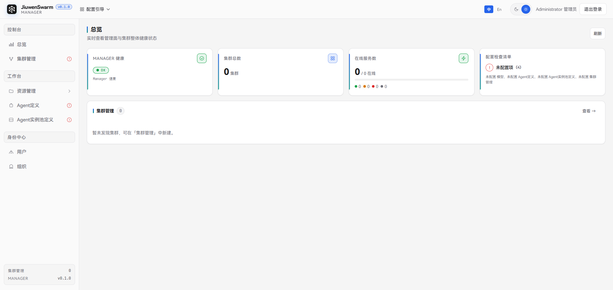

### 配置引导

点击左上角的「配置引导」，可以查看新手开局的必做操作。

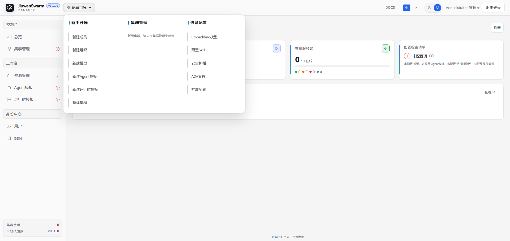

也可以将鼠标悬停在总览页「配置检查清单」的未配置项提醒上，查看缺失的必配项。

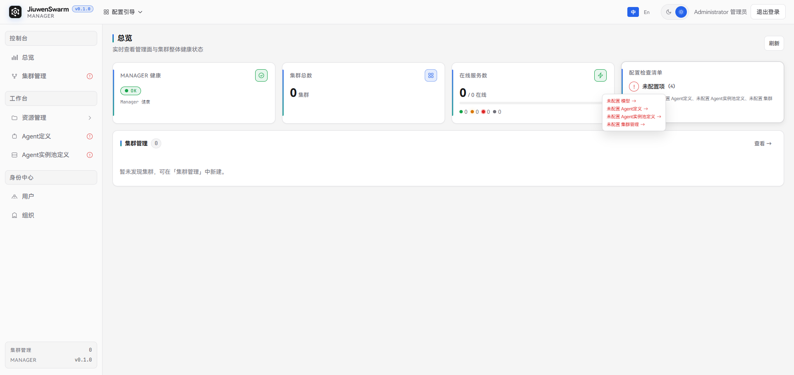

### 新建成员

新建普通用户账号，用于登录用户面，打通对话流程。

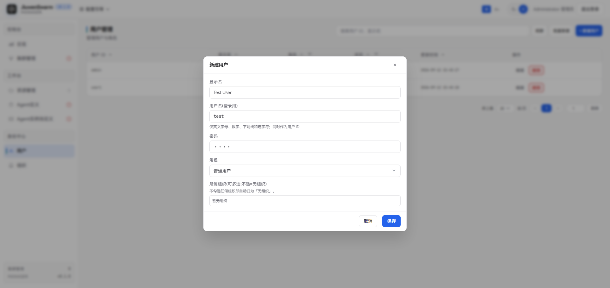

### 新建组织

新建组织，用于配置集群准入组织。

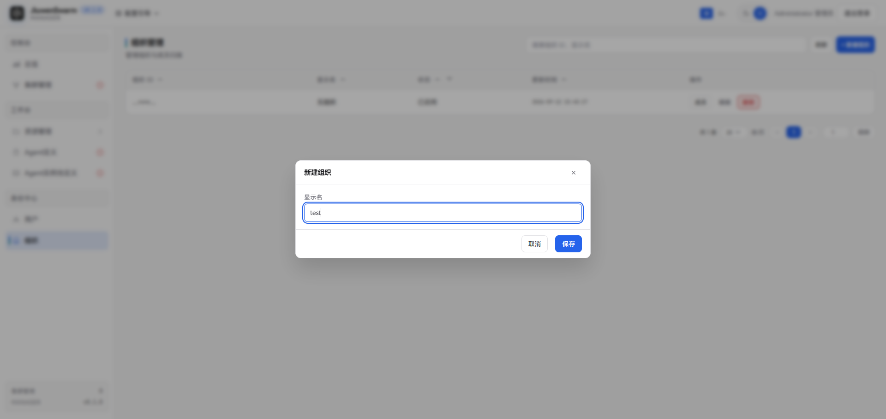

将前面新建的成员绑定到该组织。

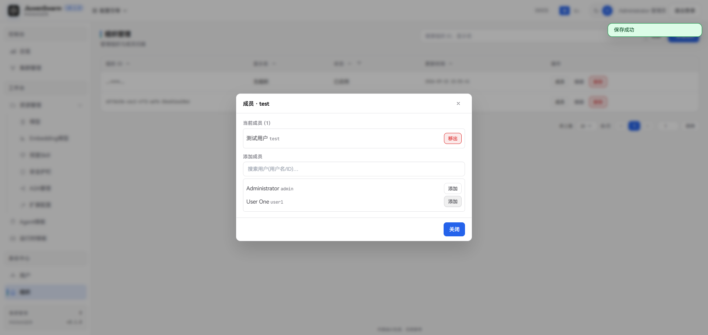

### 新建模型

新建模型。模型是 Agent 的运行基础。

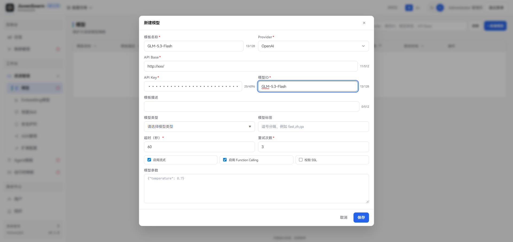

### 新建 Agent 定义

新建 Agent 定义，用于配置用户可对话的 Agent。

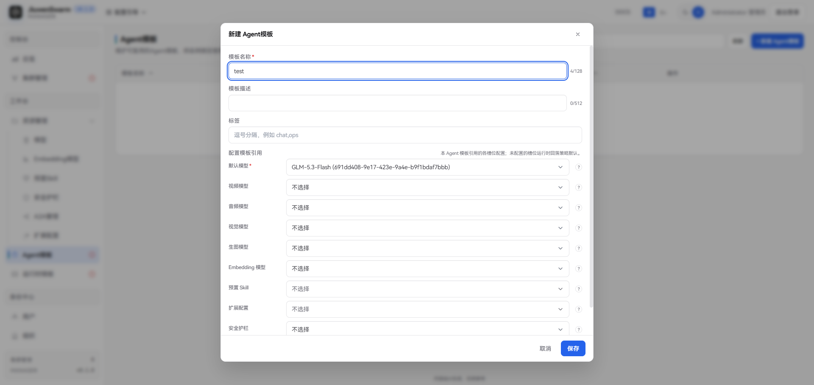

### 新建 Agent 实例池定义

新建 Agent 实例池定义，用于为组织或用户分配可用的容器资源池。可以直接导入版本部署工具中提供的 agentserver.json 文件。

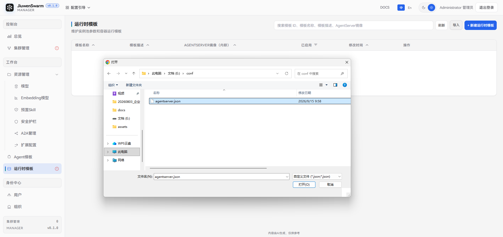

### 新建集群

新建集群，绑定前面已部署好的运行面服务，包括 Gateway、Runtime 等服务。

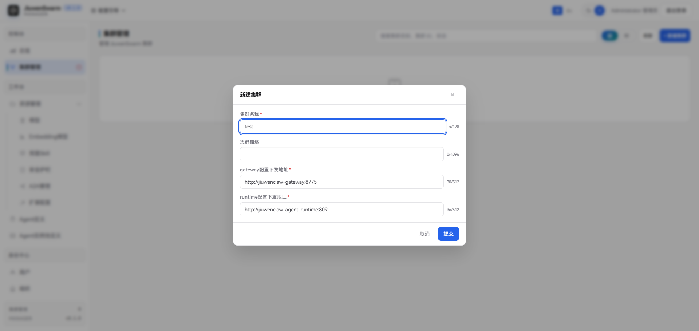

### 集群准入

配置集群准入。支持准入组织和准入用户两种方式，本文以准入组织为例，选择前面新建的组织。

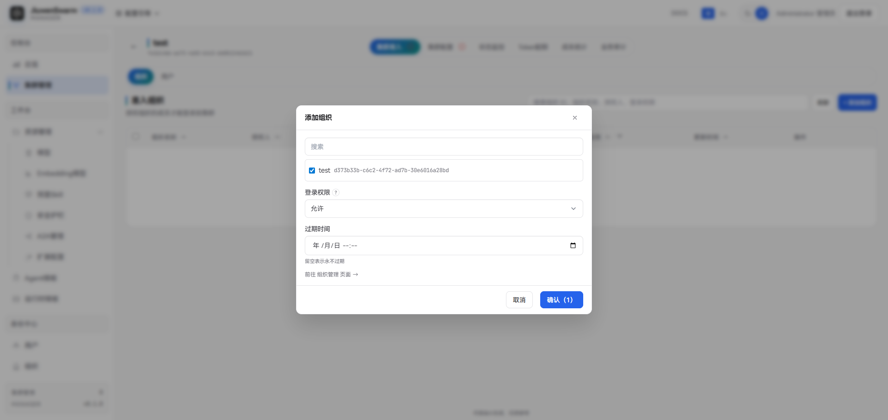

### 集群配置

配置集群上可用的 Agent 及其授权范围。授权范围支持全员可用、特定组织可用或特定用户可用，本文以授权给组织为例。

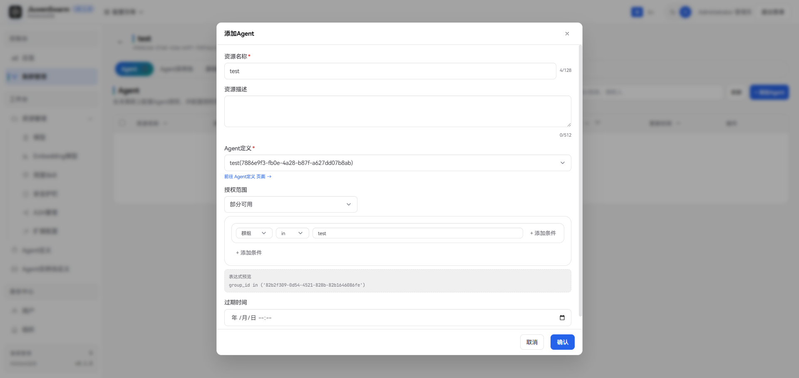

配置集群上可用的 Agent 实例池及其授权范围。授权范围支持全员可用、特定组织可用、特定用户可用或特定 Agent 可用，本文以授权给组织为例。

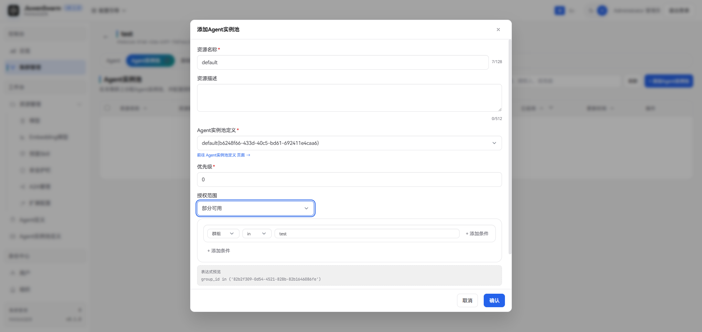

## 成员对话

### 登录用户面并对话

使用前面新建的成员账号，登录用户面。


在对话框中输入问题，即可完成对话。

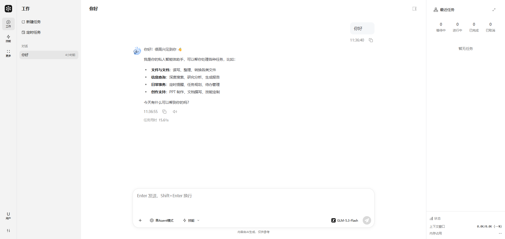
