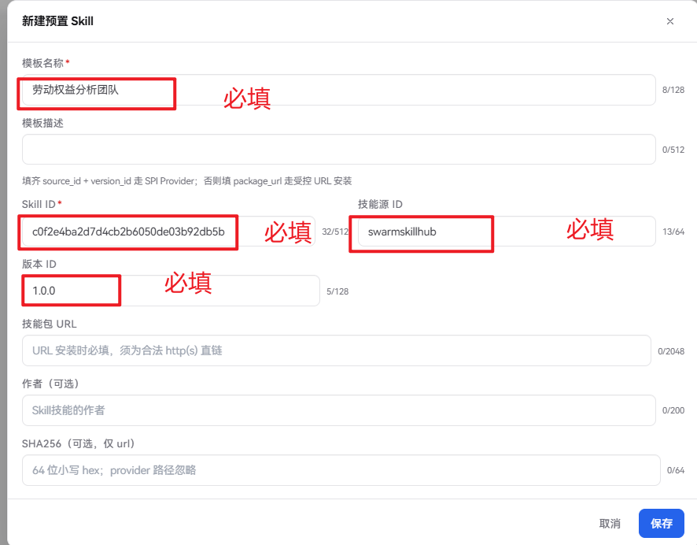
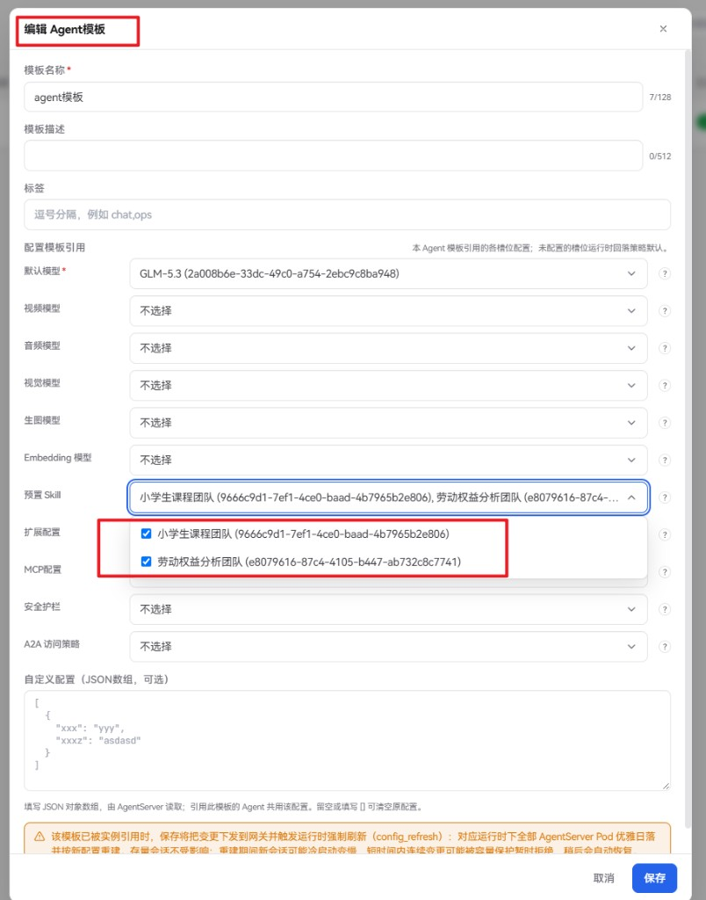
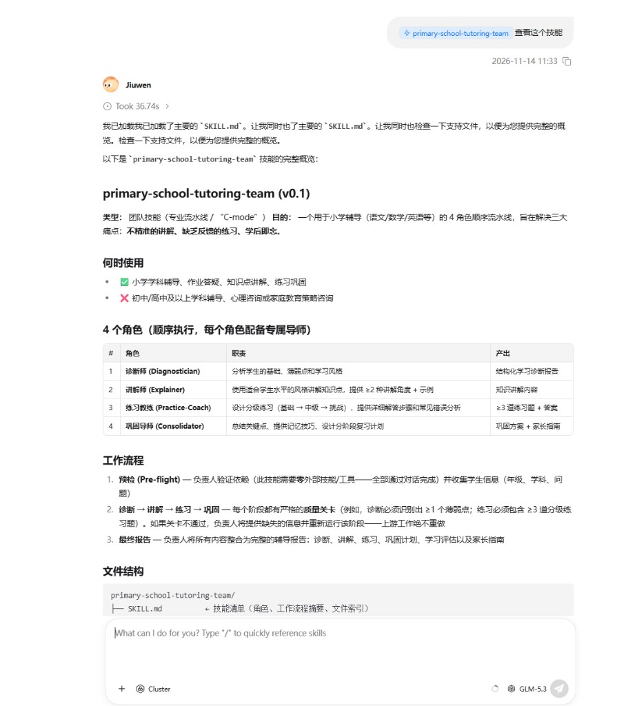

# 预置Skill

## 功能说明

**预置 Skill** 就是管理员统一维护、再通过 Agent 模板下发给用户的标准技能包。

### 和别的技能有什么不同

- **预置 Skill**：管理员下发，用户只能启停，不能编辑/卸载/发布
- **内置技能**：产品自带，用户可从技能广场安装
- **用户自装**：用户自己装，可自由管理

### 生效条件

只建预置模板不够，必须同时满足：

1. 创建并启用预置 Skill
2. 在 Agent 模板里引用它
3. 把该 Agent 模板配到集群并授权

安装来源为 **SPI** 或 **URL** 二选一，具体字段见下方「新建预置 Skill」。

## 管理面配置

### 新建预置 Skill

进入「工作台 → Agent资源 → 预置Skill」，点击「新建预置 Skill」，填写以下信息后点击 **保存**。保存后模板默认启用。

| 字段 | 说明 |
| ---- | ---- |
| **模板名称** | 必填，管理面展示用名称，最多 128 个字符 |
| **模板描述** | 可选，说明用途，最多 512 个字符 |
| **Skill ID** | 必填；SPI 须与技能源侧一致；URL 方式可自定义（如 `search/weather`） |
| **技能源 ID + 版本 ID** | 二者同时填写时走 **SPI** 安装（如 `swarmskillhub` + `1.0.0`） |
| **技能包 URL** | 未走 SPI 时必填，须为可直接下载 ZIP 的 `http(s)` 直链；生产建议 `https` |
| **作者** | 可选，会随模板下发并写入安装账本 |
| **SHA256** | 可选，仅 URL 安装时用于完整性校验（64 位小写十六进制）；SPI 路径忽略 |

安装来源二选一：填齐技能源 ID 与版本 ID 走 SPI；否则必须提供合法的技能包 URL。

#### 按 SPI 创建

适用于已接入技能源（如内置 `swarmskillhub`）的场景。填写技能源 ID、Skill ID、版本 ID，不填技能包 URL。

| 字段 | 示例值 |
| ---- | ---- |
| **模板名称** | 劳动者权益分析团队 |
| **Skill ID** | `c0f2e4ba2d7d4cb2b6050de03b92db5b` |
| **技能源 ID** | `swarmskillhub` |
| **版本 ID** | `1.0.0` |

#### 按 URL 创建

适用于直接提供技能包直链的场景。Skill ID 可自定义；建议填写 SHA256。

| 字段 | 示例值 |
| ---- | ---- |
| **模板名称** | 小学生课程团队 |
| **Skill ID** | `primary-school-tutoring-team` |
| **技能包 URL** | `https://artifacts.example.com/skills/primary-school-tutoring-team-1.0.0.zip` |
| **SHA256** | `136619520bc56bb502701b932a1faa5d022e85bb840f90c1fdedce4d627f333b`（可选） |

技能包 URL 须为打开即下载 ZIP 的直链（不是网页预览页），例如对象存储或 CDN 下载地址。下载主机须在 AgentServer 白名单内，否则运行面拒绝拉取。

### 维护预置 Skill

- **编辑**：可修改名称、描述、Skill ID、安装来源等；已被引用时，保存后会推送到相关网关。
- **禁用**：列表开关切换。禁用后不再出现在 Agent 模板可选列表；若仍被引用，下次用户侧同步会从工作区移除对应预置技能，操作前请确认影响面。
- **删除**：仍被 Agent 模板引用时无法删除，需先解除引用。
- **被引用**：列表显示引用该模板的 Agent 模板数量，可跳转查看。

### 绑定

预置 Skill 需绑定到 **Agent 模板**，再将该模板配置到集群并授权，才会下发到用户工作区。

1. **绑定**：进入「工作台 → Agent模板」，新建或编辑目标模板，在「配置模板引用」的 **预置 Skill** 槽位中勾选一个或多个已启用的模板并保存。若暂无选项，可通过引导链接跳转到预置 Skill 页先创建。详见[Agent模板](../Agent模板.md)。
2. **配到集群并授权**：将该 Agent 模板配置到集群，并授权给目标组织或用户。具体操作参考[快速上手](../../../快速开始/快速上手.md)中的「配置集群配置」章节。

## 用户面使用

用户登录用户面、进入已授权的 Agent 后：

1. 打开左侧 **技能** → **我的技能**，在 **预置** 分组中查看下发的技能。
2. 按需 **启用 / 禁用**；禁用后对话中不再主动使用该技能。界面不提供编辑、卸载、发布。

3. 在对话中用自然语言提出需求，Agent 会按已启用技能自动选用。

## 注意事项

- 优先使用可信的 SPI 技能源或内网受控 URL；URL 安装建议填写 SHA256。
- **域名白名单**：URL 方式下，技能包下载域名须加入 AgentServer 下载白名单，否则安装失败；SPI 方式由技能源的下载策略控制，须在技能源侧配置允许的主机。配置细节见[预置Skill设计](../../../开发文档/设计文档/预置Skill设计.md)；对接第三方技能源见[企业自建skillhub接入](../../../开发者指南/接口文档/企业自建skillhub接入.md)。
- SPI 的 Skill ID、源 ID、版本 ID 须与技能源侧一致；URL 方式下 Skill ID 可自定义。
- 修改已挂到集群的 Agent 模板或其引用的预置 Skill，会触发配置刷新，建议在业务低峰期操作。
