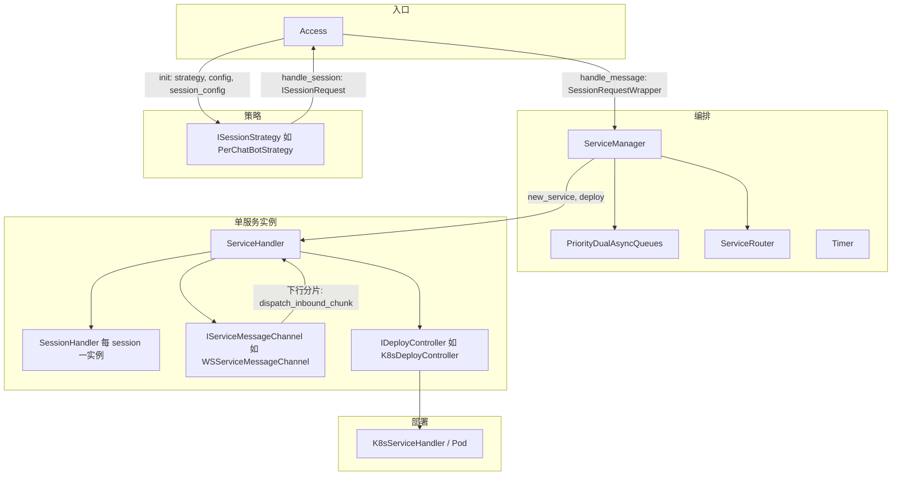
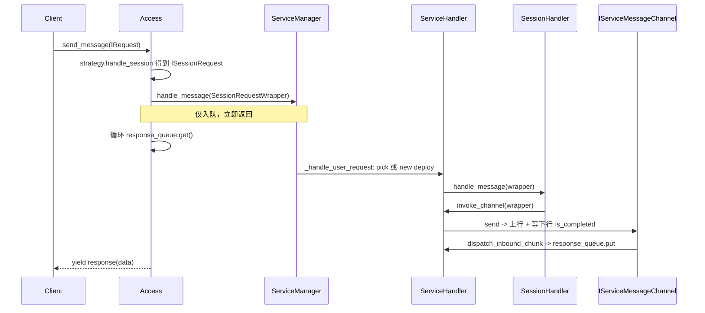

# Session 包软件设计说明

本文档描述 `openjiuwen_runtime.management.session` 的**整体架构、模块职责、输入输出与端到端业务流程**，便于实现扩展与排障。

---

## 1. 定位与目标

Session 包在「入口请求 → 多实例、多 Session、可伸缩的后端工作负载（如 K8s Pod）」之间，提供一层**编排**能力：

- **双队列**调度：用户业务请求与系统内部事件分队列，**系统侧优先**。
- **单服务实例 = 一个部署单元 + 一条下行通道**（典型为 WebSocket 多路复用 `request_id`）。
- **两级并发控制**：**服务级**（实例内总并行度）+ **Session 内**（同一会话内并行度），二者独立、通过信号量 `acquire` 排队配合。
- **Session 亲和**：同一 `session_id` 路由到同一 `service_id`，在 TTL 内可滑动续期；可选策略（如 `chat_id` + `bot_id` 生成稳定 session 键）。
- **弹性伸缩**：`min_idle` 预热、`max_services` 上限、空闲 `service_ttl` 后缩容；部署抽象（K8s / Docker / 无部署调试用 `NoOp`）。

---

## 2. 整体架构

**层次关系**：

| 层 | 职责 |
|----|------|
| **Access** | 将 `IRequest` 经策略变成 `ISessionRequest`，封 `SessionRequestWrapper`，**只负责入队**与**消费** `response_queue` 的异步迭代。 |
| **ServiceManager** | 双队列、路由、多实例池（`in_use` / `idle`）、bootstrap `min_idle`、autoscale、session TTL 与 service idle 回收。 |
| **ServiceHandler** | 单实例：服务级信号量、SessionRouter（子 SessionHandler）、`deploy` / `delete`、经 `invoke_channel` 调通道 `send`。 |
| **SessionHandler** | 同 `session_id` 的会话内信号量、调用父级 `invoke_channel`。 |
| **IServiceMessageChannel** | 上行业务、下行多路分片、完成时 `on_request_complete` 归还服务级并发。 |
| **IDeployController** | 创建/删除后端资源，返回 `PodDeployInfo` 等，供通道 `on_pod_ready` 建链。 |

---

## 3. 核心类型与「接口 I/O」

### 3.1 请求与包装

| 类型 | 说明 | 主要输入 / 输出 |
|------|------|-----------------|
| `IRequest` | 业务入口行协议（`request_id` / `chat_id` / `bot_id` / `user_id` / `session_id`）。 | 入：由调用方提供实现；`Access` 在缺省 `request_id` 时包一层 `_AutoIdRequest` 并写回 `wire_dict`（若存在）。 |
| `ISessionRequest` | 策略产出的**会话化**请求，含 `session_id`、`session_concurrency`、`session_ttl`、`raw`（原 `IRequest`）。 | 出：`ISessionStrategy.handle_session(IRequest) -> ISessionRequest`。实现：`SessionRequest`。 |
| `SessionRequestWrapper` | 一次用户调用对应一个 wrapper：`session_request` + `response_queue` + `cancel` Future。 | 入：Access 创建；`ServiceManager` 入队；通道下行 `put` 到 `response_queue`；`Access` 以 `is_completed` 判终态。 |

### 3.2 控制面接口（摘录）

| 接口 | 方法 | 含义 |
|------|------|------|
| `IAccess` | `init(...)` / `send_message(IRequest) -> AsyncIterator` | 初始化并 `start` 服务管理；流式产出来自下游的解析后结果。 |
| `IServiceManager` | `init` / `start` / `stop` / `handle_message` / `enqueue_system` | 对 wrapper 入用户队列；系统事件入系统队列。 |
| `IServiceHandler` | `handle_message` / `deploy` / `delete` / `remove_session` / 并发与 session 只读属性 | 单实例生命周期与消息处理。 |
| `IServiceMessageChannel` | `send(service_id, wrapper, *, response_parser, on_request_complete)` | **上行**一帧 + **下行**在独立接收循环中 `dispatch` + 完成时 `await on_request_complete(rid)`。 |
| `IResponseParser` | `request_id` / `is_completed` / `response` 作用于 `dict` 分片 | 多路流式与终态判断。 |
| `IDeployController` | `deploy() -> info` / `delete()` / `resource_id` | 与具体运行时解耦。 |

**回调约定**：`on_request_complete(Optional[str])` 为可 `await` 的异步回调，**必须**在单条用户请求在通道侧视为结束后调用，以释放 `ServiceHandler` 的服务级信号量。

### 3.3 数据模型 `models.py`

- **`AccessConfig`**：双队列大小、`image`、`target_port`、`invoke_path`、`ws_use_tls`、**服务池** `min_idle_services` / `max_services`、`service_concurrency`、**实例空闲回收** `service_ttl`、`message_timeout`、`autoscale_interval` 等。
- **`SessionConfig`**：单策略生效的 `concurrency`（同 session 内最大并行中请求数）、`ttl`（秒；0 表示不启用 session TTL 计时器）。

### 3.4 内部事件 `internal_events.py`

- `ServiceReclaimEvent(service_id: str)`：经 `Timer` 与 `service_idle_ttl` 触发，**系统队列**优先消费，执行缩容 `delete`。

### 3.5 错误码 `exception.py`

- 与 `ServiceManager._fail` 配合，向 `response_queue` 写入 `error_code` + `message` + `completed`；常见 `100001`（资源满）、`100002`（路由/处理异常）。

---

## 4. 模块与文件功能一览

| 文件 | 功能 |
|------|------|
| `access.py` | `Access`：策略生成 `ISessionRequest`、自动补 `request_id`（多路复用必须）、`handle_message` 入队、从 `response_queue` 流式 `yield`；`init` 时拉 `ServiceManager.start()`。 |
| `service_manager.py` | 双队列消费循环、用户消息独立 task 路由、`_pick_or_create` 亲和/选实例/新 deploy、`_bootstrap_min_idle`、autoscale、session 与 service 空闲计时器、`_fail` 写错误。 |
| `service_handler.py` | `ServiceHandler`：`deploy`→`on_pod_ready`、`invoke_channel`→`channel.send`、`dispatch_inbound_chunk` 按 `request_id` 写回、`delete` 先关通道再删资源。 |
| `session_handler.py` | `SessionHandler`：会话内 `BoundedSemaphore` + `invoke_channel`。 |
| `dual_queue.py` | 系统优先的 `get()`：先 `drain` 系统队列，再与阻塞用户队列用 `asyncio.wait(FIRST_COMPLETED)`。 |
| `router.py` | `ServiceRouter`：`session_id -> service_id`；`SessionRouter`：`request_id -> session_id`（在 ServiceHandler 上用于下行匹配）。 |
| `ws_client_channel.py` | `WSServiceMessageChannel`：`serialize_request_payload` / `wire_dict` 上行业务、`_ensure_connected`、`on_pod_ready` 中预建链、`send` 内等待 `is_completed` 与 `cancel`、`close`。 |
| `k8s_service_handler.py` | `K8sServiceHandler` 创建/等待 Pod Ready、`K8sDeployController` 适配 `IDeployController`、`PodDeployInfo`。 |
| `docker_service_handler.py` | Docker 侧部署信息与实现（如存在）。 |
| `runtime.py` | `IDeployController` 协议、`NoOpDeployController` 不调真实部署。 |
| `strategies/_base.py` + `per_chat_bot.py` | `BaseSessionStrategy`：`PerChatBotStrategy` 以 `f"{chat_id}::{bot_id}"` 为 session 键。 |
| `session_request.py` | `SessionRequest` 实现 `ISessionRequest`。 |
| `timer.py` | 抽象 `ITimer` 的调度实现，供 `ServiceManager` arm session/service 空闲计时。 |
| `interfaces.py` | 上表各类 Protocol/ABC/别名如 `OnRequestCompleteCallback`、`IServiceMessageChannel`。 |
| `__init__.py` | 对外的公开导出。 |

---

## 5. 全链路业务流程

### 5.1 启动（含预热）

1. 构造 `ServiceManager`（注入 `IServiceInstanceFactory`、`PriorityDualAsyncQueues`、`Timer` 等）。
2. `Access.init` → `ServiceManager.init(response_parser)` → `ServiceManager.start()`。
3. `start()` 内部：
   - 启动 `_message_loop`（从双队列取项）、`_autoscale_loop`；
   - `await _bootstrap_min_idle()`：在 `lock` 内循环 `min_idle` 与 `max_services`，对每个缺口调用 `_new_deployed()`。
4. `_new_deployed()`：`factory.new_service(response_parser)` 得到 `ServiceHandler`，`await h.deploy()`（K8s 等创建 Pod/容器并 **等 Ready**；`WSS` 在 `on_pod_ready` 里**预建 WebSocket**），成功后放入 `idle` 池。

### 5.2 单次用户请求

**要点**：

- **入队与消费解耦**：`handle_message` 是异步队列写入；真正路由在 `_message_loop` 起的独立 task 中执行，避免单条长请求阻塞下一条入队（多 session 可并行进入不同实例）。
- **亲和路由**（`_pick_or_create`）：
  1. 若 `ServiceRouter` 已有 `session_id -> service_id` 且实例仍在池 → 复用，必要时从 `idle` 提升到 `in_use`。
  2. 否则在 `in_use` / `idle` 中找 `available_concurrency >= 1` 的实例。
  3. 否则若未达 `max_services`，`await _new_deployed()` 再 `in_use`。
  4. 达上限仍无位 → `_fail(100001)`。

### 5.3 服务级与 Session 级并发

- **服务级**：`ServiceHandler` 的 `asyncio.BoundedSemaphore(total_concurrency)`，在 `invoke_channel` 开头 `acquire`，在 `on_request_complete` 中 `release`（无论成功失败通常都会走到回调）。
- **Session 级**：`SessionHandler` 的 `BoundedSemaphore(max_parallel)`，由 `SessionConfig`→策略→`ISessionRequest.session_concurrency` 提供上限。

**单条请求 = 1 点服务级并发**（`_NEED = 1` 在 `ServiceManager` 中隐式使用）。

### 5.4 Session TTL 与实例空闲

- 若 `session_ttl > 0`：成功处理完一条用户请求后 `Timer` 对 `sess:{session_id}` arm；到期 `remove_session` 并清 `ServiceRouter` 映射，若无其它 session 且实例在 `in_use` 则可能回落 `idle` 并 arm `svc:{service_id}` 的 `service_idle_ttl`。
- `service_idle_ttl` 到期 → `ServiceReclaimEvent` 入**系统**队列，确认无活跃 session / inflight 后 `h.delete()`（先关 WSS 再删 Pod 等）。

### 5.5 部署与 WSS 建链

- `ServiceHandler.deploy()`：`pod_info = await deploy_controller.deploy()`，若非空且通道有 `on_pod_ready`，`await on_pod_ready(service_id, pod_info)`。
- `WSServiceMessageChannel`：用 `PodDeployInfo.pod_ip`（或 Docker 的 `host`）与**部署声明的 `port`** 拼 `ws://`/`wss://` URL，在 `on_pod_ready` 内 `await _ensure_connected()` 完成与业务进程握手（避免「K8s Ready 但首包发不出去」的纯懒连问题）。
- **上行体**：`serialize_request_payload` 对 `IRequest`/`wire_dict` 序列化；`request_id` 非空是 **WSS 多路复用硬条件**；`Access` 在缺失时可自动生成 UUID 并补 `wire_dict`。

### 5.6 缩容与停止

- 空闲回收见上；`ServiceManager.stop()` 标记队列关闭、取消 `_message_loop` / `_autoscale_loop` 与用户路由子 task 等。

---

## 6. 设计取舍与扩展点

| 点 | 说明 |
|----|------|
| **策略** | 新增 `ISessionStrategy` 可换「按 user 维 session」「仅 request_id 维」等。 |
| **通道** | 实现 `IServiceMessageChannel`：除 `send` 外可实现 `bind_handler` / `on_pod_ready` / `close` 以配合 `ServiceHandler`。 |
| **部署** | 实现 `IDeployController` 即可接 VM、Nomad 等。 |
| **存储** | `AccessConfig.db_handler` 预留，当前核心路径可不落库。 |

---

## 7. 与测试 / 可执行样例的对应关系

- 系统级 Mock：`tests/system_tests/management_session/test_session_sdk.py`（`NoOpDeploy` + 假通道）。
- 真 K8s + WSS：`tests/system_tests/management_session/main_k8s_access.py`，用 `K8sServiceHandler` + `WSServiceMessageChannel` 跑通全链路；业务 JSON 可经由 `WireIRequest` 等 `IRequest` 实现上送。

---

*文档版本与代码包同步于 `openjiuwen_runtime/management/session/`；若行为与实现不一致，以源码为准。*
