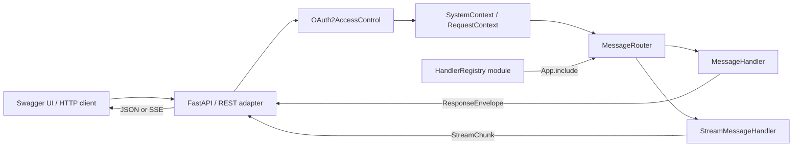
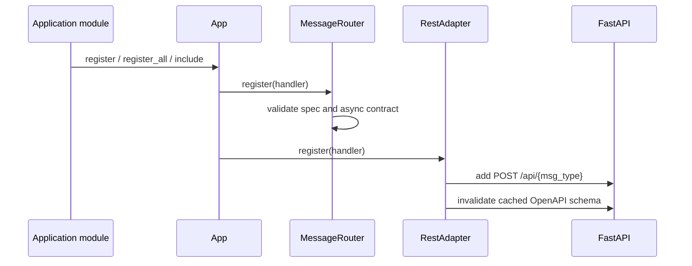
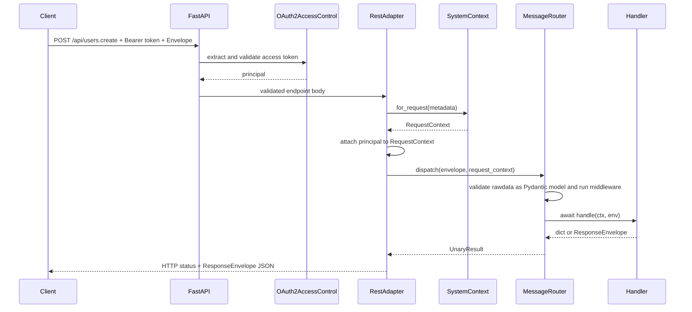

# Service Framework examples

本目录提供一个可以直接运行、调试和扩展的 `openjiuwen_runtime.service`
示例。它的目标不是展示某个特定业务，而是回答开发者在使用 Service
Framework 时最常见的几个问题：

- 如何定义普通 Handler 和流式 Handler；
- 如何为 Handler 声明输入、输出和 OpenAPI 元数据；
- 如何通过装饰器、对象注册、批量注册和模块组合组织不同规模的服务；
- HTTP 请求如何经过 FastAPI、OAuth2、统一 Envelope、消息路由和 Handler；
- 流式 Handler 如何通过 HTTP Server-Sent Events（SSE）返回数据；
- 如何在不修改框架代码的情况下增加自定义 Handler 模块；
- 如何把本地登录和企业联合登录接入同一个 OAuth2 Authorization Code 流程。

> 本目录是开发者示例，不是可直接部署到生产环境的认证中心或用户服务。
> 文档中会明确标注演示实现及其生产替换点。

## 1. 目录结构

```text
examples/
├── README.md
├── multi_handler_app.py
├── custom_handlers.py
└── federated_auth/
    ├── README.md
    ├── __init__.py
    ├── domain.py
    ├── identity_store.py
    ├── database_identity_store.py
    ├── provider.py
    ├── module.py
    ├── oauth2_server.py
    └── demo_idp.py
```

各文件职责如下：

| 文件 | 职责 |
| --- | --- |
| `multi_handler_app.py` | 组装 `App`、OAuth2、联合认证模块和全部示例 Handler，并提供可运行入口 |
| `custom_handlers.py` | 展示独立功能模块如何通过 `HandlerRegistry` 向宿主应用贡献 Handler |
| `federated_auth/` | 使用正式联合认证契约的 Demo Provider、SQLite Store 和示例 OAuth2 服务 |
| `federated_auth/README.md` | 联合认证模块的详细设计、通信时序、安全边界与扩展方法 |

## 2. 整体架构

示例刻意把“通用框架”“应用组装”和“可插拔业务模块”分开：



关键原则：

1. **Handler 与传输协议解耦。** Handler 只接收 `RequestContext` 和
   `Envelope`，不直接依赖 FastAPI 的 `Request`、HTTP 或 WebSocket。
2. **所有注册方式共享同一份契约。** 装饰器、对象和模块最终都会转换成
   `MessageHandler` 或 `StreamMessageHandler`，并进入同一个
   `MessageRouter`。
3. **异步是强约束。** 普通 Handler 必须是 `async def`；流式 Handler
   必须是异步生成器。同步实现会在注册阶段被拒绝，而不是等到请求期间阻塞事件循环。
4. **消息类型是唯一的路由键。** `Envelope.type` 同时决定 Handler 和默认
   REST 路径，一个应用中不允许重复注册同一个消息类型。

## 3. 环境准备与运行

### 3.1 前置条件

- Python `>= 3.11.4`
- `uv`

从仓库的 `service` 目录执行：

```bash
uv sync
uv run python examples/multi_handler_app.py
```

默认地址：

- OpenAPI/Swagger UI：<http://127.0.0.1:8090/docs>
- OpenAPI JSON：<http://127.0.0.1:8090/openapi.json>
- 健康检查：<http://127.0.0.1:8090/health>

监听地址和端口由 Service Framework 的通用配置控制：

| 环境变量 | 默认值 | 说明 |
| --- | --- | --- |
| `OPENJIUWEN_SERVICE_HOST` | `0.0.0.0` | 服务监听地址 |
| `OPENJIUWEN_SERVICE_PORT` | `8090` | 服务监听端口 |
| `FEDERATED_AUTH_DATABASE_PATH` | `examples/federated_auth/.data/federated_auth.db` | 示例联合身份 SQLite 文件路径 |

例如：

```bash
OPENJIUWEN_SERVICE_PORT=18090 \
FEDERATED_AUTH_DATABASE_PATH=/tmp/openjiuwen-federated-auth.db \
uv run python examples/multi_handler_app.py
```

`.data/` 是本地运行数据目录，已经被忽略，不应提交数据库文件。

### 3.2 在 Swagger UI 中完成认证

1. 打开 `/docs`；
2. 点击右上角 **Authorize**；
3. 保持 `client_id` 为 `swagger-docs`，无需填写 `client_secret`；
4. 再次点击 **Authorize**，浏览器会打开统一登录页；
5. 选择本地登录或 Enterprise Demo SSO；
6. 登录完成后，Swagger 使用 Authorization Code 和 PKCE 换取 Bearer Token；
7. Swagger 随后会自动为受保护的 `/api/*` 请求增加
   `Authorization: Bearer <token>`。

本地演示账号：

```text
username: demo
password: demo
```

Enterprise Demo SSO 页面预置的演示身份：

```text
employee ID: employee-10086
display name: Enterprise Alice
email: alice@enterprise.example
```

Enterprise Demo SSO 只是本地交互模拟器，不解析或验证 SAML XML。完整边界见
[`federated_auth/README.md`](federated_auth/README.md)。

联合认证的正式领域对象、异步 Provider/Store 契约和传输无关编排位于
`openjiuwen_runtime.service.auth.federation`。本目录中的 Demo IdP、OAuth2 Server 和
SQLite Store 只用于演示，不会随正式认证能力被误认为生产实现。

## 4. 请求和响应协议

### 4.1 统一请求 Envelope

所有通过 Service Framework 注册的 REST Handler 都使用完整的 v1
`Envelope`：

```json
{
  "type": "users.create",
  "metadata": {
    "request_id": "request-1",
    "user_id": "optional-user-id",
    "chat_id": null,
    "session_id": null,
    "bot_id": null,
    "channel": "web",
    "timestamp": null,
    "trace_id": "optional-trace-id",
    "extra": {}
  },
  "rawdata": {
    "name": "alice"
  },
  "version": "1"
}
```

字段说明：

| 字段 | 是否必填 | 说明 |
| --- | --- | --- |
| `type` | 是 | 消息路由键；默认 REST 路径为 `/api/{type}` |
| `metadata.request_id` | 是 | 请求标识，也是后续幂等与链路追踪能力的基础 |
| `metadata.*` | 否 | 用户、会话、Bot、渠道及追踪上下文；未知顶层 metadata 字段会被忽略，扩展字段应放入 `extra` |
| `rawdata` | 是 | Handler 的业务输入；若声明了 `request_model`，进入 Handler 前会转换为对应的 Pydantic 对象 |
| `version` | 否 | 协议版本，默认 `1` |

路径和 `type` 必须一致。例如 `/api/users.create` 的请求体中 `type` 必须是
`users.create`。REST adapter 为每个 Handler 生成独立的 Envelope OpenAPI
模型，因此路径与 `type` 不一致时，FastAPI 会在进入框架路由前返回 `422`。
`rawdata` 的业务模型校验则统一在 Router 内执行，使 REST、WebSocket 和直接
`app.dispatch()` 具有一致的 `validation` 错误信封。

### 4.2 普通响应

普通 Handler 返回 `dict` 或 `ResponseEnvelope`。返回 `dict` 时，框架会包装为：

```json
{
  "type": "users.create",
  "metadata": {
    "request_id": "request-1"
  },
  "rawdata": {
    "id": 1,
    "name": "alice",
    "created_by": "demo"
  },
  "ok": true,
  "error_code": null,
  "error_message": null,
  "version": "1"
}
```

若 Handler 声明了 `response_model`，框架会在返回客户端前校验
`rawdata`。响应不满足模型属于服务端实现错误，会被归一化为 `internal` 错误响应。

### 4.3 SSE 流式响应

`StreamMessageHandler` 产生的每个 `dict` 或 `StreamChunk` 都会被框架包装为
SSE 事件：

```text
data: {"sequence":1,"is_final":false,"metadata":{"request_id":"request-1"},"rawdata":{"chunk":"h"},"error_code":null,"error_message":null}

data: {"sequence":2,"is_final":true,"metadata":{"request_id":"request-1"},"rawdata":{"chunk":"i"},"error_code":null,"error_message":null}

```

- `sequence` 从 `1` 递增；
- 正常情况下最后一个分片的 `is_final` 为 `true`；
- 流处理中发生框架异常时，会发送一个带 `error_code`、`error_message` 且
  `is_final=true` 的终止分片；
- 空的异步生成器当前不会额外产生终止分片。

## 5. Handler 开发方式

### 5.1 装饰器：适合宿主应用内的小型 Handler

```python
from openjiuwen_runtime.service import Envelope


@app.handle(
    "ping",
    summary="Ping",
    tags=["system"],
)
async def ping(ctx, env: Envelope):
    return {
        "pong": True,
        "request_id": ctx.request_id,
        "authenticated_user": ctx.principal["username"],
    }
```

这种方式代码最短，适合逻辑简单、不会跨应用复用的 Handler。

### 5.2 对象式普通 Handler：适合依赖注入和复用

```python
from pydantic import BaseModel, Field

from openjiuwen_runtime.service import (
    Envelope,
    HandlerSpec,
    MessageHandler,
)


class CreateUserInput(BaseModel):
    name: str = Field(min_length=1)


class CreatedUserOutput(BaseModel):
    id: int
    name: str
    created_by: str


class CreateUserHandler(MessageHandler):
    spec = HandlerSpec(
        msg_type="users.create",
        request_model=CreateUserInput,
        response_model=CreatedUserOutput,
        summary="Create user",
        tags=("users",),
    )

    def __init__(self, store):
        self._store = store

    async def handle(self, ctx, env: Envelope):
        user = await self._store.create(ctx.request.name)
        return {
            **user,
            "created_by": ctx.principal["username"],
        }


app.register(CreateUserHandler(store))
```

`HandlerSpec` 是传输无关的 Handler 描述：

| 属性 | 作用 |
| --- | --- |
| `msg_type` | 唯一消息类型及默认 REST 路径后缀 |
| `request_model` | `rawdata` 的 Pydantic 输入模型 |
| `response_model` | 普通响应 `rawdata` 的 Pydantic 输出模型 |
| `summary` | OpenAPI 操作摘要 |
| `description` | OpenAPI 操作说明 |
| `tags` | OpenAPI 分组标签 |

构造函数可接收 Repository、客户端、配置或领域服务。不要依赖模块级可变状态来保存
需要跨副本共享的数据；生产服务应使用 `SystemContext` 中的数据库、Redis 或明确注入的
持久化组件。

### 5.3 对象式流式 Handler

```python
from openjiuwen_runtime.service import (
    HandlerSpec,
    StreamMessageHandler,
)


class ChatHandler(StreamMessageHandler):
    spec = HandlerSpec(
        msg_type="chat",
        request_model=ChatInput,
        summary="Stream chat characters",
        tags=("chat",),
    )

    async def handle_stream(self, ctx, env):
        for character in ctx.request.text:
            yield {
                "chunk": character,
                "user": ctx.principal["username"],
            }


app.register(ChatHandler())
```

`handle_stream()` 必须是包含 `yield` 的异步生成器函数。仅仅写成返回列表的
`async def` 不满足流式契约，并会在注册时抛出 `TypeError`。

### 5.4 批量注册

同一功能域存在多个对象式 Handler 时，可以按顺序注册：

```python
app.register_all(
    [
        ListUsersHandler(store),
        GetUserHandler(store),
        RemoveUserHandler(store),
        ChatHandler(),
    ]
)
```

如果批次中出现重复的 `msg_type`，注册会立即失败。

### 5.5 独立 Handler 模块

当一个功能由其他开发者或独立目录维护时，使用 `HandlerRegistry`：

```python
# feature_handlers.py
from openjiuwen_runtime.service import HandlerRegistry

feature_handlers = HandlerRegistry()


@feature_handlers.handle(
    "feature.execute",
    request_model=FeatureInput,
    response_model=FeatureOutput,
    tags=["feature"],
)
async def execute(ctx, env):
    return {"result": ctx.request.value}
```

宿主应用只负责组合：

```python
from feature_handlers import feature_handlers

app.include(feature_handlers)
```

`App.include()` 接收任何实现 `handlers()` 方法的模块，不要求模块继承某个具体基类。
这使功能模块能够独立开发和测试，同时保持 Handler 契约一致。

### 5.6 传输无关中间件

需要为多个 Handler 统一增加日志、计时、审计或策略检查时，可以使用
`app.use()` 注册异步中间件：

```python
import time


async def timing_middleware(ctx, env, nxt):
    started_at = time.monotonic()
    try:
        return await nxt(ctx, env)
    finally:
        ctx.logger.info(
            "handler completed: type=%s elapsed_ms=%.2f",
            env.type,
            (time.monotonic() - started_at) * 1000,
        )


app.use(timing_middleware)
```

中间件采用洋葱模型：先注册的中间件位于外层，`await nxt(ctx, env)` 调用下一个
中间件或最终 Handler。中间件位于 Router 层，因此直接 `app.dispatch()` 和所有传输
adapter 共用同一条链路。中间件本身也必须异步，且不要执行阻塞 I/O。

## 6. 注册、启动和请求通信链路

### 6.1 应用启动



注册时会完成以下校验：

- `handler.spec` 必须是 `HandlerSpec`；
- `msg_type` 必须是非空字符串且不能重复；
- `request_model`、`response_model` 必须是 Pydantic 模型；
- 普通 Handler 必须实现异步 `handle()`；
- 流式 Handler 必须实现异步生成器 `handle_stream()`。

### 6.2 普通 HTTP 请求



认证只发生在 REST adapter 的边界；业务 Handler 从 `ctx.principal` 使用已经验证的
本地身份，不解析 Authorization Header，也不自行验证 Token。

### 6.3 流式 HTTP/SSE 请求

流式请求的前半段与普通请求相同。Router 返回 `StreamResult` 后，REST adapter
创建 `StreamingResponse(media_type="text/event-stream")`，异步读取 Handler
分片并按 SSE `data:` 帧发送给客户端。整个过程不会把完整结果缓存在内存后再响应。

## 7. RequestContext 和依赖边界

`SystemContext` 是进程级能力容器，在 FastAPI lifespan 中启动和停止。每次请求根据
`Envelope.metadata` 派生一个 `RequestContext`。Handler 常用字段包括：

- `ctx.request_id`
- `ctx.request`（声明 `request_model` 后的 Pydantic 请求对象）
- `ctx.user_id`
- `ctx.chat_id`
- `ctx.session_id`
- `ctx.bot_id`
- `ctx.trace_id`
- `ctx.principal`
- `ctx.db`
- `ctx.redis`
- `ctx.settings`
- `ctx.logger`

`ctx.redis` 返回 `SystemContext` 持有的共享异步 Redis 客户端，适合在框架现有
`kv`、`idempotency`、`queue`、`pubsub` 和 `lock` 原语无法覆盖业务需求时，直接使用
`redis.asyncio` 的完整命令集：

```python
async def update_score(ctx, env):
    await ctx.redis.hset(
        f"user:{ctx.user_id}",
        mapping={"score": ctx.request.score},
    )
    await ctx.redis.zadd("user:scores", {str(ctx.user_id): ctx.request.score})
    return {"updated": True}
```

该客户端由 `SystemContext` 创建并在应用停止时统一关闭；Handler 和请求清理逻辑只借用
它，不能调用 `close()` 或 `aclose()`。裸客户端不会自动添加服务、用户或 Bot
命名空间，业务代码必须自行设计不会冲突的 Key。Redis 命令是异步 I/O，调用时必须
使用 `await`；Pipeline 中的命令先同步入队，最终的 `execute()` 必须使用 `await`。

如果需要事务，应使用框架提供的请求上下文事务入口，而不是在 Handler 内创建无法统一
管理的连接。示例中的 `DemoUserStore` 为了便于运行，使用进程内字典和
`asyncio.Lock`；它的数据会在进程退出后丢失，也不会在多个服务副本之间共享。

## 8. OAuth2 和联合身份如何接入

`multi_handler_app.py` 创建一个 `ExampleOAuth2AuthorizationServer`，然后把它的异步
Token 校验函数交给框架的 `OAuth2AccessControl`：

```python
oauth2_server = ExampleOAuth2AuthorizationServer()

oauth2 = OAuth2AccessControl(
    token_url="/oauth/token",
    authorization_url="/oauth/authorize",
    token_validator=oauth2_server.validate_access_token,
    scheme_name="OAuth2AuthorizationCode",
)

app = App(
    lambda: SystemContext(),
    title="OpenJiuwen Multi Handler Example",
    enable_ws=False,
    oauth2=oauth2,
)

app.asgi.swagger_ui_init_oauth = {
    "clientId": oauth2_server.client_id,
    "usePkceWithAuthorizationCodeGrant": True,
}
```

框架只负责：

- 在 OpenAPI 中声明 OAuth2 scheme；
- 从请求读取 Bearer Token；
- 异步调用应用提供的 `token_validator`；
- 把验证结果作为 `ctx.principal` 传入 Handler；
- Token 无效时返回 `401` 和 `WWW-Authenticate: Bearer`。

用户存储、登录页面、Token 签发和联合身份协议都属于应用层。本示例把这些能力放在
`federated_auth/` 中，生产应用可以保持 `OAuth2AccessControl` 不变，只替换为现有认证
中心的异步 Token 校验方法。

## 9. 示例接口

所有 `/api/*` 接口均需要 Bearer Token。

| 方法与路径 | 类型 | 说明 | 注册方式 |
| --- | --- | --- | --- |
| `POST /api/users.create` | 普通 | 创建演示用户 | `app.register()` |
| `POST /api/users.list` | 普通 | 查询演示用户列表 | `app.register_all()` |
| `POST /api/users.get` | 普通 | 按 ID 查询演示用户 | `app.register_all()` |
| `POST /api/users.remove` | 普通 | 删除演示用户 | `app.register_all()` |
| `POST /api/chat` | SSE | 按字符输出输入文本 | `app.register_all()` |
| `POST /api/custom.uppercase` | 普通 | 独立模块提供的大写转换 | `app.include()` |
| `POST /api/ping` | 普通 | 宿主应用内装饰器示例 | `@app.handle()` |
| `POST /api/identity.me` | 普通 | 返回当前本地 Principal | `@app.handle()` |
| `POST /api/demo.error` | 普通错误 | 展示框架错误信封 | `@app.handle()` |
| `GET /health` | 普通 FastAPI | 健康检查，不经过消息路由 | `@app.asgi.get()` |

认证相关接口见联合认证文档。

## 10. 校验和错误行为

需要区分两层校验：

1. **FastAPI/OpenAPI 边界校验。** 完整 Envelope 的结构或路径对应的 `type`
   不符合要求时，FastAPI 返回标准 `422`。
2. **框架派发校验。** `rawdata` 不满足 Handler 的 `request_model`、直接调用
   `app.dispatch()`，或进入 Router 后发生领域校验、资源不存在等问题时，框架返回统一
   `ResponseEnvelope(ok=false)`。`rawdata` 校验失败对应 HTTP `400`。

框架错误码与 HTTP 状态映射：

| `error_code` | HTTP 状态 |
| --- | --- |
| `validation` | `400` |
| `not_found` | `404` |
| `conflict` / `idempotent` | `409` |
| `locked` | `423` |
| `timeout` | `504` |
| `internal` | `500` |

未知 REST 路径由 FastAPI 返回标准 `404`。已注册路径中的业务错误由 Service
Framework 统一包装。

## 11. 如何增加一个新的功能模块

推荐流程：

1. 为每种消息定义稳定且唯一的 `msg_type`；
2. 使用 Pydantic 定义 `rawdata` 输入模型和输出模型；
3. 小型功能使用 `HandlerRegistry` 装饰器，复杂功能实现 Handler 类；
4. 所有 I/O 都使用异步客户端，避免在 Handler 中执行阻塞调用；
5. 为模块暴露一个实现 `handlers()` 的 Registry 或 Module；
6. 在宿主应用调用 `app.include(module)`；
7. 为注册、输入校验、输出校验、错误和流式终止行为补充测试；
8. 启动示例并检查 `/docs` 中路径、schema、tag、summary 和认证声明。

一个模块不应该：

- 修改 `MessageRouter` 或 REST adapter 来注册自己的业务；
- 在 import 阶段启动网络连接或后台线程；
- 绕过 `RequestContext` 自行解析认证信息；
- 注册同步 Handler；
- 依赖进程内状态实现需要多副本一致性的业务。

## 12. 测试

从 `service` 目录运行全量测试：

```bash
uv run pytest -q
```

仅运行与本示例相关的测试：

```bash
uv run pytest -q \
  tests/unit_tests/test_handler_registration.py \
  tests/unit_tests/test_federated_identity_store.py \
  tests/unit_tests/test_federated_oauth2.py \
  tests/system_tests/test_federated_identity_sqlite.py \
  tests/system_tests/test_multi_handler_example.py
```

测试覆盖：

- 三种 Handler 组合方式；
- 同步 Handler、重复类型和非法模型的注册失败；
- 请求、响应 Pydantic 校验；
- REST、SSE 和统一错误信封；
- OAuth2 未登录、非法 Token、本地登录与联合登录；
- Authorization Code 的一次性消费和 PKCE 校验；
- SQLite 身份持久化、首次并发登录和连接绑定保护；
- 同一外部身份多次登录得到同一个本地 `user_id`。

## 13. 生产化边界

本示例中以下实现必须在生产环境替换或增强：

| 示例实现 | 当前用途 | 生产要求 |
| --- | --- | --- |
| `DemoUserStore` | 展示依赖注入和 CRUD Handler | 使用共享数据库或 `ctx.db`，保证多副本一致性 |
| `ExampleOAuth2AuthorizationServer` | 展示 Authorization Code + PKCE 通信 | 接入正式认证中心；持久化或分布式保存授权状态、Token 和撤销状态 |
| `DemoEnterpriseIdentityProvider` | 展示企业登录页面跳转 | 替换为真实企业 IdP |
| `DemoFederationProvider` | 标准化本地演示表单 | 替换为严格验证 SAML/OIDC 回调的 Provider |
| SQLite 联合身份库 | 本地运行和单机演示 | 根据部署规模使用正式数据库、迁移机制、备份、审计和密钥管理 |
| 固定本地账号 `demo/demo` | 快速体验 | 删除；使用正式用户目录和凭据策略 |

此外，示例将 WebSocket 关闭，仅展示 REST 与 HTTP SSE。Service Framework 的
传输适配能力与 Handler 契约是分离的；是否启用其他传输应由具体应用根据部署需求决定。
当前流式 Handler 的 OpenAPI 操作会声明 `text/event-stream`，但不会根据 Pydantic
模型生成逐分片 schema；需要稳定流式协议时，应在应用文档中额外声明每个
`StreamChunk.rawdata` 的结构和版本策略。
