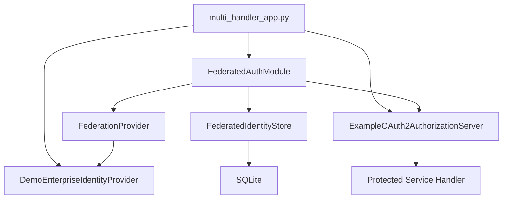
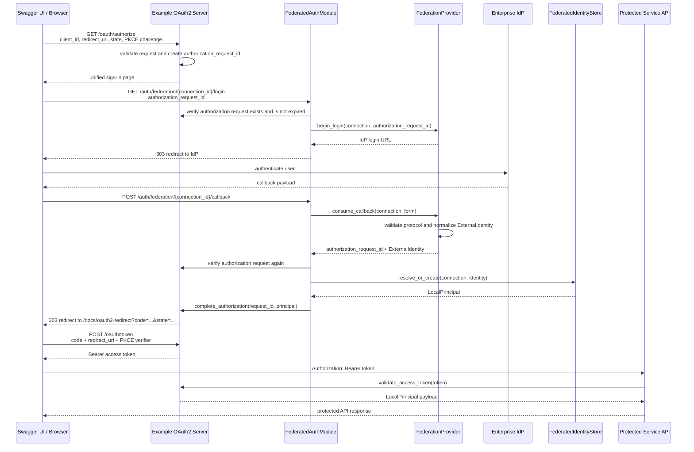
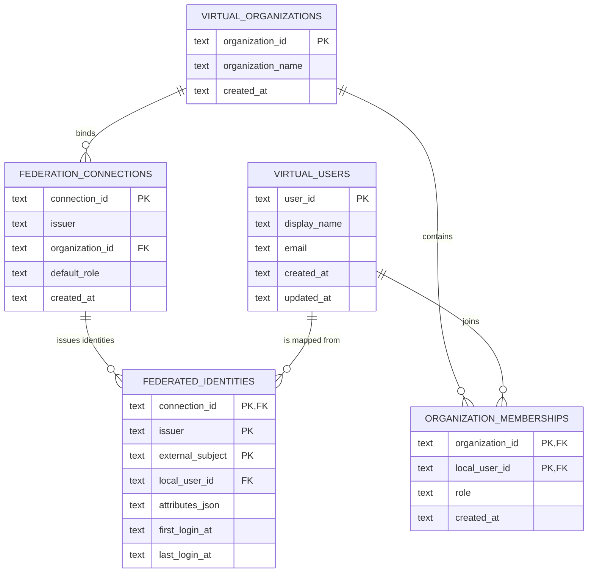

# Federated authentication example

本模块展示如何把企业外部身份接入应用自己的 OAuth2 Authorization Code 流程，
并将外部身份稳定映射为本地虚拟组织和虚拟用户。它与
`multi_handler_app.py` 组合后，可以直接从 Swagger UI 体验完整链路。

本模块解决的是两个相互独立但需要衔接的问题：

1. **联合认证：** 用户在企业身份提供方（Identity Provider，IdP）完成认证，应用获得
   一个已经验证并标准化的外部身份；
2. **本地授权身份：** 应用将该外部身份映射到稳定的本地 `user_id`、
   `organization_id` 和角色，然后通过内部 OAuth2 Token 向业务 Handler 传递身份。

联合认证不会替换应用内部的 OAuth2。SAML 或其他企业协议负责证明“外部用户是谁”，
OAuth2 Bearer Token 负责应用内部“本次请求以哪个本地身份访问 API”。

> `DemoEnterpriseIdentityProvider` 和 `DemoFederationProvider` 仅用于本地演示。
> 它们不接收、不解析、不验证 SAML XML，不能用于生产身份认证。

## 1. 设计目标和非目标

### 1.1 设计目标

- 隔离外部身份协议与业务 Handler；
- 让本地账号和企业联合账号进入同一个 OAuth2 Authorization Code 流程；
- 为外部身份生成稳定的本地虚拟用户和组织成员关系；
- 同一个外部主体重复登录时复用同一个本地 `user_id`；
- 使用异步接口，避免身份查询或数据库操作阻塞事件循环；
- 允许单元测试使用内存 Store，本地运行使用 SQLite；
- 让真实 SAML Provider 能够替换演示 Provider，而不改变身份映射和业务 Handler。

### 1.2 非目标

当前模块不负责：

- 实现生产级 SAML Service Provider；
- 同步企业完整组织树、部门或用户目录；
- 把企业部门自动映射成 Runtime 的 `group_id`；
- 管理 Bot、Agent、会话或业务资源权限；
- 实现 OAuth2 Refresh Token、Scope、Token 撤销、Introspection 或 Logout；
- 提供 MySQL、PostgreSQL 或通用数据库 URL 适配器；
- 提供多副本 OAuth2 授权状态存储。

企业组织与 Runtime `group_id` 不是同一概念。本示例中的
`organization_id` 表示本地身份和租户边界；企业部门、项目组、Runtime Group、Bot
及 Agent 的映射属于更上层的授权和资源模型，不应在身份认证模块中隐式完成。

## 2. 模块结构和职责

```text
federated_auth/
├── README.md
├── __init__.py
├── domain.py
├── provider.py
├── identity_store.py
├── database_identity_store.py
├── module.py
├── oauth2_server.py
└── demo_idp.py
```

| 文件 | 主要类型 | 职责 |
| --- | --- | --- |
| `domain.py` | `FederationConnection`, `ExternalIdentity`, `LocalPrincipal` | 定义 Provider、Store 和 OAuth2 之间共享的稳定领域对象 |
| `provider.py` | `FederationProvider`, `DemoFederationProvider` | 抽象企业身份协议的开始登录和回调消费边界 |
| `identity_store.py` | `FederatedIdentityStore`, `InMemoryFederatedIdentityStore` | 定义外部身份到本地 Principal 的映射接口，并提供单元测试实现 |
| `database_identity_store.py` | `DatabaseFederatedIdentityStore` | 使用一个 SQLite 文件持久化虚拟组织、用户、外部身份和成员关系 |
| `module.py` | `FederatedAuthModule` | 编排 Provider、Store 和 OAuth2 Server，并挂载联合登录路由 |
| `oauth2_server.py` | `ExampleOAuth2AuthorizationServer` | 示例 Authorization Code、PKCE、访问令牌签发与校验 |
| `demo_idp.py` | `DemoEnterpriseIdentityProvider` | 提供明确标注的本地企业 IdP 表单模拟器 |

依赖方向如下：



`FederatedAuthModule` 只依赖 `FederationProvider` 和
`FederatedIdentityStore` 抽象，不依赖演示类。生产应用可以替换 Provider 和 Store
实现，同时保留编排方式。

## 3. 核心领域对象

### 3.1 FederationConnection

`FederationConnection` 描述一个受信任的企业身份连接，并将它绑定到一个本地虚拟组织：

```python
connection = FederationConnection(
    connection_id="enterprise-demo",
    issuer="https://idp.enterprise-demo.example",
    organization_id="virtual-org-enterprise-demo",
    organization_name="Enterprise Demo SSO",
    default_role="member",
)
```

| 字段 | 含义 | 稳定性要求 |
| --- | --- | --- |
| `connection_id` | 应用内部引用该企业连接的唯一 ID | 必须稳定且唯一 |
| `issuer` | 外部 IdP 的受信任签发者标识 | 必须来自可信配置，不能相信回调自行声明的值 |
| `organization_id` | 该连接对应的本地虚拟组织 | 是本地身份边界，不是 Runtime `group_id` |
| `organization_name` | 本地展示名称 | 可以更新 |
| `default_role` | 首次创建组织成员关系时赋予的角色 | 默认 `member` |

SQLite 和内存 Store 都禁止把已经使用的 `connection_id` 重新绑定到另一个
`issuer`、`organization_id` 或 `default_role`，以防同一个连接 ID 的身份语义发生漂移。

### 3.2 ExternalIdentity

`ExternalIdentity` 是 Provider 完成协议验证后输出的标准化身份：

```python
ExternalIdentity(
    connection_id="enterprise-demo",
    issuer="https://idp.enterprise-demo.example",
    external_subject="employee-10086",
    display_name="Enterprise Alice",
    email="alice@enterprise.example",
    attributes={"employee_id": "employee-10086"},
)
```

其中 `(connection_id, issuer, external_subject)` 是外部身份的稳定复合键。

- `external_subject` 应使用 IdP 提供的稳定、不可由终端用户修改的 Subject；
- 不应使用展示名作为唯一键；
- 是否可使用邮箱取决于企业 IdP 是否保证邮箱稳定且唯一；默认不应这样假设；
- `attributes` 可保存经过验证的附加声明，但不应存放原始凭据或不必要的敏感信息。

### 3.3 LocalPrincipal

`LocalPrincipal` 是应用内部认证和 Handler 使用的身份：

```python
LocalPrincipal(
    user_id="user_...",
    organization_id="virtual-org-enterprise-demo",
    display_name="Enterprise Alice",
    email="alice@enterprise.example",
    roles=("member",),
    auth_source="saml",
)
```

业务 Handler 不应该读取 SAML Response 或企业回调表单，而应该只使用经过映射的
`ctx.principal`。

## 4. 完整通信链路

### 4.1 企业联合登录



`authorization_request_id` 是本地 OAuth2 请求与外部身份回调之间的关联键。真实 SAML
实现还应维护 SAML `AuthnRequest ID` 与 `InResponseTo` 的一次性关联，不能只依赖浏览器
提交的本地字段。

### 4.2 本地登录

本地账号不经过 `FederatedAuthModule`：

```text
/oauth/authorize
  -> /auth/local/login
  -> LocalPrincipal(local-demo-user)
  -> authorization code
  -> /oauth/token
  -> bearer token
```

本地和联合登录的差异只发生在“如何得到 LocalPrincipal”这一段。Principal 进入
OAuth2 之后，换码、Token 校验和受保护 API 的行为完全一致。

## 5. HTTP 接口

| 方法与路径 | 是否面向浏览器 | 说明 |
| --- | --- | --- |
| `GET /oauth/authorize` | 是 | 创建 OAuth2 授权请求并显示统一登录选择页 |
| `POST /auth/local/login` | 是 | 校验示例本地账号并完成授权 |
| `POST /oauth/token` | OAuth2 客户端 | 使用一次性 Authorization Code 和 PKCE verifier 换取 Token |
| `GET /auth/federation/{connection_id}/login` | 是 | 校验连接和授权请求，然后跳转至对应企业 IdP |
| `POST /auth/federation/{connection_id}/callback` | IdP/浏览器 | 交给 Provider 验证回调，映射本地身份并完成 OAuth2 授权 |
| `GET /demo-enterprise-idp/login` | 仅本地演示 | 显示模拟企业用户表单；不验证 SAML |

受保护的业务接口不是本模块直接注册的。`OAuth2AccessControl` 会调用
`ExampleOAuth2AuthorizationServer.validate_access_token()`，再把 Principal 放入
Service Framework 的 `RequestContext`。

## 6. 身份解析与 Just-In-Time Provisioning

`resolve_or_create()` 实现按首次登录创建本地虚拟身份（Just-In-Time
Provisioning，JIT）：

1. 校验 `ExternalIdentity.connection_id` 与当前连接一致；
2. 校验 `ExternalIdentity.issuer` 与可信连接配置一致；
3. 读取 `(connection_id, issuer, external_subject)`；
4. 若映射不存在：
   - 创建或更新虚拟组织的展示信息；
   - 创建新的本地 `user_id`；
   - 建立外部身份到本地用户的映射；
   - 建立本地组织成员关系并赋予 `default_role`；
5. 若映射已存在：
   - 保持原本的本地 `user_id`；
   - 更新展示名、邮箱、外部属性和最近登录时间；
6. 返回 `LocalPrincipal`。

这保证同一个外部主体重复登录时，本地 `user_id` 稳定。以下改变会产生不同的外部
身份键：

- 使用另一个 `connection_id`；
- 使用另一个 `issuer`；
- IdP 返回另一个 `external_subject`。

如果企业身份发生合并、拆分或 Subject 迁移，需要显式的管理流程和审计记录，不能通过
修改展示名自动合并。

## 7. Store 接口与实现

### 7.1 抽象接口

```python
class FederatedIdentityStore(ABC):
    async def resolve_or_create(
        self,
        connection: FederationConnection,
        identity: ExternalIdentity,
    ) -> LocalPrincipal:
        ...

    async def find(
        self,
        *,
        connection_id: str,
        issuer: str,
        external_subject: str,
    ) -> LocalPrincipal | None:
        ...

    async def close(self) -> None:
        ...
```

所有方法均为异步方法。生产实现执行数据库 I/O 时必须使用真正的异步驱动，或在受控
线程池中隔离阻塞驱动；不能在事件循环中直接执行同步数据库操作。

### 7.2 当前两种实现

| 实现 | 存储 | 使用场景 | 生命周期 |
| --- | --- | --- | --- |
| `InMemoryFederatedIdentityStore` | Python 字典 | 单元测试和纯逻辑验证 | 进程退出即丢失；`close()` 无操作 |
| `DatabaseFederatedIdentityStore` | 单个 SQLite 文件 | 本地可运行示例和 SQLite 集成测试 | 每次操作打开连接并关闭；`close()` 无操作 |

SQLite 实现接收**文件路径**，不是数据库 URL：

```python
from pathlib import Path

from federated_auth import DatabaseFederatedIdentityStore

store = DatabaseFederatedIdentityStore(
    Path("examples/federated_auth/.data/federated_auth.db")
)
```

应用也支持通过 `FEDERATED_AUTH_DATABASE_PATH` 指定路径：

```bash
FEDERATED_AUTH_DATABASE_PATH=/var/lib/example/federated-auth.db \
uv run python examples/multi_handler_app.py
```

## 8. SQLite 数据模型



表的职责：

| 表 | 职责 |
| --- | --- |
| `virtual_organizations` | 保存本地虚拟组织和展示名称 |
| `federation_connections` | 保存连接到 issuer、本地组织和默认角色的固定绑定 |
| `virtual_users` | 保存应用内部稳定用户 ID 和可更新的基础资料 |
| `federated_identities` | 保存外部身份复合键、本地用户映射、属性快照及登录时间 |
| `organization_memberships` | 保存本地用户在虚拟组织中的角色 |

实现细节：

- 启用 `PRAGMA foreign_keys = ON`；
- 使用 WAL journal mode；
- 首次写入使用 `BEGIN IMMEDIATE`；
- 进程内使用 `asyncio.Lock` 串行化首次创建；
- 外部身份复合主键和事务共同保证同一身份不会创建多个本地用户；
- SQLite schema 在第一次 Store 操作时自动创建；
- 每次读写使用独立 `aiosqlite` 连接，操作完成后关闭。

该自动建表方式适合示例。生产环境应使用正式 schema migration、数据库权限、备份、
审计、容量规划和多副本并发策略。

## 9. 在应用中组装

`multi_handler_app.py` 的组装顺序如下：

```python
from pathlib import Path

from federated_auth import (
    DatabaseFederatedIdentityStore,
    DemoEnterpriseIdentityProvider,
    DemoFederationProvider,
    ExampleOAuth2AuthorizationServer,
    FederatedAuthModule,
    FederationConnection,
)
from openjiuwen_runtime.service import App, OAuth2AccessControl, SystemContext


connection = FederationConnection(
    connection_id="enterprise-demo",
    issuer="https://idp.enterprise-demo.example",
    organization_id="virtual-org-enterprise-demo",
    organization_name="Enterprise Demo SSO",
)
connections = {connection.connection_id: connection}

identity_store = DatabaseFederatedIdentityStore(
    Path("examples/federated_auth/.data/federated_auth.db")
)
oauth2_server = ExampleOAuth2AuthorizationServer()

oauth2 = OAuth2AccessControl(
    token_url="/oauth/token",
    authorization_url="/oauth/authorize",
    token_validator=oauth2_server.validate_access_token,
    scheme_name="OAuth2AuthorizationCode",
)

app = App(
    lambda: SystemContext(),
    enable_ws=False,
    oauth2=oauth2,
)

app.asgi.swagger_ui_init_oauth = {
    "clientId": oauth2_server.client_id,
    "usePkceWithAuthorizationCodeGrant": True,
}

oauth2_server.mount(app.asgi, connections.values())

FederatedAuthModule(
    provider=DemoFederationProvider(),
    identity_store=identity_store,
    oauth2_server=oauth2_server,
    connections=connections,
).mount(app.asgi)

DemoEnterpriseIdentityProvider().mount(app.asgi)
```

组装中只有 `OAuth2AccessControl` 属于通用 Service Framework。Token 签发、用户映射
和企业协议实现都属于应用层示例。

## 10. OAuth2 示例实现的行为

`ExampleOAuth2AuthorizationServer` 当前实现：

- 单一公开客户端 `swagger-docs`；
- Authorization Code grant；
- Swagger 配置为 PKCE S256；
- 收到 PKCE challenge 时，在换码阶段校验 verifier；
- 授权请求默认有效期 300 秒；
- Authorization Code 默认有效期 300 秒且只能使用一次；
- Access Token 默认有效期 3600 秒；
- Token 验证为异步方法；
- 保留并原样返回 OAuth2 `state`；
- 仅接受 path 为 `/docs/oauth2-redirect` 的 HTTP/HTTPS redirect URI。

必须理解的限制：

- 授权请求、Authorization Code 和 Access Token 都保存在当前 Python 进程内；
- 服务重启后所有已签发 Token 失效；
- 多副本之间不共享授权状态；
- 当前服务端允许未携带 PKCE challenge 的请求，只有 Swagger 客户端明确启用了 PKCE；
- redirect URI 当前只校验协议、非空 host 和固定 path，不是生产级客户端 URI 白名单；
- 没有 Refresh Token、Scope、客户端密钥、Token 撤销和注销协议。

因此该 OAuth2 Server 只能用于解释和测试通信链路。生产环境应接入正式认证中心，并让
`OAuth2AccessControl` 使用认证中心提供的异步 Token 校验实现。

## 11. 实现真实 SAML Provider

真实 SAML 支持应通过新增 `FederationProvider` 实现完成，不应把 SAML 解析逻辑写进
`FederatedAuthModule`、Identity Store 或业务 Handler。

基本结构：

```python
from collections.abc import Mapping

from federated_auth.domain import ExternalIdentity, FederationConnection
from federated_auth.provider import (
    FederationAuthenticationResult,
    FederationProvider,
)


class SamlFederationProvider(FederationProvider):
    async def begin_login(
        self,
        connection: FederationConnection,
        authorization_request_id: str,
    ) -> str:
        # 1. 创建 AuthnRequest 和不可预测的 request ID
        # 2. 保存 request ID 与 authorization_request_id 的短期关联
        # 3. 根据配置签名并构造 Redirect 或 POST Binding
        # 4. 返回企业 IdP SSO URL
        ...

    async def consume_callback(
        self,
        connection: FederationConnection,
        form: Mapping[str, str],
    ) -> FederationAuthenticationResult:
        # 1. 读取并安全解析 SAMLResponse
        # 2. 验证签名、证书和 XML 安全边界
        # 3. 验证 issuer、audience、destination 和 recipient
        # 4. 验证 InResponseTo、时间窗口和一次性消费
        # 5. 提取稳定 Subject 和已验证属性
        # 6. 返回标准化 ExternalIdentity
        ...
```

生产 SAML Provider 至少必须处理：

- IdP metadata 与签名证书的可信配置、更新和轮换；
- XML Signature 验证以及 XML Signature Wrapping 防护；
- `Issuer` 与 `FederationConnection.issuer` 精确匹配；
- `AudienceRestriction`；
- `Destination`、Subject Confirmation `Recipient`；
- `InResponseTo` 与原始 AuthnRequest 的关联；
- `NotBefore`、`NotOnOrAfter` 和有限时钟偏差；
- Response/Assertion ID 防重放；
- 成功状态码、已认证 Assertion 和 NameID/Subject 提取；
- RelayState 或本地关联状态的完整性；
- 属性白名单、必填属性和数据最小化；
- 异步或非阻塞的 metadata、密钥和关联状态访问。

只有在以上验证全部成功后，Provider 才能创建 `ExternalIdentity`。生产实现绝不能像
`DemoFederationProvider` 一样直接相信浏览器提交的 `employee_id`、展示名或邮箱。

Provider 返回标准化身份后，现有 `FederatedAuthModule`、Identity Store、OAuth2 完成
流程和业务 Handler 无需感知 SAML XML。

## 12. 安全边界

### 12.1 当前已经提供的保护

- Provider 输出的 `connection_id` 和 `issuer` 必须匹配可信连接；
- 已使用的 `connection_id` 不能静默绑定到不同 issuer 或组织；
- OAuth2 Authorization Code 一次性使用并有过期时间；
- Swagger 使用 PKCE S256；
- Token 无效或过期时受保护 API 返回 `401`；
- SQLite 使用外键和事务维护映射完整性；
- 演示 IdP 页面明确说明没有执行 SAML 验证。

### 12.2 生产环境需要补充的保护

- 使用真实、严格验证的 SAML/OIDC Provider；
- 强制 PKCE，并按客户端注册精确校验 redirect URI；
- 使用正式认证中心管理客户端、Token、Scope、撤销和注销；
- 将授权请求、重放记录和必要状态放入具备 TTL 和原子操作的共享存储；
- 使用 TLS、安全 Cookie、CSRF 防护及适当的 CSP；
- 对登录、连接配置、身份绑定和角色变更写审计日志；
- 对数据库文件、备份和个人信息实施访问控制和保留策略；
- 设计外部身份禁用、离职、组织解绑和本地权限回收流程；
- 避免把敏感 SAML Assertion、密码或 Token 写入日志。

## 13. 测试策略

### 13.1 单元测试

单元测试使用 `InMemoryFederatedIdentityStore`，不创建本地数据库：

```bash
uv run pytest -q \
  tests/unit_tests/test_federated_identity_store.py \
  tests/unit_tests/test_federated_oauth2.py
```

覆盖内容包括：

- 外部身份首次创建和稳定复用；
- issuer、connection 绑定校验；
- Provider 到 LocalPrincipal 的标准化；
- Authorization Code、PKCE 和一次性消费；
- 非法 redirect URI 拒绝。

### 13.2 SQLite 集成测试

```bash
uv run pytest -q tests/system_tests/test_federated_identity_sqlite.py
```

覆盖内容包括：

- Store 关闭并重新创建后身份仍可读取；
- 同一身份并发首次登录只生成一个本地用户；
- 已有 `connection_id` 不能重新绑定到另一组织。

### 13.3 完整系统测试

```bash
uv run pytest -q tests/system_tests/test_multi_handler_example.py
```

该测试从 OAuth2 授权请求开始，覆盖本地登录、Enterprise Demo SSO、Token 交换、受保护
Handler、SSE、OpenAPI schema、错误响应和 SQLite 本地身份稳定性。

## 14. 常见问题

### 为什么企业登录后还要签发 OAuth2 Token？

企业协议证明用户在外部 IdP 的身份，OAuth2 Token 则是应用内部 API 的访问凭据。这样
业务 Handler 无需理解 SAML，并且本地账号与联合账号可以使用同一套访问控制。

### 虚拟用户是否等于复制企业用户？

不是。虚拟用户是外部身份在本系统中的最小本地映射，用于获得稳定 `user_id`、组织成员
关系和本地授权。企业凭据仍由企业 IdP 管理。

### 企业组织是否等于 Runtime group？

不是。`organization_id` 是身份/租户边界；Runtime `group_id` 是业务或运行时资源概念。
二者若需要关联，应由独立、显式、可审计的授权配置完成。

### 为什么单元测试不用 SQLite？

Store 接口的领域行为可以通过内存实现快速、确定地验证；SQLite 持久化、事务和并发行为
由独立集成测试覆盖。这样测试职责清晰，也不把数据库细节泄漏到 Provider 或 OAuth2
逻辑中。

### 能否把 SQLite 路径改成数据库 URL？

当前实现明确只支持 SQLite 文件路径，没有通用数据库 URL 抽象。若未来增加 MySQL 或
PostgreSQL，应新增明确的 Store 实现及迁移方案，而不是让 SQLite 示例类根据字符串
隐式切换不同数据库。

### 真实 SAML 接入后哪些模块保持不变？

通常可以保持 `FederatedAuthModule`、`FederatedIdentityStore`、内部 OAuth2 接入以及
业务 Handler 不变，替换 `DemoFederationProvider` 和演示 IdP，并根据生产部署替换
Identity Store 与 OAuth2 Server。
