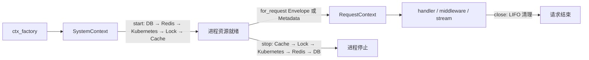

# Service Context 模块设计与接口说明

本文档说明 `openjiuwen_runtime.service` 中进程上下文、请求上下文及其数据与基础设施能力。接口范围来自提交 `f0f1c957`、`bad95732`、`4902fff0`，签名和行为以当前源码、公开导出和测试用例为准。

---

## 1. 模块职责与公开入口

Service Context 将进程共享资源装配为 `SystemContext`，再为每次请求派生 `RequestContext`。业务 handler 通过请求上下文访问数据库、异步 Redis、缓存、锁、审计和 Kubernetes，框架统一处理请求 deadline、中断和资源清理。

| 层级 | 类型或模块 | 职责 |
|---|---|---|
| 进程级 | `SystemContext` | 持有共享资源、执行启动与停止、检查就绪状态、创建请求上下文、提供数据库事务。 |
| 请求级 | `RequestContext[TRequest]` | 绑定 `Envelope[TRequest]`、请求元数据、deadline、日志字段、鉴权主体和请求内清理回调。 |
| 数据能力 | DB、Redis primitives、Cache | 提供数据库 CRUD 与事务、Redis 原生客户端、KV、幂等、队列、发布订阅和缓存接口。 |
| 协调能力 | Locks | 统一锁后端、等待策略、租约、自动续约、fencing token 和请求结束回收。 |
| 可观测性 | Audit | 从请求元数据和鉴权主体生成结构化审计事件。 |
| 基础设施 | Kubernetes | 在固定 namespace 内创建、读取和删除受管 Pod。 |
| 装配 | `ServiceConfig`、`bootstrap` | 从配置构造 DB、Redis、锁和缓存，集中执行资源生命周期。 |

业务代码使用包根入口：

```python
from openjiuwen_runtime.service import (
    ServiceConfig,
    SystemContext,
    RequestContext,
    TypedAppContext,
    build_system_context,
)
```

`openjiuwen_runtime.service.context` 公开导出上下文域类型，适合基础设施扩展代码：

| 分组 | 公开名称 |
|---|---|
| 上下文 | `SystemContext`、`RequestContext`、`TypedAppContext` |
| 审计 | `AuditEvent`、`AuditLogger`、`LoggingAuditLogger`、`NoopAuditLogger` |
| 缓存 | `Cache`、`CacheBackend`、`BaseCacheBackend`、`MemoryCacheBackend`、`RedisCacheBackend`、`CacheMetrics`、`CacheSerializer`、`JsonCacheSerializer`、`CacheBackendFactory`、`build_cache_backend`、`create_cache_backend` |
| 锁 | `LockBackend`、`LockCapabilities`、`LockCredential`、`LockLease`、`LeaseState`、`LockManager`、`MemoryLockBackend`、`RedisLockBackend`、`EtcdLockBackend`、`LockBackendFactory`、`build_lock_backend`、`create_lock_backend` |
| Kubernetes | `KubernetesOperations`、`KubernetesAsyncioOperations`、`FakeKubernetesOperations`、`PodCreateSpec`、`PodSummary`、`PodDeleteResult` |

包根还公开 `ServiceConfig`、资源装配函数和本模块使用的 `FrameworkError` 异常类型。`TypedAppContext` 是 `RequestContext` 的类型别名，可写成 `TypedAppContext[InputModel]`。

Redis 的 `KVStore`、`Idempotency`、`StreamQueue` 和 `PubSub` 通过 `RequestContext` 的 `kv`、`idempotency`、`queue`、`pubsub` 属性取得。

### 1.1 实现文件定位索引

以下路径均以仓库根目录为起点。定位一个能力时，先查看公开导出，再查看 `RequestContext` 或 `SystemContext` 的接入逻辑，最后进入具体 backend 文件。

#### 核心上下文与生命周期

| 定位目标 | 实现文件 | 关键符号或内容 |
|---|---|---|
| Service 包根公开导出 | `service/openjiuwen_runtime/service/__init__.py` | `__all__`、上下文类型、装配函数、异常的包根入口。 |
| Context 包公开导出 | `service/openjiuwen_runtime/service/context/__init__.py` | 审计、缓存、锁、Kubernetes 和上下文类型的聚合导出。 |
| 进程级上下文 | `service/openjiuwen_runtime/service/context/system_context.py` | `SystemContext`、`start()`、`stop()`、`readiness()`、`for_request()`、`transaction()`、`from_settings()`。 |
| 请求级上下文 | `service/openjiuwen_runtime/service/context/request_context.py` | `RequestContext`、`TypedAppContext`、请求元数据、deadline、中断、清理回调及全部 `ctx.*` 能力入口。 |
| 请求与响应信封 | `service/openjiuwen_runtime/service/envelope.py` | `Metadata`、`Envelope`、`ResponseEnvelope`、`StreamChunk`。 |
| App 进程生命周期 | `service/openjiuwen_runtime/service/server/app.py` | `App`、FastAPI lifespan、`SystemContext.start()` 与 `stop()` 的调用位置。 |
| REST 请求生命周期 | `service/openjiuwen_runtime/service/server/rest_adapter.py` | `RestAdapter`、请求上下文创建、客户端断连中断、普通响应与流式响应关闭。 |
| WebSocket 请求生命周期 | `service/openjiuwen_runtime/service/server/ws_adapter.py` | WebSocket 消息对应的请求上下文创建和关闭。 |
| 流式上下文清理 | `service/openjiuwen_runtime/service/routing/result.py` | `ContextBoundStream`、`StreamResult.aclose()`，终帧、异常和取消路径的清理。 |
| deadline 与异常归一化 | `service/openjiuwen_runtime/service/routing/router.py` | `MessageRouter`、`_await_with_lifecycle()`、普通响应和流式错误转换。 |
| 统一异常与 HTTP 映射 | `service/openjiuwen_runtime/service/errors.py` | `ErrorCode`、`FrameworkError` 子类、`exception_code()`、`http_status_for()`。 |

#### 配置与资源装配

| 定位目标 | 实现文件 | 关键符号或内容 |
|---|---|---|
| 环境变量与默认值 | `service/openjiuwen_runtime/service/config.py` | `ServiceConfig`、字段默认值、组合校验、`from_env()`。 |
| DB、Redis、锁、缓存装配 | `service/openjiuwen_runtime/service/bootstrap.py` | `build_db_handler()`、`build_redis_client()`、`build_system_context()`、`bootstrap_system()`、`shutdown_system()`。 |
| 资源启动与所有权 | `service/openjiuwen_runtime/service/context/system_context.py` | `set_*()`、`_owns_*`、启动顺序、逆序清理和失败回收。 |

#### 数据库与 Redis

| 定位目标 | 实现文件 | 关键符号或内容 |
|---|---|---|
| 数据库请求入口 | `service/openjiuwen_runtime/service/context/request_context.py` | `db`、`require_db()`、`db_create()`、`db_get()`、`db_update()`、`db_delete()`、`db_list()`、`db_count()`、`transaction()`。 |
| 数据库 handler 协议 | `foundation/openjiuwen_runtime/foundation/db/handler.py` | `DBHandler` 及 CRUD、连接、表初始化接口。 |
| SQLAlchemy 通用实现 | `foundation/openjiuwen_runtime/foundation/db/sqlalchemy_handler.py` | `SQLAlchemyHandler`、动态表模型、session factory 和 CRUD 实现。 |
| MySQL 实现 | `foundation/openjiuwen_runtime/foundation/db/mysql_handler.py` | `MySQLHandler`、连接串和数据库初始化。 |
| SQLite 实现 | `foundation/openjiuwen_runtime/foundation/db/sqlite_handler.py` | `SQLiteHandler`、文件路径和内存数据库初始化。 |
| 表结构模型 | `foundation/openjiuwen_runtime/foundation/db/table_def.py` | `TableDefinition`、`ColumnDefinition`、`IndexDefinition`。 |
| 原生 Redis 请求入口 | `service/openjiuwen_runtime/service/context/request_context.py` | `redis`、`require_redis()` 及 Redis primitives 的延迟创建。 |
| Redis client 构造 | `service/openjiuwen_runtime/service/bootstrap.py` | `build_redis_client()` 和 `build_redis_handler` 别名。 |
| KV 与 JSON 存储 | `service/openjiuwen_runtime/service/context/primitives/kv_store.py` | `KVStore`、字符串 CRUD、`incr()`、JSON 和 `scan()`。 |
| 幂等 | `service/openjiuwen_runtime/service/context/primitives/idempotency.py` | `Idempotency`、`IdempotencyGuard`、`idempotency_guard()`。 |
| Redis Streams 队列 | `service/openjiuwen_runtime/service/context/primitives/stream_queue.py` | `StreamQueue`、`StreamItem`、消费组、pending 和 `ack()`。 |
| Redis Pub/Sub | `service/openjiuwen_runtime/service/context/primitives/pubsub.py` | `PubSub.publish()`、`subscribe()` 及订阅清理。 |

#### 缓存

| 定位目标 | 实现文件 | 关键符号或内容 |
|---|---|---|
| 缓存公开导出 | `service/openjiuwen_runtime/service/context/cache/__init__.py` | cache 子包公开类型和 factory。 |
| 协议、校验与请求 facade | `service/openjiuwen_runtime/service/context/cache/base.py` | `CacheBackend`、`BaseCacheBackend`、`Cache`、序列化、指标和异常归一化。 |
| backend 选择 | `service/openjiuwen_runtime/service/context/cache/factory.py` | `build_cache_backend()`、`create_cache_backend`、`CacheBackendFactory`。 |
| 进程内缓存 | `service/openjiuwen_runtime/service/context/cache/memory.py` | `MemoryCacheBackend`、LRU、TTL、容量驱逐。 |
| Redis 缓存 | `service/openjiuwen_runtime/service/context/cache/redis.py` | `RedisCacheBackend`、毫秒 TTL、namespace 清理。 |
| 请求接入与自动清理 | `service/openjiuwen_runtime/service/context/request_context.py` | `cache` 属性、请求级 `Cache` facade 和 cleanup 注册。 |

#### 锁

| 定位目标 | 实现文件 | 关键符号或内容 |
|---|---|---|
| 锁公开导出 | `service/openjiuwen_runtime/service/context/locks/__init__.py` | locks 子包公开类型、backend 和 factory。 |
| backend 协议与凭证 | `service/openjiuwen_runtime/service/context/locks/base.py` | `LockBackend`、`LockCapabilities`、`LockCredential`。 |
| backend 选择 | `service/openjiuwen_runtime/service/context/locks/factory.py` | `build_lock_backend()`、`auto` 选择、etcd client 构造入口。 |
| 请求级锁管理 | `service/openjiuwen_runtime/service/context/locks/manager.py` | `LockManager`、获取等待、中断、补偿释放、租约登记和关闭。 |
| 租约与自动续约 | `service/openjiuwen_runtime/service/context/locks/lease.py` | `LeaseState`、`LockLease`、续约、失锁、释放。 |
| 内存锁 backend | `service/openjiuwen_runtime/service/context/locks/backends/memory.py` | `MemoryLockBackend`、单进程 TTL 锁。 |
| Redis 锁 backend | `service/openjiuwen_runtime/service/context/locks/backends/redis.py` | `RedisLockBackend`、`SET NX PX`、owner token 和 CAS。 |
| etcd 锁 backend | `service/openjiuwen_runtime/service/context/locks/backends/etcd.py` | `EtcdLockBackend`、endpoint/client 构造、lease、transaction 和 fencing token。 |
| `ctx.lock()` 兼容入口 | `service/openjiuwen_runtime/service/context/primitives/lock.py` | `ManagedDistributedLock` 和旧版 `DistributedLock`。 |
| 请求接入 | `service/openjiuwen_runtime/service/context/request_context.py` | `lock()`、`locks`、`require_locks()` 及配置默认值装配。 |

#### 审计与 Kubernetes

| 定位目标 | 实现文件 | 关键符号或内容 |
|---|---|---|
| 审计事件与 sink | `service/openjiuwen_runtime/service/context/audit.py` | `AuditEvent`、`AuditLogger`、`LoggingAuditLogger`、`NoopAuditLogger`。 |
| 请求审计字段装配 | `service/openjiuwen_runtime/service/context/request_context.py` | `audit()`、actor 解析和请求字段填充。 |
| Kubernetes 公开导出 | `service/openjiuwen_runtime/service/context/kubernetes/__init__.py` | Kubernetes 协议、模型和两种实现的聚合导出。 |
| Kubernetes 协议与模型 | `service/openjiuwen_runtime/service/context/kubernetes/base.py` | `KubernetesOperations`、`PodCreateSpec`、`PodSummary`、`PodDeleteResult`。 |
| 真实 Kubernetes client | `service/openjiuwen_runtime/service/context/kubernetes/asyncio_client.py` | `KubernetesAsyncioOperations`、client 启动、Pod CRUD、状态转换和 API 异常映射。 |
| 内存 Kubernetes 实现 | `service/openjiuwen_runtime/service/context/kubernetes/fake.py` | `FakeKubernetesOperations` 和进程内 Pod 状态。 |
| Kubernetes 生命周期接入 | `service/openjiuwen_runtime/service/context/system_context.py` | `require_kubernetes()`、`set_kubernetes()`、start、ping、close 和 readiness。 |
| Kubernetes 请求入口 | `service/openjiuwen_runtime/service/context/request_context.py` | `kubernetes`、`require_kubernetes()`。 |

同一能力涉及多个文件时，`request_context.py` 定义业务调用入口，`system_context.py` 和 `bootstrap.py` 定义进程资源装配与生命周期，子包中的 `base.py`、`manager.py` 或具体 backend 文件定义实际行为。

---

## 2. SystemContext 与 RequestContext

### 2.1 关系与生命周期



`App` 在 ASGI lifespan 中调用上下文工厂并执行 `SystemContext.start()`，在进程退出时执行 `SystemContext.stop()`。每次 REST 或 WebSocket 消息调用 `for_request()` 创建独立的 `RequestContext`。普通响应结束后关闭请求上下文；流式响应在终帧、显式 `aclose()`、异常或取消路径关闭请求上下文。

`SystemContext.start()` 和 `stop()` 可重复调用。启动失败时已登记资源按逆序清理，并继续抛出原始启动异常。`stop()` 尝试清理全部资源，记录每个清理异常，最终抛出第一个异常。

资源所有权决定启动和关闭行为。装配器创建的 DB、Redis、锁和缓存由 `SystemContext` 管理。通过装配器注入的资源默认由调用方管理，并在 `SystemContext.start()` 前保持可用状态。`set_db()`、`set_redis()`、`set_lock_backend()`、`set_cache_backend()`、`set_kubernetes()` 的 `owned` 参数可显式设置所有权。

### 2.2 SystemContext 公开接口

直接构造的主要参数如下：

```python
SystemContext(
    redis=None,
    db=None,
    settings=None,
    *,
    key_prefix="service",
    instance_id=None,
    logger=None,
    audit_logger=None,
    audit=None,
    etcd=None,
    lock_backend=None,
    cache_backend=None,
    cache=None,
    kubernetes=None,
    table_definitions=None,
    request_timeout_seconds=None,
    _owns_db=None,
    _owns_redis=False,
    _owns_lock_backend=None,
    _owns_cache_backend=None,
    _owns_kubernetes=False,
)
```

`audit` 是 `audit_logger` 的兼容参数，两者同时传入会抛出 `ValueError`。`cache` 是 `cache_backend` 的兼容参数，两者同时传入会抛出 `ValueError`。`request_timeout_seconds=None` 时从 `settings.request_timeout_seconds`、同名映射项或 `ServiceConfig.from_env()` 读取；值必须是有限非负数。`instance_id=None` 时生成 `<hostname>:<8 位随机十六进制>`。

`_owns_*` 是装配器使用的内部所有权参数。直接构造时，已提供的 DB、锁和缓存默认归 `SystemContext` 管理，Redis 和 Kubernetes 默认归调用方管理。`build_system_context()` 将调用方注入的资源统一标记为外部所有权。业务装配优先使用 builder 和公开的 `set_*()` 方法表达所有权。

| 签名 | 返回值与约束 |
|---|---|
| `namespace(suffix: str) -> str` | `key_prefix` 有值时返回 `<prefix>:<suffix>`，空前缀直接返回 `suffix`。 |
| `require_db() -> Any` | 返回 DB handler；缺少资源时抛出 `DatabaseUnavailable`。 |
| `require_redis() -> Any` | 返回共享异步 Redis client；缺少资源时抛出 `RedisUnavailable`。 |
| `require_cache() -> Any` | 返回进程级 cache backend；缺少资源时抛出 `CacheUnavailable`。 |
| `require_kubernetes() -> KubernetesOperations` | 返回 Kubernetes 操作对象；缺少资源时抛出 `KubernetesUnavailable`。 |
| `set_db(db, *, owned=False) -> None` | 替换 DB 并设置所有权。 |
| `set_redis(redis, *, owned=False) -> None` | 替换 Redis client 并设置所有权。 |
| `set_lock_backend(backend, *, owned=True) -> None` | 替换锁后端，同时同步其 etcd client 引用和所有权。 |
| `set_cache_backend(backend, *, owned=True) -> None` | 替换缓存后端并设置所有权。 |
| `set_kubernetes(kubernetes, *, owned=False) -> None` | 替换 Kubernetes 操作对象并设置所有权。 |
| `set_audit_logger(logger_or_none) -> None` | 设置审计 sink；`None` 选择 `NoopAuditLogger`。别名为 `set_audit`。 |
| `audit(event: AuditEvent) -> None` | 异步调用当前审计 sink 的 `write()`。sink 异常向调用方传播。 |
| `start() -> None` | 启动自有资源并检查全部已配置资源。 |
| `stop() -> None` | 按逆序关闭自有资源。 |
| `readiness() -> dict[str, bool \| None]` | 返回 `db`、`redis`、`kubernetes`、`lock`、`cache` 和 `ready`。未配置项为 `None`，检查异常或失败为 `False`。 |
| `for_request(request: Envelope[T] \| Metadata) -> RequestContext[T]` | 创建请求上下文；其他类型抛出 `TypeError`。 |
| `transaction() -> AsyncIterator[AsyncSession]` | 异步上下文管理器；正常退出提交，异常退出回滚，随后关闭 session。 |
| `from_settings(...) -> SystemContext` | 经 `build_system_context()` 构造资源；`redis_url` 和 `key_prefix` 可覆盖配置。 |

`transaction()` 要求 DB handler 提供可调用的 `session_factory`。缺少该能力时抛出 `FrameworkError`。

### 2.3 RequestContext 公开接口

调用方通过 `SystemContext.for_request()` 创建请求上下文。`Envelope[TRequest]` 会完整绑定到 `envelope`，`request` 返回 `envelope.rawdata`，`msg_type` 返回 `envelope.type`。传入独立 `Metadata` 用于兼容旧调用，此类上下文访问 `request` 或 `msg_type` 会抛出 `FrameworkError`。

| 成员 | 类型或签名 | 说明 |
|---|---|---|
| `sysctx` | `SystemContext` | 创建当前请求的进程上下文。 |
| `metadata` | `Metadata` | 请求元数据。 |
| `request_id` | `str` | 必填请求标识。 |
| `user_id`、`chat_id`、`session_id`、`trace_id`、`bot_id`、`channel` | `str \| None` | 直接映射 `Metadata`。 |
| `instance_id` | `str \| None` | 请求携带的业务实例标识 `metadata.instance_id`。 |
| `replica_id` | `str` | 当前服务进程的 `sysctx.instance_id`。 |
| `lock_owner` | `str` | 每个请求唯一，格式包含服务进程 `instance_id`。 |
| `logger` | `logging.Logger` | 每条记录自动附加 `request_id` 和 `trace_id`。 |
| `attrs` | `dict[str, Any]` | 请求内扩展数据，默认 `{}`。 |
| `principal` | `Any` | 鉴权主体，默认 `None`，审计 actor 会读取该值。 |
| `remaining_seconds()` | `float \| None` | 返回单调时钟下的剩余秒数，最低为 `0`；无 deadline 时返回 `None`。 |
| `interrupt(reason: str \| None = None) -> None` | - | 设置中断事件并保存第一次中断原因。 |
| `check_interrupted() -> None` | - | 中断时抛出 `Interrupted`，deadline 到期时抛出 `DeadlineExceeded`。 |
| `wait_interrupted() -> None` | - | 等待显式中断或 deadline 到期；返回后调用 `check_interrupted()` 取得具体异常。 |
| `add_cleanup(callback) -> None` | - | 注册无参数同步或异步回调；别名为 `register_cleanup`。 |
| `close() -> None` | - | 按 LIFO 顺序执行回调一次。单个回调失败会记录日志并继续。并发和重复关闭复用同一清理任务。 |
| `closed` | `bool` | 清理任务完成后为 `True`。 |

`request_timeout_seconds=0` 表示请求无 deadline。正值在 `for_request()` 时转换为绝对单调时钟时间。DB、原生 Redis、缓存、锁和 Kubernetes 的请求入口会检查中断状态。Redis primitives 的单次方法直接调用共享 Redis；长轮询和业务循环在操作边界调用 `check_interrupted()`。

---

## 3. 数据库接口

`ctx.db` 与 `ctx.require_db()` 返回同一个进程级 DB handler。请求上下文提供以下委托方法：

| 签名 | 委托调用 | 返回值 |
|---|---|---|
| `await db_create(table_name: str, data: dict[str, Any]) -> Any` | `db.create(table_name, data)` | 后端创建结果。 |
| `await db_get(table_name: str, filters: dict[str, Any]) -> Any` | `db.get(table_name, filters)` | 单条记录或后端定义的空值。 |
| `await db_update(table_name: str, filters: dict[str, Any], data: dict[str, Any]) -> Any` | `db.update(table_name, filters, data)` | 后端更新结果。 |
| `await db_delete(table_name: str, filters: dict[str, Any]) -> bool` | `db.delete(table_name, filters)` | 删除结果。 |
| `await db_list(table_name: str, filters: dict[str, Any] \| None = None, limit: int = 100, offset: int = 0) -> list[Any]` | `db.list_records(...)` | 记录列表。 |
| `await db_count(table_name: str, filters: dict[str, Any] \| None = None) -> int` | `db.count_records(...)` | 记录数。 |

每次 `db_*` 调用使用 DB handler 自身的独立操作和 session。多步骤原子操作使用 `async with ctx.transaction() as session:`，并在该 session 上直接执行 SQLAlchemy 操作。事务块中的 `db_*` 调用仍使用独立 session。

`table_definitions` 在 `SystemContext.start()` 期间逐个传给 DB handler 的 `init_table()`。`build_db_handler()` 根据 `db_type` 创建 `SQLiteHandler` 或 `MySQLHandler`，`db_type="none"` 返回 `None`。数据库驱动抛出的业务异常保持原类型，handler 可将预期异常转换为 `FrameworkError` 子类或指定错误码。

---

## 4. Redis 接口

### 4.1 原生异步客户端

`ctx.redis` 与 `ctx.require_redis()` 返回共享的 `redis.asyncio` client，可调用完整异步 API，例如 `hset`、`hget`、`zadd`、`zscore` 和 pipeline。该 client 的生命周期归 `SystemContext` 或注入方管理，请求结束时保持连接可用。

### 4.2 Redis primitives

所有键通过 `sysctx.namespace()` 添加命名空间，默认前缀分别为 `service:kv`、`service:idem`、`service:queue`、`service:pubsub`。

| 属性 | 主要签名 | 语义 |
|---|---|---|
| `ctx.kv` | `get(key) -> str \| None`；`set(key, value, ttl: int \| None = None)`；`delete(key) -> bool`；`exists(key) -> bool`；`incr(key, amount: int = 1) -> int`；`set_json(key, obj, ttl=None)`；`get_json(key, default=None)`；`scan(pattern) -> list[str]` | 分布式字典和原子计数。`ttl` 传给 Redis `EX`，单位为秒。`scan()` 返回移除命名空间前缀后的键。 |
| `ctx.idempotency` | `acquire(request_id: str, window: int = 60) -> IdempotencyGuard`；`guard.succeed(result: ResponseEnvelope)` | 用 `SET NX EX` 标记请求，`window` 单位为秒。guard 含 `acquired: bool` 和 `cached_result`。`succeed()` 按相同窗口保存可回放结果。 |
| `ctx.queue` | `enqueue(stream: str, data: dict) -> str`；`consume(group, consumer, *, stream, block: int = 0, count: int = 10) -> AsyncIterator[StreamItem]`；`item.ack() -> None` | Redis Streams 消费组。消费时先读取当前 consumer 的 pending，再读取新消息。`block` 单位为毫秒，`0` 表示排空后结束，正值进入长轮询。成功处理后显式 `ack()`。 |
| `ctx.pubsub` | `publish(channel: str, data: dict) -> int`；`subscribe(channel: str) -> AsyncIterator[dict]` | 瞬时扇出。`publish()` 返回接收消息的订阅者数量；订阅迭代器退出时取消订阅并关闭 pubsub 对象。 |

幂等中间件从包根导入：`idempotency_guard(window: int = 60, mode: str = "reject")`。`reject` 为重复请求返回 `idempotent` 错误；`cache` 回放首次成功的普通响应。

---

## 5. 缓存接口

`ctx.cache` 首次访问时创建请求级 `Cache` facade，并注册自动清理。`Cache.close()` 只关闭当前 facade，共享 backend 持续服务其他请求。

```python
await ctx.cache.set("key", "value", ttl=None)
value = await ctx.cache.get("key")
await ctx.cache.set_json("user:7", {"name": "Ada"}, ttl=60)
user = await ctx.cache.get_json("user:7", default=None)
model = await ctx.cache.get_model("user:7", UserModel, default=None)
```

| 签名 | 返回值与默认值 |
|---|---|
| `get(key: str) -> str \| None` | 命中返回字符串，未命中返回 `None`。 |
| `set(key: str, value: str, ttl: float \| None = None) -> None` | `ttl=None` 使用 backend 的 `default_ttl`。 |
| `delete(key: str) -> bool` | 返回键是否存在并被删除。 |
| `exists(key: str) -> bool` | 返回键是否存在。 |
| `clear_namespace() -> int` | 删除当前 backend 命名空间内的全部键并返回数量。 |
| `get_json(key, default=None, *, model=None) -> Any` | 解码 JSON；缺失时返回 `default`；指定 Pydantic model 时执行 `model_validate()`。 |
| `set_json(key, value, ttl=None) -> None` | 序列化 JSON 兼容值或 Pydantic model。 |
| `get_model(key, model, default=None) -> BaseModel \| None` | `get_json(..., model=model)` 的明确类型入口。 |
| `metrics -> CacheMetrics` | 包含 `hits`、`misses`、`expirations`、`evictions`、`backend_errors`；`expired` 和 `errors` 为兼容属性。 |

缓存键必须是非空字符串。字符串值的默认上限为 1 MiB UTF-8 字节。显式 TTL 必须是有限正数。`default_ttl=None` 创建无默认过期时间的 backend。序列化失败、反序列化失败、backend 关闭和 backend 操作失败统一抛出 `CacheUnavailable`。

| backend | 范围与特征 | 构造默认值 |
|---|---|---|
| `MemoryCacheBackend` | 单进程、并发安全、LRU、惰性清理过期项 | `prefix="service:cache"`、`default_ttl=300`、`max_entries=1000`、`max_value_bytes=1048576` |
| `RedisCacheBackend` | 跨副本共享、毫秒 TTL、按 namespace 扫描清理 | `prefix="service:cache"`、`default_ttl=300`、`max_value_bytes=1048576`、`owns_redis=False`、`scan_count=100` |

`build_cache_backend("memory" | "redis" | "none", ...)` 创建对应 backend；Redis 模式要求传入 Redis client；`none` 返回 `None`。

自定义 `CacheBackend` 提供 `metrics: CacheMetrics`，并实现异步 `get()`、`set()`、`delete()`、`exists()`、`clear_namespace()` 和 `close()`。继承 `BaseCacheBackend` 可复用键、TTL、值大小校验以及异常归一化。

---

## 6. 锁接口

### 6.1 请求级调用

```python
locks = ctx.require_locks(distributed=True, fencing=True)
async with locks.hold(
    "user:7",
    ttl=30.0,
    wait_timeout=5.0,
    auto_renew=True,
) as lease:
    fence = lease.credential.fencing_token
    lease.ensure_valid()
```

| 签名 | 返回值与默认值 |
|---|---|
| `ctx.require_locks(*, distributed: bool = False, fencing: bool = False) -> LockManager` | 校验 backend 及声明能力，缺失能力时抛出 `LockBackendUnavailable`。 |
| `ctx.locks.acquire(key, *, ttl=None, wait_timeout=None, auto_renew=False, renew_ratio=None) -> LockLease` | 获取并登记租约。`ttl`、`wait_timeout`、`renew_ratio` 的空值使用配置默认值。 |
| `ctx.locks.hold(key, *, ttl=None, wait_timeout=None, auto_renew=True, renew_ratio=None) -> AsyncIterator[LockLease]` | 获取锁的异步上下文管理器，退出时释放租约。 |
| `ctx.lock(key, *, ttl=None, timeout=None, renew_interval=None)` | 兼容入口；`timeout` 对应 `wait_timeout`，默认自动续约，返回异步上下文管理器。 |
| `ctx.locks.close() -> None` | 停止续约并回收当前请求登记的全部租约；由 `RequestContext.close()` 自动调用。 |

`wait_timeout=0` 执行一次非阻塞获取，失败抛出 `LockNotAcquired`。正值在超时后抛出 `LockAcquireTimeout`。等待过程响应请求中断、deadline 和 task cancellation；获取完成边界发生取消时会补偿释放已取得的凭证。

`LockLease` 提供 `credential`、`key`、`state`、`lost`、`released`、`renew() -> LockCredential`、`release(*, timeout=None) -> bool`、`ensure_valid()` 和 `wait_lost()`。`release()` 可重复调用。自动续约失败将租约置为 `LOST` 并中断所属请求。在写入外部系统前调用 `ensure_valid()` 校验租约状态。租约曾丢失且业务块正常退出时，异步上下文管理器抛出 `LockLost`。

`LockCredential` 是不可变值，字段包括 `key`、`token`、`backend`、`lease_id`、`fencing_token`、`acquired_at`、`expires_at`。时间字段使用单调时钟。

自定义 `LockBackend` 实现声明 `capabilities: LockCapabilities`，并实现以下原子操作：

```python
async def try_acquire(key: str, ttl: float) -> LockCredential | None
async def renew(credential: LockCredential, ttl: float) -> LockCredential
async def release(credential: LockCredential) -> bool
```

等待、重试、请求中断和续约循环由 `LockManager` 与 `LockLease` 处理。

### 6.2 backend 能力与选择

| backend | `distributed` | `fencing` | 使用场景 |
|---|---:|---:|---|
| `MemoryLockBackend` | `False` | `False` | 单进程互斥。 |
| `RedisLockBackend` | `True` | `False` | 跨副本互斥，token 校验续约与释放。 |
| `EtcdLockBackend` | `True` | `True` | 跨副本互斥，etcd create revision 作为 fencing token。 |

`lock_backend="auto"` 按 etcd、Redis、单副本内存的顺序选择。多副本部署缺少分布式 backend 时抛出 `LockBackendUnavailable`。`SystemContext.start()` 会再次验证 `deploy_replicas > 1` 时的分布式能力。

通过 endpoints 创建 `EtcdLockBackend` 需要 `aetcd`。调用方也可通过 `etcd_client` 注入满足异步 lease、transaction、get 和 status 接口的 client。

配置默认值为 `ttl=30.0` 秒、`wait_timeout=0.0` 秒、`renew_ratio=0.333`、`release_timeout=3.0` 秒。TTL 和 release timeout 必须是有限正数，wait timeout 必须是有限非负数。

---

## 7. 审计接口

```python
await ctx.audit(
    "users.update",
    outcome="success",
    resource="user:7",
    details={"fields": ["name"]},
)
```

签名为：

```python
await ctx.audit(
    action: str,
    *,
    outcome: str = "success",
    actor: str | None = None,
    resource: str | None = None,
    details: dict[str, Any] | None = None,
) -> None
```

`actor` 解析顺序为显式参数、`principal` 中的 `user_id`/`subject`/`sub`/`id`、`metadata.user_id`。`resource` 默认使用消息类型。事件自动填充 `request_id`、`trace_id`、`session_id`、`msg_type`、业务 `instance_id` 和进程 `replica_id`，并复制 `details`。

`AuditEvent` 的字段和默认值为：

```python
@dataclass(slots=True)
class AuditEvent:
    action: str
    outcome: str = "success"
    actor: str | None = None
    user_id: str | None = None
    resource: str | None = None
    request_id: str | None = None
    trace_id: str | None = None
    session_id: str | None = None
    msg_type: str | None = None
    instance_id: str | None = None
    replica_id: str | None = None
    details: dict[str, Any] = field(default_factory=dict)
    timestamp: float = field(default_factory=time.time)
```

事件提供 `to_dict()`。`AuditLogger` 协议只要求 `await write(event) -> None`。默认 `LoggingAuditLogger(logger=None, *, level=logging.INFO)` 写结构化日志；`level` 接受整数或日志级别名称。`NoopAuditLogger` 用于显式关闭审计输出。

---

## 8. Kubernetes 接口

`KubernetesOperations` 是进程级异步协议：

```python
async def start() -> None
async def ping() -> bool
async def close() -> None
async def get_pod(name: str) -> PodSummary | None
async def create_pod(spec: PodCreateSpec) -> PodSummary
async def delete_pod(name: str) -> PodDeleteResult
```

| 模型 | 字段 |
|---|---|
| `PodCreateSpec` | `name: str`、`image: str` |
| `PodSummary` | `name: str`、`namespace: str`、`phase: str`、`ready: bool`、`image: str \| None` |
| `PodDeleteResult` | `name: str`、`namespace: str`、`state: Literal["delete_requested", "deletion_in_progress", "already_absent"]` |

`ctx.kubernetes` 与 `ctx.require_kubernetes()` 返回共享操作对象，并在返回前检查请求状态。

`KubernetesAsyncioOperations(namespace, *, labels=None, kubeconfig=None)` 需要 `kubernetes_asyncio`。它优先加载集群内配置，加载失败时读取 kubeconfig。默认受管标签为 `app.kubernetes.io/managed-by=openjiuwen-service-demo`。读取只返回标签匹配的 Pod。删除使用 UID precondition、`grace_period_seconds=0` 和 10 秒 API request timeout。创建接口生成固定的受限单容器 Pod 模板，容器名为 `demo`，重启策略为 `Never`。

`FakeKubernetesOperations(namespace, *, labels=None)` 在进程内保存 Pod 状态，适合本地开发和测试。调用 CRUD 前先执行 `start()`。

Kubernetes 的 `namespace`、`labels` 和 `kubeconfig` 由操作对象构造参数提供。将操作对象交给系统管理时设置所有权：

```python
operations = KubernetesAsyncioOperations("agents", kubeconfig="/path/to/config")
system = build_system_context(config, kubernetes=operations)
system.set_kubernetes(operations, owned=True)
```

此时 `SystemContext.start()` 调用 `operations.start()` 和 `ping()`，`stop()` 调用 `close()`。外部所有权模式在系统启动前由调用方完成 `operations.start()`，系统执行 `ping()` 检查。

Kubernetes API 的 401/403 映射为 `PermissionDenied`，404 映射为 `NotFoundError`，409 映射为 `FrameworkError(code="conflict")`，429 和 5xx 映射为 `KubernetesUnavailable`。`get_pod()` 遇到 404 返回 `None`；`delete_pod()` 遇到 404 返回 `already_absent`。

---

## 9. 配置与资源装配

### 9.1 ServiceConfig

`ServiceConfig` 是冻结 dataclass，`ServiceConfig.from_env()` 读取 `OPENJIUWEN_SERVICE_` 前缀环境变量。

| 配置字段 / 环境变量后缀 | 默认值 | 约束或用途 |
|---|---|---|
| `host` / `HOST` | `"0.0.0.0"` | 服务监听地址。 |
| `port` / `PORT` | `8090` | `1..65535`。 |
| `title` / `TITLE` | `"service"` | 服务标题。 |
| `request_timeout_seconds` / `REQUEST_TIMEOUT_SECONDS` | `0.0` | 有限非负数；`0` 表示无 deadline。 |
| `redis_url` / `REDIS_URL` | `"redis://localhost:6379/0"` | 空串、`none`、`disabled` 关闭自动 Redis 装配。 |
| `key_prefix` / `REDIS_KEY_PREFIX` | `"service"` | Redis primitives 命名空间。 |
| `db_type` / `DB_TYPE` | `"none"` | `mysql`、`sqlite`、`none`。 |
| `db_host` / `DB_HOST`、`db_name` / `DB_NAME`、`db_user` / `DB_USER`、`db_password` / `DB_PASSWORD` | `None` | MySQL 要求 host、name、user；SQLite 要求 name。 |
| `db_port` / `DB_PORT` | `3306` | `1..65535`。 |
| `lock_backend` / `LOCK_BACKEND` | `"auto"` | `auto`、`etcd`、`redis`、`memory`。 |
| `lock_key_prefix` / `LOCK_KEY_PREFIX` | `"service:lock"` | 非空字符串。 |
| `lock_ttl_seconds` / `LOCK_TTL_SECONDS` | `30.0` | 有限正数。 |
| `lock_wait_seconds` / `LOCK_WAIT_SECONDS` | `0.0` | 有限非负数。 |
| `lock_renew_ratio` / `LOCK_RENEW_RATIO` | `0.333` | `0 < value <= 1`。 |
| `lock_release_timeout_seconds` / `LOCK_RELEASE_TIMEOUT_SECONDS` | `3.0` | 有限正数。 |
| `deploy_replicas` / `DEPLOY_REPLICAS` | `1` | 正整数；多副本要求分布式锁。 |
| `etcd_endpoints` / `ETCD_ENDPOINTS` | `()` | 逗号分隔 endpoint；etcd 模式必填。 |
| `etcd_username` / `ETCD_USERNAME`、`etcd_password` / `ETCD_PASSWORD` | `None` | 成对配置。 |
| `etcd_ca_cert` / `ETCD_CA_CERT` | `None` | TLS CA 路径。 |
| `etcd_cert` / `ETCD_CERT`、`etcd_key` / `ETCD_KEY` | `None` | 成对配置。 |
| `etcd_connect_timeout_seconds` / `ETCD_CONNECT_TIMEOUT_SECONDS` | `5.0` | 有限正数。 |
| `cache_backend` / `CACHE_BACKEND` | `"memory"` | `memory`、`redis`、`none`。 |
| `cache_key_prefix` / `CACHE_KEY_PREFIX` | `"service:cache"` | 非空字符串。 |
| `cache_default_ttl_seconds` / `CACHE_DEFAULT_TTL_SECONDS` | `300.0` | 有限正数。 |
| `cache_max_entries` / `CACHE_MAX_ENTRIES` | `1000` | 内存缓存正整数容量。 |

Kubernetes 连接参数由 `KubernetesAsyncioOperations` 管理。配置对象构造时完成组合校验，例如 etcd backend 要求 endpoints、Redis cache 要求 Redis URL、memory lock 适用于单副本。

关闭自动 Redis 装配时，锁和缓存选择 `memory`/`none`，或通过 builder 参数注入 Redis client。

### 9.2 装配函数

以下名称从 `openjiuwen_runtime.service` 导入：

| 签名 | 行为 |
|---|---|
| `build_db_handler(settings) -> Any \| None` | 构造 SQLite/MySQL handler，不建立连接。 |
| `build_redis_client(settings) -> Any \| None` | 通过 `redis.asyncio.from_url(..., decode_responses=False)` 构造 client，不执行 ping。别名为 `build_redis_handler`。 |
| `build_lock_backend(backend: str \| Any = "auto", *, redis=None, etcd_client=None, etcd_endpoints=None, etcd_username=None, etcd_password=None, etcd_connect_timeout=None, etcd_ca_cert=None, etcd_cert=None, etcd_key=None, key_prefix="service:lock", deploy_replicas=1, instance_id=None, request_id=None, owns_etcd_client=False) -> LockBackend` | 按名称或配置对象选择锁后端。别名为 `create_lock_backend`。 |
| `build_cache_backend(backend: str \| Any = "memory", *, redis=None, key_prefix="service:cache", default_ttl=300, max_entries=1000, max_value_bytes=1048576, owns_redis=False) -> CacheBackend \| None` | 按名称或配置对象选择缓存后端。别名为 `create_cache_backend`。 |
| `build_system_context(settings=None, *, db=None, redis=None, kubernetes=None, etcd_client=None, lock_backend=None, cache_backend=None, table_definitions=None, instance_id=None) -> SystemContext` | 构造缺失资源并记录装配器创建资源的所有权。别名为 `create_system_context`。 |
| `bootstrap_system(system, settings=None, *, force=False, etcd_client=None) -> SystemContext` | 向已有上下文补齐 DB、Redis、锁和缓存，随后 `start()`；`force=True` 时先停止并重新装配。 |
| `shutdown_system(system) -> None` | 调用 `system.stop()`。 |

`SystemContext.from_settings()` 接受 `settings`、外部资源、`table_definitions`、`instance_id`，并可用 `redis_url` 和 `key_prefix` 覆盖配置。Kubernetes 由 `kubernetes` 参数注入，再通过 `set_kubernetes(..., owned=True)` 选择系统管理生命周期。

```python
SystemContext.from_settings(
    *,
    redis_url=None,
    settings=None,
    db=None,
    redis=None,
    etcd_client=None,
    lock_backend=None,
    cache_backend=None,
    kubernetes=None,
    table_definitions=None,
    instance_id=None,
    key_prefix=None,
) -> SystemContext
```

推荐调用顺序为：构造配置，构造或注入资源，创建 `SystemContext`，设置外部资源所有权，调用 `start()`，处理请求，关闭每个 `RequestContext`，调用 `stop()`。`App` 已封装进程和请求生命周期。

---

## 10. 异常处理

| 异常 | 错误码 | HTTP 状态 | 触发场景 |
|---|---|---:|---|
| `ValidationError` | `validation` | 400 | 请求或业务参数校验失败。 |
| `NotFoundError` | `not_found` | 404 | 资源不存在。 |
| `IdempotentConflict` | `idempotent` | 409 | 重复请求冲突。 |
| `FrameworkError(code=ErrorCode.CONFLICT)` | `conflict` | 409 | 资源创建或状态冲突。 |
| `Interrupted` | `interrupted` | 499 | 请求显式中断。 |
| `DeadlineExceeded` | `deadline_exceeded` | 504 | 请求 deadline 到期。 |
| `DatabaseUnavailable` | `database_unavailable` | 503 | DB 缺失或 readiness 失败。 |
| `RedisUnavailable` | `redis_unavailable` | 503 | Redis 缺失、构造失败或 readiness 失败。 |
| `CacheUnavailable` | `cache_unavailable` | 503 | 缓存缺失、关闭、连接失败或数据无效。 |
| `LockBackendUnavailable` | `lock_backend_unavailable` | 503 | 锁 backend 缺失、不可用或能力不满足。 |
| `LockNotAcquired`、`LockAcquireTimeout` | `locked` | 423 | 非阻塞获取失败或等待超时。 |
| `LockLost`、`InvalidLockLease` | `locked` | 423 | 租约丢失、过期、释放或凭证不匹配。 |
| `KubernetesUnavailable` | `kubernetes_unavailable` | 503 | Kubernetes client 缺失、未启动或 API 不可用。 |
| `PermissionDenied` | `forbidden` | 403 | Kubernetes 或业务权限不足。 |
| `FrameworkError` | `internal` | 500 | 其他框架或业务失败。 |

参数类型、数值范围和配置组合在构造阶段抛出 `TypeError` 或 `ValueError`。路由层将 `FrameworkError` 转成带 `error_code` 和 `error_message` 的响应；其他 handler 异常记录日志并映射为 `internal`。业务代码为可预期的数据库约束、远端冲突和领域校验选择对应的 `FrameworkError`。

---

## 11. 最小可复用示例

### 11.1 内存缓存、锁与审计 handler

该示例无需外部 Redis、数据库和 Kubernetes：

```python
from pydantic import BaseModel

from openjiuwen_runtime.service import (
    App,
    Envelope,
    ServiceConfig,
    TypedAppContext,
    build_system_context,
)


class PutInput(BaseModel):
    key: str
    value: dict


CONFIG = ServiceConfig(
    redis_url="",
    lock_backend="memory",
    cache_backend="memory",
)


def create_context():
    return build_system_context(CONFIG)


app = App(create_context)


@app.handle("cache/put", request_model=PutInput)
async def put(
    ctx: TypedAppContext[PutInput],
    env: Envelope[PutInput],
) -> dict:
    async with ctx.locks.hold(f"cache:{ctx.request.key}"):
        await ctx.cache.set_json(ctx.request.key, ctx.request.value, ttl=60)
    await ctx.audit("cache.put", resource=ctx.request.key)
    return {"stored": True}


asgi = app.asgi
```

### 11.2 数据库、Redis 和事务调用片段

以下代码放入已装配 DB 和 Redis 的 handler：

```python
from sqlalchemy import text

record = await ctx.db_create("users", {"name": "Ada"})
same_record = await ctx.db_get("users", {"name": "Ada"})

await ctx.kv.set_json("user:7", {"name": "Ada"}, ttl=300)
cached = await ctx.kv.get_json("user:7")
await ctx.redis.hset("user:7", mapping={"state": "active"})

statement = text("UPDATE users SET name = :name WHERE id = :user_id")
async with ctx.transaction() as session:
    await session.execute(statement, {"user_id": 7, "name": "Ada Lovelace"})
```

`db_create()` 和事务块使用各自的 session。需要同一事务的全部 SQL 都通过 `session` 执行。

### 11.3 可独立运行的 Fake Kubernetes 生命周期

```python
import asyncio

from openjiuwen_runtime.service import (
    FakeKubernetesOperations,
    Metadata,
    PodCreateSpec,
    ServiceConfig,
    build_system_context,
)


async def main() -> None:
    config = ServiceConfig(redis_url="", lock_backend="memory")
    operations = FakeKubernetesOperations("demo")
    system = build_system_context(config, kubernetes=operations)
    system.set_kubernetes(operations, owned=True)

    await system.start()
    request = system.for_request(Metadata(request_id="pod-1"))
    try:
        pod = await request.kubernetes.create_pod(
            PodCreateSpec(name="worker-1", image="example/worker:1")
        )
        assert (await request.kubernetes.get_pod(pod.name)) == pod
        await request.kubernetes.delete_pod(pod.name)
    finally:
        await request.close()
        await system.stop()


asyncio.run(main())
```

---

## 12. 调用核对清单

1. 从 `openjiuwen_runtime.service` 导入业务所需公开类型。
2. 使用 `SystemContext.from_settings()` 或 `build_system_context()` 装配进程资源。
3. 为需要由系统启动和关闭的注入资源设置 `owned=True`。
4. 在直接调用模式中先执行 `await system.start()`，再调用 `system.for_request()`。
5. 在请求结束路径执行 `await request.close()`，在进程结束路径执行 `await system.stop()`。
6. 用 `ctx.transaction()` 承载同一事务内的全部 SQLAlchemy 操作。
7. 用 `ctx.require_locks(distributed=True, fencing=True)` 声明业务所需锁能力。
8. 在外部写入的关键边界调用 `lease.ensure_valid()`，并使用 `fencing_token` 拒绝旧持有者写入。
9. 将队列消息处理成功后执行 `await item.ack()`。
10. 将可预期的领域和后端异常转换为具体 `FrameworkError`。
