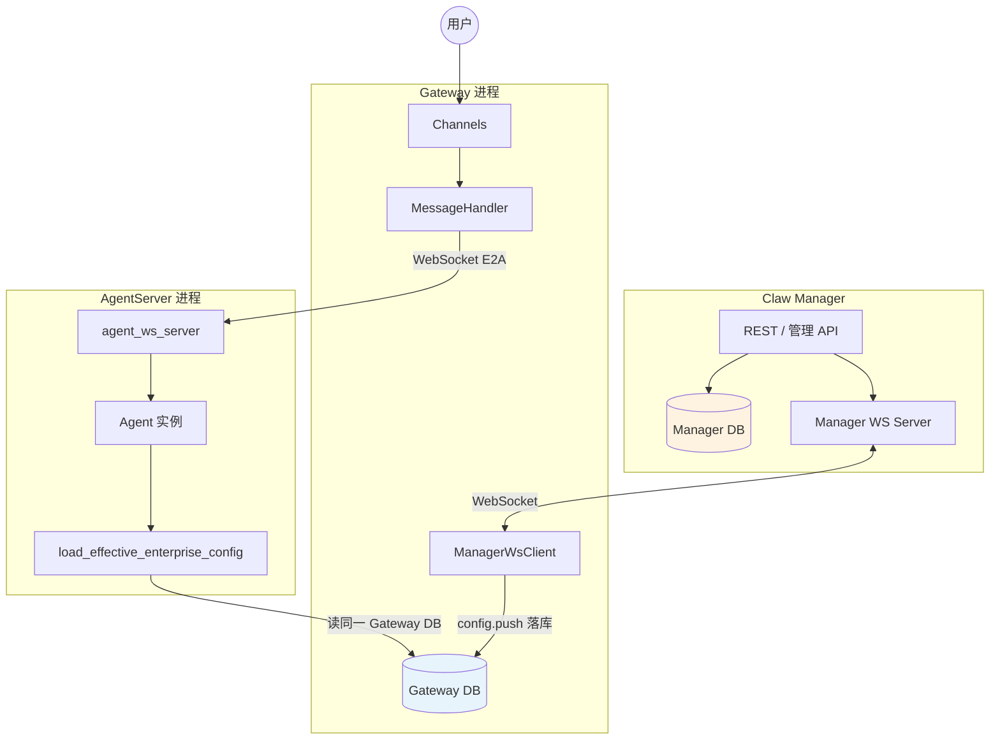

# 架构图



# 配置生效策略数据模型

## 策略表标识与 Manager 双写约定

四张策略/映射表（`config_effective_*`、`config_default_template_mapping`）在 **Manager DB** 与 **Gateway DB** 各存一份。Manager 经 WebSocket `config.push` 同步变更，Gateway 落库后 `config.ack` 返回自增行号。

| 字段 | 含义 | 说明 |
|------|------|------|
| `id` | 整数行号 | Gateway 侧自增主键；Manager 侧与 `jiuwenclaw_id` 组成复合主键，**取值来自 Gateway ack 的 `id`**，保证两侧一致。REST 路径参数 `/{id}` 指本字段。 |
| `policy_id` | 策略业务 UUID | UUID v4，**创建时由 Manager 生成**，经 WS 下发给 Gateway 写入；全局唯一。Agent 表的 `service_policy_id` **引用服务策略的 `policy_id`（字符串）**，而非整数 `id`。 |
| `policy_name` | 策略名称 | **必填**，便于控制台展示与检索。 |
| `policy_desc` | 策略描述 | 可选。 |
| `priority` | 优先级 | 同一 `jiuwenclaw_id` 下**允许多条相同 priority**；选路时先按 priority **从大到小**，再按 **`updated_at` 从新到旧**（越新越优先）。 |

**WebSocket 同步 payload 约定**（`config_effective_*` / `config_default_template_mappings`）：

| 操作 | Manager → Gateway | Gateway → Manager（ack.result） |
|------|-------------------|----------------------------------|
| create | `policy` / `mapping` 对象（含 `policy_id` UUID，**不含**整数 `id`） | `{"id": <new_row_id>}` |
| update / delete | `{"id": <row_id>, "updates": {...}}` 或 `{"id": <row_id>}` | 无额外 id 字段 |

## 模板表

各模板实体表均包含 **`template_id`（UUID）** 作为**对外稳定标识**：创建时由服务端生成（建议 UUID v4），全局唯一，其他表对模板的业务引用均使用 `template_id`**。

### 模型模板表(model_template)


| 字段名 | 类型 | 必填 | 说明 |
|--------|------|------|------|
| `id` | BIGINT 自增 PK | 是 | 数据库主键；插入时可省略。 |
| `template_id` | VARCHAR(100) UNIQUE | 是 | 使用UUIDv4算法生成的唯一标识符（如 `550e8400-e29b-41d4-a716-446655440000`）。 |
| `template_name` | VARCHAR(128) | 是 | 用户自定义模板名称。 |
| `description` | VARCHAR(512) | 否 | 模型描述。 |
| `model_type` | JSON | 否 | 模型类型，四种类型default/video/audio/vision。 |
| `model_tags` | JSON | 否 | 模型标签，支持用户自定义配置，如 `["chat","vision"]`。 |
| `api_base` | VARCHAR(512) | 是 | 模型基地址 |
| `api_key` | TEXT | 是 | API 密钥 |
| `model_id` | VARCHAR(128) | 是 | 上游模型唯一标识（调用提供商 API 时使用，如 `gpt-4o`）。 |
| `model_provider` | VARCHAR(64) | 是 | 提供商标识，如 `openai`、`anthropic`、`deepseek`、`qwen` 等。 |
| `parameters` | JSON | 否 | 模型推理参数，如 `temperature`、`max_tokens` 等。 |
| `timeout` | INT DEFAULT 60 | 否 | 单次请求超时（秒）；未配置时使用默认秒数。 |
| `retry_count` | INT DEFAULT 3 | 否 | 失败后的重试次数；未配置时使用默认次数。 |
| `enable_streaming` | BOOLEAN DEFAULT true | 否 | 是否启用流式输出；默认 `true`。 |
| `enable_function_calling` | BOOLEAN DEFAULT true | 否 | 是否启用函数调用 / tool；默认 `true`。 |
| `verify_ssl` | BOOLEAN DEFAULT true | 否 | 是否校验 HTTPS 证书链；内网自签证书场景可置 `false`。 |
| `enabled` | BOOLEAN DEFAULT true | 是 | 模型是否启用；默认`true` |
| `data` | JSON | 否 | 扩展字段 |
| `created_at` | DATETIME(3) | 是 | 创建时间 |
| `updated_at` | DATETIME(3) | 是 | 更新时间 |

### Embedding 模板表（embedding_template）

**用途**：管理可复用的Embedding模型配置，经策略 `template_ref.embedding_model` 下发到 AgentServer，并映射为 `embed` 配置段，供以下运行时场景统一复用：
  - 记忆服务通过 `get_embed_config()` 获取 API Key、Base URL 和模型名，执行记忆向量化与语义检索；
  - 外部记忆将其转换为 OpenJiuwen `EmbeddingConfig`，注入 `MemoryScopeConfig`；
  - Deep Agent 使用该配置创建 `MemoryRail`，支撑主动记忆等能力；
  - 任务记忆工具基于 Context Evolver 提供的 TaskMemoryService初始化时优先使用 task_memory 的专用 Embedding 配置，未配置时复用全局 embed 配置；经验提取与总结所需的 LLM 仍需单独配置。

**配置来源**：`embedding_template` 是统一的企业级 Embedding 配置来源，已实现 Manager CRUD、策略引用与删除保护、WebSocket 定向同步 Gateway，以及 AgentServer 按请求解析。未命中企业策略时，AgentServer 回退读取本地 `config.yaml` 的 `embed` 段 / `EMBED_*` 环境变量。

**当前 AgentServer 运行时代码实际消费的字段**（`jiuwenclaw/agentserver/memory/embeddings.py`、`memory/config.py#get_embed_config`）仅 **3 项**，下发到 AgentServer 后映射为 `config.yaml` 的 `embed` 段：

| 模板列 | YAML / DB 字段 | 环境变量别名 |
|--------|----------------|--------------|
| `api_key` | `embed.embed_api_key` | `EMBED_API_KEY` / `EMBED_KEY` |
| `api_base` | `embed.embed_base_url` | `EMBED_API_BASE` / `EMBED_BASE_URL` |
| `model_id` | `embed.embed_model` | `EMBED_MODEL` / `EMBEDDING_MODEL` |

调用方式为 OpenAI 兼容 `POST {api_base}/embeddings`，请求体固定携带 `encoding_format: "float"`（**当前代码写死，未读配置**）；`dims` 由首次响应自动探测（默认占位 1024）。未配置 `api_key` 时回退 `MockEmbeddingProvider`。

`model_provider`、`parameters`、`client_config` 等列便于控制台与加密下发；其中 `parameters` 对齐 [OpenAI Embeddings API](https://platform.openai.com/docs/api-reference/embeddings/create) 的**可选请求参数**（写入 `/embeddings` 请求体），`client_config` 为 **HTTP 客户端**配置。AgentServer 运行时代码对 `model_provider`、`parameters`、`client_config` 的读取**待接入**（当前仅 `api_base` / `api_key` / `model_id` 三列已用）。

| 字段名 | 类型 | 必填 | AgentServer 运行时状态 | 说明 |
|--------|------|------|---------|------|
| `id` | BIGINT 自增 PK | 是 | — | 数据库主键；插入时可省略。 |
| `template_id` | VARCHAR(100) UNIQUE | 是 | — | UUID v4 对外稳定标识；`template_ref.embedding_model` 引用本字段。 |
| `template_name` | VARCHAR(128) | 是 | — | 用户自定义模板名称（如「记忆向量-智谱 embedding-3」）。 |
| `description` | VARCHAR(512) | 否 | — | 模板用途说明。 |
| `embed_tags` | JSON | 否 | — | 标签，便于控制台筛选，如 `["memory","task_memory"]`。 |
| `api_base` | VARCHAR(512) | 是 | **已用** | Embedding API 基地址；运行时请求 `{api_base}/embeddings`（若末尾含 `/embeddings` 会自动剥除）。 |
| `api_key` | TEXT | 是 | **已用** | API 密钥；存储与下发时需加密（对齐 `model_template.api_key`）。 |
| `model_id` | VARCHAR(128) | 是 | **已用** | 上游 Embedding 模型标识（如 `text-embedding-3-large`、`embedding-3`）；映射 `embed_model`。 |
| `model_provider` | VARCHAR(64) | 是 | 预留 | 提供商标识，如 `openai`、`dashscope`、`qwen`；便于控制台展示与审计，当前 Embedding Provider 不读取。 |
| `parameters` | JSON | 否 | 待接入 | 对齐 **OpenAI Embeddings API 可选请求参数**（`model`/`input` 由 AgentServer 运行时代码从 `model_id` 与调用上下文填充，不入本列）；见下表。当前代码仅硬编码 `encoding_format: "float"`。 |
| `client_config` | JSON | 否 | 待接入 | **HTTP 客户端**参数（超时、重试、TLS 等），见下表；默认 `{"timeout":60,"retry_count":3,"verify_ssl":true}`。 |
| `enabled` | BOOLEAN DEFAULT true | 是 | — | 模板是否启用；`false` 时经 `template_ref` 引用后不生效。 |
| `data` | JSON | 否 | — | 扩展字段（灰度、成本备注等）。 |
| `created_at` | DATETIME(3) | 是 | — | 创建时间。 |
| `updated_at` | DATETIME(3) | 是 | — | 更新时间。 |

**`parameters` 字段说明**（对齐 OpenAI Embeddings API 可选请求参数；AgentServer 运行时代码合并本 JSON 后 `POST {api_base}/embeddings`，**不含** `model`/`input`——分别取自列 `model_id` 与调用方文本）：

| 字段名 | 类型 | 必填 | 说明 |
|--------|------|------|------|
| `encoding_format` | string | 否 | OpenAI 可选参数；返回格式 `float` \| `base64`，默认 `float`（与当前硬编码一致）。 |
| `dimensions` | int | 否 | OpenAI 可选参数；输出向量维度，仅 `text-embedding-3` 及更新模型支持。 |
| `user` | string | 否 | OpenAI 可选参数；终端用户标识，用于滥用监控。 |
| `data` | object | 否 | 非 OpenAI 标准、但 OpenAI 兼容网关或厂商扩展的请求字段（如 DashScope 专有参数）。 |

**`client_config` 字段说明**（预留，待 AgentServer 运行时代码接入后用于构造 `httpx` / SDK 客户端；**不写入** `/embeddings` 请求体）：

| 字段名 | 类型 | 必填 | 默认 | 说明 |
|--------|------|------|------|------|
| `timeout` | int | 否 | `60` | 单次 HTTP 请求超时（秒）；当前 `httpx.AsyncClient(timeout=60.0)` 写死。 |
| `retry_count` | int | 否 | `3` | 失败后重试次数（对齐 OpenAI SDK `max_retries` 语义）。 |
| `verify_ssl` | boolean | 否 | `true` | 是否校验 HTTPS 证书链；内网自签证书场景可置 `false`。 |
| `data` | object | 否 | — | 客户端扩展（如 `connect_timeout`、`read_timeout`、`proxy` 等待 AgentServer 运行时代码定义）。 |


**策略引用**：在 `template_ref` 中新增槽位 `embedding_model` → `embedding_template`（见下文「模板引用字段」表）。

**解析优先级**（已实现）：

1. 策略命中 → `template_ref.embedding_model` → 查 `embedding_template`
2. 本地兜底 → `config.yaml` `embed` 段 / 环境变量 `EMBED_*`

示例：

```json
{
  "template_id": "e3333333-3333-4333-8333-333333333303",
  "template_name": "记忆向量-智谱 embedding-3",
  "description": "MEMORY.md 语义检索",
  "embed_tags": ["memory"],
  "api_base": "https://open.bigmodel.cn/api/paas/v4",
  "api_key": "sk-***",
  "model_id": "embedding-3",
  "model_provider": "zhipu",
  "parameters": { "encoding_format": "float", "dimensions": 1024 },
  "client_config": { "timeout": 60, "retry_count": 3, "verify_ssl": true },
  "enabled": true
}
```

### **扩展配置模板表（extension_config_template）**


**配置扩展功能：**
1. 管理员定义自定义配置项
2. 配置钩子函数：
   - 定义钩子触发点：请求前、请求后、错误处理等
   - 配置钩子函数路径和参数
3. 下发配置到Gateway和Agent Server
4. 组件加载钩子函数并执行

**钩子函数机制：**
- **请求前钩子**：在请求处理前执行，可用于参数验证、权限检查等
- **请求后钩子**：在请求处理后执行，可用于日志记录、结果转换等
- **错误处理钩子**：在请求失败时执行，可用于错误恢复、告警通知等
- **定时钩子**：按时间间隔执行，可用于数据清理、状态同步等

| 字段名 | 类型 | 必填 | 说明 |
|--------|------|------|------|
| `id` | BIGINT 自增 PK | 是 | 数据库主键；插入时可省略。 |
| `template_id` | VARCHAR(100) UNIQUE | 是 | 使用 UUID v4 生成的唯一标识符（如 `550e8400-e29b-41d4-a716-446655440000`）；策略表 `template_ref` 等对外引用均使用本字段。 |
| `template_name` | VARCHAR(128) | 是 | 用户自定义模板名称（如「Gateway 请求前鉴权钩子」）。 |
| `description` | VARCHAR(512) | 否 | 扩展配置用途说明。 |
| `component` | VARCHAR(32) | 是 | 下发目标组件：`gateway` / `agent_server`。 |
| `hook_type` | VARCHAR(32) | 是 | 钩子触发类型：`pre_request` / `post_request` / `error` / `schedule`。 |
| `hook_config` | JSON | 是 | 钩子函数路径与参数等配置；结构见下表。 |
| `custom_config` | JSON | 否 | 用户的自定义配置项键值；默认 `{}`。 |
| `enabled` | BOOLEAN DEFAULT true | 是 | 模板是否启用；为 `false` 时经 `template_ref` 引用后等价于不生效。 |
| `data` | JSON | 否 | 扩展字段（如标签、灰度、与组件版本绑定信息等）。 |
| `created_at` | DATETIME(3) | 是 | 创建时间。 |
| `updated_at` | DATETIME(3) | 是 | 更新时间。 |

**`hook_config` 字段说明**：

| 字段名 | 类型 | 必填 | 说明 |
|--------|------|------|------|
| `handler` | string | 是 | 钩子实现路径或模块标识，如 `hooks.auth.pre_request`。 |
| `params` | object | 否 | 传入钩子函数的静态参数。 |
| `schedule` | string | 否 | 仅 `hook_type = schedule` 时必填；cron表达式格式，如 `0 */5 * * *`。 |
| `data` | object | 否 | 单条钩子扩展配置。 |

示例：

```json
{
  "handler": "hooks.logging.post_request",
  "params": { "log_level": "info", "include_body": false }
}
```


### skill白名单模板表(skill_whitelist_template)


| 字段名 | 类型 | 必填 | 说明 |
|--------|------|------|------|
| `id` | BIGINT 自增 PK | 是 | 数据库主键；插入时可省略。|
| `template_id` | VARCHAR(100) UNIQUE | 是 | 使用UUIDv4算法生成的唯一标识符（如 `550e8400-e29b-41d4-a716-446655440000`）。 |
| `template_name` | VARCHAR(128) | 是 | 用户自定义模板名称（如「销售组 Skill 白名单」）。 |
| `description` | VARCHAR(512) | 否 | 白名单用途说明。 |
| `skill_id` | VARCHAR(512) | 是 | Skill 唯一路径标识，如 `search/weather`；与 `skill_source` 下制品目录约定一致。 |
| `skill_version` | VARCHAR(64) | 是 | 语义化版本或发布版本，如 `1.2.0`；用于与 SkillHub 解析具体制品。 |
| `skill_source` | VARCHAR(512) | 是 | Skill 制品源根地址（通常为 SkillHub / 私有仓库 URL 前缀），如 `https://skillhub.example.com/`。 |
| `enabled` | BOOLEAN DEFAULT true | 是 | 整条白名单是否启用；为 `false` 时映射到本模板的行为等价于「无白名单」。 |
| `data` | JSON | 否 | 扩展字段（如标签、灰度、备注、与 Agent 版本绑定信息等）。 |
| `created_at` | DATETIME(3) | 是 | 创建时间。 |
| `updated_at` | DATETIME(3) | 是 | 更新时间。 |

示例：

```json
{
  "template_id": "a1000001-0000-4000-8000-000000000001",
  "template_name": "销售组 Skill 白名单",
  "skill_id": "search/weather",
  "skill_version": "1.2.0",
  "skill_source": "https://skillhub.example.com/",
  "enabled": true
}
```


### 服务配置模板表(service_config_template)

定义 **AgentServer 运行时编排**（K8s 部署、就绪探测、NFS 挂载、资源配额、服务池伸缩）的可复用模板。Gateway 的 Runtime Management 扩展（`runtime_management_client.py`）在启动时通过 `load_all_service_configs()` 加载 `enabled=true` 的模板行，作为 `service_template` 传入 `IServiceInstanceFactory.new_service()`；未在模板中覆盖的项回退到 Gateway 进程环境变量（见 `deploy/conf/gateway.template.env`）。

**运行时生效说明（简写）**

| 标记 | 含义 |
|------|------|
| **模板** | `new_service(cfg)` 读取模板字段，缺省回退 Gateway 环境变量 |
| **环境变量** | 仅 Gateway 环境变量生效；模板字段目前仅存库 |
| **未使用** | 仅存取，Runtime 未读取 |

| 字段名 | 类型 | 必填 | 默认值 | 环境变量 | 运行时 | 说明 |
|--------|------|------|--------|----------|--------|------|
| `id` | BIGINT 自增 PK | 是 | — | — | — | 数据库主键；插入时可省略。 |
| `template_id` | VARCHAR(100) UNIQUE | 是 | — | — | 模板（路由标识） | 使用 UUID v4 生成的唯一标识符；策略表 `template_ref` 等对外引用均使用本字段。 |
| `template_name` | VARCHAR(128) | 是 | — | — | — | 用户自定义模板名称（如「生产环境 AgentServer 池」）。 |
| `description` | VARCHAR(512) | 否 | — | — | — | 模板用途说明。 |
| `agent_image` | VARCHAR(512) | 是 | — | `AGENT_SERVER_IMAGE` | 模板 | AgentServer 容器镜像，如 `jiuwenclaw/agent-server:latest`。 |
| `namespace` | VARCHAR(128) | 是 | — | `AGENT_SERVER_NAMESPACE` | 模板 | K8s 命名空间；创建 AgentServer Pod 时使用的目标命名空间。 |
| `pod_name` | VARCHAR(128) | 否 | 同 `container_name` | — | 模板 | Pod 名称前缀或固定名；未配置时同 `container_name`。 |
| `container_name` | VARCHAR(128) | 是 | `agentserver` | `AGENT_SERVER_CONTAINER_NAME` | 模板 | 容器名。 |
| `container_port` | INT | 是 | `8080` | `AGENT_SERVER_PORT` | 模板 | 容器监听端口。 |
| `port_name` | VARCHAR(64) | 否 | `http` | `AGENT_SERVER_PORT_NAME` | 模板 | Service / Probe 端口名。 |
| `image_pull_policy` | VARCHAR(32) | 否 | `IfNotPresent` | `AGENT_SERVER_IMAGE_PULL_POLICY` | 模板 | 镜像拉取策略：`Always` / `IfNotPresent` / `Never`。 |
| `replicas` | INT | 否 | `1` | — | 未使用 | 静态 Deployment 副本数（预留字段；当前 Runtime 未读取，实例数由动态服务池 `min_idle_services` / `max_services` 控制）。 |
| `kubeconfig` | VARCHAR(512) | 否 | 空 | `AGENT_SERVER_KUBECONFIG` | 模板 | K8s 凭据文件路径；空表示 in-cluster。 |
| `agent_runtime` | VARCHAR(128) | 否 | 空 | `JIUWENSWARM_EDITION` | 未使用 | 预留字段；原 `AGENT_RUNTIME` 环境变量已废弃，企业版判定改由 `JIUWENSWARM_EDITION=enterprise`（个人版 `personal`）承担，由 Gateway 进程环境变量读取，本列当前未注入。 |
| `readiness_initial_delay` | INT | 否 | `10` | `AGENT_SERVER_READINESS_INITIAL_DELAY` | 模板 | **K8s 探针**：容器启动后多久做第一次 TCP 就绪探测（仅 k8s 模式；对应 Pod `readinessProbe.initialDelaySeconds`）。 |
| `readiness_period` | INT | 否 | `5` | `AGENT_SERVER_READINESS_PERIOD` | 模板 | **K8s 探针**：就绪探测每隔多久执行一次（仅 k8s 模式；对应 `periodSeconds`）。 |
| `ready_timeout` | INT | 否 | `300` | `AGENT_SERVER_READY_TIMEOUT` | 模板 | **Gateway 等待**：创建实例后最多等多久；超时则拉起失败（k8s 等 Pod Ready；process 等 WS 可连）。 |
| `ready_poll_interval` | INT | 否 | `5` | `AGENT_SERVER_READY_POLL_INTERVAL` | 模板 | **Gateway 等待**：等待就绪时每次检查的间隔（k8s 轮询 Pod 状态；process 轮询 WS 连接）。 |
| `nfs_server` | VARCHAR(256) | 否 | 空 | `AGENT_SERVER_NFS_SERVER` | 模板 | NFS 服务器地址。 |
| `nfs_path` | VARCHAR(512) | 否 | `/` | `AGENT_SERVER_NFS_PATH` | 模板 | NFS 导出路径。 |
| `nfs_mount_path` | VARCHAR(512) | 否 | 空 | `AGENT_SERVER_NFS_MOUNT_PATH` | 模板 | 容器内挂载路径。 |
| `agent_cpu_request` | VARCHAR(32) | 否 | 空 | `AGENT_SERVER_CPU_REQUEST` | 模板 | 容器 CPU 请求量（K8s quantity，如 `500m`）。 |
| `agent_memory_request` | VARCHAR(32) | 否 | 空 | `AGENT_SERVER_MEMORY_REQUEST` | 模板 | 容器内存请求量（如 `512Mi`）。 |
| `agent_cpu_limit` | VARCHAR(32) | 否 | 空 | `AGENT_SERVER_CPU_LIMIT` | 模板 | 容器 CPU 上限。 |
| `agent_memory_limit` | VARCHAR(32) | 否 | 空 | `AGENT_SERVER_MEMORY_LIMIT` | 模板 | 容器内存上限。 |
| `jiuwenbox_cpu_request` | VARCHAR(32) | 否 | 空 | `JIUWENBOX_CPU_REQUEST` | 环境变量 | JiuwenBox sidecar CPU 请求量；模板字段仅存库，实际由 Gateway 环境变量控制。 |
| `jiuwenbox_memory_request` | VARCHAR(32) | 否 | 空 | `JIUWENBOX_MEMORY_REQUEST` | 环境变量 | JiuwenBox sidecar 内存请求量。 |
| `jiuwenbox_cpu_limit` | VARCHAR(32) | 否 | 空 | `JIUWENBOX_CPU_LIMIT` | 环境变量 | JiuwenBox sidecar CPU 上限。 |
| `jiuwenbox_memory_limit` | VARCHAR(32) | 否 | 空 | `JIUWENBOX_MEMORY_LIMIT` | 环境变量 | JiuwenBox sidecar 内存上限。 |
| `min_idle_services` | INT | 否 | `1` | `AGENT_SERVER_MIN_IDLE_SERVICES` | 环境变量 | 最小空闲实例数；模板字段仅存库，ServiceManager 读 Gateway 环境变量。 |
| `max_services` | INT | 否 | `20` | `AGENT_SERVER_MAX_SERVICES` | 环境变量 | 池内实例上限。 |
| `service_concurrency` | INT | 否 | `30` | `AGENT_SERVER_SERVICE_CONCURRENCY` | 模板（单实例）+ 环境变量（ServiceManager 全局） | 单实例并发上限；`new_service(cfg)` 读模板，ServiceManager 全局参数读环境变量。 |
| `service_ttl` | INT | 否 | `180` | `AGENT_SERVER_SERVICE_TTL` | 环境变量 | 空闲实例回收 TTL（秒）。 |
| `autoscale_interval` | DECIMAL(10,3) | 否 | `5` | `AGENT_SERVER_AUTOSCALE_INTERVAL` | 环境变量 | 伸缩轮询间隔（秒）。 |
| `message_timeout` | INT | 否 | `60` | `AGENT_SERVER_MESSAGE_TIMEOUT` | 环境变量 | 单次消息超时（秒）；Access 层读 Gateway 环境变量。 |
| `session_concurrency` | INT | 否 | `3` | `AGENT_SERVER_SESSION_CONCURRENCY` | 环境变量 | 单 Session 并发上限。 |
| `session_ttl` | INT | 否 | `60` | `AGENT_SERVER_SESSION_TTL` | 环境变量 | Session 空闲 TTL（秒）。 |
| `enabled` | BOOLEAN | 是 | `true` | — | 模板（仅 `enabled=true` 参与加载） | 模板是否启用；为 `false` 时不参与 `load_all_service_configs()`。 |
| `data` | JSON | 否 | — | — | 未使用 | 扩展字段（如标签、灰度、备注等）；仅存取，Runtime 未读取。 |
| `created_at` | DATETIME(3) | 是 | — | — | — | 创建时间。 |
| `updated_at` | DATETIME(3) | 是 | — | — | — | 更新时间。 |

> 默认值以 `runtime_management_client.py` 中环境变量回退为准；部署文件 `gateway.template.env` 可在安装时覆盖（如 `AGENT_SERVER_PORT`、`AGENT_SERVER_MESSAGE_TIMEOUT`）。

示例：

```json
{
  "template_id": "b2000002-0000-4000-8000-000000000002",
  "template_name": "生产环境 AgentServer 池",
  "agent_image": "jiuwenclaw/agent-server:latest",
  "namespace": "jiuwenclaw",
  "pod_name": "agentserver",
  "container_name": "agentserver",
  "container_port": 8080,
  "port_name": "http",
  "image_pull_policy": "IfNotPresent",
  "readiness_initial_delay": 10,
  "readiness_period": 5,
  "ready_timeout": 300,
  "ready_poll_interval": 5,
  "nfs_server": "192.168.1.100",
  "nfs_path": "/data/nfs",
  "nfs_mount_path": "/mnt/nfs",
  "agent_cpu_request": "500m",
  "agent_memory_request": "512Mi",
  "agent_cpu_limit": "2",
  "agent_memory_limit": "2Gi",
  "min_idle_services": 1,
  "max_services": 20,
  "service_concurrency": 30,
  "service_ttl": 180,
  "autoscale_interval": 5,
  "message_timeout": 60,
  "session_concurrency": 3,
  "session_ttl": 60,
  "enabled": true
}
```

## 配置生效策略

### 模板引用字段 `template_ref`（策略表共用）

配置生效策略表均使用 **单一 JSON 列 `template_ref`** 存放各**槽位**对配置模板的引用。

**对象结构**：键为槽位名，值为 **`template_id` 字符串数组**；数组元素为**目标模板的 `template_id`**，或 **`${user::…}` / `${group::…} or <template_id>`** 映射表达式。同一槽位可配置多个模板（按数组顺序解析并加载）。**未出现的键**表示该槽位不在本层配置，合并时**继承**上一级。槽位值必须是数组（单元素亦写为 `["uuid"]`）。

| 槽位（`template_ref` 键） | 实体表 | 说明 |
|------------|--------|------|
| `default_model` | `model_template` | 默认模型 |
| `video_model` | `model_template` | 视频模型 |
| `audio_model` | `model_template` | 音频模型 |
| `vision_model` | `model_template` | 视觉模型 |
| `embedding_model` | `embedding_template` | 记忆向量 / 外部记忆 Embedding 服务 |
| `skill_whitelist` | `skill_whitelist_template` | Skill 白名单 |
| `extension_config` | `extension_config_template` | 扩展配置（AgentServer 扩展段等） |
| `service_config` | `service_config_template` | AgentServer 运行时编排（K8s 池、伸缩、NFS 等；Gateway Runtime Management 加载） |


**示例**：

```json
{
  "default_model": ["f2222222-2222-4222-8222-222222222202"],
  "vision_model": ["f2222222-2222-4222-8222-222222222202"],
  "skill_whitelist": ["a1000001-0000-4000-8000-000000000001", "abc"],
  "service_config": ["b2000002-0000-4000-8000-000000000002"]
}
```


### 配置生效service层级策略(config_effective_service_policy)


| 字段名 | 类型 | 必填 | 说明 |
|--------|------|------|------|
| `id` | INT | 是 | **Gateway**：自增主键。**Manager**：与 `jiuwenclaw_id` 复合主键，值来自 Gateway ack。 |
| `jiuwenclaw_id` | VARCHAR(64) FK | 是 | 外键指向组网实例（如 `instance_info.jiuwenclaw_id`）。 |
| `policy_id` | VARCHAR(100) UNIQUE | 是 | 策略业务 UUID（UUID v4），创建时由 Manager 生成，全局唯一。 |
| `policy_name` | VARCHAR(128) | 是 | 策略名称，便于控制台展示与检索。 |
| `policy_desc` | VARCHAR(512) | 否 | 策略描述。 |
| `service_id` | VARCHAR(512) | 是 | agentserver服务标识id，用于分发用户请求到agentserver。可以是`${group_id}::${bot_id}`这种模式，也可是固定值。 |
| `priority` | INT | 是 | 路由优先级；同一 `jiuwenclaw_id` 下多条规则时的排序依据（**priority 降序，同 priority 时 `updated_at` 降序**；均可重复）。 |
| `match_expr` | TEXT | 否 | 命中表达式；空表示全匹配；多条件 OR 可用 JSON 数组存于本字段或 `data`。 |
| `template_ref` | JSON | 否 | 本服务规则下的**模板引用集合**（见 **`template_ref` 共用说明**）。默认 `{}`。 |
| `enabled` | BOOLEAN DEFAULT true | 是 | 是否启用本规则；默认 `true`。 |
| `data` | JSON | 否 | 扩展字段；`memory`、`telemetry` 等大块可放此处或拆独立表。 |
| `created_at` | DATETIME(3) | 是 | 创建时间。 |
| `updated_at` | DATETIME(3) | 是 | 更新时间。 |


> **匹配仅依赖 `match_expr`**；候选规则按 **priority 降序、`updated_at` 降序** 排序后逐条尝试（数值大优先，同 priority 时更新时间越新越优先）。

### 配置生效agent层级策略(config_effective_agent_policy)


| 字段名 | 类型 | 必填 | 说明 |
|--------|------|------|------|
| `id` | INT | 是 | **Gateway**：自增主键。**Manager**：与 `jiuwenclaw_id` 复合主键，值来自 Gateway ack。 |
| `jiuwenclaw_id` | VARCHAR(64) FK | 是 | 外键指向组网实例（如 `instance_info.jiuwenclaw_id`）。 |
| `policy_id` | VARCHAR(100) UNIQUE | 是 | 策略业务 UUID（UUID v4），创建时由 Manager 生成，全局唯一。 |
| `policy_name` | VARCHAR(128) | 是 | 策略名称，便于控制台展示与检索。 |
| `policy_desc` | VARCHAR(512) | 否 | 策略描述。 |
| `agent_id` | VARCHAR(512) | 是 | agent实例标识id，用于分发用户请求到agent实例。可以是`${user_id}`这种模式，也可是固定值。|
| `workspace_dir` | VARCHAR(512) | 否 | Agent **数据存储目录逻辑键**（租户工作区）。可写 `${group_id}` / `${bot_id}` / `${user_id}` 占位符表达式，也可写固定字面量；**不参与** `match_expr` 选路。解析后对结果做 **MD5**，用于替代原路径段 `service_{md5(逻辑 service_id)}/agent_{md5(逻辑 agent_id)}`。未配置（`NULL` / 空串）时默认模板为 ``${group_id}${bot_id}${user_id}``。详见下文 **「workspace_dir 与数据存储目录」**。 |
| `service_policy_id` | VARCHAR(100) FK | 是 | 外键指向 `config_effective_service_policy.policy_id`（**UUID 字符串**），表示本 Agent 策略归属哪条服务级策略。 |
| `priority` | INT DEFAULT 0 | 否 | 同一条服务级策略下，多条 Agent 规则的**匹配优先级**；**priority 降序，同 priority 时 `updated_at` 降序**（均可重复）。未配置时视为 `0`。 |
| `match_expr` | TEXT | 否 | 命中表达式；空表示全匹配。 |
| `template_ref` | JSON | 否 | 本 Agent 规则下的**模板引用集合**（见上文 **`template_ref` 共用说明**）。默认 `{}`。 |
| `send_file_allowed` | BOOLEAN DEFAULT false | 否 | 是否允许 Agent 向用户发送文件；默认 `false`。 |
| `enabled` | BOOLEAN DEFAULT true | 是 | 是否启用本规则；默认 `true`。 |
| `data` | JSON | 否 | 扩展字段。 |
| `created_at` | DATETIME(3) | 是 | 创建时间。 |
| `updated_at` | DATETIME(3) | 是 | 更新时间。 |


> **匹配仅依赖 `match_expr`**；候选规则按 **priority 降序、`updated_at` 降序** 排序后逐条尝试（数值大优先，同 priority 时更新时间越新越优先）。
>
> **`agent_id` 与 `workspace_dir` 职责分离**：前者仍用于 Runtime / AgentServer **路由与实例隔离键**；后者**仅**决定落盘工作区路径，二者可独立配置（例如多用户共用同一 `agent_id` 路由池，但 `workspace_dir=${user_id}` 按用户分目录）。


### 配置生效全局兜底策略(config_effective_global_policy)

当 **`config_effective_service_policy`** 与 **`config_effective_agent_policy`** 经 `match_expr` 等规则匹配后**仍无任何命中**（或命中项均被禁用）时，网关 / 路由层回退到本表的配置，作为该组网（`jiuwenclaw_id`）的**最终默认策略**。

| 字段名 | 类型 | 必填 | 说明 |
|--------|------|------|------|
| `id` | INT | 是 | **Gateway**：自增主键。**Manager**：与 `jiuwenclaw_id` 复合主键，值来自 Gateway ack。 |
| `jiuwenclaw_id` | VARCHAR(64) FK | 是 | 外键指向组网实例（如 `instance_info.jiuwenclaw_id`）；同一实例可有多条全局兜底，运行时取 **enabled** 且 **priority 最高、同 priority 时 `updated_at` 最新** 的一条。 |
| `policy_id` | VARCHAR(100) UNIQUE | 是 | 策略业务 UUID（UUID v4），创建时由 Manager 生成，全局唯一。 |
| `policy_name` | VARCHAR(128) | 是 | 策略名称，便于控制台展示与检索。 |
| `policy_desc` | VARCHAR(512) | 否 | 策略描述。 |
| `priority` | INT | 是 | 兜底优先级；同一 `jiuwenclaw_id` 下多条 enabled 规则时，**数值大者优先**；同 priority 时 **`updated_at` 越新越优先**（均可重复）。 |
| `template_ref` | JSON | 否 | 组网级**最终兜底**模板引用集合（见 **`template_ref` 共用说明**）。默认 `{}`。 |
| `enabled` | BOOLEAN DEFAULT true | 是 | 是否启用该兜底配置；为 `false` 时等价于无兜底，由业务决定报错或系统默认。 |
| `data` | JSON | 否 | 扩展字段。 |
| `created_at` | DATETIME(3) | 是 | 创建时间。 |
| `updated_at` | DATETIME(3) | 是 | 更新时间。 |


### 用户与群组默认模板映射表(config_default_template_mapping)

将 **`scope_type`**（`user` / `group` / `bot`）与 **`scope_id`**（作用域标识）映射到某一 **槽位** 下的配置模板（由 **`template_type`（与槽位键同名）** + **`template_id`** 唯一定位），用于解析 `template_ref` 中的 **`${user::…}` / `${group::…}` / `${bot::…}`** 表达式，或在未命中更细粒度策略时给出默认模板。

| 字段名 | 类型 | 必填 | 说明 |
|--------|------|------|------|
| `id` | INT | 是 | **Gateway**：自增主键。**Manager**：与 `jiuwenclaw_id` 复合主键，值来自 Gateway ack。 |
| `jiuwenclaw_id` | VARCHAR(64) FK | 是 | 外键指向组网实例（如 `instance_info.jiuwenclaw_id`）。 |
| `policy_id` | VARCHAR(100) UNIQUE | 是 | 策略业务 UUID（UUID v4），创建时由 Manager 生成，全局唯一。 |
| `policy_name` | VARCHAR(128) | 是 | 策略名称，便于控制台展示与检索。 |
| `policy_desc` | VARCHAR(512) | 否 | 策略描述。 |
| `scope_type` | VARCHAR(32) | 是 | 作用域类型：`user` / `group` / `bot`。 |
| `scope_id` | VARCHAR(512) | 是 | 作用域标识（如用户 ID、群组 ID、Bot ID）。 |
| `priority` | INT | 是 | 映射优先级；同一 `jiuwenclaw_id` 下多条候选时的排序依据（**priority 降序，同 priority 时 `updated_at` 降序**；均可重复）。 |
| `template_id` | CHAR(36) | 是 | 目标模板的 template_id`|
| `template_type` | VARCHAR(512) | 是 | **槽位键**，与 `template_ref` 中的键一致，取值见下表（如 **`default_model`**、**`skill_whitelist`**、**`extension_config`**、**`service_config`** 等） |
| `enabled` | BOOLEAN DEFAULT true | 是 | 是否启用本条映射；为 `false` 时参与匹配时视为不存在。 |
| `data` | JSON | 否 | 扩展字段（如备注、灰度标签等）。 |
| `created_at` | DATETIME(3) | 是 | 创建时间。 |
| `updated_at` | DATETIME(3) | 是 | 更新时间。 |

**`template_type` 与槽位、实体表（与 `template_ref` 键对齐）**：

| `template_type`（= 槽位键） | 实体表 |
|-----------------------------|--------|
| `default_model` | `model_template` |
| `video_model` | `model_template` |
| `audio_model` | `model_template` |
| `vision_model` | `model_template` |
| `embedding_model` | `embedding_template` |
| `skill_whitelist` | `skill_whitelist_template` |
| `extension_config` | `extension_config_template` |
| `service_config` | `service_config_template` |

解析 `${user::…}` / `${group::…}` / `${bot::…}` 时，AgentServer / Gateway 按**当前正在解析的槽位键**作为 `template_type` 查询本表（例如解析 `template_ref.vision_model` 中的表达式时，查 `template_type = vision_model`）。

> **唯一性建议**：同一 `(scope_type, scope_id, template_type)` 组合至多一条启用映射，避免 `${user::carol}` 解析歧义。

# 配置生效策略业务逻辑

## 主业务逻辑

一次聊天请求的大致流程（AgentServer 读 Gateway 库）：

```
入参 → 选服务策略 →（命中则）选 Agent 策略 → 应用全局兜底 → 合并各槽位 template_ref → 解析引用并查实体表
```

**1. 入参**

请求带上 `group_id`、`bot_id`、`user_id` 和实例 `jiuwenclaw_id`。 

**2. 选服务策略**（`config_effective_service_policy`）

在本实例、已启用的规则里，按 **priority 降序、`updated_at` 降序** 逐条试，**第一条匹配即停**。

匹配条件：**仅** `match_expr` 为真（**空表示全匹配**）。未命中任何服务规则时，**跳过第 3 步**，直接进入第 4 步全局兜底。

**3. 选 Agent 策略**（`config_effective_agent_policy`）

**前提**：第 2 步已命中某条服务规则；否则本步不执行。

在命中服务的 `service_policy_id` 下，按 **priority 降序、`updated_at` 降序** 找第一条匹配的 Agent 规则（**仅看 `match_expr`**；若本步未命中任何 Agent 规则，仍继续第 4 步，仅 Agent 层 `template_ref` 不参与合并）。

**4. 应用全局兜底**（`config_effective_global_policy`）

在本实例、**enabled = true** 的全局兜底规则中，按 **priority 降序、`updated_at` 降序** 取第一条；**无 `match_expr`**，不参与服务/Agent 选路比较，仅在下列两种情形下参与合并：

| 情形 | 全局兜底的作用 |
|------|----------------|
| **第 2 步未命中任何服务规则** | 采用 priority 最高的那条全局兜底的 `template_ref` 整表；不再查 Agent 表；`service_id` / `agent_id` 均为 `None`；`workspace_dir` 走默认模板 ``${group_id}${bot_id}${user_id}`` |
| **第 2 步已命中服务规则** | 采用 priority 最高的那条全局兜底，**仅补全**合并后仍缺失的槽位键，**不覆盖**服务级或 Agent 级已配置的槽位 |

**5. 合并 `template_ref`（按槽位键）**

合并顺序：**服务策略 → Agent 策略（覆盖同名槽）→ 全局兜底（仅补全仍未出现的槽位键）**。

| 情况 | 该槽位最终引用从哪来 |
|------|----------------------|
| 命中 Agent 规则且 `template_ref` 含该键 | Agent 策略中该槽位的数组（整组覆盖服务级） |
| 只命中服务规则且含该键 | 服务策略中该槽位的数组 |
| 命中服务/Agent 但该键均未配置 | 全局兜底 `config_effective_global_policy.template_ref` 中该键 |
| 未命中任何服务规则 | 全局兜底整表（见第 4 步第一种情形） |

各槽位的数组元素通常是 **`template_id`（UUID）**，也可能是 **`${group::g_demo_sales} or <template_id>`**：先查 **默认映射表**（`group::` / `user::` 右侧为字面键，且 **`template_type` = 当前槽位键**），查不到再用 **`or` 后面的 UUID**。按数组顺序逐项解析，合并得到该槽位最终的 **`template_id` 列表**后，按**槽位键**查对应实体表（见上文「槽位与实体表」对照）。

**6. 查模板并调用**

根据最终 **`template_id` 列表**查询 `model_template` / `skill_whitelist_template` / `extension_config_template` / `service_config_template`（`WHERE template_id = ?`），得到模型连接参数、Skill 元数据、扩展段配置或 AgentServer 运行时编排参数。策略与映射表只存 UUID 引用；改模板内容（如 PUT 更新 M3 的 `model_id` 字段）即可生效，不必改策略行中的 `template_ref`。


## match_expr 支持的表达式

`match_expr` 用于 **Service 策略**（§2）与 **Agent 策略**（§3）的命中判断；**全局兜底**无此字段。实现见 Gateway `manager_ws_client` 模块 `evaluate_match_expr()`。

### 求值上下文

从单次请求的 `group_id`、`bot_id`、`user_id` 构造路由上下文；表达式中**仅**可引用这三个字段名：

| 变量名 | 含义 |
|--------|------|
| `user_id` | 当前用户 ID |
| `group_id` | 当前群组 / 通道组 ID |
| `bot_id` | 当前 Bot ID |

> **`service_id` / `agent_id` / `workspace_dir` 不参与 `match_expr` 求值**。前两者为 Runtime 路由标识（可写 `${group_id}` / `${bot_id}` / `${user_id}` 模板，命中后解析写入 Runtime）；`workspace_dir` 为数据目录逻辑键（命中后解析并 MD5，见 **「workspace_dir 与数据存储目录」**），匹配与否与 `match_expr` 无关。

### 全匹配（恒为真）

以下写法表示「任意上下文均命中」：

| 写法 | 说明 |
|------|------|
| 省略 / `null` | 字段为空 |
| `""` | 空字符串 |
| `[]` | 空数组 |
| 不含 `==` / `!=` 的任意字符串 | 如 `"always"`（不推荐，建议用空字符串） |

演示配置 **§2.7.2** 使用 `"match_expr": ""`，表示在该服务策略下对所有用户生效（仍受 **priority** 与是否被更高优先级规则抢先命中约束）。

### 比较表达式

字符串中含 `==` 或 `!=` 时，按 **Python 表达式安全子集** 解析（`ast` 求值）：

| 运算符 | 示例 |
|--------|------|
| `==` | `group_id == 'g_demo_sales'` |
| `!=` | `user_id != 'guest'` |
| `and` | `user_id == 'alice' and group_id == 'g_demo_sales'` |
| `or` | `group_id == 'g_demo_sales' or group_id == 'g_vip'` |

右侧一般为字符串字面量（单引号或双引号均可）。演示示例：

```json
"match_expr": "group_id == 'g_demo_sales'"
```

```json
"match_expr": "user_id == 'alice'"
```

### 多条件 OR（列表 / JSON 数组）

`match_expr` 可为 **数组**，或 **JSON 数组字符串**，表示「任一子表达式为真即命中」：

```json
"match_expr": ["group_id == 'g_demo_sales'", "group_id == 'g_vip'"]
```

等价字符串形式：

```json
"match_expr": "[\"group_id == 'g_demo_sales'\", \"group_id == 'g_vip'\"]"
```

### 不支持的能力

以下语法**不属于** `match_expr`，写在此处不会按预期生效：

| 不支持 | 说明 |
|--------|------|
| `${user::carol}`、`${group::…}` | 属于 **`template_ref` 槽位** 的映射表达式，见 §4 与默认映射表 |
| `>`、`<`、`>=`、`<=` | 无大小比较 |
| 函数调用、算术、属性访问 | 仅允许字面量与上述三字段名 |
| `service_id` / `agent_id` 字段 | 不参与匹配过滤 |

语法错误或求值失败（如 `invalid ===`、未知变量名）→ 该条规则视为 **不命中**（返回假），避免误匹配。

### 写入校验

创建 / 更新 **Service 策略** 与 **Agent 策略** 时，会对 `match_expr` 做语法校验（Manager API 与 Gateway 同步写入均校验）。不合规时 **拒绝保存**，返回 400，错误信息以 `invalid match_expr: …` 开头，例如：

| 非法示例 | 典型原因（英文报错语义） |
|----------|----------|
| `group_id === 'g'` | syntax error（不支持 `===`） |
| `group_id > 'g'` | relational operators are not allowed |
| `service_id == 'x'` | unknown name（仅允许 `user_id` / `group_id` / `bot_id`） |
| `${user::carol}` | 属于 `template_ref` 写法，不可用于 `match_expr` |
| `len(user_id) == 1` | function calls are not supported |

运行时求值对历史非法数据仍返回假（不命中）；**新写入**须通过校验。


## template_ref 支持的格式

`template_ref` 存放于 Service / Agent / Global 策略表的 **JSON 对象**列；运行时经合并后，由 Gateway `resolve_slot_template_id_map()` 将各槽位引用解析为 **`template_id` 列表**，再查对应实体表。Manager 写入时会规范为 `{槽位键: [引用字符串, ...]}`（见 `normalize_template_ref()`）。

### 对象结构

| 层级 | 类型 | 说明 |
|------|------|------|
| 根 | JSON 对象 | 键为槽位名，值**必须**为字符串数组 |
| 槽位值 | `string[]` | 单条模板亦写为 `["uuid"]`；**不可**写裸字符串 |
| 数组元素 | `string` | 见下文「引用字符串格式」 |

**合法示例**：

```json
{
  "default_model": ["f2222222-2222-4222-8222-222222222202"],
  "vision_model": ["f2222222-2222-4222-8222-222222222202"],
  "skill_whitelist": ["{{W1_TEMPLATE_ID}}", "{{W2_TEMPLATE_ID}}"],
  "extension_config": ["{{E1_TEMPLATE_ID}}", "{{E2_TEMPLATE_ID}}"],
  "service_config": ["{{S1_TEMPLATE_ID}}"]
}
```


### 槽位键（与实体表）

| 槽位键 | 实体表 | 典型加载方 |
|--------|--------|------------|
| `default_model` | `model_template` | AgentServer |
| `video_model` | `model_template` | AgentServer |
| `audio_model` | `model_template` | AgentServer |
| `vision_model` | `model_template` | AgentServer |
| `embedding_model` | `embedding_template` | AgentServer |
| `skill_whitelist` | `skill_whitelist_template` | AgentServer |
| `extension_config` | `extension_config_template` | AgentServer |
| `service_config` | `service_config_template` | Gateway Runtime |

**未出现的槽位键**表示本层不配置该槽，合并时**继承**上一级；Agent 层若配置了某键则**整组覆盖**服务级同名槽位。

### 引用字符串格式（数组元素）

每个数组元素为一条**待解析引用**，支持以下三种形式：

#### 1. 字面 `template_id`

直接写目标模板的 UUID（或能唯一定位模板的字符串 ID）：

```json
"default_model": ["{{M2_TEMPLATE_ID}}"]
```

解析结果即为该字面量，按 `WHERE template_id = ?` 查实体表。

同一槽位数组内可写**多项字面量**，按顺序解析、去重后合并为最终 `template_id` 列表。典型用途：

- **Skill 白名单**：`"skill_whitelist": ["{{W1}}", "{{W2}}"]` → 加载多个 Skill 模板  
- **扩展配置**：`"extension_config": ["{{E1}}", "{{E2}}"]` → 叠加多条扩展段  

#### 2. 作用域映射表达式

格式须**完整匹配**（区分大小写不敏感）：

| 写法 | 映射维度 | 查询条件 |
|------|----------|----------|
| `${user::<id>}` | user | `scope_type = 'user'` 且 `scope_id = <id>` |
| `${group::<id>}` | group | `scope_type = 'group'` 且 `scope_id = <id>` |
| `${bot::<id>}` | bot | `scope_type = 'bot'` 且 `scope_id = <id>` |

解析时使用**当前槽位键**作为 `template_type`（如解析 `vision_model` 槽位时查 `template_type = vision_model`），在映射表中取 **priority 最高、同 priority 时 `updated_at` 最新** 且 **enabled = true** 的一行，返回其 `template_id`。

演示示例（**§2.9.1** 用户 carol → M4）：

```json
"default_model": ["${user::carol}"]
```

演示示例（**§2.9.2** 销售组 → M5）：

```json
"default_model": ["${group::g_demo_sales}"]
```

#### 3. 映射表达式 + 回退（`or`）

```json
"default_model": ["${group::g_demo_sales} or {{M1_TEMPLATE_ID}}"]
```

按 **`or`**（不区分大小写，两侧可有空格）从左到右分段求值：

1. 若段为 `${user::…}` / `${group::…}` → 查默认映射表；**命中即返回**该 `template_id`  
2. 若段为映射格式但**未命中** → 跳过，尝试下一段  
3. 若段为**非 `${…}` 开头的字面量** → 视为回退 `template_id`，**直接返回**

演示 **§2.7.2**：bob 的 `default_model` 走组映射 **M5**；若无 **§2.9.2** 映射则回退 **M1**。

#### 4.映射表达式与字面量混写

多值槽位（如 `skill_whitelist` / `extension_config`）中，**映射表达式与字面量可混写**：数组每一项**独立**按上文「引用字符串格式」解析（字面 UUID、`${user::…}` / `${group::…}`、或带 `or` 回退），再将各项结果**并集合并**（去重、保序）。Gateway `resolve_slot_template_id_map()` 与 Manager `normalize_template_ref()` **均已支持**。

```json
"skill_whitelist": [
  "${group::g_demo_sales} or {{W0_TEMPLATE_ID}}",
  "{{W1_TEMPLATE_ID}}",
  "{{W2_TEMPLATE_ID}}"
]
```

上例解析过程（`template_type = skill_whitelist`）：

1. 第一项：先查 `scope_type = group` 且 `scope_id = g_demo_sales` 且 `template_type = skill_whitelist` 的映射行；**命中**则取该行 `template_id`（记为 **Wx**），**未命中**则回退 **W0**  
2. 第二、三项：字面 **W1**、**W2**  
3. 合并：最终白名单为 `[Wx 或 W0, W1, W2]`（若 **Wx** 与 **W1**/**W2** 重复则去重）

> **限制**：**单个数组元素**（含 `${group::…} or …`）至多解析出 **一个** `template_id`；映射表对同一 `(scope_type, scope_id, template_type)` 亦只取 **priority 最高、`updated_at` 最新** 的一条。因此无法通过**一条**映射表达式在同一槽位内展开出多个白名单模板；需要多个 Skill 时，应像上例那样**拆成多项**（映射/回退一项 + 若干字面项）。

### 层间合并（解析前）

策略合并顺序：**服务 → Agent（覆盖同名槽）→ 全局兜底（仅补缺失槽）**。合并完成后，再对**每个槽位的引用字符串数组**逐项执行上文解析。

### 不支持 / 易混写法

| 写法 | 结果 |
|------|------|
| `${user_id}`、`${group_id}`、`${bot_id}` | **不是**映射表达式；无法查映射表，若有 `or` 右侧则走回退，否则解析失败 |
| `${group::${group_id}}` 等嵌套 | 非合法映射格式，跳过映射段 |
| `${g_demo_sales}`（缺 `user::` / `group::`） | 非合法映射格式 |
| `group_id == '…'` 等比较式 | 属于 **`match_expr`**，不可写在 `template_ref` |
| 槽位值为裸字符串 | Manager API 拒绝（须为数组） |

映射未命中且无可用回退 → 该数组元素解析为 `null`，跳过；槽位内全部失败则该槽位不出现在最终配置中。


## service_id、agent_id 与 workspace_dir 支持的格式

`service_id`（Service 策略）与 `agent_id`（Agent 策略）为 **VARCHAR(512)** 字符串，用于 Runtime 将请求路由到 AgentServer 服务池与 Agent 实例。`workspace_dir`（Agent 策略，可选）同为 **VARCHAR(512)**，用于决定 Agent **数据落盘目录**的逻辑键（与路由 ID 解耦）。三者均在策略**命中后**才解析；**不参与** `match_expr` 选路。实现见 Gateway `substitute_template()` / `_resolve_policy_field()`。

### 字段归属与解析时机

| 字段 | 所在表 | 解析来源 | 写入 Runtime / AgentServer 时机 |
|------|--------|----------|-------------------|
| `service_id` | `config_effective_service_policy` | 命中的**服务级**策略行 | 加载 `service_config` 槽位时 → 写入 `AgentRequest.service_id`（再 MD5 后作 Runtime 会话键） |
| `agent_id` | `config_effective_agent_policy` | 命中的 **Agent 级**策略行（无命中则为 `None`） | 加载 `service_config` 槽位时 → 写入 `AgentRequest.agent_id`（再 MD5） |
| `workspace_dir` | `config_effective_agent_policy` | 命中的 **Agent 级**策略行；未配置则用默认模板 | 与 `agent_id` 同期解析 → 写入请求上下文（如 `AgentRequest` 扩展字段 / envelope）；AgentServer 用其 **MD5** 生成工作区路径 |

- 如果没有匹配到服务/Agent 策略，则默认：`service_id="${group_id}${bot_id}"`，`agent_id="${group_id}${bot_id}${user_id}"`，`workspace_dir="${group_id}${bot_id}${user_id}"`
- 如果替换后 `service_id` / `agent_id` 为空，则设置为 `"default_service_id"` / `"default_agent_id"`
- 如果替换后 `workspace_dir` 为空，则回退默认模板 ``${group_id}${bot_id}${user_id}`` 再解析；仍为空则使用字面量 `"default_workspace_dir"` 后再 MD5

### 占位符替换

字符串中含 **`${`** 时，按 **`${字段名}`** 做模板替换；字段名须为 `\w+`（字母、数字、下划线），**仅**支持路由上下文的三个字段：

| 占位符 | 替换为 |
|--------|--------|
| `${user_id}` | 当前用户 ID |
| `${group_id}` | 当前群组 / 通道组 ID |
| `${bot_id}` | 当前 Bot ID |

**写入校验**（Manager API / 控制台）：若含 `$`，则仅允许出现 `${user_id}`、`${group_id}`、`${bot_id}` 占位符（可与字面量任意拼接，如 ``${group_id}::${bot_id}``）；否则拒绝保存。`service_id` / `agent_id` / `workspace_dir` **共用**同一套校验规则。

**替换规则**：
- 同一字符串内可**多次**出现占位符，可与任意字面量拼接（分隔符、前缀后缀均保留原样）。
- 上下文中**不存在**的字段 → 把${xxx}替换为**空字符串**（不报错,写入校验拦住了，应该不会出现这种情况）。
- 替换并 `strip()` 后若结果为空 → **回退为原始配置值**（不解析为 `None`）；对 `workspace_dir` 若原始亦为空则走上文默认模板。
- 字符串中**不含** `${` → 视为**固定字面量**，原样返回。


演示示例（**§2.6.1**）：

```json
"service_id": "${group_id}::${bot_id}"
```

上下文 `group_id=g_demo_sales`、`bot_id=bot_main` → 解析为 `g_demo_sales::bot_main`。

演示示例（**§2.7.1**）：

```json
"agent_id": "${user_id}"
```

上下文 `user_id=alice` → 解析为 `alice`。

固定字面量示例（**§2.7.2**）：

```json
"agent_id": "default_agent_id_1"
```

→ 直接为 `default_agent_id_1`，与当前 `user_id` 无关。

`workspace_dir` 示例：

```json
"workspace_dir": "${user_id}"
```

上下文 `user_id=alice` → 逻辑键 `alice` → 目录段 `workspace_<md5("alice")>`。

```json
"workspace_dir": "${group_id}::${bot_id}::${user_id}"
```

→ 逻辑键如 `g_demo_sales::bot_main::alice` → 再 MD5。

未配置 `workspace_dir` 时等价于：

```json
"workspace_dir": "${group_id}${bot_id}${user_id}"
```

### 常见写法

| 写法 | 适用字段 | 说明 |
|------|----------|------|
| `${group_id}::${bot_id}` | `service_id` | 按组 + Bot 组合服务标识（推荐 Service 层默认模式） |
| `${user_id}` | `agent_id` / `workspace_dir` | 按用户隔离实例或数据目录（推荐 VIP / 专属） |
| `${group_id}${bot_id}${user_id}` | `workspace_dir`（默认） | 未配置时的默认数据目录逻辑键 |
| `${group_id}` | 均可 | 仅组维度（合法，但少见） |
| `sales_pool_v1` | 均可 | 固定字面量，不随请求上下文变化 |

占位符之间的空格**按原样保留**，例如 `"${group_id} : : ${bot_id}"` → `g_demo_sales : : bot_main`（一般应避免多余空格）。


### 不支持 / 易混写法

| 写法 | 说明 |
|------|------|
| `${user::carol}`、`${group::g_demo_sales}` | 属于 **`template_ref` 映射表达式**，**不可**用于 `service_id` / `agent_id` / `workspace_dir` |
| `${group::${group_id}}` 等嵌套 | 不支持；内层不会被二次解析 |
| `group_id == '…'` | 属于 **`match_expr`**，不可写在本字段 |
| `${service_id}`、`${agent_id}`、`${workspace_dir}` | 非路由上下文字段，替换为空字符串 |
| 绝对路径 / `../` 等文件系统路径 | **禁止**：本字段是逻辑键，不是宿主机路径；落盘路径由运行时按约定拼接 |


## workspace_dir 与数据存储目录

### 设计目标

历史上 AgentServer 多租户数据目录由 **Runtime 解析后的 `service_id` / `agent_id`（再各自 MD5）** 拼出：

```text
{JIUWENCLAW_DATA_DIR|~/.jiuwenclaw}/service_{md5(逻辑 service_id)}/agent_{md5(逻辑 agent_id)}/agent/...
```

这把 **路由维度** 与 **数据隔离维度** 绑死：调整 `service_id`/`agent_id` 路由策略会连带改变磁盘路径。引入 `workspace_dir` 后：

- **路由**仍由 `service_id` / `agent_id`（MD5 后）决定；
- **落盘**改由 `workspace_dir`（解析 → MD5）决定，**替代**上述 `service_…/agent_…` 两段。

### 路径公式（新）

```text
{数据根}/workspace_{md5(逻辑 workspace_dir)}/agent/jiuwenclaw_workspace
{数据根}/workspace_{md5(逻辑 workspace_dir)}/agent/sessions/{session_id}/
```

其中：

| 段 | 含义 |
|----|------|
| 数据根 | 环境变量 `JIUWENCLAW_DATA_DIR`；未设置则为 `~/.jiuwenclaw` |
| `workspace_{md5}` | 对**占位符替换后的逻辑字符串**做 UTF-8 `md5`，取 32 位小写 hex；目录名禁止直接使用未哈希的原始字符串（避免路径注入与过长 ID） |
| `agent/` 及子树 | 仍为固定段名（`jiuwenclaw_workspace`、`sessions`、`home` 等），与现实现一致 |

### 解析与默认值

| 情形 | 逻辑 `workspace_dir` |
|------|----------------------|
| 命中 Agent 策略且字段非空 | `substitute_template(策略行.workspace_dir, ctx)` |
| 命中 Agent 策略但字段未配置 / 空 | ``${group_id}${bot_id}${user_id}`` 再 `substitute_template` |
| 未命中 Agent 策略（含仅全局兜底） | 同上默认模板 ``${group_id}${bot_id}${user_id}`` |
| 替换结果为空 | 字面量 `"default_workspace_dir"` |

随后：`workspace_key = md5(逻辑字符串.encode("utf-8")).hexdigest()`，AgentServer `get_multi_tenant_user_workspace_dir`（或等价函数）改为基于 `workspace_key` 生成租户根，而不再拼接 `service_*` / `agent_*`。

### 与 service_id / agent_id 的关系

| 维度 | 字段 | MD5 后用途 |
|------|------|------------|
| Runtime 路由 / 会话池 | `service_id`、`agent_id` | K8s / Access 会话键、`TenantAgentPool` 缓存键等（**保持现有行为**） |
| 磁盘工作区 | `workspace_dir` | 仅数据目录；**不再**要求与 `service_id`/`agent_id` 一一对应 |

示例：`agent_id=shared_pool`（多用户共用路由实例），`workspace_dir=${user_id}` → 同一 Agent 进程/池内，alice 与 bob 数据目录分别为 `workspace_<md5(alice)>` 与 `workspace_<md5(bob)>`。

### 兼容与迁移说明

- **存量策略**：`workspace_dir` 列可空；未填时走默认 ``${group_id}${bot_id}${user_id}``，与当前 Runtime 在「未配策略时」对 `agent_id` 的默认拼接一致，便于按用户隔离数据。
- **路径形态变化**：新布局为单级 `workspace_{md5}/…`，**不再**生成 `service_{md5}/agent_{md5}/…`。已有数据目录**不会自动迁移**；变更 `workspace_dir` 模板等同于切换工作区，需运维侧拷贝或接受冷启动。
- **非 Runtime / 无企业策略路径**：若请求未携带解析后的 `workspace_dir`，AgentServer 可继续回退旧公式或本地 default 租户（实现阶段在代码中明确），企业 Runtime 主路径以本设计为准。


# 配置生效示例

以下用例通过 **Claw Manager** 调用（默认 `http://127.0.0.1:8765`）。

**前置**：环境变量 `MANAGER_ALLOW_LOCAL_PROVISION=true`，且 RabbitMQ 等本地 provision 依赖已配置（与 `provision-local` 实现一致）。

**演示目标**：构造一组可区分的模型模板与策略，便于后续 AgentServer 启动时从 **Gateway 库**加载，并按单次请求上的解析顺序做匹配与槽位合并。


## 演示场景（匹配逻辑一览）

假设运行时上下文：

| 变量 | 示例值 |
|------|--------|
| `group_id` | `g_demo_sales` |
| `bot_id` | `bot_main` |
| `user_id` | `alice` / `bob` / `carol` |

将创建 **5 条** `model_template`（下文记为 **M1–M5**）、**3 条** `embedding_template`（**B1–B3**）、**4 条** `extension_config_template`（**E1–E4**）、**3 条** `skill_whitelist_template`（**W1–W3**）、**2 条** `service_config_template`（**S1–S2**）。各条 POST 响应中的 **`data.template_id`（UUID）** 记入下表占位符，后续 `template_ref` / 映射表均填该 UUID。

| 模板 | template_name | `template_id` 占位符 | 用途 |
|------|----------------|------------------------|------|
| M1 | 全局兜底-经济型 | `{{M1_TEMPLATE_ID}}` | `config_effective_global_policy.template_ref.default_model` |
| M2 | 销售组-标准型 | `{{M2_TEMPLATE_ID}}` | 命中「销售服务」规则时的服务级 `template_ref` |
| M3 | VIP 对话加强 | `{{M3_TEMPLATE_ID}}` | Agent 级 `template_ref` 覆盖 `default_model`（仅 alice） |
| M4 | Carol 默认映射模型 | `{{M4_TEMPLATE_ID}}` | 用户级 `config_default_template_mapping`（**2.9.1**） |
| M5 | 销售组映射专用 | `{{M5_TEMPLATE_ID}}` | 组级 `config_default_template_mapping`（**2.9.2**） |

| 模板 | template_name | `template_id` 占位符 | 用途 |
|------|----------------|------------------------|------|
| B1 | 全局兜底向量模型 | `{{B1_TEMPLATE_ID}}` | **2.8** 全局兜底 `embedding_model` |
| B2 | 销售组向量模型 | `{{B2_TEMPLATE_ID}}` | **2.6.1** 服务级 `embedding_model` |
| B3 | VIP 向量模型 | `{{B3_TEMPLATE_ID}}` | **2.7.1** Agent 级覆盖 `embedding_model`（仅 alice） |

| 模板 | template_name | `template_id` 占位符 | 用途 |
|------|----------------|------------------------|------|
| E1 | Gateway 请求前鉴权 | `{{E1_TEMPLATE_ID}}` | **2.6.1** `extension_config`（与 E2 组合，gateway / pre_request） |
| E2 | Gateway 请求后日志 | `{{E2_TEMPLATE_ID}}` | **2.6.1** `extension_config`（与 E1 组合，gateway / post_request） |
| E3 | Agent Server 错误恢复 | `{{E3_TEMPLATE_ID}}` | **2.7.1** `extension_config`（agent_server / error） |
| E4 | Gateway 定时清理 | `{{E4_TEMPLATE_ID}}` | **2.8** `extension_config`（gateway / schedule） |

| 模板 | template_name | `template_id` 占位符 | 用途 |
|------|----------------|------------------------|------|
| W1 | 销售组-天气 Skill | `{{W1_TEMPLATE_ID}}` | 销售服务 / VIP Agent `skill_whitelist` |
| W2 | 销售组-CRM Skill | `{{W2_TEMPLATE_ID}}` | 销售服务 `skill_whitelist`（与 W1 组合） |
| W3 | 全局兜底 Skill | `{{W3_TEMPLATE_ID}}` | 全局兜底 `skill_whitelist` |

| 模板 | template_name | `template_id` 占位符 | 用途 |
|------|----------------|------------------------|------|
| S1 | 销售组 AgentServer 池 | `{{S1_TEMPLATE_ID}}` | **2.6.1** `service_config`（销售通道运行时编排） |
| S2 | 全局兜底 AgentServer 池 | `{{S2_TEMPLATE_ID}}` | **2.8** `service_config`（未命中服务策略时的 Gateway 池配置） |


## 步骤 1：本地拉起实例

### 1.1 启动 Claw Manager
```
cd path\to\jiuwenswarm
uv venv
.venv\Scripts\activate
uv sync
uv pip install -e ./packages/jiuwenclaw-ee/claw_manager
cp .env.example .env #按需修改.env中的配置


jiuwenclaw-manager
```

启动完clawmanager后就可以通过访问swagger文档（http://127.0.0.1:8765/docs）执行http请求


### 1.2 启动 JiuwenClaw 实例（可先用默认数据）
```http
POST /api/v1/instances/provision-local
Content-Type: application/json

{
  "jiuwenclaw_name": "local-instance",
  "creator_id": "system",
  "description": "string"
}
```

从响应 `data` 中记录：

- `jiuwenclaw_id` → 下文记为 **`{{JIUWENCLAW_ID}}`**（UUID v4，如 `b26bc496-dfee-488b-a2ab-8bae8ce94985`）
- `ports.web` → 下文记为 **`{{WEB_PORT}}`**（步骤 **3.1** 经 WebChannel 发聊天时使用）
- `management_api_base`、`ports.agent_client_rest`（联调 Gateway 直连时可选用）
- 可将整段响应保存为 `provision.json`，供步骤 **3.1** 脚本 `--provision-json` 读取端口

创建完之后，会启动一个gateway和agentserver，等gateway连接上manager的ws接口后，才能执行后面的写入数据的接口。可以查询/api/manager-ws/status，查看ws的连接状态，registered_jiuwenclaw_ids中有值之后，就表示gateway连接上了manager的ws接口。


启动后，可以在下面的目录查看gateway的运行日志


## 步骤 2：配置演示数据

步骤 2 经 Manager REST API 写入；策略/映射类接口会 **双写 Gateway + Manager**。创建成功时响应 `data` 均含 **`id`**（整数行号）、**`policy_id`**（UUID）；**`policy_name` 为必填**；可选 **`policy_desc`** 可在请求体传入，未传则为 `null`。

步骤2里的所有数据，可以运行脚本一键添加数据。也可以按照下面的步骤用http请求一步一步添加数据。

```
cd path\to\jiuwenswarm
#本地插入数据命令
.venv\Scripts\python packages/jiuwenclaw-ee/claw_manager/scripts/enterprise_config_demo_data_config.py b26bc496-dfee-488b-a2ab-8bae8ce94985
#远端服务器插入数据命令
.venv\Scripts\python packages/jiuwenclaw-ee/claw_manager/scripts/enterprise_config_demo_data_config.py --manager-base http://1.92.102.16:30100 b26bc496-dfee-488b-a2ab-8bae8ce94985
```

### 2.1 录入模型模板（5 条）

**2.1.1 全局兜底用 M1**

```http
POST /api/v1/model-templates
Content-Type: application/json

{
  "template_name": "全局兜底-经济型",
  "description": "无服务/Agent 命中时使用",
  "model_type": "default",
  "model_tags": ["chat"],
  "api_base": "https://api.openai.com/v1",
  "api_key": "sk-demo-global",
  "model_id": "gpt-4o-mini",
  "model_provider": "openai",
  "parameters": { "temperature": 0.7, "max_tokens": 4096 },
  "enabled": true,
  "data": {}
}
```

响应 `data.template_id` 记为 **`{{M1_TEMPLATE_ID}}`**（UUID；以下 M2–M5 同理）。

**2.1.2 销售组标准 M2**

```http
POST /api/v1/model-templates
Content-Type: application/json

{
  "template_name": "销售组-标准型",
  "model_type": "default",
  "api_base": "https://api.openai.com/v1",
  "api_key": "sk-demo-sales",
  "model_id": "gpt-4o",
  "model_provider": "openai",
  "enabled": true,
  "data": {}
}
```

记 `data.template_id` = **`{{M2_TEMPLATE_ID}}`**。

**2.1.3 VIP 对话 M3**

```http
POST /api/v1/model-templates
Content-Type: application/json

{
  "template_name": "VIP-加强对话",
  "model_type": ["default", "vision"],
  "model_tags": ["chat", "vision"],
  "api_base": "https://api.openai.com/v1",
  "api_key": "sk-demo-vip",
  "model_id": "gpt-5",
  "model_provider": "openai",
  "enabled": true,
  "data": {}
}
```

记 `data.template_id` = **`{{M3_TEMPLATE_ID}}`**。

**2.1.4 用户映射用 M4**

```http
POST /api/v1/model-templates
Content-Type: application/json

{
  "template_name": "Carol 默认映射模型",
  "model_type": "default",
  "api_base": "https://api.deepseek.com/v1",
  "api_key": "sk-demo-carol",
  "model_id": "deepseek-v3",
  "model_provider": "deepseek",
  "enabled": true,
  "data": {}
}
```

记 `data.template_id` = **`{{M4_TEMPLATE_ID}}`**。

**2.1.5 组映射用 M5**

```http
POST /api/v1/model-templates
Content-Type: application/json

{
  "template_name": "销售组映射专用",
  "model_type": "default",
  "api_base": "https://api.openai.com/v1",
  "api_key": "sk-demo-group-map",
  "model_id": "gpt-4o-group-map",
  "model_provider": "openai",
  "enabled": true,
  "data": {}
}
```

记 `data.template_id` = **`{{M5_TEMPLATE_ID}}`**。

---

### 2.2 录入 Embedding 模板（3 条）

Embedding 模板使用独立的 `embedding_template` 实体表，并通过策略槽位 `embedding_model` 引用。以下三条分别演示全局兜底、服务级配置和 Agent 级覆盖。

**2.2.1 全局兜底 B1**

```http
POST /api/v1/embedding-templates
Content-Type: application/json

{
  "template_name": "全局兜底向量模型",
  "description": "未命中服务策略时使用",
  "embed_tags": ["memory", "global"],
  "api_base": "https://api.openai.com/v1",
  "api_key": "sk-demo-embed-global",
  "model_id": "text-embedding-3-small",
  "model_provider": "openai",
  "parameters": { "encoding_format": "float" },
  "client_config": { "timeout": 60, "retry_count": 3, "verify_ssl": true },
  "enabled": true,
  "data": { "demo": "b1" }
}
```

记 `data.template_id` = **`{{B1_TEMPLATE_ID}}`**（**2.8** 全局兜底策略引用）。

**2.2.2 销售组 B2**

```http
POST /api/v1/embedding-templates
Content-Type: application/json

{
  "template_name": "销售组向量模型",
  "description": "销售组记忆检索使用",
  "embed_tags": ["memory", "sales"],
  "api_base": "https://api.openai.com/v1",
  "api_key": "sk-demo-embed-sales",
  "model_id": "text-embedding-3-large",
  "model_provider": "openai",
  "parameters": { "encoding_format": "float", "dimensions": 1536 },
  "client_config": { "timeout": 60, "retry_count": 3, "verify_ssl": true },
  "enabled": true,
  "data": { "demo": "b2" }
}
```

记 `data.template_id` = **`{{B2_TEMPLATE_ID}}`**（**2.6.1** 销售通道服务策略引用）。

**2.2.3 VIP 用户 B3**

```http
POST /api/v1/embedding-templates
Content-Type: application/json

{
  "template_name": "VIP 向量模型",
  "description": "VIP 用户主动记忆使用",
  "embed_tags": ["memory", "vip"],
  "api_base": "https://api.openai.com/v1",
  "api_key": "sk-demo-embed-vip",
  "model_id": "text-embedding-3-large",
  "model_provider": "openai",
  "parameters": { "encoding_format": "float", "dimensions": 3072 },
  "client_config": { "timeout": 60, "retry_count": 3, "verify_ssl": true },
  "enabled": true,
  "data": { "demo": "b3" }
}
```

记 `data.template_id` = **`{{B3_TEMPLATE_ID}}`**（**2.7.1** VIP Agent 策略引用并覆盖 B2）。

---

### 2.3 录入扩展配置模板（4 条）

**2.3.1 E1 Gateway 请求前鉴权**

```http
POST /api/v1/extension-config-templates
Content-Type: application/json

{
  "template_name": "Gateway 请求前鉴权",
  "description": "请求前参数校验与权限检查（gateway）",
  "component": "gateway",
  "hook_type": "pre_request",
  "hook_config": {
    "handler": "hooks.auth.pre_request",
    "params": { "require_token": true, "allowed_roles": ["user", "admin"] }
  },
  "custom_config": { "auth_header": "Authorization" },
  "enabled": true,
  "data": { "demo": "e1" }
}
```

记 `data.template_id` = **`{{E1_TEMPLATE_ID}}`**（**2.6.1** `extension_config` 与 **E2** 组合引用）。

**2.3.2 E2 Gateway 请求后日志**

```http
POST /api/v1/extension-config-templates
Content-Type: application/json

{
  "template_name": "Gateway 请求后日志",
  "description": "请求完成后记录访问日志（gateway）",
  "component": "gateway",
  "hook_type": "post_request",
  "hook_config": {
    "handler": "hooks.logging.post_request",
    "params": { "log_level": "info", "include_body": false }
  },
  "custom_config": {},
  "enabled": true,
  "data": { "demo": "e2" }
}
```

记 `data.template_id` = **`{{E2_TEMPLATE_ID}}`**（**2.6.1** `extension_config` 与 **E1** 组合引用）。

**2.3.3 E3 Agent Server 错误恢复**

```http
POST /api/v1/extension-config-templates
Content-Type: application/json

{
  "template_name": "Agent Server 错误恢复",
  "description": "请求失败时告警与降级（agent_server）",
  "component": "agent_server",
  "hook_type": "error",
  "hook_config": {
    "handler": "hooks.recovery.on_error",
    "params": { "notify_channel": "demo-alerts", "max_retries": 1 }
  },
  "custom_config": { "fallback_message": "服务暂时不可用，请稍后重试" },
  "enabled": true,
  "data": { "demo": "e3" }
}
```

记 `data.template_id` = **`{{E3_TEMPLATE_ID}}`**（**2.7.1** 的 `extension_config` 槽位引用本 UUID）。

**2.3.4 E4 Gateway 定时清理**

```http
POST /api/v1/extension-config-templates
Content-Type: application/json

{
  "template_name": "Gateway 定时清理",
  "description": "定时清理临时缓存与会话残留（gateway）",
  "component": "gateway",
  "hook_type": "schedule",
  "hook_config": {
    "handler": "hooks.maintenance.cleanup",
    "schedule": "0 */5 * * *",
    "params": { "ttl_seconds": 3600 }
  },
  "custom_config": { "workspace": "demo" },
  "enabled": true,
  "data": { "demo": "e4" }
}
```

记 `data.template_id` = **`{{E4_TEMPLATE_ID}}`**（**2.8** 的 `extension_config` 槽位引用本 UUID）。

---

### 2.4 录入 Skill 白名单模板（3 条）

每条白名单模板对应 **一个 Skill**（`skill_id` / `skill_version` / `skill_source` 三列）；多个 Skill 时在 `template_ref.skill_whitelist` 中填多个 `template_id`。

**2.4.1 W1 销售组-天气 Skill**

```http
POST /api/v1/skill-whitelist-templates
Content-Type: application/json

{
  "template_name": "销售组-天气 Skill",
  "description": "销售通道允许 search/weather",
  "skill_id": "search/weather",
  "skill_version": "1.2.0",
  "skill_source": "https://skillhub.example.com/",
  "enabled": true,
  "data": { "demo": "w1" }
}
```

记 `data.template_id` = **`{{W1_TEMPLATE_ID}}`**。

**2.4.2 W2 销售组-CRM Skill**

```http
POST /api/v1/skill-whitelist-templates
Content-Type: application/json

{
  "template_name": "销售组-CRM Skill",
  "description": "销售通道允许 crm/lead_lookup",
  "skill_id": "crm/lead_lookup",
  "skill_version": "2.0.1",
  "skill_source": "https://skillhub.example.com/",
  "enabled": true,
  "data": { "demo": "w2" }
}
```

记 `data.template_id` = **`{{W2_TEMPLATE_ID}}`**。

**2.4.3 W3 全局兜底 Skill**

```http
POST /api/v1/skill-whitelist-templates
Content-Type: application/json

{
  "template_name": "全局兜底 Skill",
  "description": "未命中服务策略时的最小 Skill 白名单",
  "skill_id": "search/weather",
  "skill_version": "1.0.0",
  "skill_source": "https://skillhub.example.com/",
  "enabled": true,
  "data": { "demo": "w3" }
}
```

记 `data.template_id` = **`{{W3_TEMPLATE_ID}}`**。

---

### 2.5 录入服务配置模板（2 条）

**2.5.1 S1 销售组 AgentServer 池**

```http
POST /api/v1/service-config-templates
Content-Type: application/json

{
  "template_name": "销售组 AgentServer 池",
  "description": "销售通道 g_demo_sales 使用的 AgentServer 动态池",
  "agent_image": "jiuwenclaw/agent-server:latest",
  "namespace": "jiuwenclaw",
  "container_name": "agent-server",
  "container_port": 8080,
  "min_idle_services": 2,
  "max_services": 10,
  "service_concurrency": 5,
  "enabled": true,
  "data": { "demo": "s1" }
}
```

记 `data.template_id` = **`{{S1_TEMPLATE_ID}}`**（**2.6.1** `service_config` 槽位引用）。

**2.5.2 S2 全局兜底 AgentServer 池**

```http
POST /api/v1/service-config-templates
Content-Type: application/json

{
  "template_name": "全局兜底 AgentServer 池",
  "description": "未命中服务策略时的最小 AgentServer 池",
  "agent_image": "jiuwenclaw/agent-server:latest",
  "namespace": "jiuwenclaw",
  "container_name": "agent-server",
  "container_port": 8080,
  "min_idle_services": 1,
  "max_services": 5,
  "enabled": true,
  "data": { "demo": "s2" }
}
```

记 `data.template_id` = **`{{S2_TEMPLATE_ID}}`**（**2.8** `service_config` 槽位引用）。

---

### 2.6 配置生效 Service 层级策略（2 条）


`template_ref` 内各槽位填对应实体表的 **`template_id`（UUID）**；对话/多模态模型槽位用 M*，Embedding 槽位用 B*，白名单用 W*，扩展配置用 E*，服务配置用 S*。

**2.6.1 销售通道高优先级**（命中 `g_demo_sales::bot_main`）

销售通道 `embedding_model` 引用 **B2**；`extension_config` 同时引用 **E1 + E2**（Gateway 请求前/后钩子）；`service_config` 引用 **S1**（销售组 AgentServer 池）。VIP **2.7.1** 可将 Embedding 整槽覆盖为 **B3**，并将扩展配置整槽覆盖为 **E3**。

```http
POST /api/v1/{{JIUWENCLAW_ID}}/config-effective/service-policies
Content-Type: application/json

{
  "policy_name": "销售通道高优先级",
  "policy_desc": "命中 g_demo_sales 时的主服务策略",
  "service_id": "${group_id}::${bot_id}",
  "priority": 100,
  "match_expr": "group_id == 'g_demo_sales'",
  "template_ref": {
    "default_model": ["{{M2_TEMPLATE_ID}}"],
    "vision_model": ["{{M2_TEMPLATE_ID}}"],
    "embedding_model": ["{{B2_TEMPLATE_ID}}"],
    "skill_whitelist": ["{{W1_TEMPLATE_ID}}", "{{W2_TEMPLATE_ID}}"],
    "extension_config": ["{{E1_TEMPLATE_ID}}", "{{E2_TEMPLATE_ID}}"],
    "service_config": ["{{S1_TEMPLATE_ID}}"]
  },
  "enabled": true,
  "data": {
  }
}
```

记响应 `data.id` = **`{{SERVICE_POLICY_SALES_ROW_ID}}`**（整数，如 `1`），`data.policy_id` = **`{{SERVICE_POLICY_SALES_POLICY_ID}}`**（UUID 字符串）。创建 Agent 策略时 **`service_policy_id` 填后者**。

>说明：service_config会影响gateway拉起agentserver，脚本里的template_ref没有配置service_config，如需要测试服务配置生效，可自行加上。

**2.6.2 低优先级销售组服务规则**（演示 priority 排序，通常不会被用到）


```http
POST /api/v1/{{JIUWENCLAW_ID}}/config-effective/service-policies
Content-Type: application/json

{
  "policy_name": "销售组低优先级兜底",
  "service_id": "${group_id}::${bot_id}",
  "priority": 10,
  "match_expr": "group_id == 'g_demo_sales'",
  "template_ref": {
    "default_model": ["{{M1_TEMPLATE_ID}}"]
  },
  "enabled": true,
  "data": {}
}
```

> 与 **2.6.1** 同为 `priority` 维度下的另一条规则（**允许相同 `jiuwenclaw_id` 下重复 priority**）；因 **2.6.1** priority 更高，通常不会被命中。

---

### 2.7 配置生效 Agent 层级策略（2 条）

归属 **`service_policy_id` = `"{{SERVICE_POLICY_SALES_POLICY_ID}}"`**（服务策略的 **UUID `policy_id`**，非整数 `id`）。

**2.7.1 VIP 用户 alice 覆盖对话模型为 M3、Embedding 模型为 B3**

```http
POST /api/v1/{{JIUWENCLAW_ID}}/config-effective/agent-policies
Content-Type: application/json

{
  "policy_name": "VIP alice",
  "agent_id": "${user_id}",
  "workspace_dir": "${user_id}",
  "service_policy_id": "{{SERVICE_POLICY_SALES_POLICY_ID}}",
  "priority": 100,
  "match_expr": "user_id == 'alice'",
  "template_ref": {
    "default_model": ["{{M3_TEMPLATE_ID}}"],
    "vision_model": ["{{M3_TEMPLATE_ID}}"],
    "embedding_model": ["{{B3_TEMPLATE_ID}}"],
    "skill_whitelist": ["{{W1_TEMPLATE_ID}}"],
    "extension_config": ["{{E3_TEMPLATE_ID}}"]
  },
  "enabled": true,
  "data": {
    "demo_context": { "group_id": "g_demo_sales", "bot_id": "bot_main", "user_id": "alice" }
  }
}
```

> `workspace_dir=${user_id}`：解析后为 `alice`，Runtime 再 MD5 得到数据目录 `workspace_<md5(alice)>/…`（与 `agent_id` 路由解耦）。`embedding_model` 是单值槽位。Agent 策略出现该键时整槽覆盖服务级 B2，最终 AgentServer 将 B3 转换为当前请求使用的 `embed` 配置。`match_expr` 具体语法由网关/AgentServer 实现约定；此处为可读示例，实现时可改为 JSON 条件或 DSL。

**2.7.2 非 VIP 用户**（`template_ref.default_model` 映射优先 + 字面回退）

对未命中 **2.7.1** 的用户（如 **bob**）：`template_ref.default_model` 使用 **`["${group::g_demo_sales} or {{M1_TEMPLATE_ID}}"]`**——**先**在映射表按 **`scope_type = group` 且 `scope_id = g_demo_sales` 且 `template_type = default_model`** 查 **2.9.2**（→ **`{{M5_TEMPLATE_ID}}`** / **M5**）；**若无映射**则采用 **`or` 右侧** **`{{M1_TEMPLATE_ID}}`**（**M1**）。Agent 层 `template_ref` 中含该键时整组覆盖服务级（如服务级 `default_model=["{{M2_TEMPLATE_ID}}"]`）；本策略未出现 `embedding_model`，因此继续继承服务级 **B2**。

**映射槽位表达式（`or` 左侧）**：

| 写法 | 映射维度 | `template_type`（由当前槽位键决定） | 说明 |
|------|----------|-------------------------------------|------|
| `${user::carol}` | `scope_type = user` 且 `scope_id = carol` | 如 `default_model` | 见 **2.9.1**；仅命中该槽位类型的映射行 |
| `${group::g_demo_sales}` | `scope_type = group` 且 `scope_id = g_demo_sales` | 如 `default_model` | 见 **2.9.2**；`vision_model` 槽位解析时须查 `template_type = vision_model` 的行 |

```http
POST /api/v1/{{JIUWENCLAW_ID}}/config-effective/agent-policies
Content-Type: application/json

{
  "policy_name": "组映射 default_model",
  "agent_id": "default_agent_id_1",
  "workspace_dir": "${group_id}::${bot_id}::${user_id}",
  "service_policy_id": "{{SERVICE_POLICY_SALES_POLICY_ID}}",
  "priority": 0,
  "match_expr": "",
  "template_ref": {
    "default_model": ["${group::g_demo_sales} or {{M1_TEMPLATE_ID}}"]
  },
  "enabled": true,
  "data": {
    "remark": "固定 agent_id 示例；匹配仅看 match_expr；group:: 查 2.9.2，or 右侧为 M1；workspace_dir 按组+Bot+用户隔离数据目录"
  }
}
```


### 2.8 配置生效全局兜底策略

同一 `jiuwenclaw_id` 可配置**多条**全局兜底；Gateway 加载时在 **enabled = true** 的行中按 **priority 降序、`updated_at` 降序** 取第一条生效。演示数据写入 **一条** priority=0 的兜底即可。

当 **无任何服务规则命中** 时使用（例如 `group_id = g_unknown` 且 `match_expr` 均未命中）；见本节 **2.8**。


```http
POST /api/v1/{{JIUWENCLAW_ID}}/config-effective/global-policies
Content-Type: application/json

{
  "policy_name": "全局兜底",
  "priority": 0,
  "template_ref": {
    "default_model": ["{{M1_TEMPLATE_ID}}"],
    "video_model": ["{{M1_TEMPLATE_ID}}"],
    "audio_model": ["{{M1_TEMPLATE_ID}}"],
    "vision_model": ["{{M1_TEMPLATE_ID}}"],
    "embedding_model": ["{{B1_TEMPLATE_ID}}"],
    "skill_whitelist": ["{{W3_TEMPLATE_ID}}"],
    "extension_config": ["{{E4_TEMPLATE_ID}}"],
    "service_config": ["{{S2_TEMPLATE_ID}}"]
  },
  "enabled": true,
  "data": {
  }
}
```

>说明：service_config会影响gateway拉起agentserver，脚本里的template_ref没有配置service_config，如需要测试服务配置生效，可自行加上。
---

### 2.9 用户与群组默认模板映射

`template_type` 须与 `template_ref` 中待解析的**槽位键**一致；`template_id` 填该槽位对应实体表中的 **`template_id`（UUID）**：

| `template_type` | `template_id` 所属实体表 |
|-----------------|-------------------------|
| `default_model` / `video_model` / `audio_model` / `vision_model` | `model_template` |
| `embedding_model` | `embedding_template` |
| `skill_whitelist` | `skill_whitelist_template` |
| `extension_config` | `extension_config_template` |
| `service_config` | `service_config_template` |

下文示例以 `default_model` 为主；其他槽位（含 **`service_config`**）写法相同，仅 `template_type` 与 `template_id` 换成对应槽位与模板 UUID。

**2.9.1 用户 carol 默认绑定 M4**（对话槽位）

```http
POST /api/v1/{{JIUWENCLAW_ID}}/config-default-template-mappings
Content-Type: application/json

{
  "policy_name": "carol 默认 default_model",
  "scope_type": "user",
  "scope_id": "carol",
  "priority": 0,
  "template_id": "{{M4_TEMPLATE_ID}}",
  "template_type": "default_model",
  "enabled": true,
  "data": { "remark": "未命中 Agent/服务策略时的用户级 default_model 映射" }
}
```

**2.9.2（可选）销售组级 default_model 指向 M5**

```http
POST /api/v1/{{JIUWENCLAW_ID}}/config-default-template-mappings
Content-Type: application/json

{
  "policy_name": "销售组 default_model 映射",
  "scope_type": "group",
  "scope_id": "g_demo_sales",
  "priority": 1,
  "template_id": "{{M5_TEMPLATE_ID}}",
  "template_type": "default_model",
  "enabled": true,
  "data": { "remark": "组级 default_model 映射，供 2.7.2 ${group::g_demo_sales} 解析；与 M2 服务级 template_ref 区分" }
}
```


## 步骤 3：联调验证

步骤 3 分两层验证，与运行时职责一致：

| 层级 | 加载方 | 槽位 | 验证脚本 |
|------|--------|------|----------|
| **AgentServer** | `JiuWenClawDeepAdapter` | `default_model` / `vision_model` / `video_model` / `audio_model` / `embedding_model` / `skill_whitelist` / `extension_config` | `enterprise_config_chat.py`（经 WebChannel 发真实 `chat.send`） |
| **Gateway Runtime** | `RuntimeManagementAgentClient` | **`service_config` 仅此槽**（另解析 `service_id` / `agent_id`） | `enterprise_runtime_service_config.py`（读 Gateway 库，与 `send_request` 同路径） |
| **Gateway Runtime 压测** | WebChannel → Runtime 转发 → AgentServer 池 | 端到端 `chat.send` 并发 | `enterprise_runtime_concurrent_test.py`（WebSocket 多路压测，见 **§3.3**） |

验证命令均在项目根目录下运行：

```
cd path\to\jiuwenswarm
```

---

### 3.1 AgentServer：聊天联调（模型 / Embedding / Skill / 扩展配置）

配置写入 Manager / Gateway 库后，经 **Gateway WebChannel** 发送真实 `chat.send`，由 AgentServer 按单次请求上的解析顺序匹配策略并加载 `model_template` / `embedding_template` / `skill_whitelist_template` / `extension_config_template`。

脚本：`packages/jiuwenclaw-ee/claw_manager/scripts/enterprise_config_chat.py`

脚本会在发送前打印当前路由上下文下 **各模型槽位（default / vision / video / audio）**、`embedding_model`、Skill 白名单与扩展配置的预期（`[expect]` 行），便于对照 AgentServer 日志中的 `[enterprise_config] loaded enterprise config`。

> **说明**：各槽位独立合并——Agent 策略只覆盖其 `template_ref` 中出现的键；服务/Agent **均未配置**的槽位按 **2.8** 全局兜底逐槽回填。演示 seed 中 **2.6.1** 未写 `video_model` / `audio_model`，故 **3.1.1 / 3.1.2** 这两槽回退为 **M1**；服务级 `embedding_model=B2`，alice 被 Agent 级 **B3** 覆盖，bob 继承 **B2**，未知组使用全局 **B1**。`service_config` 由 Gateway Runtime 加载，见 **§3.2**。数据目录由 `workspace_dir` 解析后 MD5 决定（见 **「workspace_dir 与数据存储目录」**），与 `service_id` / `agent_id` 路由解耦；下表「工作区路径」相对 `{JIUWENCLAW_DATA_DIR|~/.jiuwenclaw}`。

**3.1.1 alice**（**2.7.1** 覆盖 **2.6.1** 的 default / vision / embedding）

| 槽位 | 预期模板 | model_id | 来源 |
|------|----------|----------|------|
| `default_model` | **M3** VIP-加强对话 | `gpt-5` | **2.7.1** |
| `vision_model` | **M3** VIP-加强对话 | `gpt-5` | **2.7.1** |
| `video_model` | **M1** 全局兜底-经济型 | `gpt-4o-mini` | **2.8**（服务/Agent 未配置，按槽回填） |
| `audio_model` | **M1** 全局兜底-经济型 | `gpt-4o-mini` | **2.8**（同上） |
| `embedding_model` | **B3** VIP 向量模型 | `text-embedding-3-large`（3072 维） | **2.7.1**（覆盖服务级 B2） |
| Skill 白名单 | **W1** 销售组-天气 Skill | — | **2.7.1**（覆盖服务 W1+W2） |
| 扩展配置 | **E3** Agent Server 错误恢复 | — | **2.7.1**（覆盖 **2.6.1** 的 E1+E2） |
| `workspace_dir`（逻辑键） | `alice` | — | **2.7.1** ``workspace_dir=${user_id}`` |
| 工作区路径 | `workspace_6384e2b2184bcbf58eccf10ca7a6563c/agent/…` | — | ``md5("alice")`` |

```powershell
# 本地方式
.venv\Scripts\python packages/jiuwenclaw-ee/claw_manager/scripts/enterprise_config_chat.py --group-id g_demo_sales --bot-id bot_main --user-id alice --content "请用一句话回复，并说明当前使用的 model_id" --web-port {{WEB_PORT}}

#远程方式
.venv\Scripts\python packages/jiuwenclaw-ee/claw_manager/scripts/enterprise_config_chat.py --group-id g_demo_sales --bot-id bot_main --user-id alice --content "请用一句话回复，并说明当前使用的 model_id" --ws-url ws://1.92.102.16:30101/ws   --session-id session_1
```


**3.1.2 bob**（组映射：仅 **default_model** 走 **2.7.2 + 2.9.2**，**vision_model / embedding_model** 继承 **2.6.1**）

| 槽位 | 预期模板 | model_id | 来源 |
|------|----------|----------|------|
| `default_model` | **M5** 销售组映射专用 | `gpt-4o-group-map` | **2.7.2** + **2.9.2** |
| `vision_model` | **M2** 销售组-标准型 | `gpt-4o` | **2.6.1**（**2.7.2** 未覆盖此槽） |
| `video_model` | **M1** 全局兜底-经济型 | `gpt-4o-mini` | **2.8**（服务/Agent 未配置，按槽回填） |
| `audio_model` | **M1** 全局兜底-经济型 | `gpt-4o-mini` | **2.8**（同上） |
| `embedding_model` | **B2** 销售组向量模型 | `text-embedding-3-large`（1536 维） | 继承 **2.6.1** |
| Skill 白名单 | **W1** 销售组-天气 Skill + **W2** 销售组-CRM Skill | — | 继承 **2.6.1** |
| 扩展配置 | **E1** Gateway 请求前鉴权 + **E2** Gateway 请求后日志 | — | 继承 **2.6.1** |
| `workspace_dir`（逻辑键） | `g_demo_sales::bot_main::bob` | — | **2.7.2** ``workspace_dir=${group_id}::${bot_id}::${user_id}`` |
| 工作区路径 | `workspace_885901395d1dacae9d1be5831d789888/agent/…` | — | ``md5("g_demo_sales::bot_main::bob")`` |

```powershell
# 本地方式
.venv\Scripts\python packages/jiuwenclaw-ee/claw_manager/scripts/enterprise_config_chat.py --group-id g_demo_sales --bot-id bot_main --user-id bob --content "请用一句话回复，并说明当前使用的 model_id" --web-port {{WEB_PORT}}

#远程方式
.venv\Scripts\python packages/jiuwenclaw-ee/claw_manager/scripts/enterprise_config_chat.py --group-id g_demo_sales --bot-id bot_main --user-id bob --content "请用一句话回复，并说明当前使用的 model_id"  --ws-url ws://1.92.102.16:30101/ws   --session-id session_1
```

**3.1.3 未知组**（未命中 **2.6.1** / **2.6.2**，四模型槽位与 Embedding 均走 **2.8**）

| 槽位 | 预期模板 | model_id | 来源 |
|------|----------|----------|------|
| `default_model` | **M1** 全局兜底-经济型 | `gpt-4o-mini` | **2.8** |
| `vision_model` | **M1** 全局兜底-经济型 | `gpt-4o-mini` | **2.8** |
| `video_model` | **M1** 全局兜底-经济型 | `gpt-4o-mini` | **2.8** |
| `audio_model` | **M1** 全局兜底-经济型 | `gpt-4o-mini` | **2.8** |
| `embedding_model` | **B1** 全局兜底向量模型 | `text-embedding-3-small` | **2.8** |
| Skill 白名单 | **W3** 全局兜底 Skill | — | **2.8** |
| 扩展配置 | **E4** Gateway 定时清理 | — | **2.8** |
| `workspace_dir`（逻辑键） | `g_unknownbot_mainbob` | — | 未命中 Agent 策略，默认 ``${group_id}${bot_id}${user_id}`` |
| 工作区路径 | `workspace_8e1a3d69349c6f6f6ad85941e80b6bb2/agent/…` | — | ``md5("g_unknownbot_mainbob")`` |

```powershell
# 本地方式
.venv\Scripts\python packages/jiuwenclaw-ee/claw_manager/scripts/enterprise_config_chat.py --group-id g_unknown --bot-id bot_main --user-id bob --content "请用一句话回复，并说明当前使用的 model_id" --web-port {{WEB_PORT}}
#远程方式
.venv\Scripts\python packages/jiuwenclaw-ee/claw_manager/scripts/enterprise_config_chat.py --group-id g_unknown --bot-id bot_main --user-id bob --content "请用一句话回复，并说明当前使用的 model_id"  --ws-url ws://1.92.102.16:30101/ws   --session-id session_1
```

**3.1.4 更新 M3 的 `model_id`**

```http
PUT http://127.0.0.1:8765/api/v1/model-templates/{{M3_TEMPLATE_ID}}
Content-Type: application/json

{
  "model_id": "gpt-5-modify"
}
```

> 路径参数为上文 **2.1.3**（VIP 对话 M3）返回的 **`template_id`（UUID）**。Manager 会同步更新 Gateway 库，无需改 Agent 策略表中的 `template_ref`。

**3.1.5 如何确认 AgentServer 配置加载正确**

| 检查项 | 说明 |
|--------|------|
| 脚本退出码 `0` | 收到 `[res] ok=true` 与 `[event] chat.final` |
| 脚本 `[expect]` 行 | 与 seed 演示一致：各模型槽位及 `embedding_model` 含模板编号；alice→B3+W1+E3，bob→B2+W1+W2+E1+E2，g_unknown→B1+W3+E4 |
| AgentServer 日志 | 打开 `data.logs.agentserver` 或实例目录 `provision_logs/agentserver.log`，查找 `[enterprise_config] loaded enterprise config`，确认各槽位 `template_ref` 与上表一致 |
| AgentServer 启动日志 | `[JiuWenClawDeepAdapter] Agent 已启动` 中 `source=enterprise_policy` 与 **default** 槽位 `model_id` |
| 可选 `--print-deltas` | 打印流式 `chat.delta`，便于观察长回复 |

---

### 3.2 Gateway Runtime：服务配置加载验证

Gateway 启用 **Runtime Management** 扩展时，`RuntimeManagementAgentClient.send_request` / `send_request_stream` 在转发 Agent 请求前会调用 `load_effective_enterprise_config(..., slots=[service_config])`，从 Gateway 库加载 `service_config_template`（K8s 池参数等）。

**仅加载 `service_config` 槽位时**，loader 还会从命中的策略行解析并返回：

| 字段 | 来源 | 说明 |
|------|------|------|
| `service_id` | 命中 **服务策略** 行的 `service_id` | 演示 seed 为 ``${group_id}::${bot_id}``，解析后如 `g_demo_sales::bot_main`；未命中服务策略时为 `None` |
| `agent_id` | 命中 **Agent 策略** 行的 `agent_id` | 可为 ``${user_id}`` 模板（解析后如 `alice`）或固定字面量（如 **2.7.2** 的 `default_agent_id_1`）；未命中 Agent 规则或未走 Agent 表时为 `None` |
| `workspace_dir` | 命中 **Agent 策略** 行的 `workspace_dir` | 数据目录逻辑键；未配置或未命中 Agent 时默认 ``${group_id}${bot_id}${user_id}``；解析后再 **MD5**，生成 `workspace_{md5}/…`（替代原 `service_{md5}/agent_{md5}/…`）。详见 **「workspace_dir 与数据存储目录」** |

Runtime 客户端会将 `service_id` / `agent_id` 写入 `AgentRequest`（再 MD5），供 K8s 池路由与会话标识使用；将解析后的 `workspace_dir`（或已哈希的 workspace key）一并下发给 AgentServer，供工作区路径生成。

脚本：`packages/jiuwenclaw-ee/claw_manager/scripts/enterprise_runtime_service_config.py`

脚本经 ``manager_ws_client.infrastructure.db.Database`` 连接 Gateway 库（与 Gateway 进程相同，按 ``GATEWAY_DB_TYPE`` / ``GATEWAY_*`` / 仓库根 ``.env`` 解析，支持 sqlite 与 mysql），走与 Runtime 客户端**相同**的三级策略匹配与 ``service_config`` 槽位解析，打印 ``[expect]`` / ``[loaded]`` 并断言 ``template_name``、``min_idle_services``、``max_services``、``service_id``、``agent_id``、``workspace_dir``。

前置：步骤 **2** seed 已写入 **S1/S2** 与策略 ``template_ref.service_config``，且 Agent 策略含演示用 ``workspace_dir``（见 **2.7.1** / **2.7.2**）；运行脚本前请确认项目根 ``.env`` 中 ``GATEWAY_*`` 与 Gateway 进程一致（无需额外传数据目录参数）。Gateway / Manager 库表须已包含 ``config_effective_agent_policy.workspace_dir`` 列。

**3.2.1 alice**（命中 **2.6.1** → **S1**；**2.7.1**）

| 字段 | 预期 | 来源 |
|------|------|------|
| `template_name` | **销售组 AgentServer 池** | **2.6.1** |
| `min_idle_services` | `2` | S1 模板 |
| `max_services` | `10` | S1 模板 |
| `service_id` | `g_demo_sales::bot_main` | **2.6.1** ``service_id`` 模板 |
| `agent_id` | `alice` | **2.7.1** ``agent_id`` 模板 |
| `workspace_dir` | `alice` | **2.7.1** ``workspace_dir=${user_id}`` |

```powershell
.venv\Scripts\python packages/jiuwenclaw-ee/claw_manager/scripts/enterprise_runtime_service_config.py `
  --group-id g_demo_sales --bot-id bot_main --user-id alice {{JIUWENCLAW_ID}}
```

**3.2.2 bob**（继承 **2.6.1** → 同为 **S1**；**2.7.2**）

| 字段 | 预期 | 来源 |
|------|------|------|
| `template_name` | **销售组 AgentServer 池** | 继承 **2.6.1** |
| `min_idle_services` | `2` | S1 模板 |
| `max_services` | `10` | S1 模板 |
| `service_id` | `g_demo_sales::bot_main` | **2.6.1** |
| `agent_id` | `default_agent_id_1` | **2.7.2** 固定 ``agent_id``（未命中 **2.7.1** 后按 priority 命中） |
| `workspace_dir` | `g_demo_sales::bot_main::bob` | **2.7.2** ``workspace_dir=${group_id}::${bot_id}::${user_id}`` |

```powershell
.venv\Scripts\python packages/jiuwenclaw-ee/claw_manager/scripts/enterprise_runtime_service_config.py `
  --group-id g_demo_sales --bot-id bot_main --user-id bob {{JIUWENCLAW_ID}}
```

**3.2.3 g_unknown**（未命中服务策略 → **2.8** → **S2**）

| 字段 | 预期 | 来源 |
|------|------|------|
| `template_name` | **全局兜底 AgentServer 池** | **2.8** |
| `min_idle_services` | `1` | S2 模板 |
| `max_services` | `5` | S2 模板 |
| `service_id` | `None` | 未命中服务策略 |
| `agent_id` | `None` | 未查 Agent 表（直接全局兜底） |
| `workspace_dir` | `g_unknownbot_mainbob` | 未命中 Agent 策略时默认 ``${group_id}${bot_id}${user_id}`` |

```powershell
.venv\Scripts\python packages/jiuwenclaw-ee/claw_manager/scripts/enterprise_runtime_service_config.py `
  --group-id g_unknown --bot-id bot_main --user-id bob {{JIUWENCLAW_ID}}
```

**3.2.4 一次跑完三个场景**

```powershell
.venv\Scripts\python packages/jiuwenclaw-ee/claw_manager/scripts/enterprise_runtime_service_config.py `
  --provision-json provision.json --all-scenarios
```

> `provision.json` 为步骤 **1** `provision-local` 响应；脚本自动读取 `jiuwenclaw_id`。Gateway 库连接由 `.env` 中 `GATEWAY_*` 决定，与 Gateway 进程一致。

**3.2.5 如何确认 Runtime 服务配置与 workspace_dir 加载正确**

| 检查项 | 说明 |
|--------|------|
| 脚本退出码 `0` | 各场景输出 `[ok] service_config 与演示 seed 预期一致` |
| 脚本 `[expect]` / `[loaded]` | `template_name`、`min_idle_services`、`max_services`、`service_id`、`agent_id`、`workspace_dir` 与 **3.2.1–3.2.3** 表一致 |
| 脚本 `[db]` 行 | `gateway database ready` 含 `db_type`；sqlite 时为 `sqlite_path`，mysql 时为 `host`/`database` |
| 脚本 `[loaded] service_policy_id` | **3.2.1 / 3.2.2** 应为命中服务策略的 **`policy_id`（UUID 字符串）**；**3.2.3** 为 `None`、仅 `global_policy_id` 有值 |
| 脚本 `[loaded] service_id` / `agent_id` | **3.2.1** → `g_demo_sales::bot_main` / `alice`；**3.2.2** → `g_demo_sales::bot_main` / `default_agent_id_1`；**3.2.3** 均为 `None` |
| 脚本 `[loaded] workspace_dir` | **3.2.1** → `alice`；**3.2.2** → `g_demo_sales::bot_main::bob`；**3.2.3** → `g_unknownbot_mainbob`（默认模板，**非** `None`） |
| 脚本 `[loaded] workspace_key` / 路径提示 | 脚本同时打印 ``md5(workspace_dir)`` 与预期落盘前缀 ``workspace_<md5>/agent/…``，与 Runtime → AgentServer 一致 |
| Gateway 日志（可选） | 真实 `chat.send` 经 Runtime 转发时，在 `gateway.log` 查找 `[RuntimeManagementAgentClient] resolved config:`（含 `workspace_dir`）或 hash 后的 `workspace_dir=` |
| AgentServer 日志（可选） | 查找 `[TenantAgentPool] 创建新 AgentManager` 中 `workspace_key=` 与 `path=.../workspace_<md5>` |

---

### 3.3 Gateway Runtime：并发压测

**§3.2** 通过读 Gateway 库校验 `service_config` 槽位与 `service_id` / `agent_id` / `workspace_dir` 解析；本节在相同 Runtime 转发链路上，经 **WebChannel** 并发发送真实 `chat.send`，验证 Gateway 接受请求、Runtime 路由到 AgentServer 池、以及多路长任务并行执行时的端到端表现。

脚本：`packages/jiuwenclaw-ee/claw_manager/scripts/enterprise_runtime_concurrent_test.py`

| 能力 | 说明 |
|------|------|
| 并发模型 | 默认 **30 路**（``--concurrency 30``），均匀分到 **3 个 AgentServer**（``--shards 3``，每分片约 10 路）；**不要求** ``concurrency`` / ``shards`` / ``shards2`` 整除，余数由序号靠前的分片多承接 |
| 路由参数 | 同一分片共用 ``group_id``（默认 ``loadtest_s0`` / ``loadtest_s1`` / ``loadtest_s2``），``session_id`` 每路唯一且贯穿四步；每步 ``req_id`` 独立 |
| 默认任务（``--flow loadtest``） | 每路会话在**同一** ``session_id`` 内**依次**发送 4 条用户消息，与 Mock LLM ``--profile loadtest`` 场景顺序一致：**travel**（小说《旅行的意义》）→ **skill**（skillnet + 北京3日游）→ **file**（上传作文扩写）→ **cron**（定时喝水提醒） |
| 单条消息模式 | ``--flow single`` 时仅发一条 ``--content``（旧行为，默认小说 prompt） |
| 完成判定 | 默认 ``--flow loadtest``：每步等待 ``chat.file``（有文件交付的步骤）或收尾文本（cron 无文件），再采纳 ``chat.processing_status idle`` / ``chat.usage_summary`` / 带正文的 ``chat.final``；整路四步全部完成后记 ``[done]``。``--final-timeout`` 默认 7200s（**整路**超时，非单步）。仅验证 Gateway 接受时可加 ``--accept-only``（仅发第 1 步并接受） |
| 自动放行 | 收到 ``chat.ask_user_question`` 时自动选「总是允许」；禁用加 ``--no-auto-allow`` |
| 日志输出 | 毫秒时间戳；关键阶段为 ``[plan]`` / ``[send]`` / ``[send-step]`` / ``[accepted]`` / ``[step-done]`` / ``[auto-allow]`` / ``[done]`` / ``[result]`` / ``[requests]`` |

**3.3.1 Mock LLM（推荐与压测联调）**

压测若不想调用真实大模型，先启动 OpenAI 兼容 Mock 服务，并将 AgentServer 所用 ``model_template`` 的 ``API_BASE`` 指向该服务：

脚本：`packages/jiuwenclaw-ee/claw_manager/scripts/mock_llm_server.py`

```powershell
# 压测 / 四步联调（须显式指定 loadtest）
python3 packages/jiuwenclaw-ee/claw_manager/scripts/mock_llm_server.py --host 0.0.0.0 --port 30103 --profile loadtest
```

健康检查：`GET http://127.0.0.1:30103/health` 返回 ``{"status":"ok"}``。

| 配置项 | 示例值 |
|--------|--------|
| `API_BASE` | `http://<mock_host>:30103/v1` |
| `API_KEY` | `mock-key` |
| `MODEL_PROVIDER` | `OpenAI` |
| `MODEL_NAME` | `mock-model` |
| `LLM_SSL_VERIFY` | `false` |

**Profile 说明**

| Profile | 用途 |
|---------|------|
| ``e2e``（默认） | 轻量占位：仅返回 ``mock token1`` … 流式 token，用于冒烟 / 链路验证 |
| ``loadtest`` | 压测专用：按 session 维护 stage 状态机，模拟完整 Agent 多工具流 |


``--profile loadtest`` 时，Mock 按用户意图在同一会话内依次路由四场景（完成后自动切下一场景）。
用户请求路由看最近有效 user 意图，按优先级匹配关键词（``cron_delivery > scheduled_task > skill > file > travel``；无匹配时默认 ``travel``）：

| 顺序 | 场景 | 用户请求示例 | 触发关键词 / 条件 | 典型工具链 |
|------|------|--------------|-------------------|------------|
| 1 | travel | 帮我写一篇十万字的小说，主题是旅行的意义，写完后保存到txt发给我。直接开始写，不要问我其他问题 | ``旅行的意义``、``人生的意义``、``十万字``、``txt``（均未匹配时也默认走本场景） | ``todo_create`` → 流式长文 → ``bash``（权限）→ ``write_file`` → ``read_file`` → ``todo_modify`` × N → ``send_file_to_user`` |
| 2 | skill | 先使用skillnet安装这个旅游攻略技能https://github.com/Asif2BD/openclaw.tours/tree/main，然后再给我制作一个北京3日游的旅游攻略 | ``skill``、``技能``、``skillnet``、``openclaw.tours``、``旅游攻略技能``、``北京3日游``、``旅游攻略`` | ``install_skill`` → ``skill_tool`` / ``skill_step`` → ``free_search`` → ``write_file`` → ``send_file_to_user`` → ``skill_complete`` |
| 3 | file | 先上传一个文件（例如 ``童趣的春天.md``），然后发送消息“帮我把这个文件里的作文扩写到6000字，然后发回给我” | ``童趣的春天``、``扩写``、``作文``；或本轮消息带上传附件 | ``bash``（下载/写入原文）→ ``read_file`` → ``write_file`` → ``send_file_to_user`` |
| 4 | cron | 创建一个定时任务，1分钟后提醒我喝水 | ``定时任务``、``定时提醒`` | ``cron_create_job`` → 收尾确认文案 |

另有 ``cron_delivery``（到点投递，非压测四步主路径）：user 含 ``喝水时间到啦``，或请求带 cron 子会话 context 路径时，仅返回喝水提醒短文案。

其中 travel 的 ``bash``、各场景 ``todo_modify`` 等会触发 ``chat.ask_user_question``，用于压测并发脚本的 auto-allow 链路。Session Memory 子 Agent（仅 ``edit_file``）请求会单独返回 ``edit_file`` mock。

> 说明：容器内访问本机可使用 172.17.0.1。蓝区服务器之间相互访问要用内网 IP。

**3.3.2 常见压测脚本命令**

下面的 `<节点IP>` 是 web Pod 对外提供访问的 IP。`<webpod端口>` 可用 `kubectl get svc -n wx` 查询，下面的 30105 即 web Pod 的 NodePort：

```shell
kubectl get svc -n wx
NAME                                 TYPE        CLUSTER-IP       EXTERNAL-IP   PORT(S)             AGE
jiuwenclaw-manager-server            ClusterIP   10.97.209.144    <none>        8765/TCP,8766/TCP   17h
jiuwenclaw-manager-server-nodeport   NodePort    10.104.31.21     <none>        8765:30100/TCP      17h
jiuwenclaw-manager-web-nodeport      NodePort    10.103.158.211   <none>        5273:30101/TCP      17h
jiuwenclaw-web                       ClusterIP   10.105.161.116   <none>        19000/TCP           17h
jiuwenclaw-web-nodeport              NodePort    10.109.126.64    <none>        5173:30105/TCP      17h
```

**3.3.2.1 推荐：Mock LLM + 四步 loadtest 联调**

先启动 Mock（见 **§3.3.1**），再跑并发脚本（``--flow loadtest`` 为默认值，可省略）：

```powershell
python packages/jiuwenclaw-ee/claw_manager/scripts/enterprise_runtime_concurrent_test.py ^
  --ws-url ws://<节点IP>:<webpod端口>/ws --concurrency 3 --shards 3 --flow loadtest
```

第 3 步「文件扩写」会通过 ``params.files`` 上传附件，默认路径为仓库内 ``packages/jiuwenclaw-ee/claw_manager/scripts/童趣的春天.md``，可用 ``--essay-file`` 覆盖。**该路径须在 Gateway 能读到的机器上存在**（Gateway 负责把文件转发到 AgentServer）。

**3.3.2.2 自定义并发规模**

```powershell
python packages/jiuwenclaw-ee/claw_manager/scripts/enterprise_runtime_concurrent_test.py --ws-url ws://<节点IP>:<webpod端口>/ws --concurrency 60 --shards 6
```

**3.3.2.3 单路排查（查看 WS 事件）**

```powershell
python packages/jiuwenclaw-ee/claw_manager/scripts/enterprise_runtime_concurrent_test.py --ws-url ws://<节点IP>:<webpod端口>/ws --concurrency 1 --shards 1 --ws-event-log
```

**3.3.2.4 仅发一条消息（旧行为）**

```powershell
python packages/jiuwenclaw-ee/claw_manager/scripts/enterprise_runtime_concurrent_test.py --ws-url ws://<节点IP>:<webpod端口>/ws --concurrency 1 --flow single --content "帮我写小说..."
```

**3.3.2.5 控制 AgentServer 内的 agent 实例分布（`--shards2`）**

Gateway 按 `bot_id` + `group_id` + `user_id` 路由到同一 agent 实例。

- **`--shards`**：分到多个 AgentServer（`loadtest_s0`、`loadtest_s1`…）
- **`--shards2`**（默认 `0`）：同一 AgentServer 内再分到 M 个 agent 实例
  - `0`：每路独立 `user_id`（`{prefix}_{idx:02d}`，默认）
  - `1`：同一 AgentServer 内全部打到同一 agent 实例（多路共用 `loadtest_user_s{shard}_a0`）
  - `>1`：在 M 个 agent 实例间轮询（`loadtest_user_s{shard}_a{j}`），压测单 agent 多会话

```powershell
python packages/jiuwenclaw-ee/claw_manager/scripts/enterprise_runtime_concurrent_test.py --ws-url ws://<节点IP>:<webpod端口>/ws --concurrency 9 --shards 3 --shards2 2
```

`[plan]` 日志可看各 `user_id` 分配了几路；`[shard2]` 汇总各实例完成情况。

**3.3.3 如何确认压测结果**

| 检查项 | 说明 |
|--------|------|
| 脚本退出码 `0` | 全部会话在超时内完成四步（或 ``--flow single`` 时完成单步） |
| ``[plan]`` | 展示 ``flow=loadtest``、四步名称 ``travel -> skill -> file -> cron`` 及 ``essay_file`` 路径 |
| ``[send-step]`` / ``[step-done]`` | 每路每步发送与完成；失败时 ``failed_step`` 标明停在哪一步（如 ``file``） |
| ``[accepted]`` | 各步 ``chat.send`` 均被 Gateway 接受；``accept_ms`` 为首次接受耗时 |
| ``[auto-allow]`` | 权限/追问时自动「总是允许」；四步完整跑完一路通常可见**多条**（travel 的 ``bash`` / ``todo_modify``、skill 安装与写文件等）。若无此行：检查 Mock 是否为 ``--profile loadtest``、是否加了 ``--no-auto-allow``，或加 ``--ws-event-log`` |
| ``[done] n/N`` | 每完成一路（四步全部结束）递增；``total_ms`` 为整路总耗时；日志含 ``steps=4/4`` |
| ``[result]`` | 汇总 ``accept_ms`` / ``total_ms`` 的 p50、p95、max |
| ``[requests]`` | 按 idx 列出 ``steps_completed`` / ``steps_total`` / ``failed_step`` / ``session_id`` 等 |
| ``[shard]`` / ``[shard2]`` | 各 AgentServer / agent 实例完成数 |
| Mock LLM 日志 | ``Agent loadtest scenario=travel|skill|file|scheduled_task``；场景切换可见 ``loadtest re-route after done`` |
| Gateway / AgentServer 日志（可选） | 对照 **§3.2** 中 ``service_id`` / ``agent_id`` 及 ReAct 轮次 |


